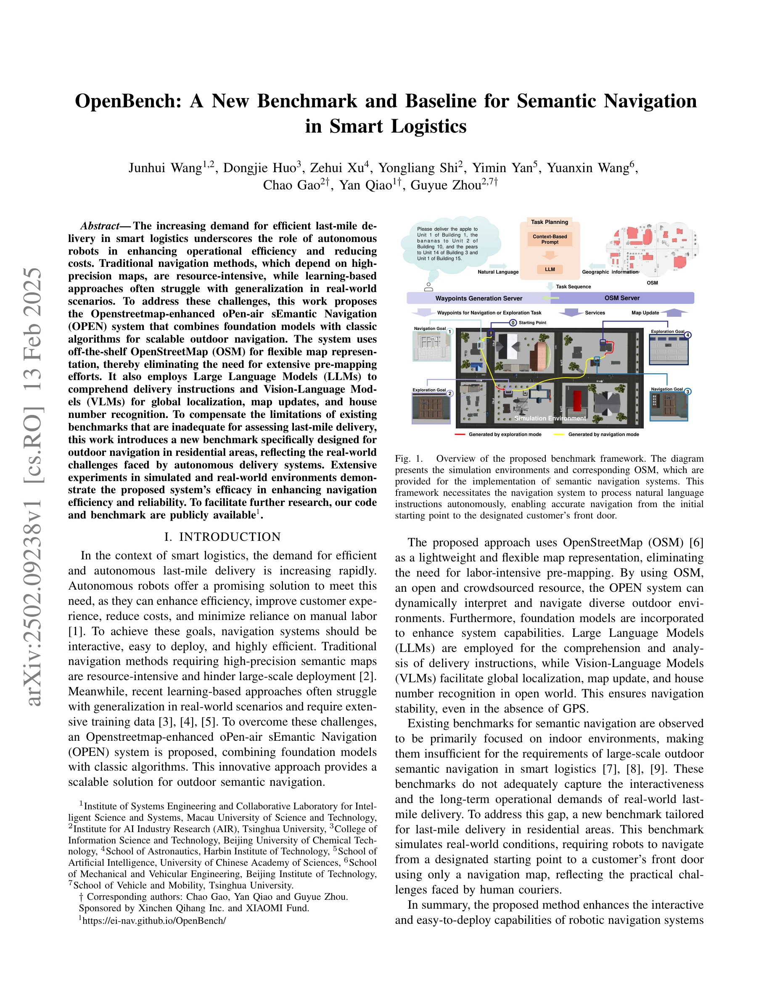

# OpenBench: A New Benchmark and Baseline for Semantic Navigation in Smart Logistics

> **저자**: Junhui Wang, Dongjie Huo, Zehui Xu, Yongliang Shi, Yimin Yan, Yuanxin Wang, Chao Gao, Yan Qiao, Guyue Zhou | **날짜**: 2025-02-13 | **URL**: [https://arxiv.org/abs/2502.09238](https://arxiv.org/abs/2502.09238)

---

## Essence

*Fig. 1.*

스마트 로지스틱스의 마지막 배송 구간을 위해 OpenStreetMap, LLM, VLM을 결합한 OPEN 시스템과 이를 평가하기 위한 새로운 벤치마크 OpenBench를 제안한다.

## Motivation

- **Known**: 기존 네비게이션 방식은 고정밀 지도에 의존하며 자원 집약적이고, 학습 기반 방식은 실제 환경에서 일반화에 어려움이 있다. 기존 벤치마크는 실내 환경에 초점을 맞춰 야외 배송 평가에 부적절하다.
- **Gap**: 야외 주택가 배송의 실제 도전을 반영하는 장기 운영 평가 벤치마크가 부족하고, 사전 매핑 없이 확장 가능한 야외 시맨틱 네비게이션 시스템이 필요하다.
- **Why**: 자율 배송 로봇의 효율적인 마지막 배송 구간 해결은 로지스틱스 비용 절감과 운영 효율성 향상에 필수적이며, 실제 배송 환경의 복잡성을 반영한 벤치마크는 신뢰할 수 있는 시스템 개발을 가능하게 한다.
- **Approach**: OPEN 시스템은 OpenStreetMap의 경량 지도 표현, LLM의 자연어 이해, VLM의 글로벌 로컬라이제이션과 하우스 넘버 인식을 결합하여 GPS 없는 네비게이션을 구현한다. OpenBench 벤치마크는 시뮬레이션 환경에서 SRTP, SR, SPL 메트릭으로 평가한다.

## Achievement

*Fig. 1.*

- **야외 배송용 새로운 벤치마크**: 주택가의 마지막 배송을 위해 설계된 OpenBench를 제시하여 기존 실내 중심 벤치마크의 한계를 보완
- **확장 가능한 기선 시스템**: 사전 매핑 없이 공개 OpenStreetMap 데이터를 활용하는 OPEN 시스템으로 대규모 배포의 용이성 달성
- **기초 모델과 고전 알고리즘의 融合**: LLM을 통한 자연어 이해와 VLM을 통한 로컬라이제이션, 지도 업데이트, 하우스 넘버 인식을 통합하여 GPS 없는 신뢰할 수 있는 네비게이션 구현
- **실험 검증**: 시뮬레이션과 실제 환경 실험을 통해 OPEN 시스템의 효율성과 신뢰성 입증 및 코드와 벤치마크 공개

## How

*Fig. 1.*

- OpenStreetMap을 경량 지도 표현으로 활용하여 사전 고정밀 매핑 비용 제거
- LLM을 통해 자연어 배송 지시사항을 파싱하여 다중 배송 목적지의 작업 순서 계획 (Task Planning)
- VLM (CLIP 기반으로 추정)을 이용한 글로벌 로컬라이제이션으로 GPS 없이 위치 결정
- VLM 기반 하우스 넘버 인식으로 정확한 목적지 식별
- Gazebo 시뮬레이션 환경에서 소형, 중형, 대형 3단계 복잡도의 월드 모델 구축
- SRTP (Success Rate of Task Planning), SR (Success Rate), SPL (Success Weighted by Path Length) 메트릭으로 장기 운영 능력 평가

## Originality

- 야외 마지막 배송 시나리오에 특화된 첫 벤치마크 제시로 기존 실내 네비게이션 벤치마크와 차별화
- OpenStreetMap 기반의 경량 지도 표현을 foundation model과 결합한 새로운 접근으로 확장성 제고
- LLM 기반 자연어 작업 계획과 VLM 기반 글로벌 로컬라이제이션을 통합한 GPS-free 네비게이션 전략의 구체적 구현
- 다중 배송 지점(multi-delivery) 시나리오를 평가하는 기존 벤치마크에서 찾기 어려운 현실성 높은 문제 정의

## Limitation & Further Study

- 기존 발췌에서 VLM 모델 선택의 구체적 근거와 정량적 정확도 데이터가 제시되지 않음
- OpenStreetMap의 데이터 질이 지역별로 편차가 있을 수 있는데 이에 대한 대응 방안 미흡
- 시뮬레이션 환경과 실제 환경 간의 도메인 갭 (sim-to-real transfer)에 대한 분석 부족
- 장기 네비게이션에서 누적 오류나 지도 업데이트 실패 시나리오에 대한 상세한 논의 필요
- 다양한 날씨, 조명, 계절 변화 등 현실적 야외 조건에서의 VLM 성능 저하 가능성에 대한 검토 필요
- 후속 연구에서는 실제 배송 환경에서의 대규모 장기 테스트와 다양한 도시 환경에 대한 일반화 가능성 평가 필요

## Evaluation

- Novelty: 4/5
- Technical Soundness: 3/5
- Significance: 4/5
- Clarity: 4/5
- Overall: 4/5

**총평**: 본 논문은 야외 마지막 배송이라는 실제 문제에 초점을 맞춘 새로운 벤치마크와 확장 가능한 기선 시스템을 제시하여 스마트 로지스틱스 분야에 실질적 기여를 한다. Foundation model과 고전 알고리즘의 효과적 결합으로 GPS-free 네비게이션의 실현 가능성을 보여주었으나, 실제 환경 적응성과 장기 운영 안정성에 대한 심층 분석이 보완되면 더욱 완성도 높은 연구가 될 수 있다.

## Related Papers

- 🔄 다른 접근: [[papers/1575_SmartWay_Enhanced_Waypoint_Prediction_and_Backtracking_for_Z/review]] — SmartWay의 zero-shot VLN-CE와 OpenBench의 스마트 로지스틱스는 모두 실제 환경에서의 네비게이션 문제를 다른 관점에서 접근한다.
- 🔗 후속 연구: [[papers/1329_CityNavAgent_Aerial_Vision-and-Language_Navigation_with_Hier/review]] — CityNavAgent의 aerial vision-language navigation이 OpenBench의 마지막 배송 구간 네비게이션을 공중 시점으로 확장한다.
- 🏛 기반 연구: [[papers/1577_MolmoSpaces_A_Large-Scale_Open_Ecosystem_for_Robot_Navigatio/review]] — MolmoSpaces의 대규모 개방형 로봇 네비게이션 생태계가 OpenBench 벤치마크의 기반 환경을 제공한다.
- 🏛 기반 연구: [[papers/1311_Cognition_to_Control_-_Multi-Agent_Learning_for_Human-Humano/review]] — OpenBench는 ApexNav의 zero-shot navigation 성능 평가를 위한 의미 네비게이션 벤치마크 기반을 제공한다
- 🔄 다른 접근: [[papers/1575_SmartWay_Enhanced_Waypoint_Prediction_and_Backtracking_for_Z/review]] — OpenBench의 스마트 로지스틱스 네비게이션과 SmartWay의 zero-shot VLN-CE는 모두 실제 환경 네비게이션을 위한 서로 다른 접근법이다.
- 🏛 기반 연구: [[papers/1345_CoWs_on_Pasture_Baselines_and_Benchmarks_for_Language-Driven/review]] — OpenBench는 CoWs의 성능 평가를 위한 의미 네비게이션 벤치마크 기반을 제공한다
