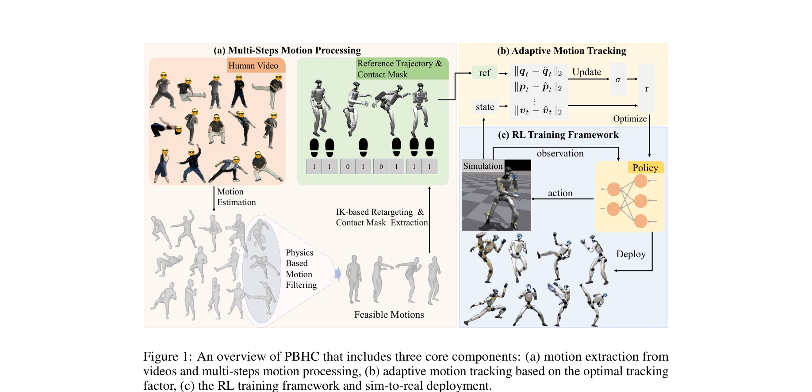

# KungfuBot: Physics-Based Humanoid Whole-Body Control for Learning Highly-Dynamic Skills

> **저자**: Weiji Xie, Jinrui Han, Jiakun Zheng, Huanyu Li, Xinzhe Liu, Jiyuan Shi, Weinan Zhang, Chenjia Bai, Xuelong Li | **날짜**: 2025-06-15 | **URL**: [https://arxiv.org/abs/2506.12851](https://arxiv.org/abs/2506.12851)

---

## Essence

*Figure 1: An overview of PBHC that includes three core components: (a) motion extraction from*

humanoid 로봇이 Kungfu, dancing 등 고속 동작을 모방하기 위해 physics-based 모션 처리와 적응형 추적을 통합한 제어 프레임워크를 제시하며, Unitree G1에서 실제 배포를 달성함.

## Motivation

- **Known**: 기존 RL 기반 humanoid 제어는 smooth하고 저속인 인간 동작만 추적 가능하며, 모션 캡처 데이터가 로봇의 물리적 제약을 위반하는 문제가 있음.
- **Gap**: 기존 방법들은 물리적 실현 가능성과 고속 동작 추적 간 균형을 제대로 맞추지 못하고 있으며, 어려운 동작에 대한 적절한 tolerance 메커니즘이 부족함.
- **Why**: humanoid 로봇이 복잡한 인간 행동을 모방할 수 있다면 산업, 엔터테인먼트, 재활 등 다양한 분야에서 활용 가능하며, 실제 배포 가능성을 시연하는 것이 중요함.
- **Approach**: multi-step motion processing 파이프라인으로 비디오에서 추출한 모션을 physics-based filtering, contact-aware correction, retargeting으로 정제하고, bi-level optimization을 통한 adaptive tracking factor로 curriculum learning을 구현함.

## Achievement

*Figure 1: An overview of PBHC that includes three core components: (a) motion extraction from*

- **Physics-based motion filtering**: CoM-CoP 안정성 메트릭과 경계프레임 조건을 사용하여 물리적으로 부실현 가능한 모션을 자동 제거
- **Adaptive tracking mechanism**: tracking error에 기반하여 동적으로 조정되는 bi-level optimization 기반 tracking factor로 어려운 모션의 학습 가능성 향상
- **Asymmetric actor-critic framework**: critic이 privileged information과 reward vectorization을 활용하면서 actor는 local observation만 사용하여 효율성 증대
- **Real-world deployment**: Unitree G1 로봇에서 Kungfu, dancing 등 고속 동작 성공 배포로 sim-to-real gap 극복
- **Lower tracking errors**: 기존 방법 대비 유의미하게 낮은 추적 오차 달성

## How

*Figure 1: An overview of PBHC that includes three core components: (a) motion extraction from*

- GVHMR를 사용하여 monocular 비디오에서 SMPL 포맷 모션 추출 및 gravity-view 좌표계로 body tilt 제거
- Equation (1): CoM과 CoP의 projected 거리 δd_t < ε_stab 임계값으로 안정성 평가하여 모션 필터링
- Equation (2): ankle 변위의 zero-velocity 가정을 통해 contact mask 추정 및 floating artifact 보정
- Differential inverse kinematics로 처리된 모션을 G1 로봇에 retarget
- Bi-level optimization: tracking error 기반으로 optimal tracking factor σ 도출하고 online estimation으로 동적 업데이트
- PPO 알고리즘 위에 asymmetric actor-critic 구조 구현: critic은 vectorized reward와 privileged information 활용, actor는 proprioceptive state만 관찰
- 각 처리된 모션에 대해 별도 RL policy 훈련 후 실제 로봇에 배포

## Originality

- Physics-based filtering과 contact-aware motion correction을 통합한 체계적인 motion processing pipeline으로 기존 H2O, ExBody 등과 차별화
- Bi-level optimization 기반 adaptive tracking factor로 curriculum learning을 수학적으로 공식화하여 기존 휴리스틱한 접근과 구별
- Asymmetric actor-critic에서 critic의 privileged information 활용과 reward vectorization 기법으로 policy 최적화 효율성 향상
- Gravity-view GVHMR 및 zero-velocity based contact estimation 등 개별 기술들의 창의적 조합

## Limitation & Further Study

- Motion processing 단계의 여러 임계값 (ε_stab, ε_N, ε_vel, ε_height)이 경험적으로 설정되어 있어 일반화 가능성 제한
- 각 모션마다 별도의 RL policy를 훈련해야 하므로 확장성이 제한적이며, 새로운 모션 추가 시 재훈련 필요
- 실제 배포는 Unitree G1만 수행되어 다른 humanoid 플랫폼에의 적용 검증 부족
- Motion processing 파이프라인이 multi-stage라 각 단계에서의 누적 오차 분석 부재
- 후속 연구: (1) 단일 policy로 multiple motions을 동시에 학습할 수 있는 meta-learning 접근, (2) adaptive threshold 자동 튜닝 메커니즘, (3) 다양한 로봇 morphology에 대한 일반화

## Evaluation

- Novelty: 4/5
- Technical Soundness: 3/5
- Significance: 4/5
- Clarity: 4/5
- Overall: 4/5

**총평**: Physics-based motion processing과 adaptive tracking을 통합한 체계적 프레임워크로 humanoid의 고속 동작 모방을 실현했으며, Unitree G1에서의 실제 배포 성공으로 sim-to-real 적용 가능성을 입증한 매우 강력한 연구임.

## Related Papers

- 🔄 다른 접근: [[papers/1545_Learning_to_Walk_and_Fly_with_Adversarial_Motion_Priors/review]] — 두 논문 모두 고속 동작 학습을 다루지만, KungfuBot은 physics-based tracking에, 다른 논문은 adversarial motion priors에 초점을 둔다.
- 🔗 후속 연구: [[papers/1425_GMT_General_Motion_Tracking_for_Humanoid_Whole-Body_Control/review]] — KungfuBot의 고속 동작 모방은 GMT의 adaptive motion tracking을 극한 동작 영역으로 확장한다.
- 🏛 기반 연구: [[papers/1330_CLAM_Continuous_Latent_Action_Models_for_Robot_Learning_from/review]] — KungfuBot의 physics-based control은 DeepMimic의 example-guided deep RL 방법론에서 발전한다.
