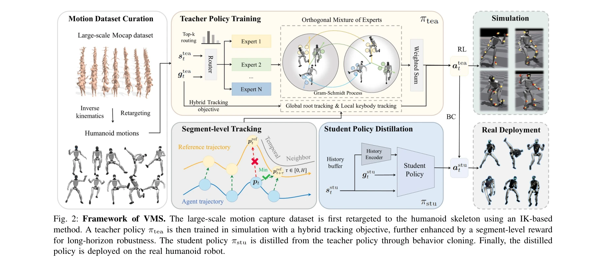
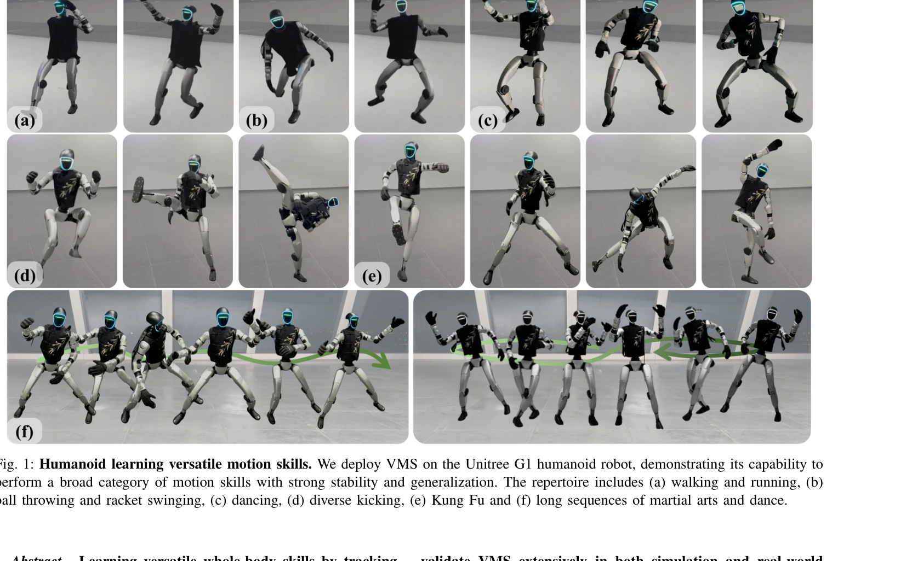

# KungfuBot2: Learning Versatile Motion Skills for Humanoid Whole-Body Control

> **저자**: Jinrui Han, Weiji Xie, Jiakun Zheng, Jiyuan Shi, Weinan Zhang, Ting Xiao, Chenjia Bai | **날짜**: 2025-09-20 | **DOI**: [10.48550/arXiv.2509.16638](https://doi.org/10.48550/arXiv.2509.16638)

---

## Essence

*Fig. 2: Framework of VMS. The large-scale motion capture dataset is first retargeted to the humanoid skeleton using an I*

VMS는 Orthogonal Mixture-of-Experts (OMoE) 아키텍처와 hybrid tracking objective를 통해 인간형 로봇이 단일 정책으로 다양한 동작을 학습하고 장시간 안정적으로 수행할 수 있게 하는 전신 제어 프레임워크이다.

## Motivation

- **Known**: DeepMimic부터 최근의 ExBody2, GMT 등의 연구들이 인간형 로봇의 모션 추적을 다루었으나, 기존 방법들은 단일 정책으로 다양한 동작을 학습할 때 표현력 제한, 로컬 대 글로벌 추적 간의 균형 부족, 장시간 시퀀스의 안정성 문제를 겪고 있다.
- **Gap**: 기존 방법들은 정책 표현력 확장에 제한이 있고(단일 MLP 네트워크 의존), 로컬 추적(모션 스타일)과 글로벌 추적(안정성) 간의 트레이드오프를 적절히 조화하지 못하고 있다.
- **Why**: 범용 인간형 로봇은 다양한 복합 동작을 정밀하게 모방하면서도 장시간 안정적으로 수행할 수 있어야 하며, 이는 산업, 서비스 로봇 분야에서 근본적인 요구사항이다.
- **Approach**: VMS는 (1) 글로벌 루트 추적과 로컬 키바디 추적을 결합한 hybrid tracking objective, (2) 스킬 표현을 분리하는 OMoE 아키텍처, (3) rigid step-wise matching을 완화하는 segment-level tracking reward를 통합하고, teacher-student 학습 패러다임으로 실제 로봇 배포를 위해 정책을 증류한다.

## Achievement

*Fig. 1: Humanoid learning versatile motion skills. We deploy VMS on the Unitree G1 humanoid robot, demonstrating its cap*

- **OMoE 아키텍처**: 모션 표현을 자동으로 분리하여 정책 표현력을 향상시키고 스킬 간 일반화 성능을 개선했다
- **Hybrid tracking objective + segment-level reward**: 로컬 모션 충실도와 글로벌 궤적 일관성을 동시에 달성하며, 분단위 길이의 장시간 시퀀스에서도 안정적 추적을 가능하게 했다
- **광범위한 검증**: Unitree G1 로봇에서 동적 스킬의 정밀한 모방, 분 단위 시퀀스의 안정적 성능, 미학습 동작에 대한 강력한 일반화를 입증했다

## How

*Fig. 2: Framework of VMS. The large-scale motion capture dataset is first retargeted to the humanoid skeleton using an I*

- AMASS Mocap 데이터셋을 differentiable inverse kinematics를 통해 인간형 로봇 스켈레톤으로 리타겟팅하고, oracle policy로 검증하여 9,770개의 고품질 모션 데이터셋 구축
- Teacher policy를 PPO로 전체 상태 정보를 활용하여 학습, Mixture-of-Experts 네트워크로 다양한 모션 스킬 표현
- OMoE의 expert 간 orthogonality 제약으로 스킬 표현 분리 강화
- Global root tracking (위치/회전)과 local keybody tracking (상대 위치/회전)의 가중 조합으로 hybrid objective 구성
- Segment-level reward로 일정 시간 윈도우 단위의 추적 오류를 평가하여 단계별 rigid matching 완화
- Student policy를 behavior cloning으로 학습하여 부분 관찰성 처리 후 실제 로봇에 배포

## Originality

- OMoE 아키텍처의 orthogonality 제약을 통한 명시적 스킬 표현 분리는 기존의 단순 MoE 방식의 혼선 문제를 해결하는 새로운 접근
- Hybrid tracking objective에서 로컬과 글로벌 추적의 이분법적 트레이드오프를 체계적으로 통합한 설계
- Segment-level reward의 도입으로 장시간 시퀀스 추적 안정성을 확보하는 새로운 보상 설계 방식
- 13,000개 이상의 대규모 모션 데이터 기반 단일 정책 학습으로 기존의 개별 정책 학습 방식과 차별화

## Limitation & Further Study

- 연구는 Unitree G1 로봇에만 검증되어, 다른 인간형 로봇 플랫폼으로의 일반화 가능성이 미명확함
- 부분 관찰성 극복을 위해 teacher-student 증류가 필수인데, 이로 인한 성능 저하(오버헤드)가 정량적으로 분석되지 않음
- Segment-level reward 윈도우 크기 등 하이퍼파라미터 민감성 분석 부재
- OMoE의 expert 개수 및 orthogonality 제약 강도에 대한 ablation 연구 제한적
- 실시간 성능(computational latency, 추론 속도)에 대한 평가 미흡
- 후속 연구로 다중 로봇 플랫폼 적응, 온라인 학습/미세조정(fine-tuning) 메커니즘, 불확실성 모델링 등이 필요함

## Evaluation

- Novelty: 4/5
- Technical Soundness: 3/5
- Significance: 4/5
- Clarity: 4/5
- Overall: 4/5

**총평**: VMS는 OMoE와 hybrid tracking objective라는 효과적인 설계를 통해 단일 정책으로 다양한 고동적 모션을 학습하고 안정적으로 실행하는 문제를 명확히 해결하며, 실제 로봇에서의 광범위한 검증과 분 단위 시퀀스 안정성 달성으로 인간형 로봇의 범용 제어 기초로서의 가치를 충분히 입증하였다.

## Related Papers

- 🏛 기반 연구: [[papers/1267_AMP_Adversarial_Motion_Priors_for_Stylized_Physics-Based_Cha/review]] — Adversarial Motion Priors (AMP) 기반의 물리 기반 캐릭터 제어 방법론이 VMS의 다양한 동작 학습 접근법과 직접적으로 연관됨
- 🔄 다른 접근: [[papers/1425_GMT_General_Motion_Tracking_for_Humanoid_Whole-Body_Control/review]] — GMT와 동일하게 휴머노이드 전신 제어를 위한 일반화된 모션 트래킹 시스템을 제안하지만 OMoE 아키텍처로 차별화됨
- 🔗 후속 연구: [[papers/1412_GR00T_N1_An_Open_Foundation_Model_for_Generalist_Humanoid_Ro/review]] — GR00T의 일반적인 휴머노이드 제어 프레임워크를 다양한 동작 기술 학습에 특화시킨 발전된 형태로 볼 수 있음
- 🔗 후속 연구: [[papers/1282_Being-M05_A_Real-Time_Controllable_Vision-Language-Motion_Mo/review]] — vision-language-action 모델을 오픈소스로 확장한 일반화된 버전이다
- 🏛 기반 연구: [[papers/1286_π_05_a_Vision-Language-Action_Model_with_Open-World_Generali/review]] — OpenVLA는 π0.5와 유사한 오픈소스 Vision-Language-Action 모델의 기초적 구현을 제공한다
- 🔗 후속 연구: [[papers/1344_DIAL_Distilling_Intent-Aware_Latents_for_Vision-Language-Act/review]] — DIAL의 시각적 미래 예측 방법이 OpenVLA의 일반화된 vision-language-action 모델로 확장 적용됩니다.
- 🏛 기반 연구: [[papers/1438_InternVLA-M1_A_Spatially_Guided_Vision-Language-Action_Frame/review]] — 오픈소스 비전-언어-행동 모델의 기초적인 구조와 훈련 방법론을 제공합니다.
- 🏛 기반 연구: [[papers/1547_Robotic_Control_via_Embodied_Chain-of-Thought_Reasoning/review]] — OpenVLA의 open-source vision-language-action model이 embodied chain-of-thought reasoning 구현의 기초 플랫폼을 제공한다.
- 🏛 기반 연구: [[papers/1615_VLA-0_Building_State-of-the-Art_VLAs_with_Zero_Modification/review]] — OpenVLA의 오픈소스 vision-language-action 모델이 VLA-0의 단순한 VLA 구조 설계에 이론적 기반을 제공한다.
- 🔄 다른 접근: [[papers/1414_General_Humanoid_Whole-Body_Control_via_Pretraining_and_Fast/review]] — 둘 다 일반적 휴머노이드 제어를 추구하지만 FAST는 사전학습-적응, OpenVLA는 대규모 vision-language-action 모델 기반이다.
