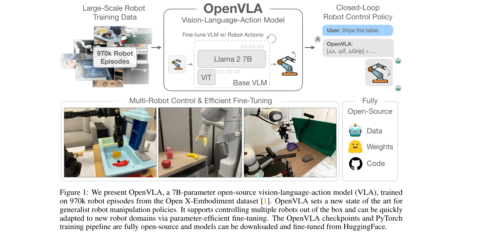
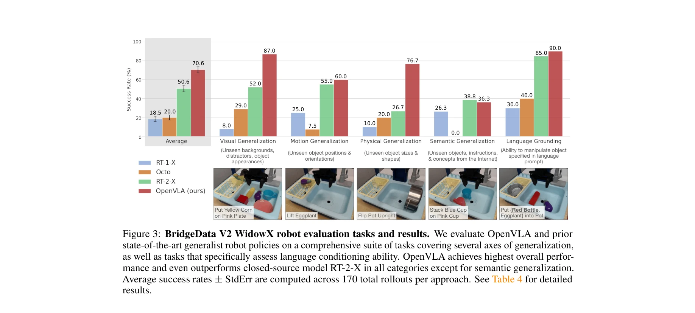
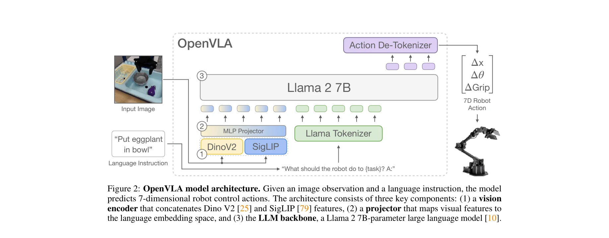

# OpenVLA: An Open-Source Vision-Language-Action Model

> **저자**: Moo Jin Kim, Karl Pertsch, Siddharth Karamcheti, Ted Xiao, Ashwin Balakrishna, Suraj Nair, Rafael Rafailov, Ethan Foster, Grace Lam, Pannag Sanketi, Quan Vuong, Thomas Kollar, Benjamin Burchfiel, Russ Tedrake, Dorsa Sadigh, Sergey Levine, Percy Liang, Chelsea Finn | **날짜**: 2024-06-13 | **URL**: [https://arxiv.org/abs/2406.09246](https://arxiv.org/abs/2406.09246)

---

## Essence

*Figure 1: We present OpenVLA, a 7B-parameter open-source vision-language-action model (VLA), trained*

OpenVLA는 970k개의 로봇 시연 데이터로 학습된 7B 파라미터의 오픈소스 Vision-Language-Action 모델로, 폐쇄형 모델들보다 우수한 성능을 보이면서 효율적인 미세조정과 배포를 지원한다.

## Motivation

- **Known**: VLM 기반의 robot policy 학습이 가능하며, RT-2와 같은 폐쇄형 VLA 모델들이 좋은 일반화 성능을 보인다. 하지만 기존 VLA들은 폐쇄적이고 효율적인 미세조정 방법이 부재하다.
- **Gap**: 기존의 VLA 모델들은 대부분 폐쇄적이고 접근 불가능하며, 새로운 작업에 대한 효율적인 미세조정 방법과 실제 배포 전략이 탐색되지 않았다.
- **Why**: 오픈소스 VLA와 효율적인 미세조정 방법은 로봇 커뮤니티의 광범위한 채택을 촉진하고, 소비자 수준의 하드웨어에서도 로봇 정책을 적응시킬 수 있게 함으로써 로봇 분야 발전을 가속화한다.
- **Approach**: Llama 2 언어 모델과 DINOv2, SigLIP의 시각 인코더를 결합한 VLM 백본을 Open X-Embodiment 데이터셋의 다양한 로봇 시연 데이터로 미세조정하고, LoRA와 quantization을 활용한 효율적 적응 방법을 제시한다.

## Achievement

*Figure 3: BridgeData V2 WidowX robot evaluation tasks and results. We evaluate OpenVLA and prior*

- **성능 우수성**: RT-2-X(55B)를 7배 적은 파라미터로 16.5% 절대 성공률 향상을 29개 작업에서 달성
- **일반화 능력**: 다중 객체를 포함한 멀티태스크 환경에서 강력한 일반화 성능과 언어 기반 제어 능력 입증
- **미세조정 효율성**: Diffusion Policy 대비 20.4% 성능 향상을 달성하면서 효율적 미세조정 가능 입증
- **계산 효율성**: LoRA와 quantization을 통해 소비자 GPU에서 성능 손실 없이 미세조정 및 배포 가능
- **오픈소스 공개**: 모델 체크포인트, 미세조정 노트북, PyTorch 학습 파이프라인 전체를 공개

## How

*Figure 2: OpenVLA model architecture. Given an image observation and a language instruction, the model*

- Llama 2 7B 언어 모델을 기반으로 하며, DINOv2(저수준 공간 정보)와 SigLIP(고수준 의미론)의 다중 해상도 시각 특징을 융합
- 로봇 액션을 언어 모델 어휘로 취급하여 end-to-end VLM 미세조정을 수행
- Open X-Embodiment 데이터셋의 970k 에피소드로 학습하여 다양한 로봇 구현, 작업, 장면 포함
- LoRA(Low-Rank Adaptation)를 사용한 파라미터 효율적 미세조정 방법 적용
- Model quantization을 통한 효율적 배포 실현
- 다양한 로봇 구현에 대한 즉시 제어 및 새로운 로봇 도메인으로의 빠른 적응 지원

## Originality

- VLM의 단순한 patch-as-token 아키텍처를 로봇 제어에 직접 적용하여 확장성과 성능의 균형 달성
- DINOv2와 SigLIP 특징의 명시적 융합을 통해 다중 입도의 시각 정보 활용
- 로봇 분야에서 처음으로 LoRA와 quantization 같은 현대적 효율성 기법의 효과를 체계적으로 입증
- 폐쇄형 모델보다 적은 파라미터로 우수한 성능을 달성하는 새로운 벤치마크 제시
- 완전한 오픈소스 생태계 제공으로 재현성과 커뮤니티 기여 가능성 극대화

## Limitation & Further Study

- 학습 데이터 규모(970k 에피소드)는 인터넷 규모 비전-언어 데이터에 비해 여전히 제한적이며, 로봇 도메인의 데이터 부족 문제 해결 부분적
- 평가는 주로 WidowX와 Google Robot 두 가지 로봇 구현에 제한되어 다양한 로봇 형태로의 일반화 능력 검증 필요
- 실시간 제어와 고주파 행동 생성이 필요한 복잡한 조작 작업에 대한 성능 평가 부재
- 언어 명령의 다양한 표현 방식(paraphrasing)에 대한 강건성 검증 필요
- 후속 연구로 더 큰 규모의 로봇 데이터셋 확보, 다양한 센서 모달리티 통합, 동적 환경에서의 적응 능력 향상 필요

## Evaluation

- Novelty: 4/5
- Technical Soundness: 3/5
- Significance: 4/5
- Clarity: 4/5
- Overall: 4/5

**총평**: OpenVLA는 폐쇄형 대규모 VLA 모델을 능가하는 성능을 더 작은 파라미터로 달성하면서 완전한 오픈소스 공개와 효율적 미세조정 방법을 제시하여 로봇 분야의 파운데이션 모델 생태계 구축에 중요한 기여를 한다.

## Related Papers

- 🏛 기반 연구: [[papers/1554_RT-1_Robotics_Transformer_for_Real-World_Control_at_Scale/review]] — 대규모 로봇 시연 데이터 학습 방법론이 RT-1의 다양한 태스크 일반화 능력 구현에 핵심 이론적 기반을 제공한다
- 🔗 후속 연구: [[papers/1588_TinyVLA_Towards_Fast_Data-Efficient_Vision-Language-Action_M/review]] — 고속 데이터 효율적 VLA 모델 설계를 OpenVLA의 7B 파라미터 구조 최적화에 적용하여 배포 효율성을 향상시킬 수 있다
- 🧪 응용 사례: [[papers/1555_LHM-Humanoid_Learning_a_Unified_Policy_for_Long-Horizon_Huma/review]] — web 지식 전이 방법론이 OpenVLA의 오픈소스 모델 성능 향상에 직접적으로 활용 가능하다
- 🏛 기반 연구: [[papers/1392_FAST_Efficient_Action_Tokenization_for_Vision-Language-Actio/review]] — OpenVLA의 vision-language-action model이 FAST의 효율적인 action tokenization을 적용할 수 있는 기반 모델이다.
- ⚖️ 반론/비판: [[papers/1421_Helix_A_Vision-Language-Action_Model_for_Generalist_Humanoid/review]] — OpenVLA의 오픈소스 접근법과 대비하여 proprietary foundation model의 장단점을 비교할 수 있습니다.
- 🏛 기반 연구: [[papers/1424_HiMoE-VLA_Hierarchical_Mixture-of-Experts_for_Generalist_Vis/review]] — OpenVLA의 대규모 VLA 훈련 방법론을 hierarchical MoE로 확장하여 더 복잡한 embodiment 처리가 가능합니다.
- ⚖️ 반론/비판: [[papers/1427_GR00T_N1_An_Open_Foundation_Model_for_Generalist_Humanoid_Ro/review]] — proprietary vs open-source foundation model approach의 대조적 관점을 제시하여 각각의 장단점을 비교할 수 있습니다.
- 🔗 후속 연구: [[papers/1436_InstructVLA_Vision-Language-Action_Instruction_Tuning_from_U/review]] — OpenVLA의 기본 구조를 instruction tuning으로 확장하여 understanding과 action 능력을 동시에 향상시킵니다.
- 🧪 응용 사례: [[papers/1554_RT-1_Robotics_Transformer_for_Real-World_Control_at_Scale/review]] — 오픈소스 VLA 모델의 효율적인 미세조정 방법이 RT-1의 대규모 로봇 데이터 학습에 직접 적용 가능하다
- 🏛 기반 연구: [[papers/1588_TinyVLA_Towards_Fast_Data-Efficient_Vision-Language-Action_M/review]] — 오픈소스 VLA 모델의 경량화 버전으로 실제 배포 가능한 효율적 대안을 제시한다.
- 🏛 기반 연구: [[papers/1599_Unified_Vision-Language-Action_Model/review]] — 오픈소스 VLA 모델을 통합된 vision-language-action 토큰 모델링으로 확장한 기반을 제공한다.
- 🔄 다른 접근: [[papers/1606_Vision-Language_Foundation_Models_as_Effective_Robot_Imitato/review]] — 둘 다 VLM 기반 로봇 정책이지만 RoboFlamingo는 OpenFlamingo, OpenVLA는 처음부터 설계된 차이가 있다
- 🔗 후속 연구: [[papers/1611_Visual_Instruction_Tuning/review]] — LLaVA의 instruction tuning 방법론을 로봇 조작 도메인으로 확장하여 실용적 응용을 구현했다
- 🔗 후속 연구: [[papers/1336_CogACT_A_Foundational_Vision-Language-Action_Model_for_Syner/review]] — OpenVLA의 오픈소스 VLA 모델이 CogACT의 전문화된 아키텍처를 더 광범위한 커뮤니티에서 활용할 수 있게 한다.
- 🏛 기반 연구: [[papers/1363_Diffusion_Transformer_Policy/review]] — OpenVLA의 오픈소스 vision-language-action model이 diffusion transformer policy 연구의 기반 모델 역할을 한다.
- 🔗 후속 연구: [[papers/1412_GR00T_N1_An_Open_Foundation_Model_for_Generalist_Humanoid_Ro/review]] — OpenVLA의 오픈소스 접근이 GR00T N1의 foundation model을 더 접근 가능한 형태로 확장한다.
