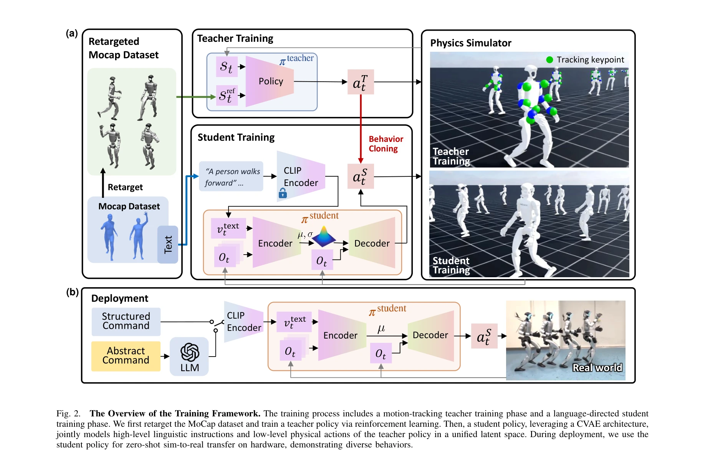
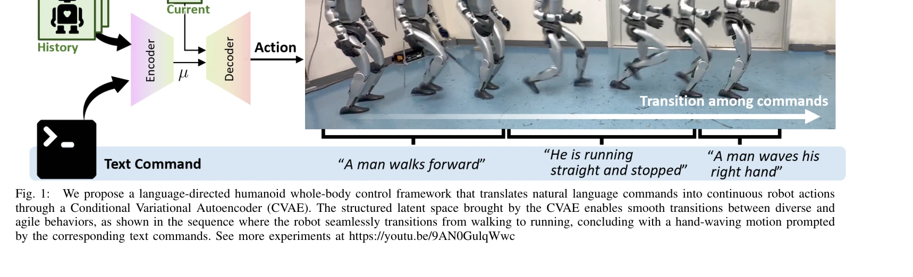

# LangWBC: Language-directed Humanoid Whole-Body Control via End-to-end Learning

> **저자**: Yiyang Shao, Xiaoyu Huang, Bike Zhang, Qiayuan Liao, Yuman Gao, Yufeng Chi, Zhongyu Li, Sophia Shao, Koushil Sreenath | **날짜**: 2025-04-30 | **URL**: [https://arxiv.org/abs/2504.21738](https://arxiv.org/abs/2504.21738)

---

## Essence

*Fig. 2.*

자연언어 명령을 인문형 로봇의 전신 제어 행동으로 직접 변환하는 end-to-end 학습 프레임워크를 제시하며, CVAE 구조를 통해 다양한 움직임 생성과 부드러운 전환을 가능하게 한다.

## Motivation

- **Known**: 기존 계층적 접근법은 kinematic 동작 생성과 whole-body 추적 제어를 분리하여 물리적으로 비현실적인 동작을 생성하고 고정 길이 동작만 지원한다.
- **Gap**: 언어 이해와 물리 행동 간의 근본적인 갭을 해결하면서 동시에 다양성, 구성가능성, 실시간 피드백 기반 폐루프 제어를 모두 달성하는 end-to-end 프레임워크가 부재했다.
- **Why**: 인문형 로봇이 일상생활에 통합되려면 일반인(특히 고령층)도 직관적으로 상호작용할 수 있어야 하며, 자연언어는 이를 위한 가장 접근성 높은 인터페이스이기 때문이다.
- **Approach**: 강화학습으로 학습한 teacher policy가 MoCap 데이터를 추적하여 물리적으로 타당한 행동 집합을 확보하고, CVAE 기반 student policy가 behavior cloning을 통해 자연언어와 제어 행동의 결합 분포를 구조화된 잠재 공간에 학습한다.

## Achievement

*Fig. 1:*

- **End-to-end 폐루프 제어**: 자연언어 명령을 직접 whole-body 제어 행동으로 매핑하여 실시간 피드백과 외란 복구 능력을 갖춘 실제 로봇 배포 가능
- **다양한 동작 생성 및 전환**: CVAE 구조의 구조화된 잠재 공간을 통해 다양한 동작 생성, smooth transition, 잠재 공간 보간을 통한 미학습 동작 합성 실현
- **강건한 sim-to-real 전이**: 실제 인문형 로봇 하드웨어에서 달리기, 빠른 회전, 손 흔들기 등 민첩한 전신 동작과 외란(킥) 복구 시연

## How

*Fig. 2.*

- **Teacher policy 학습**: Retargeted MoCap 데이터셋에 대해 강화학습으로 keypoint tracking 능력을 학습하여 물리적으로 타당한 동작 재현
- **Student policy 설계**: CVAE 아키텍처를 사용하여 CLIP 인코더로 추출한 텍스트 임베딩과 고유감각 역사(proprioceptive history)로부터 제어 행동을 직접 생성
- **Behavior cloning**: Teacher policy의 추적 행동 데이터로부터 student policy를 학습하여 물리적 타당성과 언어 조건화의 결합
- **Variable duration 지원**: 폐루프 제어로 고정 길이 제한을 제거하여 외란 대응과 동작 간 유연한 전환 가능
- **잠재 공간 보간**: 구조화된 CVAE 잠재 공간을 활용하여 학습 데이터에 없는 중간 동작 생성

## Originality

- **End-to-end 폐루프 설계**: 기존 hierarchical 방식(kinematic generation + tracking)의 근본적 문제를 single unified policy로 해결
- **CVAE 기반 생성 제어**: 고차원 동적 제어에서 diffusion 기반이 아닌 CVAE를 사용하여 계산 효율성과 실시간 성능 달성
- **물리적 타당성 보장**: Teacher policy의 RL 학습을 통해 생성된 동작이 자동으로 물리적으로 실현 가능하도록 보장하는 메커니즘
- **실제 하드웨어 시연**: 대부분의 선행 연구(특히 text-to-action 방식)가 시뮬레이션 또는 open-loop에 국한된 반면, 폐루프 실제 로봇 제어 달성

## Limitation & Further Study

- **MoCap 데이터 의존성**: 학습에 사용된 MoCap 데이터셋의 다양성과 품질에 의해 학습 가능한 동작 집합이 제한될 가능성
- **언어 표현 한계**: CLIP 텍스트 임베딩 기반의 접근이 복잡한 문법 구조나 맥락 의존적 명령 이해에 제한될 수 있음
- **일반화 범위**: 실험이 특정 인문형 로봇 플랫폼(명시적 플랫폼명 없음)에 국한되어 다른 크기/형태의 로봇으로의 전이 가능성 미검증
- **정량적 평가 부족**: 논문에서 motion tracking error, success rate 등 정량 메트릭이 제시되지 않아 성능 정확도 평가 어려움
- **후속 연구 방향**: (1) 더 대규모의 다양한 MoCap 데이터 또는 합성 데이터 활용, (2) LLM과의 integration으로 복잡한 언어 이해 개선, (3) 다양한 로봇 플랫폼으로의 일반화, (4) 사람과의 상호작용(안전 제약) 추가 고려

## Evaluation

- Novelty: 4/5
- Technical Soundness: 3/5
- Significance: 4/5
- Clarity: 4/5
- Overall: 4/5

**총평**: 자연언어로부터 인문형 로봇의 전신 제어를 end-to-end 폐루프로 구현하면서 CVAE 구조를 통해 다양성과 일반화를 달성한 혁신적 연구이며, 실제 하드웨어 검증과 우수한 실험 결과를 통해 기술적·응용적 가치가 높다.

## Related Papers

- 🏛 기반 연구: [[papers/1362_ECHO_Edge-Cloud_Humanoid_Orchestration_for_Language-to-Motio/review]] — 자연언어 명령을 로봇 행동으로 변환하는 기본 아이디어가 ECHO의 언어-동작 매핑 프레임워크와 근본적으로 동일함
- 🔄 다른 접근: [[papers/1437_Hand-Eye_Autonomous_Delivery_Learning_Humanoid_Navigation_Lo/review]] — InternVLA-A1과 유사하게 언어-비전-행동 통합을 다루지만 CVAE 기반 전신 제어에 특화된 접근법을 제시함
- 🏛 기반 연구: [[papers/1324_Bridging_Language_and_Action_A_Survey_of_Language-Conditione/review]] — 언어 조건부 정책 학습 분야의 전반적인 이론적 배경과 방법론적 토대를 제공함
- 🏛 기반 연구: [[papers/1362_ECHO_Edge-Cloud_Humanoid_Orchestration_for_Language-to-Motio/review]] — LangWBC의 언어 기반 전신 제어 방법이 ECHO의 자연어 명령 처리와 모션 생성의 핵심 기반 기술이다.
- 🔗 후속 연구: [[papers/1444_Language_to_Rewards_for_Robotic_Skill_Synthesis/review]] — Language to Rewards의 자연어-보상 변환 개념은 LangWBC의 언어 지향 전신 제어로 발전한다.
- 🔗 후속 연구: [[papers/1518_Prismatic_VLMs_Investigating_the_Design_Space_of_Visually-Co/review]] — PaLI-X의 multilingual vision-language model이 Prismatic VLMs의 VLM 설계 공간을 다국어 환경으로 확장한다.
