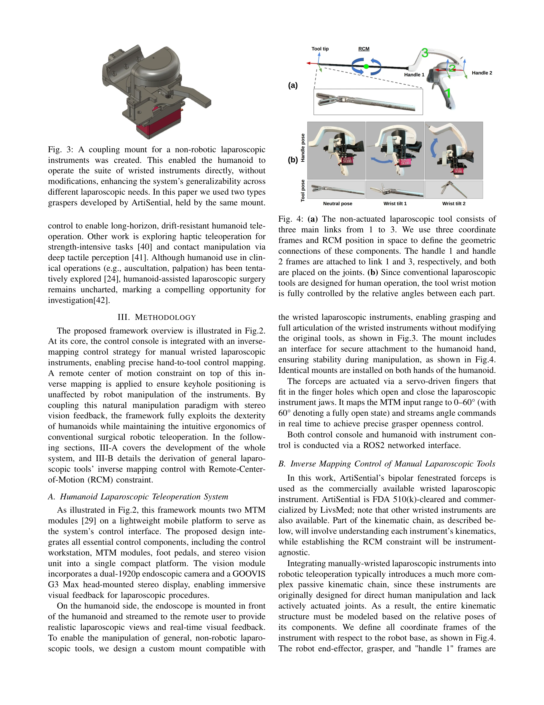
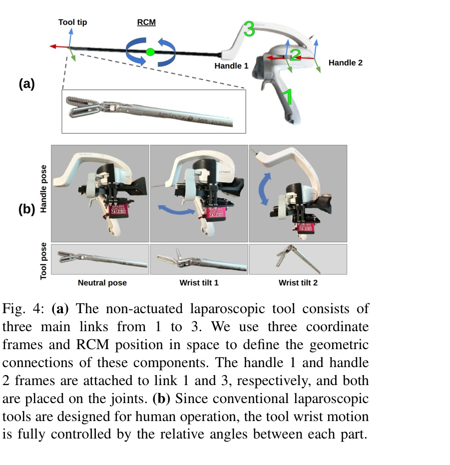

# LapSurgie: Humanoid Robots Performing Surgery via Teleoperated Handheld Laparoscopy

> **저자**: Zekai Liang, Xiao Liang, Soofiyan Atar, Sreyan Das, Zoe Chiu, Peihan Zhang, Calvin Joyce, Florian Richter, Shanglei Liu, Michael C. Yip | **날짜**: 2025-10-03 | **URL**: [https://arxiv.org/abs/2510.03529](https://arxiv.org/abs/2510.03529)

---

## Essence

*Fig. 2: The overview of the humanoid-based laparoscopic framework. The target tool pose Ptt is mapped from the control*

LapSurgie는 humanoid robot이 teleoperated handheld laparoscopic instrument를 사용하여 수술을 수행할 수 있도록 하는 최초의 프레임워크로, inverse-mapping control과 Remote-Center-of-Motion 제약 조건을 통해 off-the-shelf 수술 도구의 정밀한 조작을 가능하게 한다.

## Motivation

- **Known**: 로봇 보조 복강경 수술은 정밀도 향상과 수술자 피로 감소 등의 이점이 있지만, da Vinci와 같은 전문 수술 로봇은 매우 높은 가격대와 복잡한 인프라 요구로 인해 고급 의료 기관에만 국한되어 있다.
- **Gap**: 현재 surgical robotic systems는 자체 배포 및 통합이 근본적인 과제로 남아 있으며, humanoid robot의 수술 적용 가능성은 아직 탐색되지 않았다.
- **Why**: Humanoid robot은 전문화된 시스템과 달리 인간 환경에서 기존 도구와 호환되어 광범위한 배포 가능성을 제공하며, 이는 저자원 지역의 의료 접근성 격차를 줄일 수 있는 중요한 기회를 나타낸다.
- **Approach**: G1 humanoid robot이 commercially available laparoscopic instrument를 파지하고, Master Tool Manipulator 기반 제어 콘솔을 통해 inverse-mapping control과 RCM constraint를 적용하여 stereo vision feedback과 함께 teleoperation을 구현한다.

## Achievement

*Fig. 3: A coupling mount for a non-robotic laparoscopic*

- **최초의 humanoid 기반 복강경 teleoperation 프레임워크**: LapSurgie는 general-purpose humanoid를 전문 수술 시스템 없이 최소 침습 수술에 적용한 최초 사례이다.
- **Inverse-mapping control with RCM constraint**: Manual-wristed laparoscopic instrument에 대한 정확한 hand-to-tool 제어를 가능하게 하며, keyhole 위치를 보존한다.
- **Custom coupling mount 설계**: Off-the-shelf wristed laparoscopic tool을 추가 수정 없이 humanoid가 조작할 수 있게 하는 호환성 높은 인터페이스를 개발했다.
- **사용자 연구를 통한 검증**: Manual laparoscopy, dVRK surgical platform, humanoid system 간 비교 연구로 humanoid 플랫폼의 안전성과 효과성을 입증했다.

## How

*Fig. 4: (a) The non-actuated laparoscopic tool consists of*

- Control console에 two MTM modules를 lightweight mobile platform에 탑재하여 통합 제어 인터페이스 구성
- Dual-1920p endoscopic camera와 GOOVIS G3 Max head-mounted stereo display를 통해 immersive visual feedback 제공
- Non-actuated laparoscopic tool의 기하학적 특성을 three coordinate frames과 RCM position으로 정의
- MTM input을 정규화된 tool motion으로 매핑하는 inverse-mapping 알고리즘 적용
- Servo-driven finger를 통해 forceps 개폐 제어 (0-60° 범위)
- Stereo vision과 natural manipulation paradigm을 결합하여 직관적인 수술 ergonomics 유지

## Originality

- Humanoid robot을 복강경 수술에 최초로 적용한 혁신적 시도
- Manual-wristed laparoscopic instrument의 RCM-aware inverse mapping control 방법 제안
- General-purpose humanoid를 전문 수술 로봇의 제약을 우회하면서도 유사한 기능을 달성하는 새로운 패러다임 제시
- Custom coupling mount를 통해 기존 off-the-shelf 도구의 호환성 문제를 창의적으로 해결

## Limitation & Further Study

- 현재 시스템은 연구 단계이며 실제 임상 운영에서의 검증이 아직 부족하다.
- Humanoid의 정밀도와 반응 속도가 전문 수술 로봇(da Vinci)에 비해 제한적일 수 있다.
- Latency와 telepresence quality가 원격 수술의 안전성과 효과성에 미치는 영향을 더 체계적으로 분석할 필요가 있다.
- 현재 prototype은 특정 humanoid(G1) 기반이므로 다른 humanoid 플랫폼으로의 일반화 가능성을 검토해야 한다.
- 사용자 학습곡선, 수술 난이도 분류, 다양한 수술 절차에서의 성능 평가가 필요하다.
- 후속 연구는 실제 수술 환경에서의 장기 신뢰성, autonomy 수준의 점진적 증대, haptic feedback 통합을 탐색해야 한다.

## Evaluation

- Novelty: 4/5
- Technical Soundness: 3/5
- Significance: 4/5
- Clarity: 4/5
- Overall: 4/5

**총평**: LapSurgie는 humanoid robot의 수술 적용 가능성을 최초로 체계적으로 탐색한 혁신적 연구로, 저자원 지역의 의료 격차 해소라는 중요한 사회적 문제에 새로운 해결책을 제시한다. 비록 현재는 연구 단계이고 실제 임상 배포까지의 여정이 남아 있지만, 전문화된 시스템의 제약을 우회하면서도 주요 수술 기능을 보존하는 접근 방식은 로봇 지원 수술의 미래에 중요한 함의를 갖는다.

## Related Papers

- 🏛 기반 연구: [[papers/1482_Humanoids_in_Hospitals_A_Technical_Study_of_Humanoid_Robot_S/review]] — 수술용 도구 조작 기술이 포괄적인 의료용 휴머노이드 시스템의 기반이 된다
- 🔄 다른 접근: [[papers/1246_A_Rapid_Instrument_Exchange_System_for_Humanoid_Robots_in_Mi/review]] — 둘 다 의료용 휴머노이드를 다루지만 LapSurgie는 복강경 수술에, Instrument Exchange는 도구 교체에 집중한다
- 🏛 기반 연구: [[papers/1341_Dexterous_Teleoperation_of_20-DoF_ByteDexter_Hand_via_Human/review]] — 정밀한 텔레오퍼레이션 기술이 수술용 도구 조작의 기반이 된다
- 🔗 후속 연구: [[papers/1246_A_Rapid_Instrument_Exchange_System_for_Humanoid_Robots_in_Mi/review]] — 복강경 수술에서 휴머노이드 로봇의 기구 교환 시스템이 확장 적용된다
- 🧪 응용 사례: [[papers/1435_Instruct2Act_Mapping_Multi-modality_Instructions_to_Robotic/review]] — PaLM-E의 multimodal language model이 Instruct2Act의 멀티모달 지시사항 처리에 실용적 기반을 제공한다.
- 🔗 후속 연구: [[papers/1482_Humanoids_in_Hospitals_A_Technical_Study_of_Humanoid_Robot_S/review]] — LapSurgie의 수술 도구 조작을 일반적인 의료 절차로 확장했다
