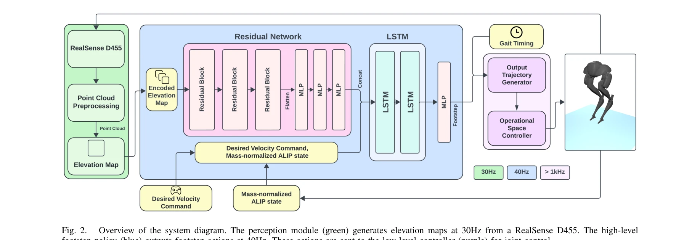
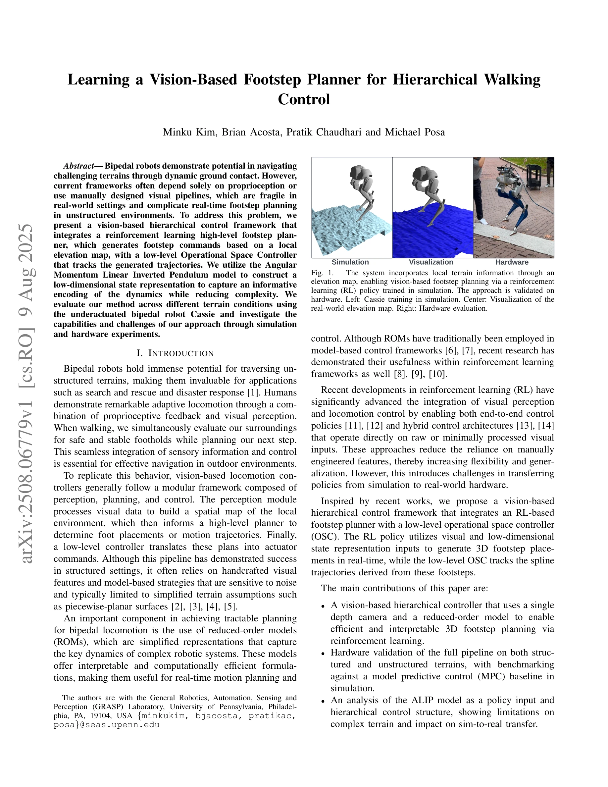
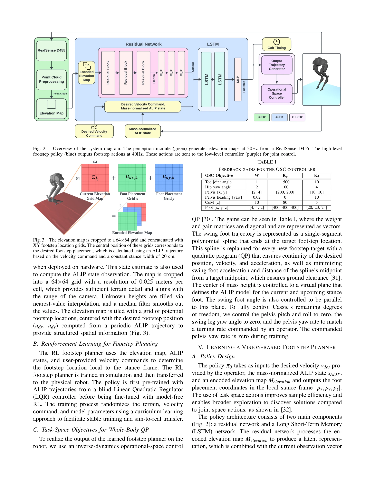

# Learning a Vision-Based Footstep Planner for Hierarchical Walking Control

> **저자**: Minku Kim, Brian Acosta, Pratik Chaudhari, Michael Posa | **날짜**: 2025-08-09 | **URL**: [https://arxiv.org/abs/2508.06779](https://arxiv.org/abs/2508.06779)

---

## Essence

*Fig. 2.*

본 논문은 단일 depth 카메라와 Angular Momentum Linear Inverted Pendulum (ALIP) 모델을 활용하여 reinforcement learning 기반의 고수준 footstep 계획기와 저수준 Operational Space Controller를 통합한 vision 기반 계층적 제어 프레임워크를 제시하며, bipedal robot Cassie를 이용한 시뮬레이션 및 하드웨어 실험을 통해 검증한다.

## Motivation

- **Known**: Bipedal 로봇 제어는 전통적으로 Linear Inverted Pendulum (LIP)과 같은 reduced-order model을 기반으로 한 model-based 최적제어 방법들이 사용되어 왔으며, 최근 deep reinforcement learning은 다양한 지형에서 robust한 보행 제어기를 학습할 수 있음이 입증되었다.
- **Gap**: 기존 vision 기반 bipedal 제어 방법들은 수작업으로 설계된 시각적 파이프라인에 의존하거나 순수 proprioceptive 피드백만 사용하여 실제 환경에서 취약성을 보이며, unstructured terrain에서의 실시간 footstep 계획에 어려움이 있다.
- **Why**: Bipedal 로봇이 검색 구조 및 재해 대응과 같은 실제 응용에서 복잡한 지형을 안정적으로 탐색할 수 있도록 하기 위해 시각정보를 직접 활용하면서도 interpretable하고 계산 효율적인 제어 방법이 필수적이다.
- **Approach**: 본 연구는 elevation map을 입력으로 받는 RL 기반 high-level footstep planner와 ALIP 저차원 상태표현을 결합하여 3D footstep placement를 생성하고, 이를 low-level OSC가 추적하는 hierarchical 구조를 채택한다.

## Achievement

*Fig. 1.*

- **Vision 기반 계층적 제어 프레임워크**: Single depth camera와 ALIP 모델을 이용하여 효율적이고 해석 가능한 3D footstep planning을 reinforcement learning으로 실현
- **Structured/unstructured 지형에서의 하드웨어 검증**: Cassie 로봇을 이용하여 실제 환경에서 전체 파이프라인의 작동을 검증하고 MPC baseline과 비교 평가
- **ALIP 모델의 정량적 분석**: 계층적 제어 구조 내에서 ALIP를 policy input으로 사용할 때의 이점과 한계, 특히 복잡한 지형에서의 성능 제약을 분석

## How

*Fig. 3. The elevation map is cropped to a 64×64 grid and concatenated with*

- Intel RealSense D455를 pelvis에 장착하고 elevation mapping framework로 point cloud를 처리하여 로봇 중심의 elevation map 생성 (30 Hz 업데이트)
- 생성된 elevation map을 64×64 grid로 crop하고 ALIP 궤적으로부터 계산된 desired footstep position (udx, udy)을 중심으로 XY footstep location grid와 결합
- RL policy가 elevation map과 low-dimensional ALIP 상태를 입력으로 받아 3D footstep placement를 40 Hz에서 생성
- 생성된 footstep으로부터 spline 궤적을 유도하고 low-level Operational Space Controller (OSC)가 joint-level 제어를 수행
- Contact-aided invariant EKF를 이용하여 robot state를 추정하며 시뮬레이션에서는 encoder/IMU 시뮬레이션 값, 하드웨어에서는 실제 센서 값 사용
- Domain randomization을 적용하여 sim-to-real 전이 격차 해소

## Originality

- ALIP 모델을 RL 기반 footstep planning의 저차원 상태표현으로 활용하여 높은 차원의 로봇 동역학을 효율적으로 인코딩하는 방식의 활용
- 단일 depth camera와 elevation map 기반 local perception만으로 3D footstep placement를 실시간으로 생성하는 접근법
- Hierarchical 구조 내에서 high-level RL planner와 low-level OSC의 통합을 통해 interpretability와 flexibility의 균형을 달성
- Structured/unstructured 지형에서의 포괄적인 하드웨어 검증 및 ALIP 모델의 한계에 대한 체계적 분석

## Limitation & Further Study

- ALIP 모델은 높은 곡률 또는 급격한 경사 변화가 있는 복잡한 지형에서 모델링 오류가 증가하여 RL policy 성능 저하 가능성
- Elevation map의 해상도(0.025 m/cell) 및 카메라 범위 제한으로 인한 장거리 terrain planning의 제약
- 단일 depth camera의 조명 의존성과 야외 환경에서의 robustness 한계 미흡
- Sim-to-real 전이 시 domain randomization 외 추가적인 적응 메커니즘(예: online fine-tuning) 검토 필요
- 다양한 bipedal 로봇 플랫폼으로의 일반화 가능성 미검증

## Evaluation

- Novelty: 4/5
- Technical Soundness: 3/5
- Significance: 4/5
- Clarity: 4/5
- Overall: 4/5

**총평**: 본 논문은 vision 기반 bipedal 제어에 ALIP와 RL을 결합한 계층적 프레임워크를 제시하고, 하드웨어 검증을 통해 실제 적용 가능성을 입증했으나, 복잡한 지형에서의 ALIP 모델 한계와 카메라 기반 perception의 robustness 개선이 향후 과제로 남아있다.

## Related Papers

- 🔄 다른 접근: [[papers/1449_Learned_Perceptive_Forward_Dynamics_Model_for_Safe_and_Platf/review]] — 두 논문 모두 지각 기반 보행 제어를 다루지만, depth 카메라 vs 다중 센서 융합이라는 서로 다른 센서 전략을 채택함
- 🔗 후속 연구: [[papers/1366_Ego-Vision_World_Model_for_Humanoid_Contact_Planning/review]] — ego-vision 기반 월드 모델을 발걸음 계획에 구체적으로 적용한 계층적 제어 시스템으로 발전시킨 형태임
- 🔄 다른 접근: [[papers/1608_Perceptive_Humanoid_Parkour_Chaining_Dynamic_Human_Skills_vi/review]] — 지각 기반 파쿠르 제어와 유사한 도전적 환경 탐색 문제를 다루지만 발걸음 계획에 특화된 접근법을 제시함
