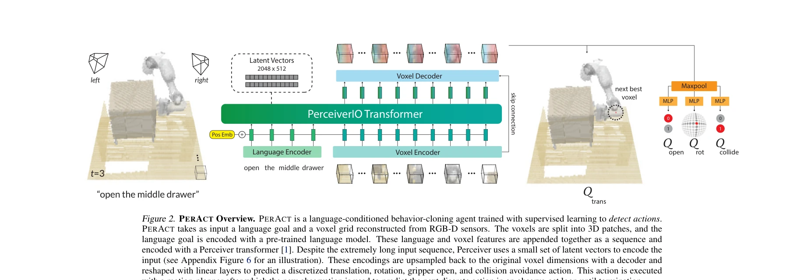
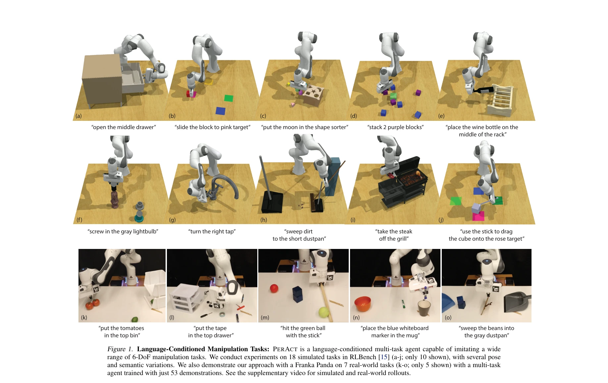

# Perceiver-Actor: A Multi-Task Transformer for Robotic Manipulation

> **저자**: Mohit Shridhar, Lucas Manuelli, Dieter Fox | **날짜**: 2022-09-12 | **URL**: [https://arxiv.org/abs/2209.05451](https://arxiv.org/abs/2209.05451)

---

## Essence

*Figure 2. PERACT Overview. PERACT is a language-conditioned behavior-cloning agent trained with supervised learning to d*

본 논문은 Perceiver Transformer를 사용하여 voxelized 3D 관찰과 이산화된 행동으로 6-DoF 로봇 조작을 수행하는 언어 조건화 행동 복제 에이전트 PerAct를 제안한다. 이 formulation은 2D 이미지 기반 접근법보다 훨씬 효율적이고 강력한 구조적 prior를 제공한다.

## Motivation

- **Known**: Transformer는 대규모 데이터로 vision과 NLP에서 성공했다. 로봇 조작에서는 C2FARM이 voxel 기반 3D ConvNet으로 강화학습을 통해 action-centric 표현을 학습했다. 기존 행동 복제 방법들은 2D 이미지에서 6-DoF 행동으로의 직접 매핑에 의존하여 비효율적이다.
- **Gap**: Transformer의 데이터 효율성을 제한된 로봇 조작 데이터에 맞추기 위한 올바른 problem formulation이 부족하다. 기존 3D 기반 접근법은 제한된 수용장(receptive field)을 가지거나 언어 조건화가 없다.
- **Why**: 로봇 조작은 비용이 크고 데이터 수집이 어려우므로 데이터 효율적인 학습이 필수적이다. 언어 조건화를 통한 다중 작업 학습은 실제 로봇 응용에서 매우 중요하다.
- **Approach**: RGB-D voxel 패치의 sequence를 Perceiver Transformer로 인코딩하고, 다음 최선의 voxel 행동(이산화된 병진, 회전, gripper 상태)을 detection 문제로 해결한다. 언어 목표와 voxel 관찰을 함께 인코딩하여 multi-task 학습을 가능하게 한다.

## Achievement

*Figure 1. Language-Conditioned Manipulation Tasks: PERACT is a language-conditioned multi-task agent capable of imitatin*

- **시뮬레이션 성능**: RLBench 18개 작업(249개 변형)에서 image-to-action 에이전트보다 34배, 3D ConvNet 기준선보다 2.8배 성능 향상
- **실제 로봇 검증**: Franka Panda에서 7개 실제 작업(18개 변형)을 단 53개 시연으로 학습 가능
- **효율적인 확장성**: 100³ voxel 공간(최대 100만 voxel)을 Perceiver의 소수 latent vector로 효율적으로 인코딩
- **단일 멀티태스크 모델**: 명시적 segmentation, pose, memory 없이 다양한 조작 기술 학습

## How

*Figure 2. PERACT Overview. PERACT is a language-conditioned behavior-cloning agent trained with supervised learning to d*

- RGB-D 카메라로부터 voxelized 3D 관찰 생성 (100×100×100 격자)
- 언어 목표를 token sequence로 인코딩
- PerceiverIO Transformer에 voxel과 언어 임베딩을 입력하여 per-voxel 특징 학습
- 각 voxel에 대해 translation, rotation, gripper action의 확률 예측
- 예측된 행동을 motion planner로 실행하는 observe-act loop
- 다양한 pose 및 semantic 변형을 포함한 데이터셋에서 supervised learning으로 훈련

## Originality

- Transformer 기반 6-DoF 조작에서 voxel 기반 formulation 최초 적용으로, 2D image 기반 접근법의 비효율성 극복
- Action-centric representation learning을 Perceiver Transformer로 구현하여 global receptive field 확보
- Language grounding을 voxel-level 행동 detection과 통합한 새로운 접근
- 극히 높은 차원(100만 voxel)의 입력을 효율적으로 처리하는 Perceiver 활용

## Limitation & Further Study

- Voxelized representation의 해상도(100³)에 제한되어 작은 객체나 세밀한 조작에 어려움 가능
- Motion planner에 의존하여 end-to-end 학습의 이점 상실 가능
- 실제 로봇 실험이 단 7개 작업으로 제한적이며, 더 복잡한 시나리오 검증 필요
- Pre-trained vision model 없이 처음부터 학습하므로 unseen object로의 일반화 한계 있을 수 있음
- Perception과 action 사이의 중간 representation(voxel grid)이 명시적이어서 end-to-end 학습의 자유도 제한

## Evaluation

- Novelty: 4/5
- Technical Soundness: 4/5
- Significance: 4/5
- Clarity: 4/5
- Overall: 4/5

**총평**: 본 논문은 제한된 로봇 조작 데이터에서 Transformer의 강력함을 활용하기 위한 효과적인 formulation을 제시하며, voxel 기반 표현과 action-centric learning을 통해 데이터 효율성을 대폭 개선한다. 시뮬레이션과 실제 로봇에서 검증된 결과는 다중 작업 로봇 학습의 실용적 가능성을 잘 보여준다.

## Related Papers

- 🔗 후속 연구: [[papers/1576_SpatialVLA_Exploring_Spatial_Representations_for_Visual-Lang/review]] — SpatialVLA의 3D 공간 표현이 PerAct의 voxelized 3D 관찰을 더 일반화된 VLA 모델로 확장한다.
- 🔄 다른 접근: [[papers/1291_3D-VLA_A_3D_Vision-Language-Action_Generative_World_Model/review]] — 3D-VLA의 3D generative world model과 PerAct의 voxelized transformer는 모두 3D 공간 이해를 위한 서로 다른 접근법이다.
- 🏛 기반 연구: [[papers/1559_RVT_Robotic_View_Transformer_for_3D_Object_Manipulation/review]] — RVT의 robotic view transformer가 PerAct의 Perceiver Transformer 구조의 이론적 기반을 제공한다.
- 🏛 기반 연구: [[papers/1576_SpatialVLA_Exploring_Spatial_Representations_for_Visual-Lang/review]] — PerAct의 voxelized 3D 관찰이 SpatialVLA의 3D 공간 표현 학습의 기초 방법론을 제공한다.
