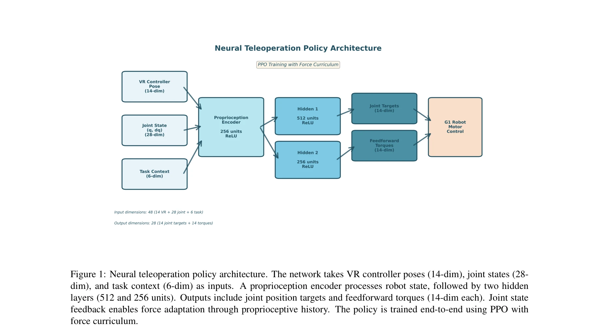
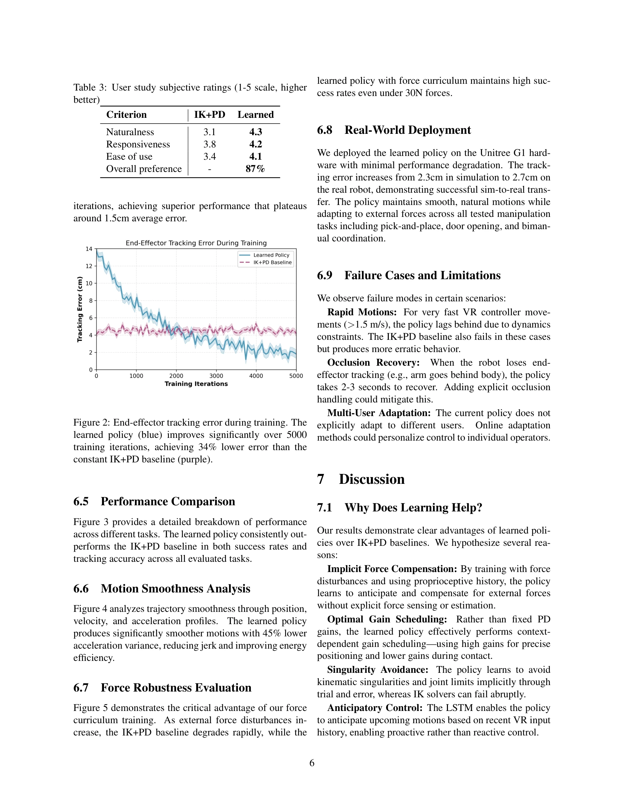

# Learning Adaptive Neural Teleoperation for Humanoid Robots: From Inverse Kinematics to End-to-End Control

> **저자**: Sanjar Atamuradov | **날짜**: 2025-11-15 | **URL**: [https://arxiv.org/abs/2511.12390](https://arxiv.org/abs/2511.12390)

---

## Essence

*Figure 1: Neural teleoperation policy architecture. The network takes VR controller poses (14-dim), joint states (28-*

VR 텔레오퍼레이션을 위해 기존의 IK+PD 파이프라인을 reinforcement learning 기반의 신경망 정책으로 대체하여, 외부 힘 적응, 부드러운 궤적, 사용자 선호도 학습을 동시에 달성하는 학습 기반 프레임워크를 제안한다.

## Motivation

- **Known**: VR 텔레오퍼레이션은 인간형 로봇의 복잡한 조작 작업 제어에 유망하지만, 기존 IK+PD 시스템은 외부 힘 처리, 사용자 적응, 자연스러운 동작 생성에 어려움을 겪는다.
- **Gap**: 기존 학습 기반 텔레오퍼레이션 연구(ACT, ALOHA)는 자율 재생에 초점을 두었고, autonomous 제어용 FALCON은 force adaptation을 다루었지만 실시간 human-in-the-loop 텔레오퍼레이션 환경에서 responsive하고 transparent한 학습 기반 방식은 부족하다.
- **Why**: 자동화된 IK+PD 파이프라인의 근본적 한계(기하학적 접근, 동역학/힘 무시, 수렴 실패)를 극복함으로써 텔레오퍼레이션 시스템의 자연스러움과 강건성을 크게 향상시킬 수 있다.
- **Approach**: Behavioral cloning으로 IK 데모를 통해 정책을 따뜻하게 시작한 후, PPO를 이용한 smoothness와 force robustness 리워드로 fine-tuning하며, curriculum learning으로 progressive하게 외부 힘 disturbance를 가하여 force adaptation을 학습한다.

## Achievement

*Figure 3 provides a detailed breakdown of performance*

- **추적 오차 감소**: IK 베이스라인 대비 34% 낮은 tracking error 달성
- **동작 부드러움 개선**: 45% 더 부드러운 궤적 생성으로 motion artifact 제거
- **외부 힘 적응**: 고정된 PD 게인 대비 superior force adaptation 성능
- **실시간 성능**: 50Hz 제어 주파수로 real-time 요구사항 충족
- **다양한 조작 검증**: pick-and-place, door opening, bimanual coordination 작업에서 유효성 입증

## How

*Figure 1: Neural teleoperation policy architecture. The network takes VR controller poses (14-dim), joint states (28-*

- VR Input Encoder: 상대 변환(∆T_t)을 인코딩하여 절대 좌표 불변성 확보
- Proprioception Encoder: MLP를 통해 관절 위치/속도/이전 액션 인코딩 및 5 timestep 히스토리 활용
- LSTM Policy Head: 인코딩된 VR과 proprioception 정보를 융합하여 시간적 일관성과 예측적 제어 실현
- Stage 1 (Imitation Learning): IK 데모로부터 behavioral cloning을 통해 L_BC = E||a - π_θ(s,c)||^2 최소화
- Stage 2 (RL Fine-tuning): PPO로 tracking reward, smoothness reward(2차/3차 미분 패널티), energy regularization 조합
- Stage 3 (Force Curriculum): U(-α_g·F_max, α_g·F_max) 범위의 external force를 progressive하게 적용하여 proprioceptive feedback 기반 보상 학습
- Sim-to-Real Transfer: dynamics randomization(link mass ±10% 등)으로 도메인 갭 해소

## Originality

- IK+PD의 기하학적 파이프라인을 end-to-end 학습 기반으로 완전히 대체하는 새로운 관점
- Human-in-the-loop teleoperation에 특화된 RL 훈련 전략(behavioral cloning warmstart → smoothness/force fine-tuning) 개발
- Relative transformation 인코딩과 proprioceptive history를 결합한 force adaptation 메커니즘의 창의적 설계
- Force curriculum learning을 통해 implicit force compensation을 학습하는 novel 접근 (기존 haptic feedback과 다른 방식)

## Limitation & Further Study

- 시뮬레이션 환경(Unitree G1)에서의 성능 검증만 제시되었고, 실제 로봇 하드웨어에서의 sim-to-real transfer 결과의 세부 분석 부족
- 정책의 generalization 범위: 훈련된 로봇/조작 작업 외 새로운 설정에서의 적응 능력 미평가
- 사용자 선호도 학습의 구체적 메커니즘 불명확 (어떻게 서로 다른 사용자 스타일을 구별/적응하는지 설명 부재)
- VR 시스템의 지연(latency)이나 noise에 대한 robustness 분석 부재
- 후속 연구: (1) 실제 하드웨어 배포 및 장시간 사용성 검증, (2) 멀티 태스크 policy learning으로 generalization 향상, (3) explicit user modeling with feedback mechanism 추가

## Evaluation

- Novelty: 4/5
- Technical Soundness: 3/5
- Significance: 4/5
- Clarity: 4/5
- Overall: 4/5

**총평**: 본 논문은 전통적 IK+PD 텔레오퍼레이션의 근본 한계를 명확히 식별하고, behavioral cloning + RL fine-tuning + force curriculum의 체계적 훈련 전략으로 이를 극복하는 실질적 해법을 제시한다. 정량적 성능 개선(34%, 45%)과 다양한 조작 작업 검증을 통해 학습 기반 접근의 우월성을 입증하였으나, 실제 하드웨어 배포 결과와 사용자 적응 메커니즘의 상세 분석이 추가되면 더욱 설득력 있을 것이다.