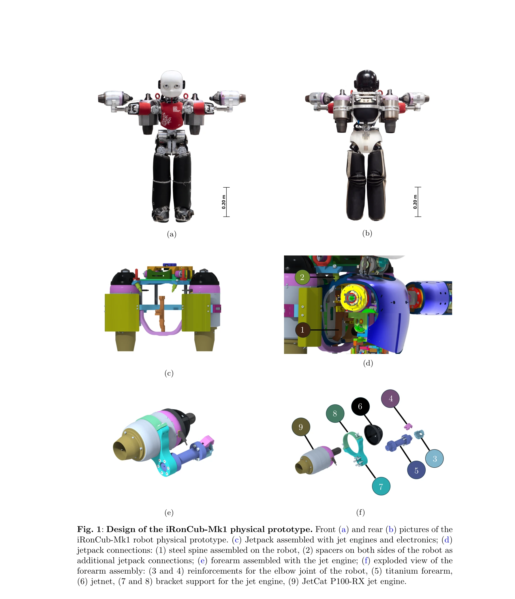
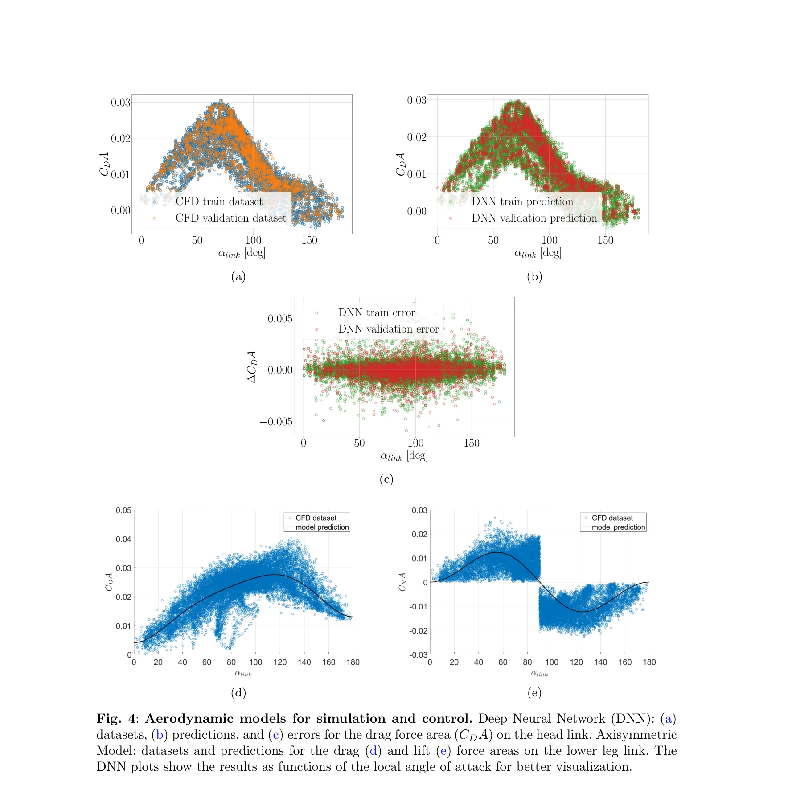

# Learning Aerodynamics for the Control of Flying Humanoid Robots

> **저자**: Antonello Paolino, Gabriele Nava, Fabio Di Natale, Fabio Bergonti, Punith Reddy Vanteddu, Donato Grassi, Luca Riccobene, Alex Zanotti, Renato Tognaccini, Gianluca Iaccarino, Daniele Pucci | **날짜**: 2025-05-30 | **URL**: [https://arxiv.org/abs/2506.00305](https://arxiv.org/abs/2506.00305)

---

## Essence

*Fig. 1: Design of the iRonCub-Mk1 physical prototype. Front (a) and rear (b) pictures of the*

본 논문은 제트 엔진으로 구동되는 비인간형 로봇 iRonCub-Mk1을 설계하고, CFD 시뮬레이션과 풍동 실험을 통해 공기역학 모델을 검증한 후, Deep Neural Network과 선형 회귀 모델을 학습하여 비행 제어를 수행하는 종합적 접근법을 제시한다.

## Motivation

- **Known**: 다중 운동 모드 로봇은 다양한 환경에 적응 가능하며, 기존 VTOL 시스템은 저속에서 공기역학 효과를 무시하거나 외란 추정을 통해 보상한다. CFD와 RANS 모델은 복잡한 형상의 공기역학 해석에 사용되지만 실험 검증이 필수적이다.
- **Gap**: 비인간형 로봇의 복잡한 형상과 링크 간 공기역학 간섭을 명시적으로 모델링하는 방법이 부족하며, 공기역학 기반의 제어기 설계를 위한 데이터 기반 접근법이 제한적이다.
- **Why**: 비인간형 로봇의 고중량(40kg)과 높은 탑재 능력을 활용하면서도 비행 능력을 확보하려면 공기역학 모델링과 제어가 필수적이며, 외부 풍력이 있는 실제 환경에서의 안정적 운용이 요구된다.
- **Approach**: 풍동 실험으로 실제 공기역학 데이터를 취득하고, RANS 기반 CFD 시뮬레이션으로 검증한 후, 자동화된 CFD 프레임워크로 데이터셋을 확장하여 DNN과 선형 회귀 모델을 학습하고 시뮬레이터와 실물 프로토타입에서 검증한다.

## Achievement

*Fig. 4: Aerodynamic models for simulation and control. Deep Neural Network (DNN): (a)*

- **iRonCub-Mk1 설계 및 제작**: 제트 엔진 통합에 최적화된 기계 설계 및 풍동 실험을 위한 하드웨어 개선(공기역학 힘과 표면 압력 측정 가능)
- **CFD 검증**: RANS 시뮬레이션 결과를 Politecnico di Milano의 풍동 실험 데이터로 검증하여 모델 신뢰성 확보
- **학습 기반 공기역학 모델**: Deep Neural Network과 선형 회귀 모델 개발로 공기역학 계산의 효율성 향상
- **공기역학 인식 제어**: 학습된 모델을 시뮬레이터에 통합하여 비행 시뮬레이션 및 평형 실험으로 검증된 제어기 설계
- **통합 프레임워크**: 고전 제어 기법과 기계학습을 결합한 종합적 모델링 및 제어 방법론 제시

## How

*Fig. 3: iRonCub aerodynamics CFD simulations. Validation of RANS simulations on iRon-*

- Politecnico di Milano의 대형 풍동(GVPM)에서 다양한 자세와 속도 조건에서 iRonCub-Mk1의 공기역학 힘 측정
- Realizable k-ε 및 SST k-ω RANS 모델을 사용한 CFD 시뮬레이션 실행 및 풍동 실험과의 비교 검증
- 자동화된 CFD 프레임워크를 이용한 매개변수 공간 탐색으로 대규모 공기역학 데이터셋 생성
- 생성된 데이터셋을 사용하여 Deep Neural Network 모델 학습 및 선형 회귀 모델 개발
- iDynTree 시뮬레이터에 공기역학 모델 통합하여 비행 시뮬레이션 실행
- 실물 iRonCub-Mk1 프로토타입에서 평형 실험 수행하여 제어기 성능 검증

## Originality

- 제트 엔진 기반의 비인간형 로봇이라는 새로운 플랫폼 제시로 고중량 로봇의 비행 능력 확보
- 복잡한 형상의 로봇 전체에 대한 공기역학 간섭 모델링으로 기존의 단순화된 접근을 개선
- 실험 기반 CFD 검증을 통한 RANS 모델의 신뢰성 확보 및 대규모 데이터셋 자동 생성 프레임워크 개발
- 고전 제어와 Deep Neural Network을 결합한 하이브리드 공기역학 모델링 방식 제안

## Limitation & Further Study

- CFD 시뮬레이션의 계산 비용이 높아 실시간 제어 적용에는 제한적이며, 학습 모델의 일반화 성능이 훈련 범위를 벗어난 조건에서 검증되지 않음
- 풍동 실험이 정적 자세에서만 수행되어 동적 비행 중의 공기역학 변화 포착에 한계가 있음
- 제트 엔진의 제어 특성(응답 시간, 비선형성)이 명시적으로 모델링되지 않음
- 현재 플랫폼의 무게와 크기 제약으로 인한 배터리 용량 한정 및 비행 시간 단축
- 향후 연구로 동적 풍동 시험, 실시간 적응 제어, 다양한 풍속 조건에서의 강건성 검증 필요

## Evaluation

- Novelty: 4/5
- Technical Soundness: 3/5
- Significance: 4/5
- Clarity: 4/5
- Overall: 4/5

**총평**: 본 논문은 비인간형 로봇의 비행 능력 확보라는 야심 찬 목표를 기술적·과학적으로 체계적으로 접근하여, 실험 검증과 학습 기반 모델링을 결합한 포괄적 방법론을 제시한다. Nature Communications Engineering 게재 예정 논문으로서 로보틱스, 공기역학, 기계학습의 경계를 넘는 우수한 학제적 연구이다.

## Related Papers

- 🏛 기반 연구: [[papers/1500_iRonCub_3_The_Jet-Powered_Flying_Humanoid_Robot/review]] — 공기역학 모델 학습과 제어가 iRonCub 3의 제트 추진 비행 성능 향상에 직접 적용됩니다.
- 🏛 기반 연구: [[papers/1299_CAD-Driven_Co-Design_for_Flight-Ready_Jet-Powered_Humanoids/review]] — CFD와 풍동 실험 기반 공기역학 모델이 co-design 프레임워크의 물리적 제약 조건을 제공합니다.
- 🔗 후속 연구: [[papers/1488_HUSKY_Humanoid_Skateboarding_System_via_Physics-Aware_Whole-/review]] — Deep Neural Network 기반 비행 제어가 physics-aware 전신 제어 프레임워크로 확장 적용됩니다.
- 🔗 후속 연구: [[papers/1299_CAD-Driven_Co-Design_for_Flight-Ready_Jet-Powered_Humanoids/review]] — co-design 프레임워크가 공기역학 학습 기반 비행 제어로 확장되어 더 정밀한 제어가 가능합니다.
- 🔗 후속 연구: [[papers/1500_iRonCub_3_The_Jet-Powered_Flying_Humanoid_Robot/review]] — iRonCub 3의 수직 이륙 성공이 공기역학 학습 기반 정밀 비행 제어로 발전될 수 있습니다.
- 🏛 기반 연구: [[papers/1488_HUSKY_Humanoid_Skateboarding_System_via_Physics-Aware_Whole-/review]] — 물리 인식 제어 프레임워크가 제트 엔진 비행 제어의 공기역학적 제약 관리에 기초를 제공합니다.
