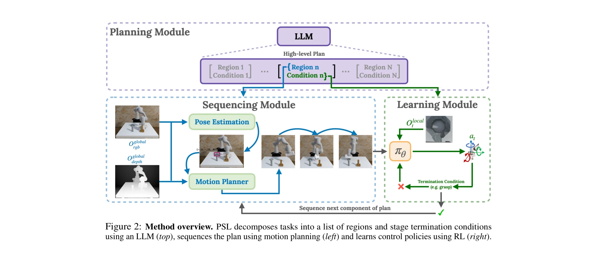
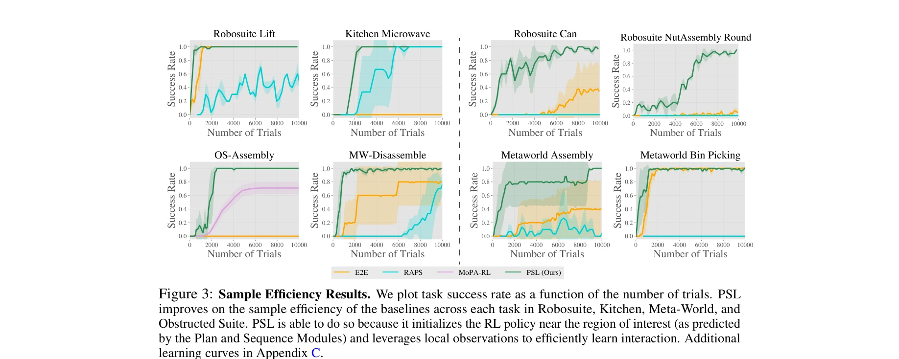

# Plan-Seq-Learn: Language Model Guided RL for Solving Long Horizon Robotics Tasks

> **저자**: Murtaza Dalal, Tarun Chiruvolu, Devendra Chaplot, Ruslan Salakhutdinov | **날짜**: 2024-05-02 | **URL**: [https://arxiv.org/abs/2405.01534](https://arxiv.org/abs/2405.01534)

---

## Essence

*Figure 2: Method overview. PSL decomposes tasks into a list of regions and stage termination conditions*

Plan-Seq-Learn (PSL)은 LLM의 고수준 계획, motion planning의 시퀀싱, RL의 저수준 제어 학습을 통합하여 사전 정의된 스킬 라이브러리 없이 장시간 로봇 작업을 해결한다.

## Motivation

- **Known**: LLM은 인터넷 규모의 지식으로 고수준 계획에 효과적이지만 저수준 제어 생성이 불가능하고, RL은 복잡한 제어 행동 학습은 가능하지만 장시간 추론에 어려움이 있다.
- **Gap**: 기존 LLM 기반 로봇 방법들은 사전 정의된 스킬 라이브러리에 의존하며, 장시간 작업에서 LLM의 추상적 계획과 RL의 저수준 제어 간의 간극을 효과적으로 연결하지 못한다.
- **Why**: 접촉이 풍부한 로봇 조작과 같은 현실의 복잡한 작업들은 사전 구축된 스킬로는 표현 불가능하며, 온라인 학습과 장시간 추론을 동시에 수행해야 한다.
- **Approach**: PSL은 LLM이 생성한 고수준 계획을 motion planning으로 해석 및 실행하며, RL 정책이 각 단계의 저수준 제어 전략을 효율적으로 학습하도록 유도하는 모듈식 프레임워크이다.

## Achievement

*Figure 3: Sample Efficiency Results. We plot task success rate as a function of the number of trials. PSL*

- **4개 벤치마크 스위트에 걸쳐 25개 이상의 장시간 로봇 작업 해결**: 최대 10단계 작업을 85% 이상의 성공률로 원본 시각 입력에서 해결
- **최첨단 성능 달성**: 언어 기반, 고전적, end-to-end 방법을 모두 능가하는 성과 (NutAssembly 작업 96% 성공률)
- **효율적인 정책 학습 전략**: 국소 관찰 공간 설계, 공유 정책 네트워크, 단계별 curriculum learning으로 샘플 효율성 개선

## How

*Figure 2: Method overview. PSL decomposes tasks into a list of regions and stage termination conditions*

- LLM을 통해 텍스트 기반 작업 설명을 의미 있는 부분 시퀀스와 단계 종료 조건으로 분해
- Vision 기반 motion planning을 사용하여 LLM의 고수준 계획을 로봇 도달 위치로 변환 (접촉 없는 도달)
- RL 정책이 각 단계에서 환경과의 접촉을 포함한 상호작용 (저수준 제어)을 학습하도록 유도
- 정책 관찰 공간을 국소 정보로 제한하여 단계 간 일반화 효율성 증대
- 모든 작업 단계에서 공유되는 정책 네트워크 구조 사용으로 학습 속도 향상
- 단계별 curriculum learning으로 학습 안정성 및 수렴 속도 개선

## Originality

- LLM 계획, motion planning, RL을 긴밀하게 통합하는 처음의 체계적 접근으로, 사전 정의된 스킬 라이브러리의 필요성을 제거
- Motion planning을 LLM의 추상 언어 공간과 RL의 저수준 제어 공간 간의 명시적 연결 고리로 활용하는 창의적 설계
- 국소 관찰 공간, 공유 정책, curriculum learning 등 효율적인 RL 학습을 위한 실용적 전략들의 새로운 조합

## Limitation & Further Study

- Motion planning의 성능이 전체 시스템에 의존적이므로, 복잡한 환경이나 부분 관찰 설정에서의 확장성이 미흡할 수 있음
- LLM의 계획 오류가 하위 단계에 전파될 가능성이 있으며, 이를 복구하는 메커니즘이 명시적으로 제시되지 않음
- 실험이 제한된 로봇 플랫폼과 작업 범위에서 수행되었으므로, 다양한 로봇 형태나 극단적인 작업 복잡도로의 일반화 검증 필요
- 후속 연구는 LLM 계획 오류에 대한 강건성 향상, 더 복잡한 지각 환경에서의 motion planning 개선, 다중 로봇 설정으로의 확장을 고려할 수 있음

## Evaluation

- Novelty: 4/5
- Technical Soundness: 3/5
- Significance: 4/5
- Clarity: 4/5
- Overall: 4/5

**총평**: PSL은 LLM, motion planning, RL의 상호 보완적 강점을 창의적으로 통합하여 사전 정의된 스킬 없이 장시간 로봇 작업을 효율적으로 해결하는 실질적이고 강력한 방법을 제시한다. 광범위한 실험과 명확한 설명으로 높은 가치의 기여를 입증한다.

## Related Papers

- 🔄 다른 접근: [[papers/1566_Scaling_Up_and_Distilling_Down_Language-Guided_Robot_Skill_A/review]] — 장기 로봇 작업 해결에서 PSL의 LLM-motion planning-RL 통합 방식과 언어 가이드 스킬 증류 방식의 차이점을 비교할 수 있다.
- 🏛 기반 연구: [[papers/1605_VIMA_General_Robot_Manipulation_with_Multimodal_Prompts/review]] — 멀티모달 프롬프트 기반 로봇 조작을 통합 시퀀스 모델링으로 접근한 VIMA의 방법론이 PSL의 계층적 계획 수립에 이론적 기반을 제공한다.
- 🔗 후속 연구: [[papers/1604_Video_Language_Planning/review]] — VLP의 비디오 계획 생성 방법을 PSL의 고수준 계획 단계에서 활용하여 장기 작업의 시각적 계획을 개선할 수 있다.
- 🧪 응용 사례: [[papers/1416_Grounding_Large_Language_Models_in_Interactive_Environments/review]] — 대화형 환경에서 LLM을 grounding하는 연구로 PSL의 LLM 기반 고수준 계획을 실제 환경에서 적용하는 방법론을 제시한다.
- 🔄 다른 접근: [[papers/1566_Scaling_Up_and_Distilling_Down_Language-Guided_Robot_Skill_A/review]] — 장기 로봇 스킬 획득에서 언어 가이드 증류 방식과 PSL의 LLM-계획-RL 통합 방식을 데이터 효율성 관점에서 비교할 수 있다.
- 🏛 기반 연구: [[papers/1604_Video_Language_Planning/review]] — VLP의 비디오 계획 생성 방법론이 PSL의 고수준 계획 단계에서 시각적 계획 수립의 이론적 기반을 제공한다.
- 🏛 기반 연구: [[papers/1605_VIMA_General_Robot_Manipulation_with_Multimodal_Prompts/review]] — 멀티모달 프롬프트를 통한 통합 시퀀스 모델링 접근법이 PSL의 LLM 기반 고수준 계획 수립에 이론적 기반을 제공한다.
