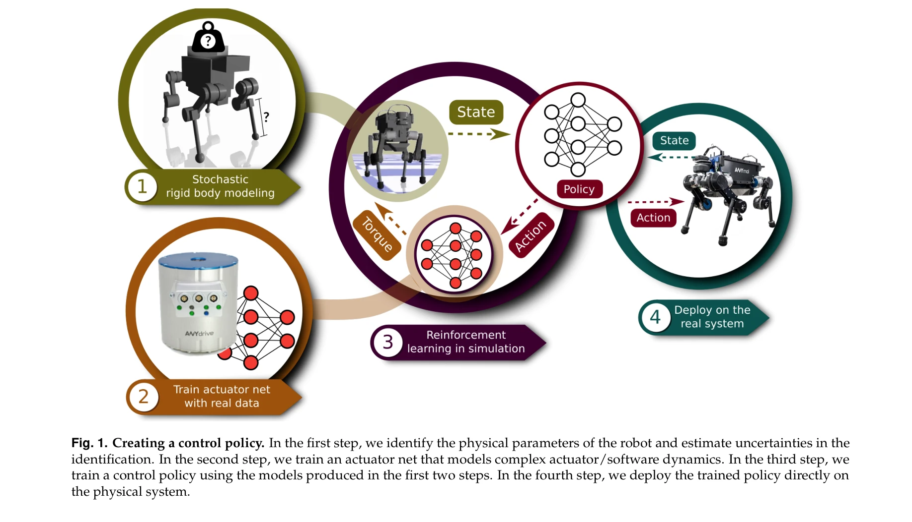
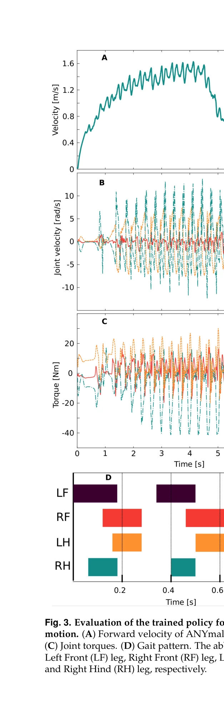
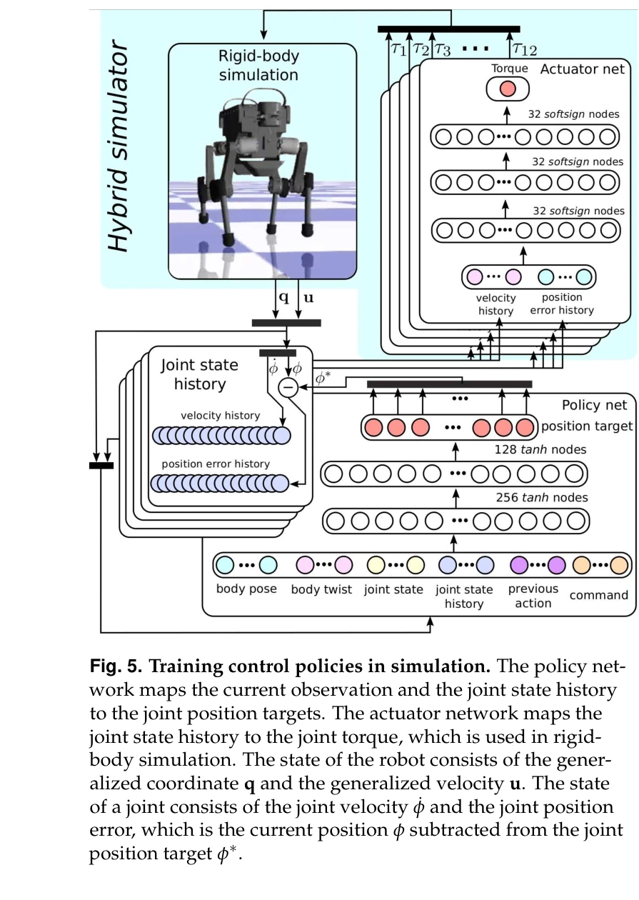

# Learning agile and dynamic motor skills for legged robots

> **저자**: Jemin Hwangbo, Joonho Lee, Alexey Dosovitskiy, Dario Bellicoso, Vassilios Tsounis, Vladlen Koltun, Marco Hutter | **날짜**: 2019-01-24 | **URL**: [https://arxiv.org/abs/1901.08652](https://arxiv.org/abs/1901.08652)

---

## Essence

*Fig. 1. Creating a control policy. In the first step, we identify the physical parameters of the robot and estimate uncer*

본 논문은 시뮬레이션에서 신경망 정책을 학습한 후 실제 로봇에 전이하는 방법을 제시하여, ANYmal 사족 로봇이 민첩한 동작 제어를 학습하고 실행하도록 함.

## Motivation

- **Known**: 모듈식 제어기 설계와 궤적 최적화 방법이 사족 로봇 제어의 주요 접근법이지만, 이들은 설계에 많은 수작업이 필요하고 성능 제약이 있음. Reinforcement Learning은 시뮬레이션에서 우수한 결과를 보였으나 실제 로봇에 적용하기 어려움.
- **Gap**: RL로 학습한 시뮬레이션 정책을 실제 동적 균형 로봇에 효과적으로 전이하는 방법이 부족함. Reality gap으로 인해 실제 배포 사례가 제한적임.
- **Why**: 자동화되고 비용 효율적인 학습 방법을 통해 사족 로봇의 민첩성과 에너지 효율을 향상시킬 수 있으며, 복잡한 환경에서의 적용 가능성을 확대할 수 있음.
- **Approach**: 도메인 랜더마이제이션(dynamics randomization)과 시뮬레이션 파라미터 식별을 결합하여 reality gap을 줄이고, PPO와 같은 policy gradient 알고리즘으로 신경망 정책을 학습한 후 실제 ANYmal 로봇에 배포함.

## Achievement

*Fig. 3. Evaluation of the trained policy for high-speed loco-*

- **고속 주행 달성**: 이전보다 빠른 속도의 보행 및 주행 성능 구현
- **정밀한 속도 제어**: 높은 수준의 신체 속도 명령을 정확하고 에너지 효율적으로 추종
- **낙하 회복**: 복잡한 구성에서도 낙하 후 회복 능력 습득
- **Sim-to-real 전이 성공**: 시뮬레이션 학습 정책의 실제 로봇 배포 성공

## How

*Fig. 5. Training control policies in simulation. The policy net-*

- 물리적 파라미터와 동역학 불확실성을 포함한 simulator 구축 및 파라미터 식별
- dynamics randomization을 통해 정책의 견강성(robustness) 증진
- PPO(Proximal Policy Optimization) 알고리즘으로 신경망 정책 학습
- 사전 학습된 정책을 실제 로봇에 적용하고 미세 조정(fine-tuning)
- 관찰(observation) 노이즈, 지연, 실행 지연 등을 시뮬레이션에 포함

## Originality

- 동적 사족 로봇을 위한 체계적인 sim-to-real 전이 프레임워크 제시
- 도메인 랜더마이제이션과 시스템 식별을 통합한 reality gap 감소 전략
- 실제 고급 사족 로봇(ANYmal)에서 복잡한 운동 기술의 end-to-end 학습 성공

## Limitation & Further Study

- 시뮬레이션 파라미터 식별 과정이 여전히 부분적 수작업 필요
- 특정 로봇(ANYmal)에 최적화된 접근으로, 다른 로봇 플랫폼으로의 일반화 정도 미검증
- 학습 중 정책의 불안정한 거동으로 인한 로봇 손상 위험 가능성
- 후속 연구: 더 효율적인 자동 파라미터 식별 방법, 다양한 로봇 플랫폼으로의 확대 적용, 전이 학습(transfer learning) 활용

## Evaluation

- Novelty: 4/5
- Technical Soundness: 3/5
- Significance: 4/5
- Clarity: 4/5
- Overall: 4/5

**총평**: 본 논문은 reinforcement learning을 통한 실용적인 사족 로봇 제어 학습 및 sim-to-real 전이를 성공적으로 시연하여 로봇 공학 분야에 중대한 기여를 함. 동역학 랜더마이제이션과 시스템 식별의 결합은 효과적인 실용적 접근법을 제시함.

## Related Papers

- 🏛 기반 연구: [[papers/1330_CLAM_Continuous_Latent_Action_Models_for_Robot_Learning_from/review]] — 시뮬레이션에서 학습한 신경망 정책을 실제 로봇에 전이하는 방법론이 DeepMimic의 물리 기반 캐릭터 제어 프레임워크를 기반으로 한다.
- 🔗 후속 연구: [[papers/1534_Learning_Sim-to-Real_Humanoid_Locomotion_in_15_Minutes/review]] — ANYmal의 민첩한 동작 제어를 위한 sim-to-real 전이 방법이 15분 만에 휴머노이드 locomotion을 학습하는 효율적 전이 기법으로 발전했다.
- 🔄 다른 접근: [[papers/1322_BOSS_Benchmark_for_Observation_Space_Shift_in_Long-Horizon_T/review]] — 강화학습 기반 민첩한 로봇 제어를 위한 효율적 모델 예측 제어 방식이 신경망 정책과 다른 접근법을 제시한다.
- 🔄 다른 접근: [[papers/1301_Chasing_Stability_Humanoid_Running_via_Control_Lyapunov_Func/review]] — 민첩하고 동적인 운동 기술에서 CLF 기반과 일반적인 RL의 다른 학습 접근이다
