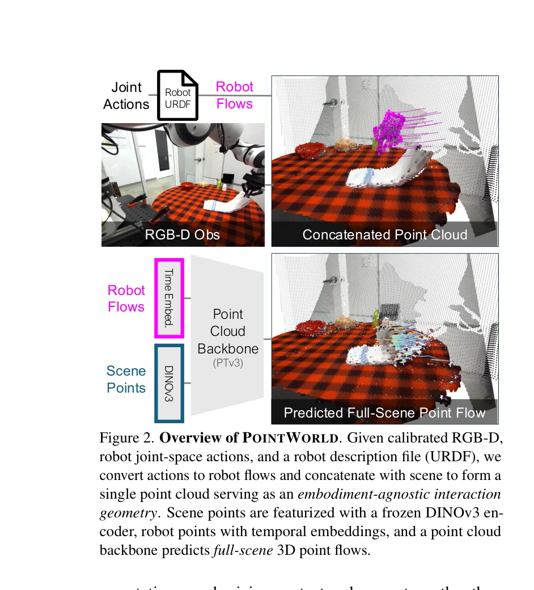
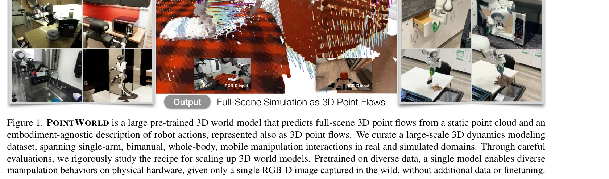

# PointWorld: Scaling 3D World Models for In-The-Wild Robotic Manipulation

> **저자**: Wenlong Huang, Yu-Wei Chao, Arsalan Mousavian, Ming-Yu Liu, Dieter Fox, Kaichun Mo, Li Fei-Fei | **날짜**: 2026-01-07 | **URL**: [https://arxiv.org/abs/2601.03782](https://arxiv.org/abs/2601.03782)

---

## Essence

*Figure 2. Overview of POINTWORLD. Given calibrated RGB-D,*

PointWorld는 RGB-D 입력과 로봇 동작을 3D point flow로 통일하여 표현하고, 이를 통해 전체 장면의 3D 포인트 변위를 예측하는 대규모 사전학습 3D 월드 모델이다. 단일 체크포인트로 실제 로봇이 다양한 조작 작업을 수행할 수 있게 한다.

## Motivation

- **Known**: 월드 모델은 현재 상태와 동작으로부터 미래 상태를 예측하는 모델로 연구되어 왔으며, 3D 표현 기반의 동역학 모델들이 로봇 조작에 사용되어 왔다. 최근 point tracking, depth estimation, camera pose estimation 등 3D 비전 기술이 발전했다.
- **Gap**: 기존 월드 모델들은 sim-to-real 갭, 도메인 특화성, 완전 관측성 가정, objectness prior 필요성 등의 제약이 있으며, 단일 모델로 개방형 환경의 다양한 체화(embodiment)와 작업에 일반화하기 어렵다.
- **Why**: 로봇의 일반적인 조작 능력을 위해서는 다양한 환경과 작업에서 3D 물리 상호작용을 정확히 예측해야 하며, 이는 spatial intelligence의 핵심 목표이다.
- **Approach**: 상태와 동작을 모두 3D point flow로 통일 표현하여 체화에 무관한 공유 표현공간을 만들고, 2M 궤적과 500시간 규모의 대규모 데이터셋으로 사전학습하며, MPC 프레임워크와 통합한다.

## Achievement

*Figure 1. POINTWORLD is a large pre-trained 3D world model that predicts full-scene 3D point flows from a static point c*

- **대규모 통합 표현**: 상태(RGB-D로부터의 point cloud)와 동작(robot URDF로부터의 3D point trajectory)을 3D point flow로 통일하여 체화 무관성 달성
- **고품질 3D 데이터셋**: DROID, BEHAVIOR-1K에서 metric depth, camera pose, point tracking 기술을 활용하여 2M 궤적, 500시간 규모의 3D 동역학 데이터셋 구축
- **체계적 설계 원리**: backbone 아키텍처, 동작 표현, 학습 목표, 부분 관측성, 데이터 혼합, 도메인 전이, scaling law에 대한 광범위한 실증 연구 수행
- **실시간 성능과 일반화**: 0.1초의 real-time 추론 속도로 MPC 통합 가능하며, 단일 checkpoint로 실제 Franka 로봇이 고정체 pushing, 변형체, articulated object, tool use를 in-the-wild 단일 이미지로 수행

## How

*Figure 2. Overview of POINTWORLD. Given calibrated RGB-D,*

- RGB-D 입력으로부터 metric depth와 camera pose estimation을 통해 calibrated point cloud 구성
- robot URDF와 joint action으로부터 robot 기하학과 kinematics를 이용해 robot point trajectory (robot flows) 생성
- scene point와 robot point를 concatenate하여 단일 point cloud 형성
- frozen DINOv3로 scene point 특성 추출, temporal embedding으로 robot point 표현
- Point Transformer v3(PTv3) backbone으로 full-scene 3D point flow 예측
- MPPI 기반 sampling MPC와 통합하여 planning 수행
- backbone 아키텍처, action representation (joint vs. end-effector vs. motion primitive), regression/contrastive/hybrid loss, partial observability 처리, real/sim data 혼합, zero-shot/finetuned transfer에 대한 ablation study 실시

## Originality

- State와 action을 동일한 3D point flow 모달리티로 통일하는 novel 공식화로, 기존 pixel-space, mesh, radiance field, particle 기반 접근들과 차별화
- Point tracking, depth estimation, camera pose estimation 등 최신 3D 비전 기술을 체계적으로 조합하여 대규모 실제 데이터에서 3D ground truth 추출
- Embodiment agnostic 표현으로 single-arm, bimanual, whole-body 로봇들을 unified framework에서 학습 가능하게 함
- Next-token prediction 패러다임을 3D 공간-시간 상호작용으로 확장하는 conceptual 기여

## Limitation & Further Study

- RGB-D 센서의 해상도 및 깊이 추정 오류가 3D point flow 정확도에 직결되며, 투명/반사 물체 처리 미흡 가능성
- Partial observability 하에서 occluded region의 동역학 예측 정확도 평가 필요
- 학습된 모델이 training data의 도메인(Franka, humanoid 등)에만 최적화되어 있을 가능성으로, 다른 로봇 형태로의 transfer 성능 명확하지 않음
- 실패한 trajectories도 학습 데이터에 포함되는데, 이것이 모델 성능에 미치는 영향 분석 필요
- 후속 연구: (1) 투명/반사 물체, 유체, 소입자 등 다양한 재료에 대한 일반화, (2) long-horizon 예측의 오차 누적 문제 해결, (3) 고해상도 센서와의 scaling, (4) 실시간 camera tracking 오류에 대한 robustness 향상

## Evaluation

- Novelty: 4/5
- Technical Soundness: 4/5
- Significance: 4/5
- Clarity: 4/5
- Overall: 4/5

**총평**: PointWorld는 상태-동작의 통일된 3D 표현, 대규모 고품질 데이터셋 구축, 체계적인 설계 원리 도출을 통해 일반목적 로봇 조작을 위한 scalable world modeling의 새로운 기준을 제시한다. Real robot에서의 zero-shot 성능은 3D 월드 모델의 실용성을 강력히 입증하며, 로봇 조작 커뮤니티에 significant impact를 미칠 것으로 예상된다.

## Related Papers

- 🏛 기반 연구: [[papers/1290_3D_Gaussian_Splatting_for_Real-Time_Radiance_Field_Rendering/review]] — 3D Gaussian Splatting의 실시간 3D 렌더링이 PointWorld의 3D point flow 예측 모델의 기초 기술을 제공한다.
- 🔗 후속 연구: [[papers/1631_World_Models/review]] — World Models의 일반적 프레임워크가 PointWorld의 3D 월드 모델을 더 광범위한 embodied AI 영역으로 확장한다.
- 🔄 다른 접근: [[papers/1419_Generative_World_Modelling_for_Humanoids_1X_World_Model_Chal/review]] — Generative World Modelling for Humanoids와 PointWorld는 모두 로봇을 위한 세계 모델 구축에서 서로 다른 표현 방식을 제시한다.
- 🏛 기반 연구: [[papers/1308_CLoSD_Closing_the_Loop_between_Simulation_and_Diffusion_for/review]] — PointWorld는 LEO의 3D 월드 모델링에 필요한 확장 가능한 3D 월드 모델의 기반을 제공한다
