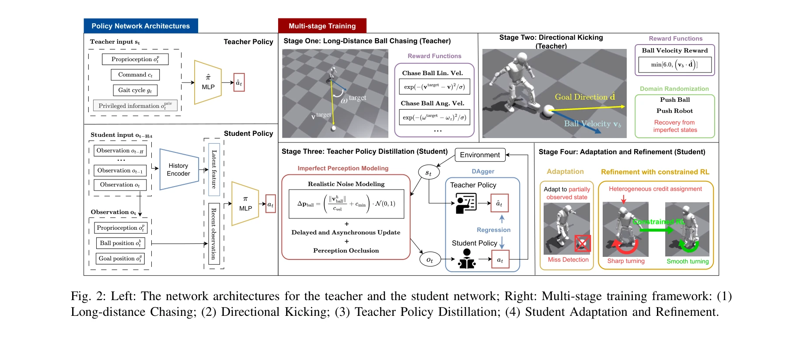
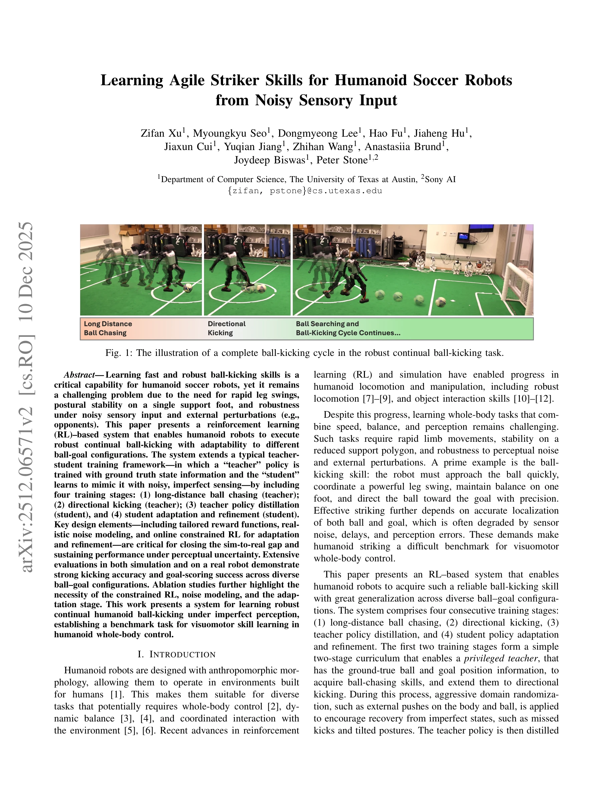

# Learning Agile Striker Skills for Humanoid Soccer Robots from Noisy Sensory Input

> **저자**: Zifan Xu, Myoungkyu Seo, Dongmyeong Lee, Hao Fu, Jiaheng Hu, Jiaxun Cui, Yuqian Jiang, Zhihan Wang, Anastasiia Brund, Joydeep Biswas, Peter Stone | **날짜**: 2025-12-10 | **DOI**: [10.48550/arXiv.2512.06571](https://doi.org/10.48550/arXiv.2512.06571)

---

## Essence

*Fig. 2: Left: The network architectures for the teacher and the student network; Right: Multi-stage training framework: *

이 논문은 reinforcement learning 기반의 4단계 학습 프레임워크를 통해 휴머노이드 로봇이 잡음이 많은 센서 입력 하에서도 견고한 볼 킹 능력을 습득할 수 있도록 한다. Teacher-student 정책 증류와 온라인 제약 RL 적응을 결합하여 시뮬레이션에서 실제 로봇으로의 전이를 성공적으로 달성한다.

## Motivation

- **Known**: 휴머노이드 로봇의 전신 제어는 이미 연구되었고, 쿼드러펫 플랫폼에서는 동적 축구 기술이 입증되었으나, 휴머노이드에서의 킹 기술은 양발 밸런스와 지각 불확실성으로 인해 덜 탐구되었다.
- **Gap**: 기존 휴머노이드 축구 연구는 드리블링이나 일반 보행에 초점을 맞춰왔으며, 잡음 많은 지각 하에서 민첩한 킹 기술이 남은 과제로 남아 있다.
- **Why**: 휴머노이드 로봇의 축구 능력은 빠른 다리 스윙, 한 발 위의 자세 안정성, 외부 교란에 대한 견고성을 동시에 요구하는 전형적인 전신 제어 벤치마크이며, 이는 인간 환경에서의 로봇 작동 능력을 평가하는 중요한 지표이다.
- **Approach**: Long-distance chasing과 directional kicking을 학습하는 teacher 정책 → DAgger를 통한 student 정책 증류 → 속도 의존 잡음 모델링과 현실적인 지각 불완전성 포함 → N-P3O 제약 RL을 이용한 온라인 적응 및 정제

## Achievement

*Fig. 1: The illustration of a complete ball-kicking cycle in the robust continual ball-kicking task.*

- **다단계 학습 프레임워크**: Teacher 정책 학습에서 student 정책 증류 및 적응까지 체계적인 4단계 커리큘럼 구성
- **현실적 지각 모델링**: 속도 의존 잡음, 지연, 프레임 드롭을 포함한 상세한 지각 불완전성 모델링
- **제약 RL을 통한 정제**: N-P3O 알고리즘으로 킥 전후 불균형한 보상을 처리하여 매끄러운 동작 달성
- **실제 로봇 검증**: Booster T1 휴머노이드에서 5가지 볼-골 배치에 걸쳐 평균 66.7% 성공률 달성
- **포괄적 평가**: 시뮬레이션과 실제 로봇 모두에서 킹 정확도, 성공률, 킹 강도, 에너지 효율성 측정

## How

*Fig. 2: Left: The network architectures for the teacher and the student network; Right: Multi-stage training framework: *

- **Stage 1 (Long-Distance Chasing)**: Teacher 정책이 특권정보(ground truth ball position)를 사용하여 다양한 초기 배치에서 공에 접근하는 견고한 보행 습득
- **Stage 2 (Directional Kicking)**: Teacher 정책이 ground truth ball/goal 위치를 활용하여 정밀하고 견고한 킹 동작 학습, 도메인 랜더마이제이션으로 실패 상황 복구
- **Stage 3 (Teacher Policy Distillation)**: DAgger 알고리즘으로 특권정보 teacher를 불완전 지각의 student 정책으로 증류
- **Stage 4 (Adaptation & Refinement)**: N-P3O 제약 RL로 부분관찰 상태에 온라인 적응, 킥 전의 부자연스러운 회전과 다리 떨림 제거
- **Network Architecture**: History encoder와 MLP 기반 정책 네트워크로 관찰 시퀀스 처리
- **Imperfect Perception Modeling**: 지각 noise, 업데이트 지연, occlusion으로 인한 프레임 드롭을 현실적으로 시뮬레이션

## Originality

- Teacher-student 프레임워크에 온라인 제약 RL 적응 단계 추가로 sim-to-real 갭을 단계적으로 폐쇄하는 참신한 접근
- 속도 의존 잡음 모델, 지연, 프레임 드롭을 통합한 현실적 지각 불완전성 모델링이 기존 work보다 정교함
- Heterogeneous credit assignment를 N-P3O로 해결하여 킥 동작 직전의 보상 불균형 문제를 직접 대응
- 휴머노이드 킹을 정확하고 일반화 가능한 벤치마크로 설정하여 전신 visuomotor 기술 학습의 새로운 표준 제시

## Limitation & Further Study

- 실제 로봇 성공률 66.7%는 실용적 적용에는 여전히 개선 여지가 있으며, 상대 선수 등 동적 환경에서의 성능 미평가
- Booster T1 특정 로봇에만 검증되었으며, 다른 휴머노이드 플랫폼으로의 일반화 가능성 불명확
- 복잡한 다단계 학습 절차로 인해 하이퍼파라미터 튜닝과 재현성이 어려울 수 있음
- **후속 연구**: 동적 환경과 대치 상황 추가, 다양한 휴머노이드 플랫폼으로의 전이학습, 에너드-조건부 학습으로 다양한 킹 강도 제어

## Evaluation

- Novelty: 4/5
- Technical Soundness: 3/5
- Significance: 4/5
- Clarity: 4/5
- Overall: 4/5

**총평**: 이 논문은 휴머노이드 로봇의 도전적인 킹 기술을 체계적인 다단계 학습과 현실적 지각 모델링으로 성공적으로 학습시킨 저작이며, sim-to-real 전이의 실질적 해결책을 제시한다. 다만 실제 로봇의 성공률 개선과 더욱 동적인 환경에서의 검증이 필요하다.

## Related Papers

- 🔄 다른 접근: [[papers/1358_Dribble_Master_Learning_Agile_Humanoid_Dribbling_through_Leg/review]] — 두 논문 모두 휴머노이드의 축구 드리블 기술을 다루지만, 볼 킥킹 vs 드리블링이라는 서로 다른 축구 기술에 집중함
- 🔗 후속 연구: [[papers/1547_Learning_Vision-Driven_Reactive_Soccer_Skills_for_Humanoid_R/review]] — 시각 기반 반응형 축구 기술의 기본 아이디어를 Teacher-student 증류와 제약 RL을 통해 더욱 견고하게 발전시킨 형태임
- 🏛 기반 연구: [[papers/1536_Learning_Soccer_Skills_for_Humanoid_Robots_A_Progressive_Per/review]] — 휴머노이드 축구 기술 학습을 위한 점진적 지각-행동 통합 프레임워크의 이론적 토대를 제공함
- 🔗 후속 연구: [[papers/1450_HITTER_A_HumanoId_Table_TEnnis_Robot_via_Hierarchical_Planni/review]] — HITTER의 계층적 planning과 learning은 축구와 같은 다른 스포츠 기술 학습에도 적용될 수 있는 일반적 프레임워크를 제공한다.
- 🔄 다른 접근: [[papers/1465_Humanoid_Goalkeeper_Learning_from_Position_Conditioned_Task-/review]] — 두 논문 모두 축구 관련 기술을 다루지만, 하나는 골키퍼에, 다른 하나는 일반적인 striker skills에 특화되어 있다.
- 🏛 기반 연구: [[papers/1536_Learning_Soccer_Skills_for_Humanoid_Robots_A_Progressive_Per/review]] — PAiD 프레임워크의 점진적 학습 아키텍처가 축구 로봇의 견고한 볼 킥킹 능력 습득에 이론적 토대를 제공함
- 🏛 기반 연구: [[papers/1547_Learning_Vision-Driven_Reactive_Soccer_Skills_for_Humanoid_R/review]] — 강화학습 기반 시각 제어 시스템의 기본 개념이 축구 로봇의 견고한 볼 킹 기술 학습에 방법론적 토대를 제공함
