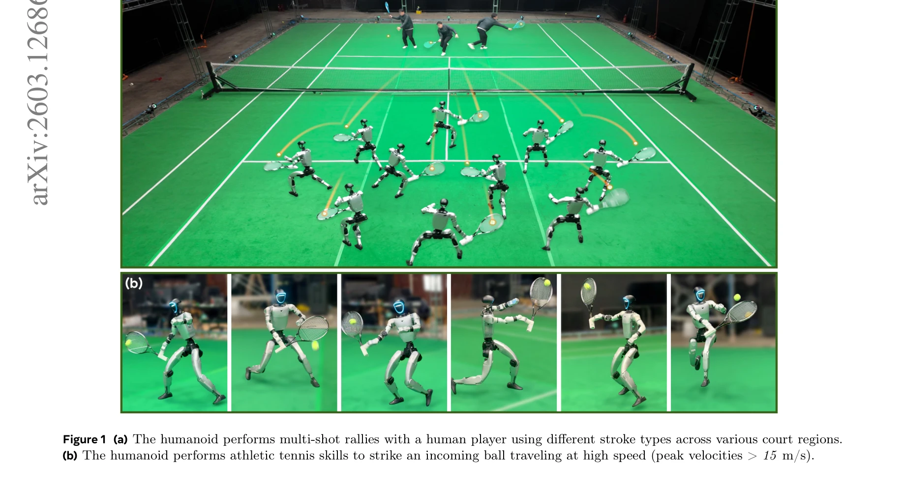

# Learning Athletic Humanoid Tennis Skills from Imperfect Human Motion Data (LATENT)

> **저자**: Zhikai Zhang, Haofei Lu, Yunrui Lian, Ziqing Chen, Yun Liu, Chenghuai Lin, Han Xue, Zicheng Zeng, Zekun Qi, Shaolin Zheng, Qing Luan, Jingbo Wang, Junliang Xing, He Wang, Li Yi | **날짜**: 2026-03-13 | **URL**: [https://arxiv.org/abs/2603.12686](https://arxiv.org/abs/2603.12686)

---

## Essence

*Figure 2 Overview of LATENT. (a) We pre-train a motion tracker on collected imperfect human motion data. (b) We construc*

불완전한 인간 테니스 모션 데이터(5명 선수의 5시간 단편)로부터 잠재 행동 공간을 구성하고, 고수준 정책과 손목 보정을 통해 휴머노이드 로봇이 멀티샷 테니스 랠리를 수행할 수 있도록 학습하는 LATENT 시스템을 제안한다.

## Motivation

- **Known**: 휴머노이드 로봇의 높은 자유도 제어를 위해 인간 모션 데이터로부터 잠재 행동 공간을 학습하고, 고수준 정책이 이를 샘플링하는 계층적 제어 방식이 널리 연구되어 왔다. 테니스 같은 스포츠 기술 습득은 매우 동적인 움직임, 빠른 반응, 높은 정밀도를 요구한다.
- **Gap**: 기존 연구는 완전하고 정밀한 인간 테니스 모션 데이터 수집이 어렵거나, 복잡한 비디오 처리 파이프라인에 의존하거나, 물리적 부실성 가정을 포함한다. 또한 불완전한 모션 데이터(부정확한 손목 동작, 불완전한 스킬 정보)를 효과적으로 활용하는 방법이 부족하다.
- **Why**: 테니스는 6m/s 이상의 스프린트, 15-30m/s의 고속 볼 반응, 밀리초 단위의 정밀한 라켓 접촉이 필요한 대표적인 동적 스포츠이며, 실제 휴머노이드 로봇에서 이러한 경기력을 달성하는 것은 중요한 도전 과제이다.
- **Approach**: 세 단계로 구성된다: (1) 3m×5m 영역의 컴팩트 모션 캡처 시스템으로 전·백핸드, 옆 셔플 등 기본 스킬만 수집, (2) 보정 가능한 잠재 행동 공간 구성으로 손목 보정 호환성 제공, (3) 고수준 정책이 latent action barrier를 통해 기본 스킬 사전 분포를 존중하며 학습.

## Achievement

*Figure 1 (a) The humanoid performs multi-shot rallies with a human player using different stroke types across various co*

- **imperfect 모션 데이터 활용**: 부정확한 손목 동작과 불완전한 스킬 정보를 포함한 저비용 모션 데이터(5시간, 5명)로도 자연스러운 테니스 기술 학습 가능
- **Correctable latent action space**: 모션 트래커와 variational information bottleneck을 통해 고수준 정책의 보정을 허용하는 잠재 공간 설계
- **Latent action barrier (LAB)**: 상태 기반 행동 분포 사전으로 RL 탐색을 제약하여 태스크 성능과 자연스러운 동작 사이의 균형 달성
- **실제 로봇 배포**: Unitree G1에서 안정적인 멀티샷 랠리 수행 및 sim-to-real 전이 성공
- **광범위한 검증**: 다양한 스트로크 타입, 코트 영역, 고속 볼(15m/s 이상) 처리 능력 입증

## How

*Figure 2 Overview of LATENT. (a) We pre-train a motion tracker on collected imperfect human motion data. (b) We construc*

- **모션 데이터 수집**: 5명의 아마추어 테니스 선수로부터 전·백핸드 스트로크, 옆 셔플, 크로스오버 스텝 등 primitive skills를 3m×5m 모션 캡처 영역에서 5시간 분량 수집 (편집/주석 없음)
- **Retargeting**: LocoMuJoCo를 사용하여 인간 모션을 휴머노이드 모션으로 전환
- **모션 트래커 사전학습**: 수집된 노이즈가 있는 모션 데이터를 모방하도록 학습
- **Variational information bottleneck 기반 잠재 공간 생성**: 트래커를 증류(distillation)하여 재사용 가능한 primitive skills의 잠재 공간 구성
- **손목 보정 호환성**: 잠재 공간이 고수준 정책의 보정 예측을 수용할 수 있도록 설계
- **Latent action barrier**: 상태 조건부 행동 분포 사전을 기반으로 RL 탐색 범위 제약
- **동역학 무작위화 및 관찰 노이즈**: 로봇과 테니스 볼 모두에 대한 강건한 sim-to-real 전이 지원
- **학습**: PPO 프레임워크로 고수준 정책 학습 (8개 GPU 병렬, 50Hz 고수준/저수준 제어, 2000Hz 시뮬레이션)

## Originality

- **불완전 데이터의 명시적 처리**: 부정확성(imprecise)과 불완전성(incomplete)을 구분하여 각각 보정 가능 공간 설계와 latent action barrier로 해결하는 새로운 접근
- **Correctable latent action space**: 기존 VAE 기반 접근과 달리 고수준 정책의 능동적 보정을 허용하는 잠재 공간 구조 제안
- **Latent action barrier**: 상태 기반 사전 분포로 RL 탐색을 제약하는 새로운 메커니즘으로 natural motion style 보존과 태스크 성능의 균형
- **실제 로봇 테니스 구현**: 기존 Vid2Player3D와 달리 물리적 제약을 고려하고 강건한 실제 로봇 배포 달성

## Limitation & Further Study

- **데이터 규모 제한**: 5시간의 모션 데이터는 여전히 다양한 테니스 상황을 완전히 커버하지 못할 수 있음
- **Retargeting 품질**: LocoMuJoCo를 통한 자동 retargeting 과정에서 인간-휴머노이드 체형 차이로 인한 손실 가능성
- **공 예측**: 테니스 볼의 궤적 예측 정확도가 고속 볼 처리 능력을 제한할 수 있음
- **스트로크 다양성**: 현재 구현은 주요 스트로크(전·백핸드 등)에 초점이며, 슬라이스, 드롭샷 등 고급 기술은 미포함 가능성
- **일반화**: 특정 Unitree G1 로봇과 실험 환경에 맞춰진 튜닝이 다른 휴머노이드나 환경으로의 전이를 제한할 수 있음
- **후속 연구**: (1) 더 큰 규모 및 다양한 모션 데이터 수집, (2) 온라인 학습을 통한 실제 로봇에서의 적응, (3) 다양한 휴머노이드 플랫폼으로의 확장, (4) 시각 기반 의도 예측 통합으로 인간 플레이어 적응성 강화

## Evaluation

- Novelty: 4/5
- Technical Soundness: 3/5
- Significance: 4/5
- Clarity: 4/5
- Overall: 4/5

**총평**: LATENT는 불완전한 인간 모션 데이터로부터 실제 휴머노이드 로봇의 동적 스포츠 기술을 학습하는 실질적이고 창의적인 접근법을 제시하며, correctable latent action space와 latent action barrier라는 두 가지 핵심 설계를 통해 데이터의 불완전성을 효과적으로 해결한다. 실제 Unitree G1에서 안정적인 멀티샷 테니스 랠리 구현은 휴머노이드 로봇의 경기력 달성에 있어 중요한 진전을 보여준다.

## Related Papers

- 🔄 다른 접근: [[papers/1485_HumanX_Toward_Agile_and_Generalizable_Humanoid_Interaction_S/review]] — 둘 다 인간 영상에서 휴머노이드 스킬을 학습하지만 1519는 특정 운동(테니스)에, 1485는 일반적 상호작용에 특화됨
- 🧪 응용 사례: [[papers/1573_SimpleVLA-RL_Scaling_VLA_Training_via_Reinforcement_Learning/review]] — Mimicking-Bench의 다양한 가사 작업이 테니스 스킬 학습의 확장된 적용 영역을 보여줌
- 🏛 기반 연구: [[papers/1525_Learning_Human-Like_Badminton_Skills_for_Humanoid_Robots/review]] — Learning Human-Like Badminton Skills의 라켓 스포츠 학습 방법론이 테니스 스킬 학습의 기반을 제공함
- 🏛 기반 연구: [[papers/1525_Real-Time_Execution_of_Action_Chunking_Flow_Policies/review]] — 불완전한 인간 데이터로부터 운동 기술 학습 방법론이 배드민턴 기술의 인간 모션 프라이어 활용에 직접 적용 가능하다
- 🔄 다른 접근: [[papers/1485_HumanX_Toward_Agile_and_Generalizable_Humanoid_Interaction_S/review]] — 둘 다 인간 영상으로부터 휴머노이드 스킬을 학습하지만 1485는 일반적 상호작용에, 1519는 특정 운동(테니스)에 특화됨
