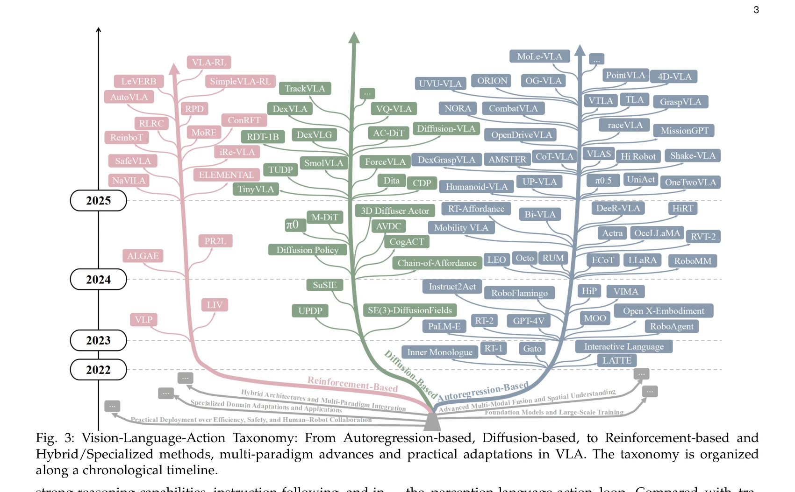
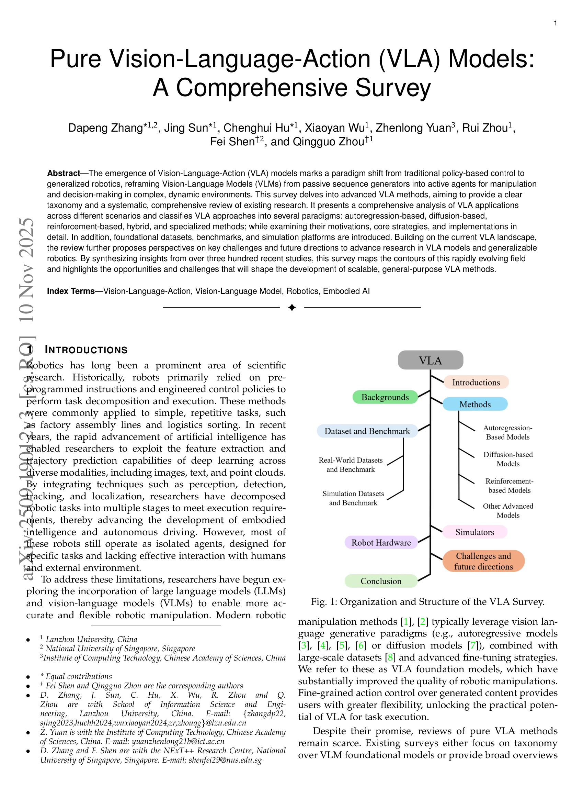
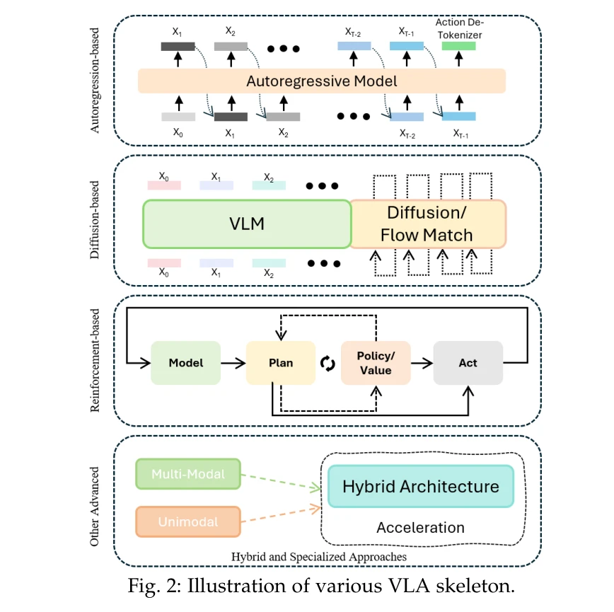

# Pure Vision Language Action (VLA) Models: A Comprehensive Survey

> **저자**: Dapeng Zhang, Jing Sun, Chenghui Hu, Xiaoyan Wu, Zhenlong Yuan, Rui Zhou, Fei Shen, Qingguo Zhou | **날짜**: 2025-09-23 | **URL**: [https://arxiv.org/abs/2509.19012](https://arxiv.org/abs/2509.19012)

---

## Essence

*Fig. 3: Vision-Language-Action Taxonomy: From Autoregression-based, Diffusion-based, to Reinforcement-based and*

본 논문은 Vision Language Action (VLA) 모델을 체계적으로 분류하고 분석하는 포괄적 서베이로, autoregression-based, diffusion-based, reinforcement-based, hybrid, specialized methods로 VLA 접근법을 분류하여 300개 이상의 최근 연구를 종합한다.

## Motivation

- **Known**: Vision Language Model (VLM)과 Large Language Model (LLM)의 발전으로 로봇의 지각, 이해, 행동 능력이 향상되었으나, 이들 능력을 통합한 VLA 시스템의 체계적 분류와 분석이 부족하다.
- **Gap**: 기존 서베이는 VLM 기초 모델이나 로봇 조작의 전반적 개요에만 초점을 맞추었으며, pure VLA 방법론의 정립된 분류체계와 포괄적 분석이 부재하다.
- **Why**: VLA는 전통적 정책 기반 제어에서 일반화된 로봇공학으로의 패러다임 전환을 대표하며, 복잡한 동적 환경에서 로봇 조작과 의사결정의 실용화를 위해 체계적 이해가 필수적이다.
- **Approach**: VLA 모델의 행동 생성 전략(action-generation strategy)을 기준으로 autoregression-based, diffusion-based, reinforcement-based, hybrid, specialized methods의 5가지 패러다임으로 분류하고, 각 방법의 동기, 핵심 전략, 구현을 상세 분석한다.

## Achievement

*Fig. 1: Organization and Structure of the VLA Survey.*

- **VLA 방법론의 체계적 분류**: pure VLA 방법에 대한 명확한 분류체계를 제시하여 행동 생성 전략에 따른 접근법의 차별화된 특성을 파악 가능하게 함
- **포괄적 리소스 개요**: VLA 모델 학습 및 평가에 필수적인 데이터셋, 벤치마크, simulation platform에 대한 종합적 개요 제공
- **응용 도메인 분석**: robotic arm, quadruped robot, humanoid, wheeled robot 등 다양한 로봇 플랫폼에서의 VLA 배포 현황 평가
- **향후 방향 제시**: 데이터 제약, 추론 속도, 안전성 등 핵심 과제를 식별하고 확장 가능한 범용 VLA 방법 개발을 위한 미래 연구 방향 제안

## How

*Fig. 2: Illustration of various VLA skeleton.*

- Vision-Language-Action taxonomy 개발: autoregression-based, diffusion-based, reinforcement-based, hybrid, specialized methods로 분류하고 시간 축을 따라 발전 추이 시각화
- 각 패러다임별 심층 분석: 동기(motivation), 핵심 전략(core strategy), 구현 메커니즘(implementation mechanism)을 상세히 검토
- 응용 시나리오 매핑: 로봇 팔, 사족 로봇, 휴머노이드, 자율주행 등 다양한 로봇 유형별 VLA 활용 사례 체계화
- 리소스 인벤토리 구축: 주요 데이터셋, 벤치마크, simulation platform을 조사하여 VLA 개발 생태계 파악
- 문헌 메타분석: 300개 이상의 최근 연구를 종합하여 현황 파악 및 트렌드 분석

## Originality

- Pure VLA 방법론에 특화된 최초의 포괄적 서베이: 기존 VLM 중심이나 로봇공학 전체 역사 중심 서베이와 달리 VLA의 행동 생성 전략을 중심으로 분류
- 5가지 패러다임 분류체계의 제시: autoregression, diffusion, reinforcement learning, hybrid, specialized methods의 상호 연관성과 차별성을 명확히 함
- 멀티모달-행동 통합 프레임워크 분석: 시각, 언어, 행동의 통합 시퀀스 모델링 관점에서 VLA의 고유한 특성 해석

## Limitation & Further Study

- 서베이의 시간 제약성: 300개 연구 수집 이후 신속히 발전하는 VLA 분야의 최신 방법론을 완전히 포괄하지 못할 가능성
- VLA 평가 메트릭 표준화 부재: 다양한 도메인과 데이터셋의 벤치마크가 이질적이어서 방법론 간 직접 비교의 어려움
- 현실-시뮬레이션 갭: 대부분 연구가 시뮬레이션 환경에서 검증되며 실제 로봇 배포의 일반화 성능에 대한 평가 부족
- **후속 연구 방향**: (1) 데이터 효율성 증대를 위한 few-shot, zero-shot VLA 방법 개발, (2) 실시간 추론을 위한 경량 VLA 모델 연구, (3) 안전성 보증 메커니즘 통합, (4) 크로스 도메인 일반화 능력 강화

## Evaluation

- Novelty: 4/5
- Technical Soundness: 3/5
- Significance: 4/5
- Clarity: 4/5
- Overall: 4/5

**총평**: 본 서베이는 VLA 분야의 급속한 발전 속에서 처음으로 체계적인 분류체계를 제시하고 300개 이상의 연구를 종합하여 현황 맵핑을 제공함으로써, VLA 연구자와 로봇공학자들에게 높은 학술적 가치를 제공한다. 다만 시뮬레이션-현실 갭, 평가 메트릭 표준화, 최신 방법론 수용 측면의 개선이 향후 필요하다.

## Related Papers

- 🔄 다른 접근: [[papers/1446_Large_VLM-based_Vision-Language-Action_Models_for_Robotic_Ma/review]] — VLA 모델 분류에서 pure VLA와 hierarchical/monolithic 관점이라는 서로 다른 체계적 접근을 보여준다.
- 🔗 후속 연구: [[papers/1429_HybridVLA_Collaborative_Diffusion_and_Autoregression_in_a_Un/review]] — VLA 모델의 포괄적 분류와 diffusion-autoregression 통합이 VLA 접근법의 확장된 이해를 제공한다.
- 🏛 기반 연구: [[papers/1608_Vision-Language-Action_VLA_Models_Concepts_Progress_Applicat/review]] — VLA 모델의 개념과 응용에 대한 기본적 이해가 pure VLA 모델의 체계적 분석에 이론적 기반을 제공한다.
- 🏛 기반 연구: [[papers/1307_An_Anatomy_of_Vision-Language-Action_Models_From_Modules_to/review]] — pure VLA 모델의 포괄적 조사가 VLA 구조 분석의 이론적 토대를 제공한다
- 🔄 다른 접근: [[papers/1429_HybridVLA_Collaborative_Diffusion_and_Autoregression_in_a_Un/review]] — VLA 모델에서 diffusion과 autoregression의 통합 방식에 대한 서로 다른 체계적 접근을 보여준다.
- 🔄 다른 접근: [[papers/1446_Large_VLM-based_Vision-Language-Action_Models_for_Robotic_Ma/review]] — VLA 모델의 아키텍처 분류에 대한 서로 다른 체계적 접근과 관점을 보여준다.
- 🏛 기반 연구: [[papers/1509_OpenHelix_A_Short_Survey_Empirical_Analysis_and_Open-Source/review]] — Pure VLA 모델의 포괄적 서베이가 dual-system VLA 아키텍처 분석의 이론적 기반을 제공한다.
- 🏛 기반 연구: [[papers/1608_Vision-Language-Action_VLA_Models_Concepts_Progress_Applicat/review]] — Pure VLA 모델들의 종합적 분석이 VLA 개념과 진전을 체계화한 1608 리뷰의 기초 자료
