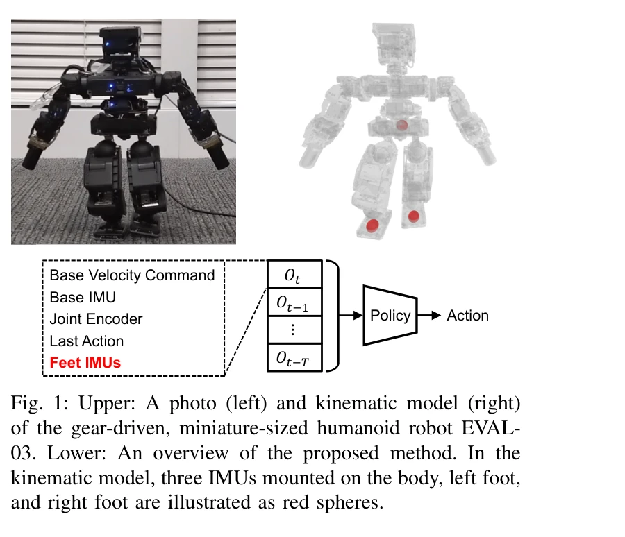

# Learning Bipedal Locomotion on Gear-Driven Humanoid Robot Using Foot-Mounted IMUs

> **저자**: Sotaro Katayama, Yuta Koda, Norio Nagatsuka, Masaya Kinoshita | **날짜**: 2025-04-01 | **URL**: [https://arxiv.org/abs/2504.00614](https://arxiv.org/abs/2504.00614)

---

## Essence

*Fig. 1: Upper: A photo (left) and kinematic model (right)*

고기어비 액추에이터를 가진 휴머노이드 로봇의 토크 센서 부재 문제를 해결하기 위해 발-장착 IMU를 활용한 Sim-to-real RL 프레임워크를 제안하며, 대칭 데이터 증강과 random network distillation을 적용하여 복잡한 지형에서의 이족 보행 학습을 개선한다.

## Motivation

- **Known**: RL은 강건하고 역동적인 보행 능력을 보여주었으나, 직접 구동(direct/quasi-direct drive) 액추에이터가 없는 고기어비 로봇의 경우 정확한 액추에이터 모델링이나 토크 센서가 필수적이어야 한다.
- **Gap**: 저비용 소형 휴머노이드 로봇(EVAL-03 등)은 토크 센서가 없고 높은 백래시와 마찰로 인한 비선형 토크-전류 관계를 가지는데, 이러한 로봇에 RL을 적용하기 위한 효과적인 방법이 부족하다.
- **Why**: 소형 휴머노이드 로봇의 실제 배포를 위해서는 정교한 시스템 식별 없이도 다양한 지형에서 안정적인 보행을 학습할 수 있는 방법이 필요하며, 이는 엔터테인먼트와 실용 로봇 응용 분야에서 중요하다.
- **Approach**: 발-장착 IMU 센서 측정값(선형 가속도, 각속도)을 관찰 공간에 통합하고, 대칭 데이터 증강과 random network distillation을 적용하여 Legged Gym 기반의 Sim-to-real RL을 수행한다.

## Achievement

- **발-장착 IMU 활용 프레임워크**: 발의 상태를 직접 측정하는 발-장착 IMU를 RL 정책의 관찰 공간에 포함시켜 상세한 액추에이터 모델링 없이도 sim-to-real 전환을 개선
- **대칭 데이터 증강**: 제안된 관찰 공간에 적합한 대칭 데이터 증강 기법을 개발하여 학습 효율성 향상
- **Random Network Distillation 적용**: 거친 지형에서의 보행 학습을 강화하기 위해 random network distillation을 적용
- **하드웨어 검증**: EVAL-03 로봇에서 비강성 표면과 환경 급변에 대한 빠른 안정화 능력 개선을 실험으로 검증

## How

*Fig. 1: Upper: A photo (left) and kinematic model (right)*

- Legged Gym 프레임워크를 기반으로 하며, 관찰 공간에 기본 IMU 선형 가속도, 기본 IMU 각속도, 발-장착 IMU 가속도(좌우 각 3차원) 및 각속도(좌우 각 3차원)를 포함
- Domain randomization을 통해 기본 속도 명령, IMU 측정(가속도 4.0 노이즈 스케일, 각속도 0.1), 관절 위치/속도, 마찰 계수 등의 파라미터를 무작위화
- 보상 함수는 선형/각속도 추적(가중치 1.5, 1.0), 기본 회전/높이 페널티, 발 접촉 상태, 발 체공 시간 등 다양한 항목으로 구성
- Low-level PD 컨트롤러에 대한 대상 관절 위치를 액션으로 사용하며, 커리큘럼 학습으로 10가지 난이도 레벨의 다양한 지형(경사, 거친 표면, 계단 등)에서 학습
- Symmetric data augmentation은 좌우 대칭 구조를 활용한 데이터 증강 기법 적용
- Random network distillation을 통해 탐험(exploration)을 장려하여 거친 지형 학습 개선

## Originality

- 발-장착 IMU를 RL 기반 보행 제어에 적극 활용한 점은 기존 연구(상태 추정에만 사용)와 차별화
- 고기어비 액추에이터와 토크 센서 부재 문제에 대해 센서 추가라는 실용적 해결책 제시
- 제안된 관찰 공간에 맞춘 대칭 데이터 증강 기법의 개발
- 상세한 액추에이터 모델 식별 대신 발의 상태 센싱을 통한 sim-to-real 갭 해소 전략

## Limitation & Further Study

- 발-장착 IMU 추가로 인한 하드웨어 비용 증가 및 로봇 무게 증가의 절충 미논의
- EVAL-03이라는 소형 로봇에만 검증되었으며, 인간 크기의 휴머노이드 로봇으로의 확장성 불명확
- random network distillation의 정확한 구현 세부사항 및 성능 기여도의 정량적 분석 부족
- 발-장착 IMU의 성능(노이즈, 바이어스, 보정) 특성이 최종 성능에 미치는 영향에 대한 상세 분석 필요
- 후속 연구: 다른 플랫폼(인간 크기 로봇, 다리 개수 다른 로봇)에의 일반화, 발-장착 IMU 외 다른 발 센서(압력, 온도 등) 통합, 온라인 파인튜닝 전략 개발

## Evaluation

- Novelty: 4/5
- Technical Soundness: 3/5
- Significance: 4/5
- Clarity: 4/5
- Overall: 4/5

**총평**: 발-장착 IMU라는 실용적 센서 추가를 통해 저비용 고기어비 로봇의 sim-to-real RL 문제를 우아하게 해결하며, 대칭 데이터 증강과 random network distillation의 조합으로 거친 지형 보행 능력을 입증한 견고한 연구이다. 다만 하드웨어 확장성과 방법의 일반화 가능성에 대한 추가 검증이 필요하다.

## Related Papers

- 🏛 기반 연구: [[papers/1431_Impact_of_Static_Friction_on_Sim2Real_in_Robotic_Reinforceme/review]] — 정적 마찰이 Sim2Real 전이에 미치는 영향 분석이 고기어비 액추에이터 환경에서의 실제 전이 문제 해결에 직접적으로 도움됨
- 🔄 다른 접근: [[papers/1277_BeamDojo_Learning_Agile_Humanoid_Locomotion_on_Sparse_Footho/review]] — 두 논문 모두 제한된 센서 환경에서의 이족 보행을 다루지만, IMU 기반 vs sparse foothold 환경이라는 서로 다른 도전 과제에 집중함
- 🔗 후속 연구: [[papers/1535_Learning_Smooth_Humanoid_Locomotion_through_Lipschitz-Constr/review]] — Lipschitz 제약을 통한 부드러운 보행 학습 방법을 고기어비 로봇의 토크 센서 부재 문제 해결에 적용할 수 있는 확장 가능성을 제시함
- 🏛 기반 연구: [[papers/1535_Learning_Smooth_Humanoid_Locomotion_through_Lipschitz-Constr/review]] — 고기어비 로봇에서의 부드러운 보행 학습 문제에 Lipschitz 제약 기반 평활성 보장 방법을 적용할 수 있는 이론적 배경을 제공함
