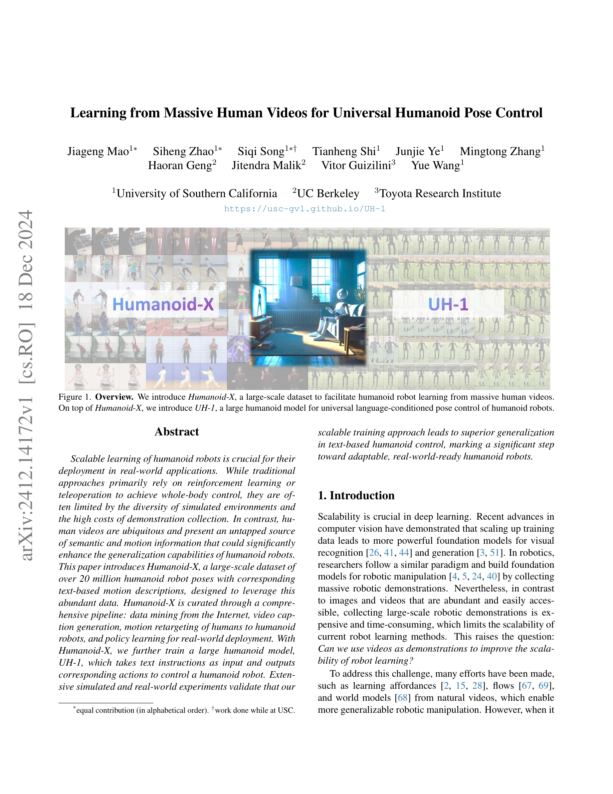
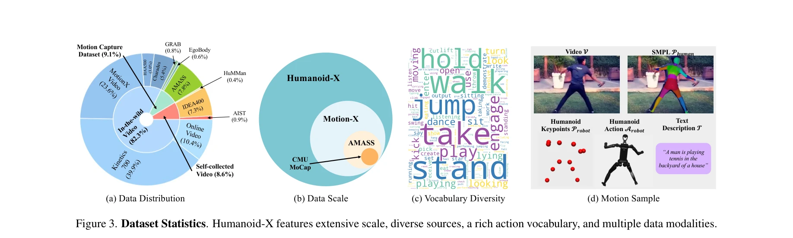
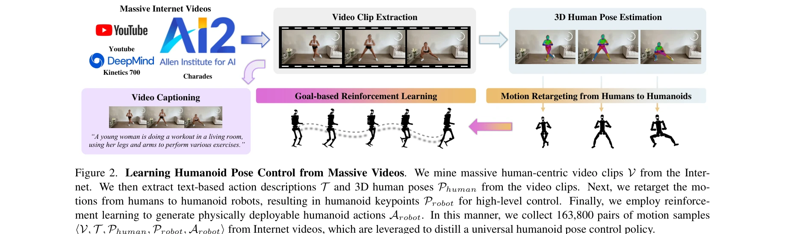

# Learning from Massive Human Videos for Universal Humanoid Pose Control

> **저자**: Jiageng Mao, Siheng Zhao, Siqi Song, Tianheng Shi, Junjie Ye, Mingtong Zhang, Haoran Geng, Jitendra Malik, Vitor Guizilini, Yue Wang | **날짜**: 2024-12-18 | **URL**: [https://arxiv.org/abs/2412.14172](https://arxiv.org/abs/2412.14172)

---

## Essence

*Figure 1. Overview. We introduce Humanoid-X, a large-scale dataset to facilitate humanoid robot learning from massive hu*

Humanoid-X는 인터넷 영상에서 추출한 2천만 개 이상의 휴머노이드 로봇 포즈-텍스트 쌍으로 구성된 대규모 데이터셋이며, 이를 기반으로 UH-1이라는 Transformer 기반 모델을 학습하여 자연언어 명령으로 휴머노이드 로봇을 제어할 수 있게 한다.

## Motivation

- **Known**: Reinforcement learning과 teleoperation을 통한 휴머노이드 로봇 제어가 존재하지만, 시뮬레이션 환경의 제한성과 높은 데이터 수집 비용으로 인해 확장성이 부족하다. 최근 로봇 조작 학습에서는 대규모 인터넷 영상을 활용하는 접근법이 성공했다.
- **Gap**: 휴머노이드 로봇은 로봇 팔과 다른 운동학적 구조와 자유도를 가지므로, 인터넷 영상으로부터 일반화 가능한 전신 제어 정책을 학습하는 방법이 미해결 상태이다.
- **Why**: 휴머노이드 로봇의 실제 배포를 위해서는 높은 확장성과 다양한 작업에 대한 일반화 능력이 필수적이며, 무제한 인터넷 영상을 활용하면 이를 달성할 수 있다.
- **Approach**: 인터넷 영상에서 3D 인간 포즈를 추출하고 motion retargeting으로 휴머노이드 로봇 포즈로 변환한 후, 이를 RL로 실제 배포 가능한 행동으로 변환하여 대규모 텍스트-행동 데이터셋을 구성한다. 이 데이터셋으로 Transformer 기반 UH-1 모델을 학습하여 텍스트 명령을 휴머노이드 행동으로 매핑한다.

## Achievement

*Figure 3. Dataset Statistics. Humanoid-X features extensive scale, diverse sources, a rich action vocabulary, and multip*

- **Humanoid-X 데이터셋**: 160,800개 영상에서 추출한 2천만 개 이상의 휴머노이드 포즈-텍스트 쌍으로 구성되며, SMPL 기반 인간 포즈, 휴머노이드 keypoints, 행동 토큰 등 5개 modality를 포함한 최대 규모의 휴머노이드 데이터셋
- **UH-1 모델**: Transformer 아키텍처 기반으로 20백만 행동을 discrete action tokens로 변환하여 자연언어 명령에서 행동 수열을 auto-regressive 생성
- **유연한 제어 모드**: Text-to-keypoint와 text-to-action 두 가지 상호교환 가능한 제어 모드 지원
- **높은 일반화 성능**: 시뮬레이션 및 실제 로봇 환경에서 광범위한 텍스트 명령에 대해 다양하고 맥락적으로 정확한 휴머노이드 행동을 생성 가능
- **실제 배포 검증**: 제안된 확장적 학습 방식이 이전에 달성하지 못했던 수준의 일반화 능력을 제공함을 확인

## How

*Figure 2. Learning Humanoid Pose Control from Massive Videos. We mine massive human-centric video clips V from the Inter*

- 대규모 영상 수집: Kinetics 700, Charades, YouTube 등에서 인간-중심 영상 163,800개 마이닝
- 텍스트 설명 추출: 영상 captioning 도구를 활용한 자연언어 행동 설명 생성
- 3D 인간 포즈 추출: SMPL 기반 3D human pose estimation으로 비디오에서 인간 포즈 시퀀스 복원
- Motion retargeting: 3D 인간 포즈를 humanoid keypoints로 변환하여 고수준 제어용 표현 생성
- RL 기반 정책 학습: Goal-based reinforcement learning으로 keypoints를 물리적으로 실현 가능한 로봇 DoF 위치(저수준 행동)로 매핑
- Action discretization: 20백만 humanoid 행동을 discrete tokens로 양자화하여 motion primitive 어휘 구성
- Transformer 모델 학습: UH-1이 텍스트를 입력받아 tokenized humanoid 행동 수열을 auto-regressive 생성
- Action decoding: Keypoint 표현을 추가 decoder로 DoF 위치로 변환
- 로봇 제어: PD controller를 통해 DoF 위치를 모터 토크로 변환하여 실제 로봇 배포

## Originality

- 휴머노이드 로봇을 위한 대규모 인터넷 영상 기반 학습 첫 시도: 기존 로봇 조작 분야의 접근법을 휴머노이드의 복잡한 운동학적 구조에 맞게 확장
- Motion retargeting 파이프라인 활용: 3D 인간 포즈를 humanoid 로봇으로 자동 변환하는 체계적 방법론 제시
- Dual control mode 설계: Text-to-keypoint와 text-to-action 두 제어 모드를 상황에 따라 선택 가능하도록 구현
- 대규모 수치 실험: 시뮬레이션과 실제 로봇 환경 모두에서 광범위한 검증으로 높은 현실성 입증
- 자연언어 인터페이스: 사람이 텍스트로 휴머노이드 로봇을 직관적으로 제어할 수 있는 인터페이스 제공

## Limitation & Further Study

- Motion retargeting의 정확성: 인간과 휴머노이드의 운동학적 차이로 인한 정보 손실이나 물리적 부자연스러움의 정도 미상세
- 3D pose estimation 오류 누적: 영상에서 추출한 포즈 추정의 부정확성이 최종 로봇 제어에 미치는 영향도 분석 부족
- 텍스트 설명의 품질 편향: Captioning 도구 기반 자동 생성 텍스트의 다양성 및 정확성 한계
- 실제 로봇 배포 범위: 제한된 실제 로봇 하드웨어(모델/사양 미명시)에서의 검증으로 일반성 확보 미흡
- 분포 외 명령 처리: 학습 데이터에 없는 새로운 텍스트 명령이나 복합 작업에 대한 일반화 능력 미평가
- 후속연구 방향: Motion retargeting 오류 최소화 기법, 온라인 미세조정을 통한 실제 환경 적응, 복합 다중 작업 시나리오 확장, 로봇 안전성 평가 및 실패 케이스 분석

## Evaluation

- Novelty: 4/5
- Technical Soundness: 3/5
- Significance: 4/5
- Clarity: 4/5
- Overall: 4/5

**총평**: 본 논문은 대규모 인터넷 영상을 체계적으로 활용하여 휴머노이드 로봇 제어를 위한 최초의 거대 데이터셋과 모델을 제시함으로써 로봇 학습의 확장성과 일반화 능력에 기여한다. 실제 로봇 배포 검증과 자연언어 인터페이스의 직관성이 장점이나, motion retargeting의 정확성 평가와 더 다양한 실제 환경 검증을 통해 현실 적용성을 강화할 필요가 있다.

## Related Papers

- 🔗 후속 연구: [[papers/1465_ManiFlow_A_General_Robot_Manipulation_Policy_via_Consistency/review]] — RDT의 diffusion 기반 양팔 조작을 flow matching과 consistency training으로 더욱 효율화한 발전된 형태입니다.
- 🔗 후속 연구: [[papers/1480_Moto_Latent_Motion_Token_as_the_Bridging_Language_for_Learni/review]] — 대규모 인간 비디오 학습을 latent motion token과 결합하여 더욱 효과적인 로봇 정책을 구현할 수 있습니다.
- 🏛 기반 연구: [[papers/1513_Parallels_Between_VLA_Model_Post-Training_and_Human_Motor_Le/review]] — 대규모 인간 비디오로부터의 humanoid policy 학습이 VLA 모델 post-training과 인간 운동 학습의 연관성에 기반을 제공한다.
- 🔄 다른 접근: [[papers/1515_Phantom_Training_Robots_Without_Robots_Using_Only_Human_Vide/review]] — 로봇 없이 인간 비디오로 정책 학습하는 Phantom과 대규모 인간 비디오로 휴머노이드 정책을 학습하는 접근법이 동일한 문제를 다룬다.
- 🏛 기반 연구: [[papers/1601_UniSkill_Imitating_Human_Videos_via_Cross-Embodiment_Skill_R/review]] — UniSkill의 human video demonstration이 Learning from Massive Human Videos의 대규모 인간 행동 데이터 활용 방법론을 기반으로 구현
- 🏛 기반 연구: [[papers/1627_What_Matters_in_Building_Vision-Language-Action_Models_for_G/review]] — 대규모 인간 비디오 학습 방법론이 1627에서 제안한 데이터 활용 전략의 이론적 기반을 제공
- 🏛 기반 연구: [[papers/1610_PHUMA_Physically-Grounded_Humanoid_Locomotion_Dataset/review]] — 대규모 인간 비디오에서 학습하는 방법론이 PHUMA의 인터넷 비디오 기반 데이터 큐레이션 접근법과 일치한다
