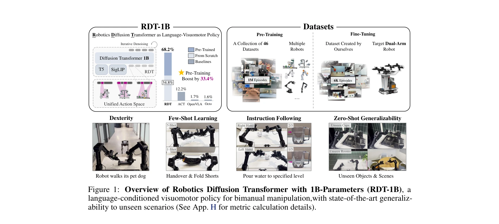
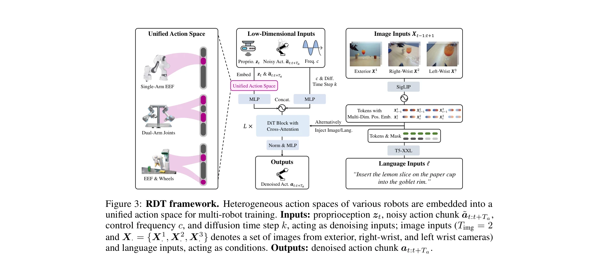

# RDT-1B: a Diffusion Foundation Model for Bimanual Manipulation

> **저자**: Songming Liu, Lingxuan Wu, Bangguo Li, Hengkai Tan, Huayu Chen, Zhengyi Wang, Ke Xu, Hang Su, Jun Zhu | **날짜**: 2024-10-10 | **URL**: [https://arxiv.org/abs/2410.07864](https://arxiv.org/abs/2410.07864)

---

## Essence

*Figure 1: Overview of Robotics Diffusion Transformer with 1B-Parameters (RDT-1B), a*

bimanual manipulation을 위한 1.2B 파라미터 규모의 diffusion foundation model인 RDT를 제시하며, 다중 로봇 데이터셋 사전학습과 physically interpretable unified action space를 통해 높은 일반화 성능을 달성한다.

## Motivation

- **Known**: bimanual manipulation은 로봇 응용에서 필수적이지만 두 팔의 조정 복잡성과 데이터 부족으로 인해 어렵다. 최근 unimanual manipulation을 위한 foundation model 개발이 진행 중이다.
- **Gap**: bimanual manipulation의 multi-modal action distribution을 효과적으로 표현하면서 동시에 heterogeneous multi-modal input의 scalability를 확보해야 한다. 또한 서로 다른 로봇의 action space variation으로 인한 negative transfer 문제가 해결되지 않았다.
- **Why**: bimanual manipulation foundation model은 복잡한 실제 작업에 대한 일반화 가능성을 제공하며, 데이터 부족과 아키텍처 한계를 극복하는 것이 로봇 자동화의 실용적 응용에 중요하다.
- **Approach**: diffusion transformer를 backbone으로 하여 multi-modality를 표현하고, physically interpretable unified action space를 도입하여 서로 다른 로봇의 action representation을 통합한다. 46개 데이터셋으로 사전학습 후 6K+ 에피소드의 bimanual 데이터로 fine-tuning한다.

## Achievement

*Figure 1: Overview of Robotics Diffusion Transformer with 1B-Parameters (RDT-1B), a*

- **Multi-modal Action 표현**: diffusion model의 capacity를 활용하여 bimanual manipulation의 복잡한 action distribution을 효과적으로 모델링
- **확장성과 정확성**: Transformer backbone과 MLP decoding, 개선된 normalization을 통해 high-frequency robotic data의 비선형 동역학을 포착
- **데이터 이질성 해결**: Physically interpretable unified action space로 다양한 로봇의 action을 통합하면서 물리적 의미 보존
- **대규모 사전학습**: 1.2B 파라미터의 최대 규모 diffusion-based robotic manipulation model로 3배 이상의 데이터 증폭
- **우수한 성능**: 56% 성공률 개선, zero-shot 일반화, 1~5 shot few-shot learning, language instruction 이해 능력 입증

## How

*Figure 3: RDT framework. Heterogeneous action spaces of various robots are embedded into a*

- Diffusion Transformer (DiT) backbone 기반으로 multi-modal input (text, vision, action)의 이질성 제거
- Robotic data의 특성 (temporal-spatial discontinuity, high-frequency changes, unstable numerical range)에 맞춘 개선: MLP decoding, improved normalization, alternate condition injection
- Physically interpretable unified action space 설계로 gripper arm을 가진 다양한 로봇의 action representation 통합
- Multi-robot 데이터셋 (46개, ~1M episodes) 활용 사전학습으로 transferable physical knowledge 학습
- ALOHA dual-arm robot 기반 자체 수집 bimanual dataset (6K+ episodes)으로 target-robot fine-tuning
- Language-conditioned visuomotor policy로 T5와 SigLIP 활용한 instruction following 구현
- Diffusion model의 iterative denoising 프로세스를 통한 순차적 action 생성

## Originality

- Bimanual manipulation을 위한 최초의 diffusion foundation model로, multi-modal action distribution을 명시적으로 다루는 새로운 접근
- Physically interpretable unified action space라는 novel 개념으로 heterogeneous robot data의 negative transfer 문제 근본 해결
- Robotic data의 고유한 특성 (nonlinearity, high-frequency, numerical instability)을 반영한 DiT 구조의 맞춤형 개선
- 3배 이상 데이터 증폭을 통한 cross-robot pretraining 전략으로 data scarcity 문제의 실질적 해결

## Limitation & Further Study

- 평가가 ALOHA dual-arm robot에 한정되어 있으며, 다른 bimanual 로봇 플랫폼에서의 성능 일반화 검증 필요
- Physically interpretable unified action space의 설계 원리와 다른 gripper arm 로봇으로의 확장성에 대한 더 자세한 분석 부족
- 1~5 shot few-shot learning의 성능이 아직 완벽하지 않으므로, 극단적으로 적은 데이터 상황에서의 개선 필요
- Fine-tuning dataset의 다양성 (task, object, environment)이 제한적일 수 있으므로, 더 광범위한 bimanual task 커버리지 확대 필요
- 후속 연구로 non-gripper 조작 (dexterous hand)이나 mobile manipulation 등 다양한 로봇 형태로의 확장 가능성 탐색 필요

## Evaluation

- Novelty: 4/5
- Technical Soundness: 3/5
- Significance: 4/5
- Clarity: 4/5
- Overall: 4/5

**총평**: RDT-1B는 bimanual manipulation을 위한 diffusion foundation model의 획기적 사례로, physically interpretable unified action space 개념과 맞춤형 architecture 설계를 통해 multi-modality와 data heterogeneity 문제를 효과적으로 해결하였으며, 대규모 사전학습과 강력한 실험 결과로 로봇 자동화의 실질적 진전을 보여준다.

## Related Papers

- 🔗 후속 연구: [[papers/1494_In-N-On_Scaling_Egocentric_Manipulation_with_in-the-wild_and/review]] — 대규모 egocentric 데이터 수집 방법론을 Humanoid-X의 2천만 포즈-텍스트 쌍 데이터셋 구축에 적용하여 데이터 품질을 향상시킬 수 있다
- 🧪 응용 사례: [[papers/1430_iGibson_10_a_Simulation_Environment_for_Interactive_Tasks_in/review]] — interactive task 시뮬레이션 환경이 RDT-1B의 bimanual manipulation 정책 검증에 실제적인 테스트 환경을 제공한다
- 🏛 기반 연구: [[papers/1287_BeyondMimic_From_Motion_Tracking_to_Versatile_Humanoid_Contr/review]] — 비전-언어-행동 flow 모델 구조가 UH-1의 Transformer 기반 휴머노이드 제어 시스템에 핵심 아키텍처 기반을 제공한다
- 🏛 기반 연구: [[papers/1376_EmbodMocap_In-the-Wild_4D_Human-Scene_Reconstruction_for_Emb/review]] — Massive human video를 통한 universal policy learning이 EgoScale의 대규모 egocentric 데이터 활용에 방법론적 기반을 제공한다.
- 🏛 기반 연구: [[papers/1425_Human2Robot_Learning_Robot_Actions_from_Paired_Human-Robot_V/review]] — massive human video learning의 기반 방법론을 human-robot paired data에 특화하여 적용한 구체적 구현입니다.
- ⚖️ 반론/비판: [[papers/1450_Learning_Fine-Grained_Bimanual_Manipulation_with_Low-Cost_Ha/review]] — 저비용 접근법 vs 대규모 데이터 접근법의 대조를 통해 bimanual learning의 다른 패러다임을 제시합니다.
- 🏛 기반 연구: [[papers/1474_MEM_Multi-Scale_Embodied_Memory_for_Vision_Language_Action_M/review]] — 대규모 휴머노이드 포즈-텍스트 데이터셋 구축 방법론을 MEM의 장기 메모리 시스템에 활용할 수 있다
- 🧪 응용 사례: [[papers/1624_VQ-VLA_Improving_Vision-Language-Action_Models_via_Scaling_V/review]] — Learning from Massive Human Videos의 대규모 데이터와 VQ-VLA의 확장 가능한 토큰화를 결합한 효과적 학습이 가능하다
- 🔗 후속 연구: [[papers/1358_DexVLA_Vision-Language_Model_with_Plug-In_Diffusion_Expert_f/review]] — Massive human video 학습을 통한 universal humanoid policy가 DexVLA의 embodied curriculum learning을 확장한다.
- 🔗 후속 연구: [[papers/1371_DreamDojo_A_Generalist_Robot_World_Model_from_Large-Scale_Hu/review]] — Massive human video를 통한 universal humanoid policy가 DreamDojo의 human video 학습을 humanoid control로 확장한다.
- 🏛 기반 연구: [[papers/1432_H-RDT_Human_Manipulation_Enhanced_Bimanual_Robotic_Manipulat/review]] — massive human video learning의 기본 방법론을 bimanual manipulation에 특화하여 적용한 구체적 구현 사례입니다.
- 🏛 기반 연구: [[papers/1460_Human-Humanoid_Robots_Cross-Embodiment_Behavior-Skill_Transf/review]] — massive human video learning의 기반 방법론을 cross-embodiment transfer에 특화하여 적용한 구체적 구현입니다.
