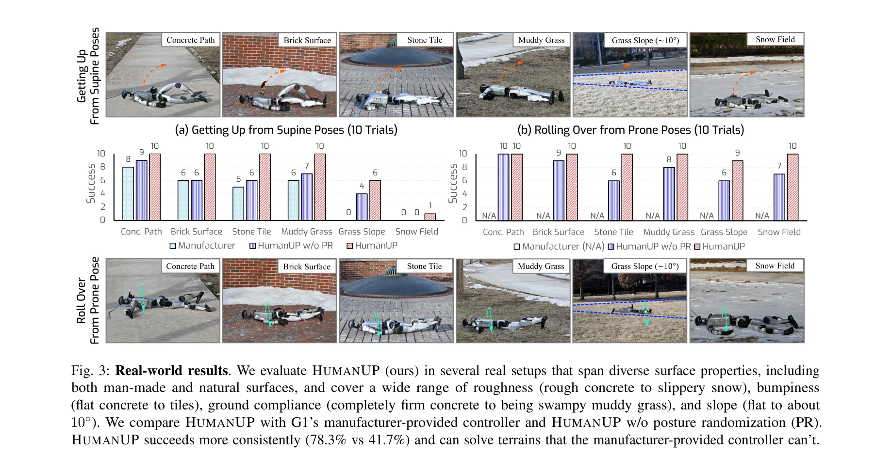

# Learning Getting-Up Policies for Real-World Humanoid Robots

> **저자**: Xialin He, Runpei Dong, Zixuan Chen, Saurabh Gupta | **날짜**: 2025-02-17 | **URL**: [https://arxiv.org/abs/2502.12152](https://arxiv.org/abs/2502.12152)

---

## Essence

*Fig. 2: HUMANUP system overview. Our getting-up policy (Sec. III-A) is trained in simulation using two-stage RL training*

인간형 로봇의 다양한 낙상 자세와 지형에서 일어날 수 있도록 강화학습 기반 2단계 학습 프레임워크 HUMANUP을 제안하고, 실제 G1 로봇에서 검증했다.

## Motivation

- **Known**: 강화학습을 통한 로봇 보행 제어는 성공 사례가 많으나, 주로 주기적이고 발-환경 접촉만 다루는 보행 작업에 집중되어 있다. 낙상 회복은 손으로 설계한 제어기가 주로 사용되었다.
- **Gap**: 비주기적 행동, 전신의 복잡한 접촉 패턴, 희소한 보상 신호로 인해 기존 보행 학습 방법을 직접 적용하기 어렵다. 실제 크기 인간형 로봇의 학습 기반 낙상 회복 시연 사례가 부족하다.
- **Why**: DARPA 로봇 챌린지에서 낙상의 56%가 인간 개입이 필요했으며, 복잡한 지형에서 작업해야 하는 인간형 로봇의 자동 낙상 회복 능력은 실제 배포의 필수 조건이다.
- **Approach**: Stage I에서는 최소한의 부드러움/토크 제약으로 낙상 동작 발견에 집중하고, Stage II에서는 발견된 동작을 배포 가능하도록 정제하며 지형과 초기 자세 변동에 강건하게 만드는 2단계 커리큘럼 기반 RL 방식을 적용했다.

## Achievement

*Fig. 3: Real-world results. We evaluate HUMANUP (ours) in several real setups that span diverse surface properties, incl*

- **실세계 배포 성공**: Unitree G1 로봇이 평지, 변형 가능한 지형, 미끄러운 표면, 경사지 등 6개 다양한 지형에서 앙와위(얼굴 위), 복와위(얼굴 아래) 2가지 자세에서 일어나기 성공
- **제조사 제공 제어기 능력 확대**: 기존 손으로 만든 제어기는 평지의 앙와위에서만 성공했으나, HUMANUP은 모든 테스트 조건에서 성공
- **인간형 로봇 낙상 회복의 선도적 학습 기반 시연**: 실제 크기 인간형 로봇에서 학습된 낙상 회복 정책의 첫 성공적 입증 중 하나

## How

*Fig. 2: HUMANUP system overview. Our getting-up policy (Sec. III-A) is trained in simulation using two-stage RL training*

- Stage I: 희소 작업 보상과 약한 정규화 하에서 발견 정책(discovery policy) f 학습 - 단순화된 충돌 메시 사용, 고정 초기 자세, 약한 제어 정규화
- Stage II: 발견된 궤적의 슬로우 다운 버전을 추적하는 배포 정책(deployable policy) π 학습 - 완전 충돌 메시, 무작위 초기 자세, 강한 제어 정규화, 지형 도메인 무작위화
- 커리큘럼: 충돌 메시(단순→완전), 자세 무작위화(고정→무작위), 제어 정규화(약→강)를 단계적으로 증가시킴
- Sim-to-Real 전이: 강화학습으로 시뮬레이션에서 학습한 정책을 실제 로봇에 직접 배포
- 상태 공간: 관절 위치, 속도, 토크와 기저 위치, 속도, 각속도 포함

## Originality

- **비주기적 행동을 위한 적응**: 보행의 주기적 접촉 패턴 가정을 버리고, 접촉 순서 자체를 학습하는 비주기적 작업에 최적화된 설계
- **전신 접촉 모델링**: 발뿐만 아니라 몸통, 팔 등 전신이 환경과 상호작용하는 복잡한 접촉 기하학을 정확히 모델링
- **희소 보상 문제 해결**: 작업 발견(Stage I)과 동작 배포(Stage II)를 분리하는 2단계 커리큘럼으로 희소 보상 문제를 우회
- **역방향 커리큘럼 설계**: 작업 난이도는 감소(발견→추적), 정규화와 변동성은 증가(약→강)하는 이중 커리큘럼 구조

## Limitation & Further Study

- **테스트 시나리오 제한**: 앙와위와 복와위 2가지 자세만 다룸 - 옆으로 누운 자세 등 다른 낙상 배치는 미실험
- **지형 유형 제한**: 잔디, 눈밭, 타일 등 제한된 지형에서만 테스트 - 극도로 불규칙하거나 이동 가능한 표면(모래, 자갈)에서의 성능 미확인
- **일반화 측정 부족**: 지형 무작위화와 자세 무작위화의 정도, 실제 배포와 시뮬레이션 간 갭의 정량적 분석 제한
- **계산 비용 미기재**: 시뮬레이션 학습 시간, 하드웨어 요구사항, 수렴 속도 등에 대한 상세 분석 부족
- **후속 연구**: 더 많은 낙상 자세 커버, 극단적 지형 환경 확대, 강화학습 효율성 개선, 다른 인간형 로봇 플랫폼으로의 이전 가능성 검증 필요

## Evaluation

- Novelty: 4/5
- Technical Soundness: 4/5
- Significance: 4/5
- Clarity: 4/5
- Overall: 4/5

**총평**: 낙상 회복이라는 실제 도전적 문제에 대해 창의적인 2단계 커리큘럼 학습으로 효과적으로 해결하고, 인간형 로봇의 실세계 배포에서 성공을 입증한 고임팩트 연구다. 다양한 지형과 자세로의 확장 가능성을 보였지만, 테스트 범위와 일반화 분석을 더 확대할 여지가 있다.

## Related Papers

- 🔄 다른 접근: [[papers/1531_Learning_Humanoid_Standing-up_Control_across_Diverse_Posture/review]] — 두 논문 모두 휴머노이드의 일어서기 제어를 다루지만, 낙상 후 복구 vs 다양한 자세에서의 일어서기라는 서로 다른 시나리오에 집중함
- 🔗 후속 연구: [[papers/1382_EMP_Executable_Motion_Prior_for_Humanoid_Robot_Standing_Uppe/review]] — EMP의 실행 가능한 모션 prior 개념을 낙상 복구라는 특수한 상황에 적용하여 구체적인 일어서기 정책으로 발전시킨 형태임
- 🔄 다른 접근: [[papers/1348_Discovering_Self-Protective_Falling_Policy_for_Humanoid_Robo/review]] — 낙상 상황에 대한 대응이라는 공통 주제를 다루지만, 일어서기 vs 자기보호적 낙상이라는 정반대의 접근 방식을 제시함
- 🔗 후속 연구: [[papers/1348_Discovering_Self-Protective_Falling_Policy_for_Humanoid_Robo/review]] — 자기보호 낙상 정책을 일반적인 기립 정책으로 확장한다
- 🧪 응용 사례: [[papers/1541_Learning_to_Get_Up_Across_Morphologies_Zero-Shot_Recovery_wi/review]] — 다형태에서 낙상 복구를 학습하는 통합 정책이 실제 휴머노이드 로봇의 일어서기 정책 학습에 직접 적용될 수 있다.
- 🔄 다른 접근: [[papers/1447_HiFAR_Multi-Stage_Curriculum_Learning_for_High-Dynamics_Huma/review]] — 두 논문 모두 휴머노이드의 일어서기/회복 동작을 다루지만, HiFAR는 curriculum learning에, 다른 논문은 실제 환경 적응에 초점을 둔다.
- 🔄 다른 접근: [[papers/1531_Learning_Humanoid_Standing-up_Control_across_Diverse_Posture/review]] — 두 논문 모두 휴머노이드의 일어서기 제어를 다루지만, 다양한 자세 vs 낙상 후 복구라는 서로 다른 시나리오에 집중함
