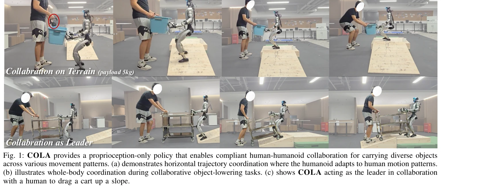
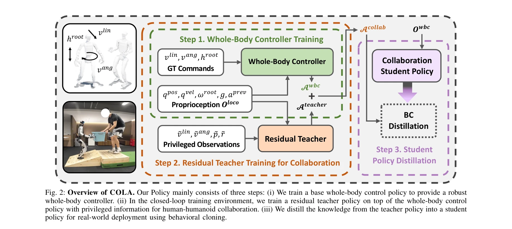

# Learning Human-Humanoid Coordination for Collaborative Object Carrying

> **저자**: Yushi Du, Yixuan Li, Baoxiong Jia, Yutang Lin, Pei Zhou, Wei Liang, Yanchao Yang, Siyuan Huang | **날짜**: 2025-10-16 | **DOI**: [10.48550/arXiv.2510.14293](https://doi.org/10.48550/arXiv.2510.14293)

---

## Essence

*Fig. 1: COLA provides a proprioception-only policy that enables compliant human-humanoid collaboration for carrying dive*

본 논문은 COLA라는 proprioception 기반 강화학습 방법을 제안하여 휴머노이드 로봇이 인간과 협력하여 물체를 운반할 수 있도록 하는 연구이다. leader/follower 역할을 동적으로 전환하면서 전신 조화를 통해 인간의 노력을 27.4% 감소시킨다.

## Motivation

- **Known**: 로봇 팔 기반의 인간-로봇 협력은 광범위하게 개발되었으며, 휴머노이드의 민첩한 보행, 원격조종, 영교 조작 등 개별 능력들이 발전했다. 다만 휴머노이드의 복잡한 전신 역학으로 인해 인간과의 협력적 상호작용은 제한적으로 탐구되었다.
- **Gap**: 기존 인간-휴머노이드 협력 방법들은 모델 기반 접근이나 제한된 범위의 heuristic 규칙에 의존하며, 전신 조화 능력을 갖춘 물체 운반 시스템이 부족하다. 또한 외부 센서 없이 힘 상호작용을 암묵적으로 모델링하는 방법이 미개척 상태이다.
- **Why**: 휴머노이드 로봇의 실질적 배포를 위해 자연스러운 인간-로봇 협력이 필수적이며, 특히 의료, 가정 지원, 제조 분야에서 안전하고 효율적인 협력이 중요하다. proprioception만 사용하는 실용적 솔루션은 배포 비용을 낮추고 일반화 가능성을 높인다.
- **Approach**: 본 논문은 3단계 학습 파이프라인을 제안한다: (1) 기본 전신 제어 정책 학습, (2) 특권 정보(물체 상태)를 포함하는 residual teacher 정책 학습, (3) 행동 복제로 proprioception만 사용하는 student 정책으로 증류한다. 닫힌 루프 시뮬레이션 환경에서 동적 물체 상호작용을 명시적으로 모델링한다.

## Achievement

*Fig. 1: COLA provides a proprioception-only policy that enables compliant human-humanoid collaboration for carrying dive*

- **시뮬레이션 성능**: 인간 노력을 24.7% 감소시키고 물체 안정성 유지, 평균 선형 속도 추적 오차 10.2 cm/s, 각속도 추적 오차 0.1 rad/s 달성
- **실제 실험 검증**: 다양한 물체(상자, 책상, 들것) 및 움직임 패턴(직선, 회전, 경사 오르기) 전반에서 안정적 협력 운반 성공
- **인간 연구**: 23명 참여자 대상 사용자 연구에서 기준 모델 대비 평균 27.4% 개선 달성 및 협력 순응성 검증
- **일반화 및 견고성**: 다양한 지형과 물체 유형에 걸쳐 일반화 능력 및 견고성 시연

## How

*Fig. 2: Overview of COLA. Our Policy mainly consists of three steps: (i) We train a base whole-body control policy to pr*

- **Whole-Body Controller (WBC) 정책**: 강화학습으로 기본 전신 제어 정책을 먼저 학습하여 robust 기초 제공
- **Residual Teacher 정책**: WBC 위에 residual 정책을 쌓고 특권 정보(물체 속도, 위치, 방향)를 사용하여 협력 학습. 보상은 전신 동작과 물체 상태에 대한 항목 포함
- **Joint state offset 활용**: 관절 상태와 목표값의 오차를 상호작용 힘의 proxy로 사용하여 접촉력 암묵적 추정
- **Velocity command 기반 역할 할당**: 속도 명령으로 leader/follower 역할 제어 (0 속도 = 추종)
- **행동 복제 증류**: Teacher 정책을 student 정책으로 증류하여 proprioception만 (joint 위치/속도, IMU, 다리 높이)으로 추론 가능하게 구현
- **닫힌 루프 훈련 환경**: 동적 물체 상호작용을 명시적으로 모델링하여 인간의 의도와 물체 운동 패턴 암묵적 학습

## Originality

- **End-to-end 통합 프레임워크**: 기존의 단편적 접근(locomotion, compliance, intention prediction)을 통합하여 전신 협력 운반을 처음으로 달성
- **Proprioception 기반 설계**: 외부 센서나 복잡한 상호작용 모델 없이 관절 오프셋으로 암묵적 힘 추정하는 혁신적 접근
- **동적 역할 할당**: 단순 속도 명령으로 leader/follower 역할을 유연하게 전환하는 메커니즘
- **3단계 학습 파이프라인**: WBC-residual teacher-student 증류 구조로 실제 배포와 시뮬레이션 간 격차 해소

## Limitation & Further Study

- **객체 타입 다양성 제한**: 주로 상자, 책상, 들것 등 대형 물체에 초점하였으며, 작은 물체나 특이한 형태 물체 테스트 부족
- **인간 의도 모델링**: 직선, 회전, 경사 등 기본 움직임 패턴만 테스트되었고 복잡한 협력 의도(예: 동적 속도 변화, 갑작스러운 방향 전환) 처리 미흡
- **외부 환경 제약**: 충분한 공간과 상대적으로 단순한 지형에서 주로 테스트되어 혼잡한 실내 환경이나 극단적 지형에 대한 일반화 미확인
- **물리적 한계**: 무거운 물체(>8kg) 운반 능력에 대한 평가 제한, 장시간 협력 운반의 안정성 데이터 부족
- **후속 연구 방향**: (1) 멀티 에이전트 협력 (여러 로봇과 인간), (2) 시각 정보 통합으로 의도 예측 개선, (3) 적응형 임피던스 제어로 유연성 향상, (4) 자연어 명령어 통합

## Evaluation

- Novelty: 4/5
- Technical Soundness: 4/5
- Significance: 4/5
- Clarity: 4/5
- Overall: 4/5

**총평**: 본 논문은 휴머노이드-인간 협력 운반이라는 실용적이고 중요한 문제에 대해 완전히 새로운 end-to-end 학습 기반 솔루션을 제시한다. 강력한 시뮬레이션 및 실제 실험 결과, 체계적인 인간 사용자 평가를 통해 27.4%의 노력 감소를 달성하였으며, proprioception 기반 설계로 실제 배포 가능성을 높였다.

## Related Papers

- 🔗 후속 연구: [[papers/1434_H2-COMPACT_Human-Humanoid_Co-Manipulation_via_Adaptive_Conta/review]] — H2-COMPACT의 인간-휴머노이드 협업 프레임워크를 물체 운반이라는 구체적인 task에 적용하여 발전시킨 specialized 버전임
- 🏛 기반 연구: [[papers/1320_BitVLA_1-bit_Vision-Language-Action_Models_for_Robotics_Mani/review]] — 인간과 로봇의 협응된 조작을 위한 choice policy 기반 접근법이 COLA의 동적 역할 전환 메커니즘의 이론적 토대를 제공함
- 🏛 기반 연구: [[papers/1549_Learning_Whole-Body_Human-Humanoid_Interaction_from_Human-Hu/review]] — 인간-휴머노이드 상호작용 학습의 전반적인 방법론과 전신 협응 원리를 제공함
- 🏛 기반 연구: [[papers/1434_H2-COMPACT_Human-Humanoid_Co-Manipulation_via_Adaptive_Conta/review]] — Human-humanoid collaboration의 기본 원리와 촉각 기반 상호작용은 contact-rich manipulation에서 중요한 기반이 된다.
- 🏛 기반 연구: [[papers/1558_Load-Aware_Locomotion_Control_for_Humanoid_Robots_in_Industr/review]] — 인간-휴머노이드 협력 물체 운반의 경험이 산업용 로봇의 load-aware locomotion 설계에 방법론적 토대를 제공함
