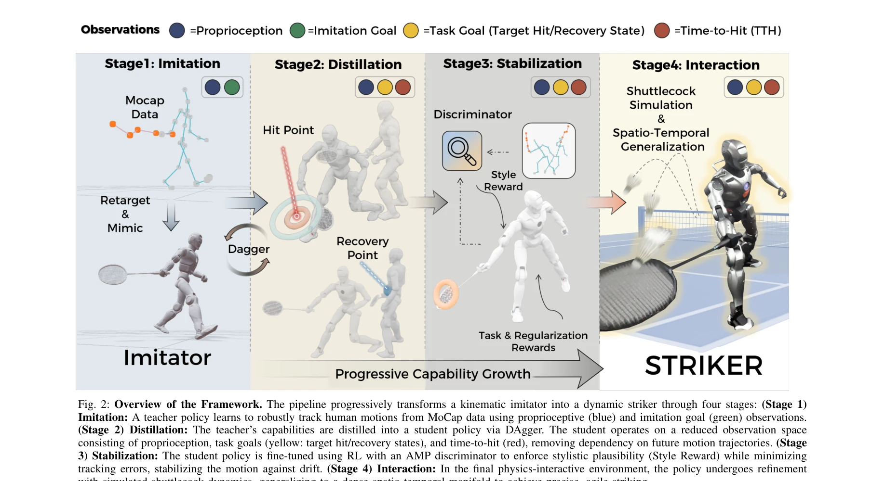
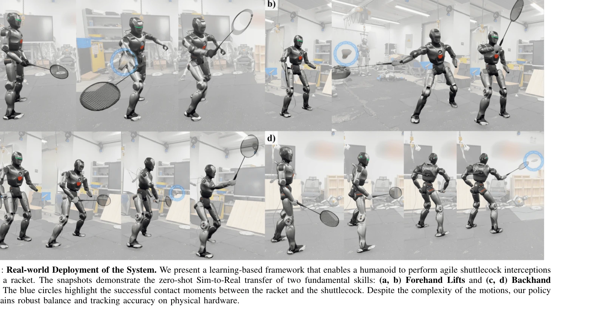

# Learning Human-Like Badminton Skills for Humanoid Robots

> **저자**: Yeke Chen, Shihao Dong, Xiaoyu Ji, Jingkai Sun, Zeren Luo, Liu Zhao, Jiahui Zhang, Wanyue Li, Ji Ma, Bowen Xu, Yimin Han, Yudong Zhao, Peng Lu | **날짜**: 2026-02-09 | **DOI**: [10.48550/arXiv.2602.08370](https://doi.org/10.48550/arXiv.2602.08370)

---

## Essence

*Fig. 2: Overview of the Framework. The pipeline progressively transforms a kinematic imitator into a dynamic striker thr*

인간 데이터 기반의 모션 프라이어(motor prior)를 활용하여 휴머노이드 로봇이 배드민턴의 복잡한 전신 협력과 정밀한 타이밍 제어를 학습하는 점진적 강화학습 프레임워크를 제시한다. Imitation-to-Interaction 파이프라인을 통해 키네마틱 모방에서 동역학 기반 기능적 상호작용으로의 전환을 달성하며, 첫 zero-shot sim-to-real 전이를 실현했다.

## Motivation

- **Known**: 휴머노이드 로봇에서 안정적인 전신 제어는 달성되었으나, 고속 동적 객체와의 정밀한 상호작용 및 스포츠와 같은 고도의 협력 운동은 여전히 도전적이다. 최근 AMP, imitation learning 등의 기법이 인간다운 움직임 모방을 가능하게 했으나 기능적 상호작용과의 연결고리가 부족하다.
- **Gap**: 기존 연구들은 영상과 같은 저차원 목표에서의 상호작용(ball sports, manipulation)이나 인간다운 동작 합성에만 초점을 맞추었으며, 스파스한 데모 데이터로부터 다양한 배드민턴 스킬의 정밀하고 민첩한 전신 협력을 배우는 것과 실제 하드웨어로의 zero-shot 전이는 아직 달성되지 않았다.
- **Why**: 배드민턴은 폭발적 전신 협력, 극히 정밀한 타이밍 제어, 다양한 스킬 전환을 동시에 요구하는 스포츠로, 이를 해결하면 로봇의 인간다운 동작 능력과 고속 동적 환경 대응 능력을 크게 향상시킬 수 있다. 더 나아가 스포츠 로보틱스의 새로운 벤치마크를 제시할 수 있다.
- **Approach**: 4단계 파이프라인으로 구성된다: (1) MoCap 데이터로부터 teacher policy를 통한 robust motor prior 학습, (2) DAgger를 이용한 student policy로의 goal-conditioned distillation (Time-to-Hit, Target Hit State, Target Recovery State 기반 state representation), (3) AMP discriminator를 활용한 RL 기반 안정화, (4) physics-interactive 환경에서의 manifold expansion을 통한 상호작용 기반 정제로 sparse discrete points를 dense interaction volume으로 일반화한다.

## Achievement

*Fig. 1: Real-world Deployment of the System. We present a learning-based framework that enables a humanoid to perform ag*

- **Zero-shot Sim-to-Real 전이**: 배드민턴 스킬(forehand/backhand lift 등)의 첫 성공적인 zero-shot sim-to-real 전이를 실현하여 물리적 휴머노이드 로봇에서 인간다운 민첩성과 기능적 정밀성을 달성했다.
- **다양한 스킬 습득**: lift와 drop shot을 포함한 다양한 배드민턴 기술을 시뮬레이션에서 성공적으로 학습했으며, 각 스킬의 kinetic elegance와 기능적 정확성을 유지했다.
- **모션 프라이어 기반 안정성**: 특화된 state representation을 통해 인간 데이터의 모션 프라이어를 보존하면서도 kinematic tracking에서 physics-aware striking으로의 안정적 전환을 실현했다.
- **Manifold 확장 전략**: 스파스한 expert demonstration의 한계를 극복하기 위해 discrete strike points를 dense interaction manifold으로 확장하는 기법을 도입하여 일반화 능력을 향상시켰다.

## How

*Fig. 2: Overview of the Framework. The pipeline progressively transforms a kinematic imitator into a dynamic striker thr*

- **Stage 1 (Imitation)**: Teacher policy가 MoCap 데이터로부터 proprioceptive와 imitation goal observation을 활용하여 인간 모션을 robust하게 추적하는 motor prior를 학습한다.
- **Stage 2 (Distillation)**: DAgger를 통해 teacher의 capability를 student policy로 증류하며, 관찰 공간을 proprioception, task goals (target hit/recovery states), time-to-hit로 축소하여 future trajectory 의존성을 제거한다.
- **Stage 3 (Stabilization)**: AMP discriminator를 이용한 RL로 student policy를 fine-tuning하여 stylistic plausibility(Style Reward)를 강제하면서 tracking error를 최소화하고 drift를 방지한다.
- **Stage 4 (Interaction)**: Physics-interactive 환경에서 shuttlecock dynamics를 포함한 simulation을 통해 정책을 정제하며, manifold expansion strategy로 sparse data points를 dense spatio-temporal manifold으로 일반화하여 '모방자'에서 '기능적 타격자'로 변환한다.", '**Goal-Conditioned Design**: Time-to-Hit, Target Hit State, Target Recovery State 등의 전문화된 state representation이 motion prior를 보존하면서 동역학 기반 상호작용을 가능하게 한다.
- **Forward-Compatible Critics**: Teacher에서 student로의 전이 과정에서 critic을 forward-compatible하게 설계하여 안정성을 확보한다.

## Originality

- **Progressive Framework 설계**: Kinematic imitation과 dynamic interaction 사이의 명시적 갭을 메우기 위해 4단계 점진적 파이프라인을 제안하여, 기존의 hierarchical decoupling이나 RSI 기반 접근과 차별화된다.
- **Manifold Expansion Strategy**: Sparse expert demonstration을 dense interaction volume으로 확장하는 기법은 스포츠 로봇 학습에서 새로운 시각을 제시하며, 이는 traditional data augmentation이나 RSI와는 다른 혁신적 접근이다.
- **Anthropomorphic State Representation**: Time-to-Hit 등 생체역학적으로 의미 있는 state variable을 기반으로 한 distillation은 human motion prior를 더 효과적으로 보존하는 설계이다.
- **Zero-Shot Sim-to-Real 성공**: 배드민턴이라는 고도로 복잡한 동적 스포츠 도메인에서 처음으로 zero-shot transfer를 달성했으며, 이는 기존의 대부분의 ball sports 연구(시뮬레이션 검증만 수행)와 비교하여 혁신적이다.

## Limitation & Further Study

- **스파스한 데모에 대한 여전한 제약**: Manifold expansion이 효과적이지만, 매우 제한된 MoCap 데이터셋에서 출발하므로 더 다양한 배드민턴 기술(예: 스매시의 세부 변형)로의 확장 가능성은 명확하지 않다.
- **동적 대응의 제한**: 논문에서는 shuttlecock interception의 기본 스킬 학습에 초점을 맞추었으나, 실시간 경기 상황에서의 빠른 전술적 결정과 적응은 다루지 않았다.
- **Sim-to-Real Gap의 미흡한 분석**: Zero-shot transfer 성공 사례는 제시했으나, 어떤 종류의 sim-to-real gap이 여전히 존재하며 어떻게 극복했는지에 대한 상세 분석이 부족하다.
- **플랫폼 특수성**: 특정 휴머노이드 로봇(Authors의 ArcLab 시스템)에 대해서만 검증되었으므로, 다른 형태의 휴머노이드나 quadrupedal 플랫폼으로의 일반화 가능성이 불명확하다.
- **후속 연구**: (1) 더 다양한 배드민턴 스킬의 학습, (2) 동적 상황에서의 온라인 적응 메커니즘, (3) Sim-to-Real Gap에 대한 구체적 정량화 및 해결 방법, (4) 다양한 로봇 플랫폼으로의 전이 용이성 개선.

## Evaluation

- Novelty: 4/5
- Technical Soundness: 3/5
- Significance: 4/5
- Clarity: 4/5
- Overall: 4/5

**총평**: 이 논문은 kinematic imitation과 dynamic interaction 사이의 근본적 갭을 명시적으로 인식하고, progressive 4단계 파이프라인과 manifold expansion 전략으로 이를 창의적으로 해결함으로써 배드민턴이라는 높은 수준의 동적 스포츠 도메인에서 처음으로 zero-shot sim-to-real 전이를 성공시켰다. 기술적 완성도와 실험 검증이 우수하며, 휴머노이드 로봇의 인간다운 동작 능력 연구에 중요한 기여를 한다.

## Related Papers

- 🏛 기반 연구: [[papers/1519_Learning_Athletic_Humanoid_Tennis_Skills_from_Imperfect_Huma/review]] — Learning Human-Like Badminton Skills의 라켓 스포츠 학습 방법론이 테니스 스킬 학습의 기반을 제공함
- 🏛 기반 연구: [[papers/1450_HITTER_A_HumanoId_Table_TEnnis_Robot_via_Hierarchical_Planni/review]] — Human-like badminton skills의 학습 방법론은 HITTER의 탁구 기술 학습에 직접적인 기반이 된다.
- 🔗 후속 연구: [[papers/1474_Humanoid_Whole-Body_Badminton_via_Multi-Stage_Reinforcement/review]] — Human-like badminton skills의 학습 방법은 휴머노이드 배드민턴의 다단계 강화학습으로 구현된다.
