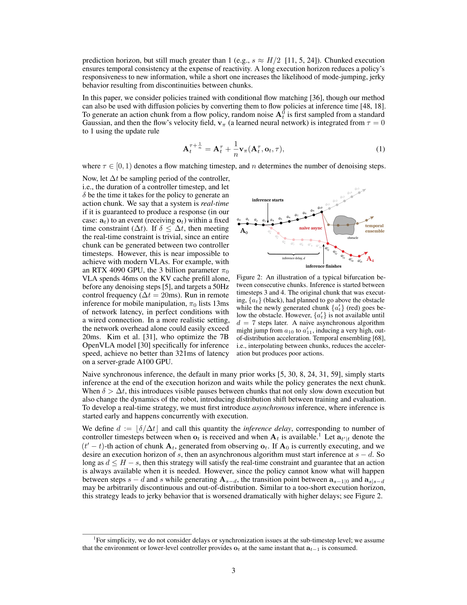
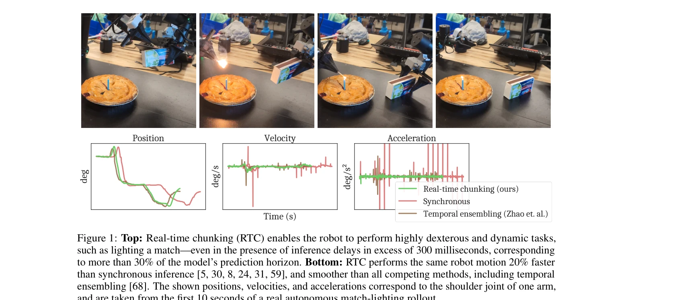
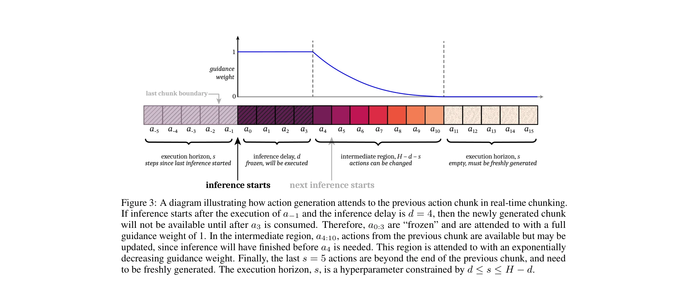

# Real-Time Execution of Action Chunking Flow Policies

> **저자**: Kevin Black, Manuel Y. Galliker, Sergey Levine | **날짜**: 2025-06-09 | **URL**: [https://arxiv.org/abs/2506.07339](https://arxiv.org/abs/2506.07339)

---

## Essence

*Figure 2: An illustration of a typical bifurcation be-*

Real-time chunking (RTC)은 diffusion 또는 flow 기반 VLA의 inference 시간에 action chunking 정책을 비동기적으로 실행하는 알고리즘으로, 현재 chunk 실행 중 다음 chunk를 생성하면서 inference 지연으로 인한 불연속성을 제거한다.

## Motivation

- **Known**: Action chunking은 고주파 제어 작업에서 시간적 일관성을 제공하지만, state-of-the-art VLA의 높은 latency로 인해 chunk 경계에서 지연이나 out-of-distribution jerky movement 문제를 유발한다.
- **Gap**: 기존 action chunking 방법들은 inference latency로 인한 chunk 간 모드 점프(bifurcation) 문제를 완전히 해결하지 못하고 있으며, naive smoothing 전략(예: temporal ensembling)은 유효하지 않은 동작을 생성할 수 있다.
- **Why**: 실시간으로 물리 세계와 상호작용하는 AI 시스템에서 지연은 성능(예: 로봇이 커피를 쏟거나 떨어뜨리는 차이)에 직접적인 영향을 미치므로 latency-robust한 inference 알고리즘이 필수적이다.
- **Approach**: RTC는 asynchronous action chunking을 inpainting 문제로 정식화하여, 반드시 실행될 action들은 '동결'하고 나머지는 flow matching의 guidance를 통해 '복원'함으로써 chunk 경계의 연속성을 보장한다.

## Achievement

*Figure 1: Top: Real-time chunking (RTC) enables the robot to perform highly dexterous and dynamic tasks,*

- **Latency-robust 성능**: 300ms 이상의 inference delay(예측 범위의 30% 이상)가 있어도 match lighting 같은 정밀한 작업을 높은 성공률로 수행
- **속도 개선**: synchronous inference 대비 20% 빠른 execution 달성
- **매끄러운 동작**: temporal ensembling 포함 모든 경쟁 방법들보다 부드러운 position, velocity, acceleration 프로필 생성
- **범용성**: diffusion 또는 flow 기반 VLA에 재학습 없이 즉시 적용 가능한 inference-time 알고리즘
- **벤치마크 구축**: Kinetix 시뮬레이터 기반 12개의 동적 작업으로 구성된 새로운 평가 벤치마크 제시 및 6개의 실제 bimanual manipulation 작업에서 검증

## How

*Figure 3: A diagram illustrating how action generation attends to the previous action chunk in real-time chunking.*

- Flow matching 정책의 velocity field v_π를 활용하여 frozen action들에 대한 조건을 유지하면서 inpainting 방식으로 새로운 chunk 생성
- Inference delay d와 execution horizon s의 관계를 분석하여 반드시 실행될 actions을 수학적으로 결정
- Guidance weight를 시간에 따라 동적으로 조정하여 frozen 구간에서의 제약을 점진적으로 해제
- 관측 o_t를 이용한 조건부 생성으로 최신 환경 정보를 반영
- Kinetix 시뮬레이터에서 quasi-static 벤치마크의 한계를 극복하기 위해 12개의 동적 작업 설계

## Originality

- Action chunking의 latency 문제를 inpainting 관점에서 새롭게 정식화한 novel 접근
- Flow matching의 velocity field 구조를 활용하여 frozen constraint를 명시적으로 표현하는 독창적 기법
- Inference 시간 알고리즘으로서 기존 VLA 학습 파이프라인에 수정을 요구하지 않는 실용적 설계
- Quasi-static 벤치마크의 한계를 인식하고 고주파 동적 작업 벤치마크를 새로 구축

## Limitation & Further Study

- Flow matching 기반 정책에 최적화되어 있으며 diffusion 정책의 경우 변환이 필요 (inference-time 변환 가능하지만 추가 계산 비용 발생 가능)
- Guidance 메커니즘의 하이퍼파라미터(guidance weight 스케줄 등) 튜닝이 작업 특성에 따라 필요할 수 있음
- 원논문에서 제시된 실제 로봇 실험이 6개 작업으로 제한적이며, 더 다양한 로봇 플랫폼과 작업 영역에서의 검증 필요
- Sub-timestep 수준의 지연이나 동기화 문제를 고려하지 않아 극도로 낮은 지연 요구 상황에서의 적용 제한
- 후속 연구로 다른 유형의 action policy(예: transformer 기반) 확장, feedback control과의 통합, 그리고 더 정교한 guidance 메커니즘 개발 가능

## Evaluation

- Novelty: 4/5
- Technical Soundness: 3/5
- Significance: 4/5
- Clarity: 4/5
- Overall: 4/5

**총평**: RTC는 modern VLA의 inference latency 문제를 실용적으로 해결하는 영리한 inference-time 알고리즘으로, flow matching의 구조를 창의적으로 활용하면서도 기존 모델에 대한 재학습을 요구하지 않아 즉시 적용 가능하다. 실제 로봇 작업에서의 우수한 성능과 latency robustness는 embodied AI 시스템의 실용화에 중요한 기여를 제시한다.

## Related Papers

- 🏛 기반 연구: [[papers/1519_Learning_Athletic_Humanoid_Tennis_Skills_from_Imperfect_Huma/review]] — 불완전한 인간 데이터로부터 운동 기술 학습 방법론이 배드민턴 기술의 인간 모션 프라이어 활용에 직접 적용 가능하다
- 🧪 응용 사례: [[papers/1502_One-Step_Diffusion_Policy_Fast_Visuomotor_Policies_via_Diffu/review]] — 실시간 action chunking 알고리즘이 배드민턴의 정밀한 타이밍 제어와 diffusion policy 가속화에 모두 적용 가능하다
- 🔗 후속 연구: [[papers/1474_MEM_Multi-Scale_Embodied_Memory_for_Vision_Language_Action_M/review]] — 배드민턴 기술의 점진적 강화학습 프레임워크를 humanoid table tennis의 복잡한 전신 협력 학습에 확장할 수 있다
- 🧪 응용 사례: [[papers/1488_NavDP_Learning_Sim-to-Real_Navigation_Diffusion_Policy_with/review]] — 실시간 action chunking 실행 프레임워크가 NavDP의 연속적인 navigation policy 배포에 직접 적용 가능하다
- 🧪 응용 사례: [[papers/1580_Streaming_Flow_Policy_Simplifying_diffusionflow-matching_pol/review]] — 실시간 액션 청킹 플로우 정책 실행에서 스트리밍 플로우가 지연 시간을 크게 개선한다.
- 🧪 응용 사례: [[papers/1613_VITA_Vision-to-Action_Flow_Matching_Policy/review]] — Real-Time Execution이 VITA의 빠른 추론 속도를 실제 로봇 환경에서 활용하는 방법을 구체적으로 보여준다
- 🔗 후속 연구: [[papers/1374_DynamicVLA_A_Vision-Language-Action_Model_for_Dynamic_Object/review]] — Real-time action chunking flow policy execution이 DynamicVLA의 실시간 폐루프 제어 개념을 구체적으로 구현한다.
