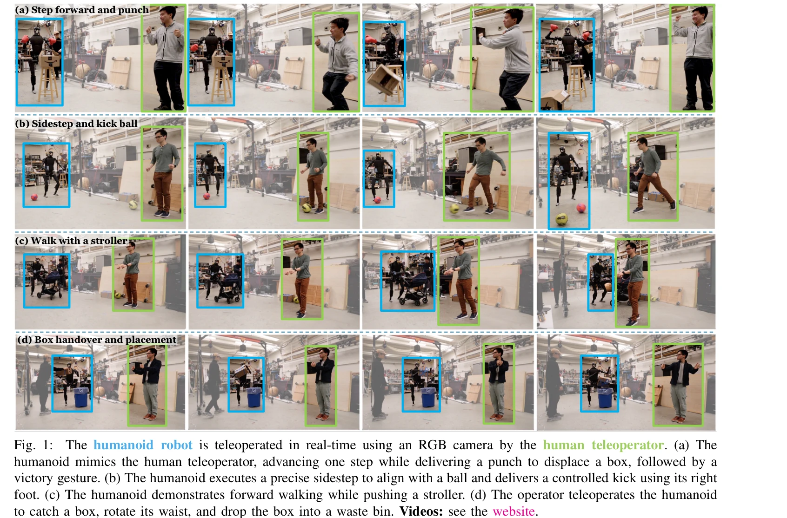

# Learning Human-to-Humanoid Real-Time Whole-Body Teleoperation

> **저자**: Tairan He, Zhengyi Luo, Wenli Xiao, Chong Zhang, Kris Kitani, Changliu Liu, Guanya Shi | **날짜**: 2024-03-07 | **URL**: [https://arxiv.org/abs/2403.04436](https://arxiv.org/abs/2403.04436)

---

## Essence

*Fig. 1:*

RGB 카메라만을 이용하여 reinforcement learning 기반의 실시간 전신 텔레오퍼레이션을 humanoid 로봇에서 구현하는 H2O 프레임워크를 제시한다. 대규모 인간 동작 데이터셋을 sim-to-data 프로세스로 정제하여 시뮬레이션에서 학습한 후 제로샷 sim-to-real 전이로 실제 로봇에서 동작시킨다.

## Motivation

- **Known**: Humanoid 로봇의 whole-body 제어는 오랫동안 존재해온 문제이며, 기존 모델 기반 제어 방식들은 높은 계산 복잡도와 센서 의존성으로 인한 확장성 제한이 있다. RL 기반 humanoid 제어는 복잡한 인간 동작 생성과 robust한 이족 보행을 달성했지만 전신 실시간 텔레오퍼레이션은 미구현 상태였다.
- **Gap**: 인간과 humanoid 간의 동역학적 차이로 인해 대규모 인간 동작 데이터셋을 humanoid에 직접 적용할 수 없으며, 기존 RL 기반 방식들은 상반신만 추적하거나 하반신은 속도 제어에 의존하는 등 전신 추적에 미흡했다. RGB 카메라만으로 실시간 전신 텔레오퍼레이션을 달성한 사례가 없었다.
- **Why**: Humanoid 로봇은 인간의 물리적 형태와 유사하여 텔레오퍼레이션에 유리하며, 이는 복잡한 가사, 의료 보조, 고위험 구조 작업 등 자율 시스템으로 미흡한 작업 수행을 가능하게 한다. 또한 인간-텔레오퍼레이션 데이터는 로봇 자율 학습을 위한 고품질 대규모 데이터 수집 방법이 될 수 있다.
- **Approach**: 먼저 SMPL 파라메트릭 인간 모델을 humanoid에 맞게 fitting하고, 역기구학으로 인간 동작을 humanoid 관절로 retargeting한 후, privileged 정보에 접근 가능한 motion imitator로 feasible한 동작만 필터링하는 sim-to-data 프로세스를 수행한다. 이후 광범위한 domain randomization으로 robust한 tracking 정책을 훈련하고 sim-to-real 전이를 통해 실제 로봇에 배포한다.

## Achievement

*Fig. 1:*

- **Sim-to-data 프로세스**: Privileged motion imitator를 이용하여 대규모 인간 동작 데이터셋을 자동으로 정제하여 humanoid-compatible 모션 데이터셋을 생성
- **Whole-body tracking 정책**: Domain randomization을 적용하여 걷기, 뛰기, 차기, 권투, 밀기, 손흔들기 등 다양한 동작을 추적하는 단일 RL 정책 학습
- **실시간 RGB 기반 텔레오퍼레이션**: Off-the-shelf 인간 pose estimator를 이용하여 RGB 카메라 입력만으로 실시간 전신 텔레오퍼레이션 시스템 구현
- **복합 작업 성공**: 유모차 밀기, 상자 잡기 및 배치, 공 차기 등 상호작용 기반의 복합 작업 실시간 수행 입증

## How

*Fig. 4: Overview of H2O: (a) Retargeting (Section IV): H2O first aligns the SMPL body model to a humanoid’s structure*

- SMPL 인간 모델을 H1 humanoid 로봇의 joint 구조와 크기에 맞게 fitting하여 파라메트릭 표현 생성
- 역기구학(IK)을 통해 SMPL의 인간 pose를 humanoid의 joint angles로 retargeting
- Privileged state information (ground truth MoCap)에 접근 가능한 motion imitator를 PPO로 훈련하여 retargeted 동작 추적 가능 여부 판별
- 추적 실패 동작을 제거하여 feasible 모션 데이터셋 구성
- Goal-conditioned MDP 공식화로 실시간 인간 동작 추적을 목표로 하는 RL 정책 설계
- State space를 RGB 카메라에서 추출 가능한 keypoint 위치 중심으로 설계
- Extensive domain randomization (시뮬레이션 파라미터 변동)을 적용하여 sim-to-real gap 축소
- PPO 알고리즘으로 simulation에서 정책 훈련 후 제로샷으로 실제 로봇에 전이

## Originality

- 최초로 RL 기반의 **실시간 전신 humanoid 텔레오퍼레이션** 달성 (기존 RL 방식은 상반신만 또는 하반신 속도 제어에 의존)
- **Privileged motion imitator**를 이용한 새로운 sim-to-data 필터링 프로세스로 대규모 인간 동작 데이터셋의 자동 정제
- RGB 카메라와 off-the-shelf pose estimator만으로 **외부 센서/마커 없는 실시간 텔레오퍼레이션** 구현
- Physics-based animation 커뮤니티의 기법을 careful sim-to-real training을 통해 실제 humanoid 로봇에 적용

## Limitation & Further Study

- Pose estimator의 오류가 누적될 수 있으며, 마커 기반 MoCap에 비해 정확도 제한
- 실험이 특정 humanoid(H1) 플랫폼에서만 검증되어 다른 humanoid로의 일반화 가능성 미상
- 동역학적으로 매우 어려운 동작(예: 공중 회전 등)은 여전히 추적 불가능할 수 있음
- 실시간 성능 요구에 따른 계산 효율성과 policy 복잡도의 trade-off 관련 분석 부재
- 후속 연구: 다양한 humanoid 플랫폼으로의 확장, 부분 관측 환경에서의 robustness 향상, 사람-로봇 상호작용 시나리오 확대, 학습 기반 접근과 모델 기반 제어의 하이브리드 방식 탐색

## Evaluation

- Novelty: 4/5
- Technical Soundness: 3/5
- Significance: 4/5
- Clarity: 4/5
- Overall: 4/5

**총평**: 이 논문은 실시간 전신 humanoid 텔레오퍼레이션을 최초로 RL로 구현하며, 새로운 sim-to-data 프로세스와 careful한 sim-to-real 설계를 통해 복잡한 동적 동작들을 성공적으로 수행한 중요한 기여다. RGB 카메라 기반의 간단한 입력 방식은 실용적 가치가 높으나, 다양한 플랫폼 일반화와 더욱 극단적인 동작에 대한 확장은 향후 과제로 남아있다.

## Related Papers

- 🔗 후속 연구: [[papers/1593_OmniH2O_Universal_and_Dexterous_Human-to-Humanoid_Whole-Body/review]] — RGB 카메라 기반 전신 텔레오퍼레이션 H2O 프레임워크가 다양한 입력 방식을 통합한 OmniH2O로 확장되었다.
- 🔄 다른 접근: [[papers/1448_High-Speed_and_Impact_Resilient_Teleoperation_of_Humanoid_Ro/review]] — 실시간 전신 텔레오퍼레이션을 위해 H2O는 RGB 카메라를, High-Speed 시스템은 IMU 기반 접근법을 사용하는 대안적 방법이다.
- 🧪 응용 사례: [[papers/1484_HumanPlus_Humanoid_Shadowing_and_Imitation_from_Humans/review]] — H2O의 휴머노이드 전신 제어 기법이 HumanPlus의 인간 모방 및 섀도잉 시스템에서 실제 적용될 수 있다.
- ⚖️ 반론/비판: [[papers/1451_Learning_Human-to-Humanoid_Real-Time_Whole-Body_Teleoperatio/review]] — 동일한 H2O 시스템이지만 다른 관점이나 개선사항을 제시할 수 있다
- 🔗 후속 연구: [[papers/1591_OmniClone_Engineering_a_Robust_All-Rounder_Whole-Body_Humano/review]] — 소비자 GPU에서 고충실도 텔레오퍼레이션을 실현하는 OmniClone이 H2O의 RGB 카메라 기반 전신 제어를 확장한 통합 시스템이다.
- 🔄 다른 접근: [[papers/1448_High-Speed_and_Impact_Resilient_Teleoperation_of_Humanoid_Ro/review]] — IMU 기반 고속 텔레오퍼레이션과 RGB 카메라 기반 전신 텔레오퍼레이션이 서로 다른 센서 방식으로 동일한 휴머노이드 제어 문제를 해결한다.
- 🏛 기반 연구: [[papers/1455_HoRD_Robust_Humanoid_Control_via_History-Conditioned_Reinfor/review]] — 실제 humanoid locomotion의 기반 기술을 history-conditioned RL로 더 robust하게 발전시킨 형태입니다.
