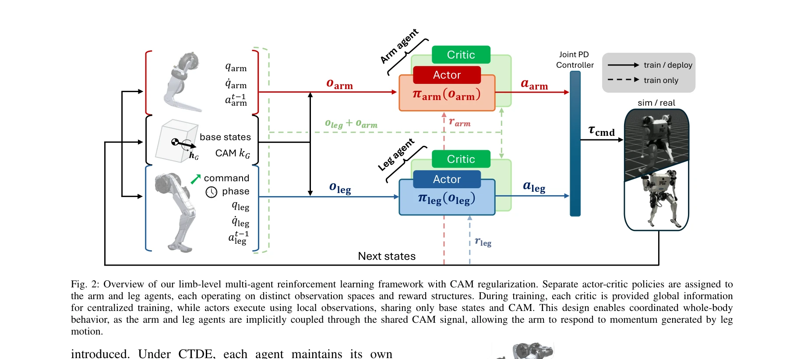
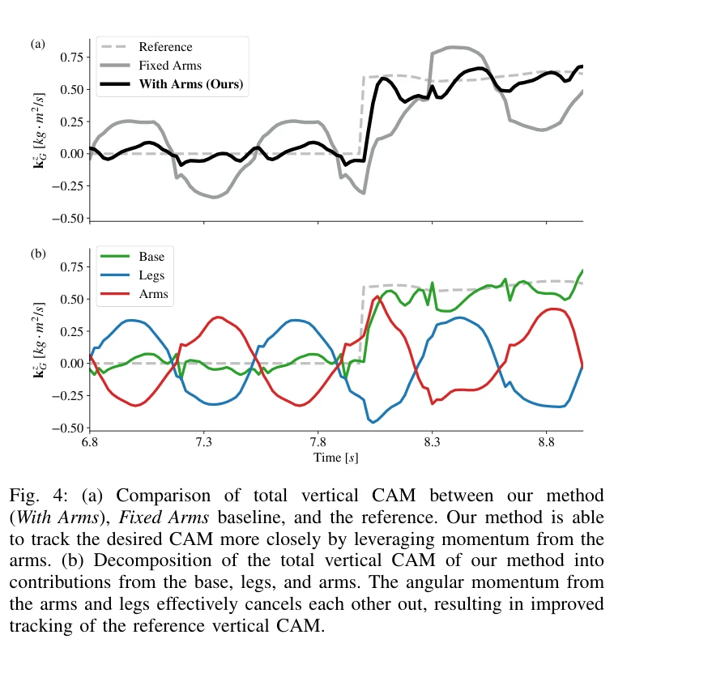

# Learning Humanoid Arm Motion via Centroidal Momentum Regularized Multi-Agent Reinforcement Learning

> **저자**: Ho Jae Lee, Se Hwan Jeon, Sangbae Kim | **날짜**: 2025-07-05 | **URL**: [https://arxiv.org/abs/2507.04140](https://arxiv.org/abs/2507.04140)

---

## Essence

*Fig. 2: Overview of our limb-level multi-agent reinforcement learning framework with CAM regularization. Separate actor-*

인간의 팔 흔들림에서 영감을 받아, centroidal angular momentum(CAM) 규제를 통한 limb-level multi-agent reinforcement learning으로 휴머노이드 로봇의 팔-다리 조율 제어를 실현했다.

## Motivation

- **Known**: 인간은 보행 중 팔을 자연스럽게 흔들어 각운동량을 감소시키고 균형을 유지한다. 기존 연구는 모방학습이나 전체 신체 최적화 기반 접근법으로 팔-다리 동작을 제어해왔다.
- **Gap**: 휴머노이드 플랫폼에서 팔 동작을 효과적으로 조율하는 방법이 명확하지 않으며, 단일 에이전트 RL의 충돌하는 보상이나 모델기반 제어의 높은 계산비용이 문제다.
- **Why**: 자연스러운 팔 흔들림은 지면 반력 모멘트를 감소시켜 에너지 효율을 높이고 외부 교란 대응 능력을 향상시키므로 휴머노이드 로봇의 보행 안정성과 강건성 향상에 필수적이다.
- **Approach**: centroidal dynamics를 기반으로 팔과 다리 에이전트를 분리하여 CTDE(Centralized Training with Decentralized Execution) 프레임워크로 학습시키며, CAM 추적 및 감쇠 보상을 통해 팔 동작을 물리적으로 유도한다.

## Achievement

*Fig. 4: (a) Comparison of total vertical CAM between our method*

- **CAM 기반 보상 설계**: 생역학적 원리에서 출발한 centroidal angular momentum 추적 및 감쇠 보상이 자연스러운 팔 흔들림을 유도하고 안정성을 향상시킴
- **Multi-agent RL 아키텍처**: 팔과 다리를 분리된 actor-critic 구조로 설계하되 centroidal dynamics를 통해 암묵적으로 결합하여 조율된 전신 제어 실현
- **하드웨어 검증**: 평지 보행, 험지 통과, 계단 오르기 등 다양한 보행 과제에서 시뮬레이션과 실제 휴머노이드 플랫폼 모두에서 강건한 성능 입증

## How

*Fig. 2: Overview of our limb-level multi-agent reinforcement learning framework with CAM regularization. Separate actor-*

- centroidal momentum matrix(CMM)를 이용하여 centroidal dynamics를 계산하고, 이를 기반으로 CAM ˙kG 변화율 감시
- 팔 에이전트는 CAM tracking 보상 rCAM_track와 CAM damping 보상 rCAM_damp으로 학습되어 운동량을 적극 감소시킴
- CTDE 패러다임 적용: 훈련 시 centralized critic은 모든 상태 정보 접근, decentralized actor는 자신의 proprioceptive 정보와 공유 기본 상태, CAM만 관찰
- policy gradient 방정식에서 advantage 함수를 centralized critic으로 계산하여 multi-agent 비정상성 문제 완화
- Joint PD Controller로 최종 명령을 실행하여 시뮬레이션과 실제 로봇 간 전이 용이하게 설계

## Originality

- 생역학적 기초를 가진 CAM 규제 보상으로 팔 동작을 물리적으로 유의미하게 유도하는 점이 기존의 휴리스틱 정규화와 차별화됨
- 뇌의 소뇌 수준 결합 원리에서 영감을 받아, 팔과 다리를 완전히 독립적인 에이전트로 분리하면서도 centroidal dynamics로 조율하는 설계의 신참성
- CTDE와 centroidal dynamics의 조합으로 scalability와 계산효율을 개선하면서도 full-body 최적화의 물리적 정합성 확보

## Limitation & Further Study

- 단일 휴머노이드 플랫폼에서만 검증되었으므로 다른 형태의 humanoid나 사족보행 로봇으로의 일반화 가능성 미지수
- CAM 보상의 가중치 설정이 task-dependent하므로, 다양한 운동 과제마다 fine-tuning이 필요할 수 있음
- sim-to-real transfer 관련 상세 분석이 제한적이며, 실제 환경의 센서 노이즈나 모델 오차에 대한 강건성 평가 보강 필요
- 후속 연구로 loco-manipulation, dynamic jumping 등 더 복잡한 운동까지 확장하거나, online adaptive 학습으로 환경 변화 대응 개선 가능

## Evaluation

- Novelty: 4/5
- Technical Soundness: 3/5
- Significance: 4/5
- Clarity: 4/5
- Overall: 4/5

**총평**: 생역학적 원리를 기반으로 CAM 규제와 multi-agent RL을 결합하여 휴머노이드의 자연스럽고 안정적인 팔 동작을 실현한 우수한 연구로, 하드웨어 검증과 centroidal dynamics의 물리적 정합성이 강점이다.

## Related Papers

- 🔄 다른 접근: [[papers/1563_MASH_Cooperative-Heterogeneous_Multi-Agent_Reinforcement_Lea/review]] — 두 논문 모두 사지별 독립 에이전트 접근법을 사용하지만, centroidal momentum vs cooperative MARL이라는 서로 다른 조율 메커니즘을 제시함
- 🏛 기반 연구: [[papers/1321_Coordinated_Humanoid_Robot_Locomotion_with_Symmetry_Equivari/review]] — 대칭성 등변 좌표계를 활용한 휴머노이드 locomotion 조율의 이론적 배경을 팔-다리 협응 제어에 적용할 수 있는 토대를 제공함
- 🔗 후속 연구: [[papers/1490_HYPERmotion_Learning_Hybrid_Behavior_Planning_for_Autonomous/review]] — hybrid behavior planning의 개념을 centroidal momentum 기반 사지 조율로 구체화하여 전신 제어에 특화시킨 발전된 형태임
- 🏛 기반 연구: [[papers/1576_MobileH2R_Learning_Generalizable_Human_to_Mobile_Robot_Hando/review]] — 합성 데이터로 핸드오버 학습하는 MobileH2R의 시뮬레이션 기반 접근법이 Real2Render2Real의 데이터 스케일링 방법론을 기반으로 한다.
- 🔄 다른 접근: [[papers/1563_MASH_Cooperative-Heterogeneous_Multi-Agent_Reinforcement_Lea/review]] — 두 논문 모두 사지별 독립 제어를 다루지만, cooperative MARL vs centroidal momentum이라는 서로 다른 조율 메커니즘을 제시함
