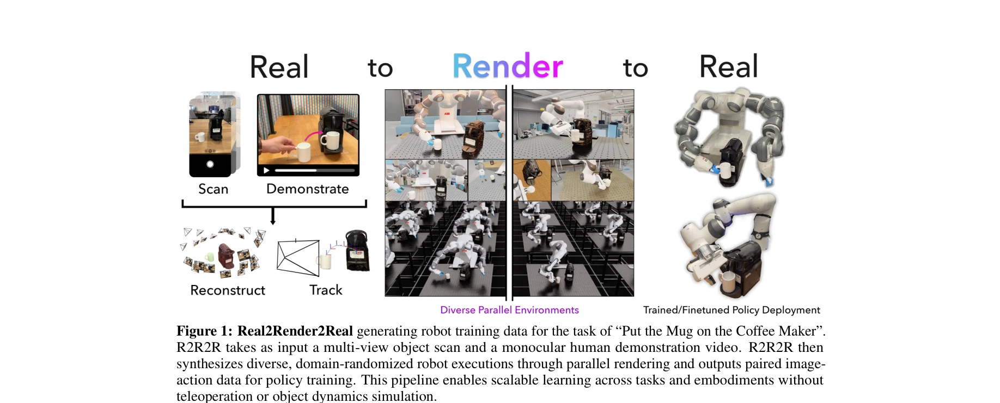
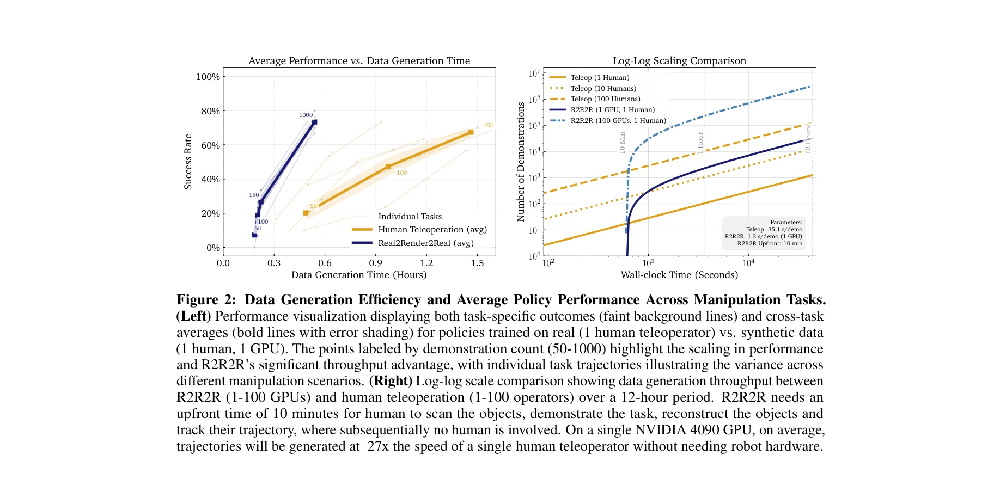

# Real2Render2Real: Scaling Robot Data Without Dynamics Simulation or Robot Hardware

> **저자**: Justin Yu, Letian Fu, Huang Huang, Karim El-Refai, Rares Andrei Ambrus, Richard Cheng, Muhammad Zubair Irshad, Ken Goldberg | **날짜**: 2025-05-14 | **URL**: [https://arxiv.org/abs/2505.09601](https://arxiv.org/abs/2505.09601)

---

## Essence

*Figure 1: Real2Render2Real generating robot training data for the task of “Put the Mug on the Coffee Maker”.*

Real2Render2Real (R2R2R)은 스마트폰으로 촬영한 3D 객체 스캔과 단일 인간 시연 영상으로부터 동역학 시뮬레이션이나 로봇 하드웨어 없이 대규모 로봇 훈련 데이터를 생성하는 파이프라인이다.

## Motivation

- **Known**: 로봇 학습 확장에는 대규모 다양한 데이터셋이 필요하며, 현재 인간 텔레오퍼레이션과 물리 시뮬레이션이 주요 데이터 수집 패러다임이다. 하지만 전자는 비용과 수작업이 많이 들고, 후자는 동역학 모델링의 정확성 문제로 어려움이 있다.
- **Gap**: 로봇 데이터셋은 LLM/VLM의 학습 데이터 규모보다 100,000배 이상 작으며, 동역학 시뮬레이션 없이도 물리적으로 타당한 대규모 합성 데이터를 생성할 수 있는지 미해결이다.
- **Why**: 생성 AI 모델과 달리 로봇 정책은 여전히 데이터 부족으로 확장에 제약받고 있으며, 접근 가능하고 저비용의 데이터 생성 방법이 일반화된 로봇 정책 개발을 가속화할 것이다.
- **Approach**: R2R2R은 3D Gaussian Splatting (3DGS)으로 객체 기하학과 외관을 재구성하고, 비디오에서 6-DoF 객체 궤적을 추출한 후, 역 기구학(differential inverse kinematics)과 도메인 랜덤화로 다양한 로봇 실행을 합성하여 IsaacLab을 순수 렌더링 엔진으로 활용한다.

## Achievement

*Figure 2: Data Generation Efficiency and Average Policy Performance Across Manipulation Tasks.*

- **동역학 시뮬레이션 제거**: IsaacLab을 운동학만 존중하고 충돌 모델링을 비활성화한 렌더링 엔진으로만 사용하여 물리 모델링의 복잡성을 회피
- **단일 시연으로 150배 데이터 효율성**: 1명의 인간 시연으로부터 생성된 R2R2R 데이터로 학습한 정책이 150개의 인간 텔레오퍼레이션 시연으로 학습한 정책과 동등한 성능 달성
- **로봇 불가지론적 생성**: 스마트폰 스캔과 인간 시연만으로 다양한 로봇 구현체와 작업에 적용 가능한 데이터 생성
- **27배 처리량 향상**: 단일 NVIDIA 4090 GPU에서 인간 텔레오퍼레이터 대비 27배 빠른 궤적 생성 속도
- **VLA 및 확산 정책 호환성**: 생성된 데이터가 vision-language-action 모델 및 diffusion 기반 아키텍처와 직접 호환 가능
- **강체 및 관절 객체 지원**: 부분 수준 분해로 회전 관절 객체까지 처리 가능

## How

*Figure 1: Real2Render2Real generating robot training data for the task of “Put the Mug on the Coffee Maker”.*

- 스마트폰 다중 시점 촬영으로 객체 3D 스캔 획득
- 인간 시연 비디오에서 6-DoF 객체 궤적 추출 (pose tracking)
- 3D Gaussian Splatting (3DGS)으로 객체 기하학 및 외관 재구성
- 메시 변환으로 IsaacLab 호환성 보장
- 차동 역기구학(differential inverse kinematics)으로 로봇 궤적 계산
- 조명, 카메라 포즈, 객체 초기 위치 랜덤화로 도메인 다양성 확보
- 병렬 렌더링으로 RGB 이미지 및 고유 상태(proprioceptive state) 생성
- 렌더링된 데이터를 VLA 및 모방 학습 정책에 입력

## Originality

- **동역학 제거 패러다임**: 기존 시뮬레이션 기반 생성의 물리 모델링 복잡성을 완전히 우회하는 새로운 접근
- **3DGS 기반 자산 생성**: 고충실도 3D 재구성으로 메시 생성까지 통합하는 end-to-end 파이프라인
- **단일 시연의 일대다 궤적 합성**: 하나의 인간 시연으로부터 역기구학 및 랜덤화를 통해 대규모 다양한 데이터 생성
- **스마트폰 기반 데이터 수집**: 전문 장비 없이 접근 가능한 입력으로 대규모 데이터 생성 가능성 제시

## Limitation & Further Study

- **정지 객체 가정**: 추출된 궤적이 인간 시연 기준이므로, 로봇이 예측 불가능한 동역학 상호작용을 해야 하는 상황에서 성능 저하 가능성
- **VLA 및 모방 학습에 제한**: RL 기반 정책이나 복잡한 환경 상호작용을 요구하는 작업에 적용 가능성 미검증
- **정확한 6-DoF 추적 의존성**: 비디오 기반 pose tracking의 오류가 생성 데이터 품질에 직접 영향
- **카메라-관찰 정책에만 적용**: 촉각, 힘 제어 등 다른 센서 모달리티 대응 미검토
- **후속 연구**: 동적 객체 상호작용 모델링, 다중 시점 추적 강화, 실시간 pose tracking 정확도 개선 필요

## Evaluation

- Novelty: 4/5
- Technical Soundness: 3/5
- Significance: 4/5
- Clarity: 4/5
- Overall: 4/5

**총평**: R2R2R은 동역학 시뮬레이션과 로봇 하드웨어라는 두 가지 주요 병목을 제거하여 스마트폰 입력만으로 대규모 로봇 훈련 데이터를 생성하는 획기적인 방법을 제시한다. 단일 인간 시연으로 150배 데이터의 성능을 달성한다는 실증적 결과와 VLA/모방 학습 호환성은 로봇 학습 확장의 실질적 경로를 제시하는 중요한 기여이다.

## Related Papers

- 🔄 다른 접근: [[papers/1523_Re3Sim_Generating_High-Fidelity_Simulation_Data_via_3D-Photo/review]] — 둘 다 real-to-sim-to-real을 다루지만 1527은 스마트폰 기반 간편한 방법으로, 1523은 3D 재구성 기반 고충실도 방법으로 접근함
- 🏛 기반 연구: [[papers/1483_MuBlE_MuJoCo_and_Blender_simulation_Environment_and_Benchmar/review]] — MuBlE의 현실적인 시각-물리 통합 환경이 스마트폰 스캔 기반 데이터 생성의 기반을 제공함
- 🧪 응용 사례: [[papers/1372_DROID_A_Large-Scale_In-The-Wild_Robot_Manipulation_Dataset/review]] — DROID의 대규모 실제 로봇 데이터가 R2R2R 파이프라인의 실제 적용 성과를 검증함
- 🔗 후속 연구: [[papers/1483_MuBlE_MuJoCo_and_Blender_simulation_Environment_and_Benchmar/review]] — MuBlE의 시각-물리 통합 환경을 실제 객체 스캔 데이터로 확장하여 더 현실적인 시뮬레이션을 구현함
- 🔄 다른 접근: [[papers/1523_Re3Sim_Generating_High-Fidelity_Simulation_Data_via_3D-Photo/review]] — 둘 다 real-to-sim-to-real 파이프라인을 사용하지만 1523은 3D 재구성 기반으로, 1527은 스마트폰 스캔 기반으로 접근함
- ⚖️ 반론/비판: [[papers/1625_VR-Robo_A_Real-to-Sim-to-Real_Framework_for_Visual_Robot_Nav/review]] — dynamics 시뮬레이션 없이 로봇 데이터를 확장하는 접근법이 VR-Robo의 물리 시뮬레이션 중심 방법론과 대조된다
