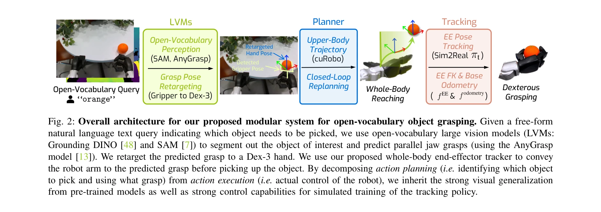
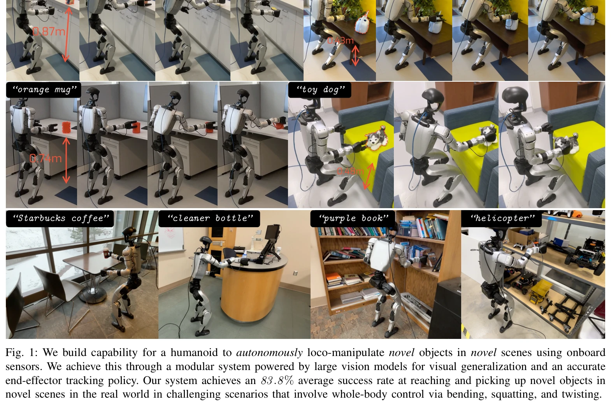
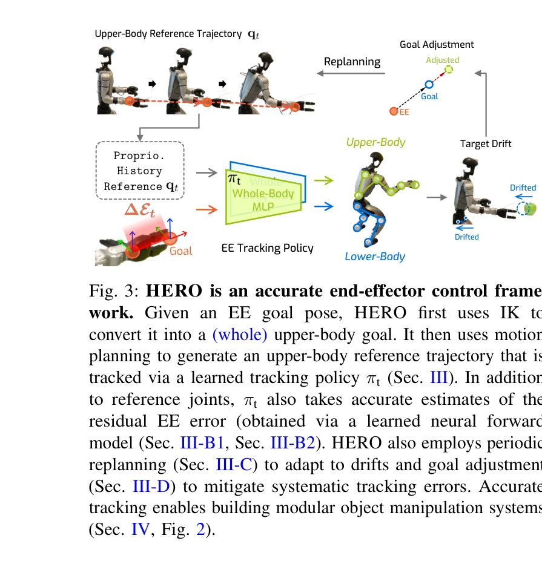

# Learning Humanoid End-Effector Control for Open-Vocabulary Visual Loco-Manipulation

> **저자**: Runpei Dong, Ziyan Li, Xialin He, Saurabh Gupta | **날짜**: 2026-02-24 | **DOI**: [10.48550/arXiv.2602.16705](https://doi.org/10.48550/arXiv.2602.16705)

---

## Essence

*Fig. 2: Overall architecture for our proposed modular system for open-vocabulary object grasping. Given a free-form*

휴머노이드 로봇의 물체 조작을 위해 대규모 비전 모델의 일반화 능력과 정확한 엔드-이펙터 추적 제어를 결합한 HERO 시스템을 제시하며, 잔차 인식 EE 추적 정책을 통해 추적 오차를 3.2배 감소시킨다.

## Motivation

- **Known**: 휴머노이드 로봇은 복잡한 동작은 가능하지만, 실시간 시각 입력 기반의 정밀한 물체 조작은 어렵다. 기존 모방 학습 방식은 대규모 데이터셋 수집의 어려움으로 일반화 성능이 제한된다.
- **Gap**: 휴머노이드의 엔드-이펙터 추적 오차가 8-13cm 수준으로 물체 조작에 부적합하며, 일반화 가능한 모듈식 시스템 구축이 어렵다.
- **Why**: 미지의 객체와 환경에서 물체 조작 능력은 로봇의 실용성을 크게 높이며, 정확한 제어와 강력한 시각 일반화의 결합은 현실 세계 적용의 핵심 과제이다.
- **Approach**: Open-vocabulary 대규모 비전 모델(Grounding DINO, SAM)로 물체 감지 및 그래스 계획을 수행하고, IK, learned neural forward model, goal adjustment, replanning을 통합한 정밀한 EE 추적 정책을 개발한다.

## Achievement

*Fig. 1: We build capability for a humanoid to autonomously loco-manipulate novel objects in novel scenes using onboard*

- **EE 추적 오차 감소**: 기존 8-13cm에서 2.5cm(시뮬레이션), 2.44cm(실제 환경)으로 3.2배 개선
- **높은 조작 성공률**: 표준 및 저형 테이블에서 10개 일상 물체 대상 90% 성공률, 10개 장면 일반화 73.3%, 혼잡한 환경 80% 성공률
- **개방형 어휘 지원**: 자연어 질의로 미지의 물체 인식 및 조작 가능
- **다양한 환경 적응**: 43-92cm 높이의 다양한 표면에서 사무실부터 카페까지 작동

## How

*Fig. 3: HERO is an accurate end-effector control frame-*

- Inverse kinematics를 사용하여 엔드-이펙터 목표를 상체 참조 궤적으로 변환
- 신경망 포워드 키네마틱스 모델로 정확한 현재 EE 위치 추정
- 신경망 오도메트리 모델로 베이스 포즈 추정 (저가 로봇의 부정확한 분석적 FK 및 오도메트리 보완)
- Learned tracking policy πt가 참조 조인트와 잔차 EE 오차를 입력으로 받아 제어
- 주기적 replanning으로 누적 드리프트 적응
- Goal adjustment를 통한 체계적 추적 오차 보정
- Grasp pose retargeting으로 병렬 jaw grasp을 Dex-3 hand로 변환
- 모듈식 아키텍처로 시각 인식 모듈(LVMs)과 제어 모듈 분리

## Originality

- Classical robotics(IK, motion planning)와 machine learning(neural forward model, learned policy)의 명시적 결합으로 정밀한 EE 추적 달성
- Residual-aware 제어 설계로 로봇의 구조적 부정확성을 보정하는 학습된 모델 사용
- Open-vocabulary 대규모 비전 모델을 휴머노이드 로코-조작에 체계적으로 통합하는 모듈식 파이프라인
- 시뮬레이션 학습으로 실시간 RGB-D 기반 정밀 제어 달성(대규모 실제 데이터 수집 없음)

## Limitation & Further Study

- 병렬 jaw grasp만 지원하며, 복잡한 다지 조작이나 동적 조작은 다루지 않음
- 저가 로봇(Unitree G1)의 센서 정확도 한계로 인한 신경망 모델 의존성
- 모듈식 설계로 인해 end-to-end 최적화 가능성 미탐색
- 단일 휴머노이드 플랫폼에서만 검증되어 다른 로봇 체형으로의 일반화 불명확
- 혼잡 환경에서 80% 성공률로, 높은 밀도의 물체 배치에서 성능 저하
- 후속 연구: 다지 손 조작, 동적 상황 대응, 다중 로봇 플랫폼 일반화, end-to-end 학습과의 비교

## Evaluation

- Novelty: 4/5
- Technical Soundness: 4/5
- Significance: 4/5
- Clarity: 4/5
- Overall: 4/5

**총평**: 정밀한 엔드-이펙터 추적과 개방형 어휘 시각 일반화를 결합하여 휴머노이드의 실용적 물체 조작을 가능하게 한 우수한 연구이며, 체계적인 기술 기여와 강력한 실제 검증으로 높은 가치를 지닌다.

## Related Papers

- 🔗 후속 연구: [[papers/1445_Hierarchical_Vision-Language_Planning_for_Multi-Step_Humanoi/review]] — HERO의 대규모 비전 모델과 엔드-이펙터 제어 통합이 다단계 휴머노이드 조작을 위한 계층적 비전-언어 계획으로 확장된다.
- 🔄 다른 접근: [[papers/1617_VLA-Cache_Efficient_Vision-Language-Action_Manipulation_via/review]] — 휴머노이드 엔드-이펙터 제어를 위한 HERO 시스템과 효율적 VLA 조작을 위한 VLA-Cache가 서로 다른 최적화 접근법을 제시한다.
- 🏛 기반 연구: [[papers/1437_Hand-Eye_Autonomous_Delivery_Learning_Humanoid_Navigation_Lo/review]] — HERO의 비전-언어 기반 휴머노이드 제어가 Hand-Eye 자율 배송 시스템의 기본 프레임워크를 제공한다.
- 🏛 기반 연구: [[papers/1344_CoT-VLA_Visual_Chain-of-Thought_Reasoning_for_Vision-Languag/review]] — Reflective Planning은 CoT-VLA의 시각적 추론에 필요한 다단계 계획의 이론적 기반을 제공한다
