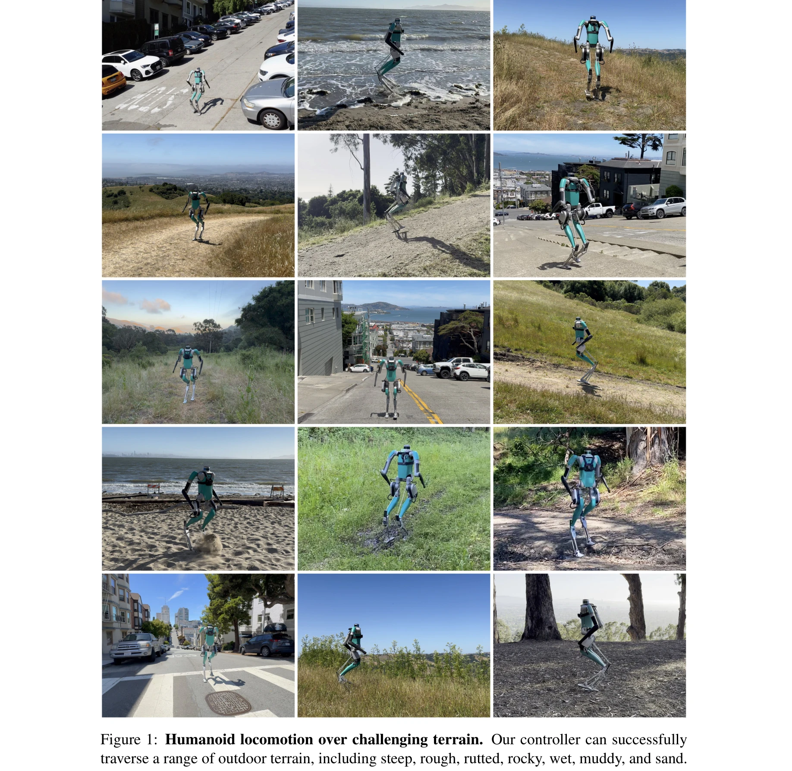

# Learning Humanoid Locomotion over Challenging Terrain

> **저자**: Ilija Radosavovic, Sarthak Kamat, Trevor Darrell, Jitendra Malik | **날짜**: 2024-10-04 | **URL**: [https://arxiv.org/abs/2410.03654](https://arxiv.org/abs/2410.03654)

---

## Essence

*Figure 1: Humanoid locomotion over challenging terrain. Our controller can successfully*

Transformer 기반 신경망을 flat-ground에서 sequence modeling으로 사전학습한 후 challenging terrain에서 강화학습으로 미세조정하여, 실제 humanoid 로봇이 복잡한 지형을 가로지를 수 있도록 하는 학습 기반 접근법

## Motivation

- **Known**: 기존의 classical controller들은 일반화가 어렵고, learning-based 방법들은 주로 평탄한 지형에 집중했다. 최근 transformer 기반 humanoid 컨트롤러가 gentle terrain에서 성공을 거두었다.
- **Gap**: 기존 학습 기반 방법들이 challenging terrain(가파른 경사, 울퉁불퉁한 지형, 변형 가능한 표면)에 대한 locomotion을 해결하지 못했다.
- **Why**: Humanoid 로봇이 실제 환경(산, 도시 거리 등)에서 안정적으로 이동할 수 있어야 humanoid 로봇의 실제 배포가 가능하기 때문이다.
- **Approach**: 사전학습(sequence modeling on flat-ground) → 미세조정(reinforcement learning on uneven terrain) 2단계 파이프라인을 통해 효율성과 강건성을 동시에 달성하는 Humanoid Transformer 2(HT-2) 모델

## Achievement

- **실제 환경 검증**: 버클리 hiking trail에서 4마일 이상의 거리를 성공적으로 주행했으며, 샌프란시스코의 31% 이상 경사도를 가진 가장 가파른 거리들을 통과
- **다양한 지형 적응**: 가파른, 울퉁불퉁한, 움푹 파인, 바위가 많은, 젖은, 진흙 많은, 모래 등 훈련 중 보지 못한 지형까지도 단일 신경망으로 처리
- **emergent 표현 학습**: 지도 없이 terrain clustering이 나타났으며, kinematic adaptation(경사도) 및 dynamic adaptation(지면 재료)이 자발적으로 발현
- **효율성 향상**: 사전학습을 통해 scratch에서 훈련하는 것 대비 상당한 샘플 효율성 증가 달성

## How

*Figure 1: Humanoid locomotion over challenging terrain. Our controller can successfully*

- Transformer 아키텍처로 proprioceptive observation과 action의 과거 이력을 입력받아 다음 action 예측
- Phase 1: 기존 policy, model-based controller, 인간 시퀀스로 구성된 flat-ground 데이터셋에서 sequence modeling으로 사전학습
- Phase 2: 미세조정 단계에서 uneven terrain에 대해 강화학습 적용
- 50 Hz에서 desired joint position과 PD gain 예측, 2000 Hz PD controller로 토크 변환
- Blind locomotion: proprioceptive 정보만 사용하며 desired velocity command로 전방향 이동 지원
- Digit humanoid robot(1.6m, 45kg, 36 DOF)에 실시간 배포 및 검증

## Originality

- Natural language processing의 generative pre-training 원리를 humanoid locomotion에 최초로 적용
- Sequence modeling 사전학습과 reinforcement learning 미세조정의 2단계 파이프라인으로 효율성과 성능의 trade-off 해결
- Emergent terrain representation과 in-context adaptation이 명시적 감독 없이 자발적으로 발현되는 현상 발견 및 분석
- 실제 challenging outdoor terrain에서 대규모 실험 검증(4마일 hiking, 31% 경사도)

## Limitation & Further Study

- 시뮬레이션-실제 환경 간의 sim-to-real gap이 완전히 해결되지 않았을 가능성
- Vision 정보를 활용하지 않아 복잡한 장애물 회피 시나리오에서 제한적일 수 있음
- 추가 지형(vegetation, 계단 등)에 대한 robust성 검증이 제한적
- 계산 비용 및 모델 크기에 대한 분석 부재
- 다른 humanoid 로봇 플랫폼에 대한 전이 학습 가능성 미검증
- 더 극단적인 조건(극저온, 강한 바람 등)에 대한 일반화 능력 평가 필요

## Evaluation

- Novelty: 4/5
- Technical Soundness: 3/5
- Significance: 4/5
- Clarity: 4/5
- Overall: 4/5

**총평**: 사전학습과 미세조정 2단계 파이프라인을 통해 humanoid 로봇이 실제 복잡한 지형에서 강건하게 이동할 수 있음을 최초로 입증한 중요한 연구이며, emergent adaptation 현상 발견과 4마일의 실제 hiking 성공 등 탁월한 실증적 결과를 제시한다.

## Related Papers

- 🔄 다른 접근: [[papers/1449_Learned_Perceptive_Forward_Dynamics_Model_for_Safe_and_Platf/review]] — 두 논문 모두 도전적인 지형에서의 지각 기반 보행을 다루지만, Transformer 사전학습 vs 실시간 적응이라는 서로 다른 학습 전략을 채택함
- 🔗 후속 연구: [[papers/1533_Learning_Perceptive_Humanoid_Locomotion_over_Challenging_Ter/review]] — 지각 기반 도전적 지형 보행의 기본 개념을 Transformer 기반 sequence modeling으로 더욱 발전시킨 형태임
- 🔄 다른 접근: [[papers/1257_Advancing_Humanoid_Locomotion_Mastering_Challenging_Terrains/review]] — 도전적 지형에서의 휴머노이드 locomotion 마스터링이라는 동일한 목표를 다루지만 서로 다른 기술적 접근법을 제시함
- 🔗 후속 연구: [[papers/1553_Let_Humanoids_Hike_Integrative_Skill_Development_on_Complex/review]] — 도전적 지형에서의 휴머노이드 locomotion을 복잡한 산책로 환경에서의 통합적 기술 개발로 더욱 구체화하고 발전시킨 형태임
- 🔄 다른 접근: [[papers/1578_MoRE_Mixture_of_Residual_Experts_for_Humanoid_Lifelike_Gaits/review]] — 도전적인 지형에서의 휴머노이드 보행 학습에 대해 잔여 전문가 혼합 방식과 다른 접근법을 제시합니다.
- 🔗 후속 연구: [[papers/1544_Learning_to_Look_Seeking_Information_for_Decision_Making_via/review]] — ReKep의 시공간적 관계 키포인트 추론을 DISaM의 정보 탐색 정책에 통합하여 더 정교한 환경 이해를 가능하게 한다.
