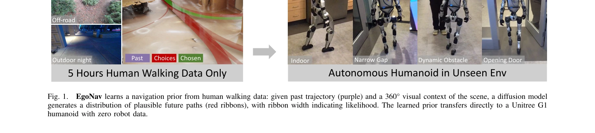
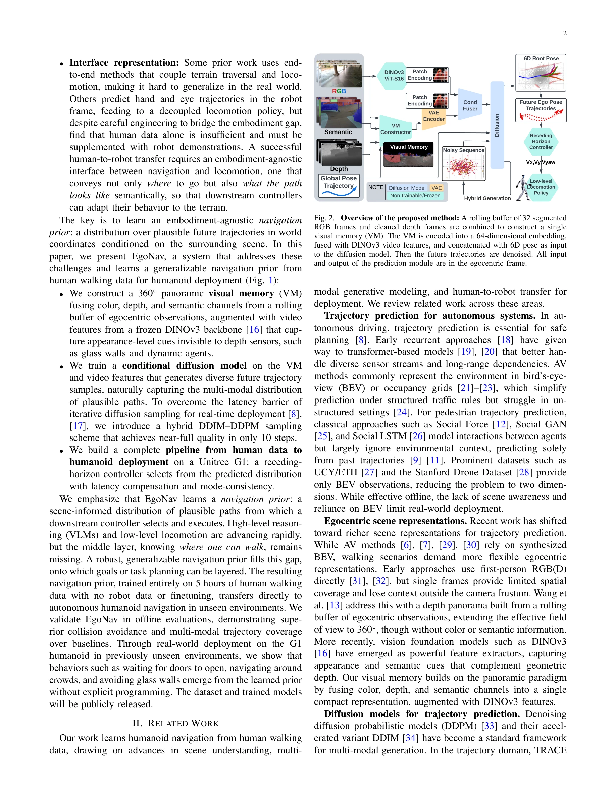

# Learning Humanoid Navigation from Human Data

> **저자**:  | **날짜**: 2026-04-01 | **URL**: [https://arxiv.org/abs/2604.00416](https://arxiv.org/abs/2604.00416)

---

## Essence

*Fig. 1.*

EgoNav는 5시간의 인간 보행 데이터만을 사용하여 diffusion model 기반 휴머노이드 로봇 자율 내비게이션 정책을 학습하는 시스템으로, 로봇 데이터나 파인튜닝 없이 미지의 실내외 환경에서 바로 배포 가능함을 입증했다.

## Motivation

- **Known**: 자율 주행과 보행자 궤적 예측 분야에서는 다양한 접근법들이 존재하지만, 기존 방법들은 지도 기반 표현, 단일 궤적 예측, 또는 로봇 특화 데이터 수집에 의존해왔다.
- **Gap**: 인간 보행 데이터만으로 휴머노이드 로봇 내비게이션을 학습하되, 360도 장면 이해, 다중모드 궤적 분포 예측, embodiment-agnostic 인터페이스를 동시에 제공하는 통합 솔루션이 부족했다.
- **Why**: 휴머노이드 로봇의 대규모 데이터 수집은 비용이 높고 확장성이 떨어지는 반면, 인간 보행 데이터는 풍부한 상식적 내비게이션 지식을 담고 있으며 저렴하고 확장 가능하기 때문에 중요하다.
- **Approach**: 360도 panoramic visual memory를 구성하여 색상, 깊이, 의미 정보를 융합하고 DINOv3 특징을 추가한 후, 이를 조건으로 하는 diffusion model을 통해 다중모드 미래 궤적 분포를 생성하며, hybrid DDIM-DDPM 샘플링으로 실시간 추론을 달성한다.

## Achievement

*Fig. 1.*

- **인간 데이터만으로의 성공적 전이**: 로봇 데이터나 파인튜닝 없이 5시간의 인간 보행 데이터만으로 학습하여 Unitree G1 휴머노이드에 zero-shot 배포 가능
- **다중모드 궤적 예측**: diffusion model을 통해 가능한 미래 경로의 분포를 예측하여 기존 단일 궤적 방법보다 우월한 collision avoidance와 coverage 성능 달성
- **실시간 추론 성능**: hybrid DDIM-DDPM 샘플링 기법으로 10 denoising steps만에 충분한 품질의 궤적 생성으로 real-time 폐루프 제어 가능
- **자동 행동 출현**: 명시적 프로그래밍 없이 문 열기 대기, 군중 회피, 유리벽 인식 등의 복잡한 행동이 학습된 prior로부터 자연스럽게 발현
- **360도 장면 이해**: panoramic visual memory와 DINOv3 특징을 결합하여 깊이 센서로 감지 불가능한 투명/반사 물체와 의미적 장면 정보 포함

## How

*Fig. 2. Overview of the proposed method: A rolling buffer of 32 segmented*

- rolling buffer로부터 32개의 segmented RGB frame과 정제된 depth frame을 수집하여 단일 visual memory 구성
- Visual memory를 64차원 embedding으로 인코딩하고 DINOv3 ViT-S16 video features와 fusion
- 6D pose 정보와 함께 diffusion model에 입력하여 noisy sequence denoising을 통한 future ego pose trajectory 생성
- Classifier-free guidance를 활용한 장면 조건부 생성
- Hybrid DDIM-DDPM 샘플링으로 추론 단계 수 감소 (약 10 step)
- Receding-horizon controller로 예측 분포에서 경로 선택 및 latency compensation 적용
- 선택된 궤적을 low-level locomotion policy로 전달하여 실행

## Originality

- 인간 보행 데이터만으로 휴머노이드 내비게이션을 전달하는 최초의 성공 사례 제시
- 색상, 깊이, 의미, DINOv3 특징을 통합하는 새로운 360도 panoramic visual memory 설계
- Trajectory prediction 도메인에서 hybrid DDIM-DDPM 샘플링으로 diffusion model의 실시간성 해결
- World coordinate 기반 embodiment-agnostic 궤적 출력으로 로봇 body 특성과 무관하게 transfer 가능하게 설계
- Human-to-robot transfer를 위한 완전한 end-to-end 파이프라인 제시 (데이터 수집부터 배포까지)

## Limitation & Further Study

- 학습 데이터가 5시간으로 제한적이므로 더 복잡하거나 극단적인 환경에서의 일반화 능력 검증 필요
- 실제 배포 환경이 주로 실내외 보행 시나리오로 제한되어 있으며, 극도로 혼잡한 군중이나 복잡한 지형에서의 성능 미검증
- DINOv3 모델이 frozen 상태이므로 task-specific fine-tuning 가능성 탐색 필요
- Receding-horizon controller의 경로 선택 전략이 휴리스틱 기반이므로 학습 기반 선택 메커니즘 개발 가능
- 다양한 체형과 보행 속도의 인간 데이터 다양성 증대로 더 강건한 모델 개발 가능
- 장기 내비게이션 작업(예: 멀티룸 목표 달성)에서의 성능 평가 필요

## Evaluation

- Novelty: 4/5
- Technical Soundness: 3/5
- Significance: 4/5
- Clarity: 4/5
- Overall: 4/5

**총평**: 본 논문은 인간 보행 데이터만으로 휴머노이드 로봇 내비게이션을 학습하는 실질적이고 혁신적인 솔루션을 제시하며, 360도 scene understanding과 다중모드 궤적 예측, 실시간 추론을 모두 해결한 통합 시스템으로 로봇 공학에서 중요한 기여를 한다.

## Related Papers

- 🏛 기반 연구: [[papers/1281_Being-H0_Vision-Language-Action_Pretraining_from_Large-Scale/review]] — 대규모 인간 데이터를 활용한 vision-language-action 사전학습의 이론적 배경이 EgoNav의 인간 보행 데이터 기반 학습에 직접적으로 적용됨
- 🔄 다른 접근: [[papers/1368_DiWA_Diffusion_Policy_Adaptation_with_World_Models/review]] — 두 논문 모두 egocentric 시점에서의 시연 생성을 다루지만, 인간 보행 데이터 vs 조작 데이터라는 서로 다른 도메인에 집중함
- 🔗 후속 연구: [[papers/1578_MoRE_Mixture_of_Residual_Experts_for_Humanoid_Lifelike_Gaits/review]] — SPRINT의 확장 가능한 사전학습 개념을 휴머노이드 내비게이션이라는 특수한 도메인에 구체적으로 적용한 발전된 형태임
