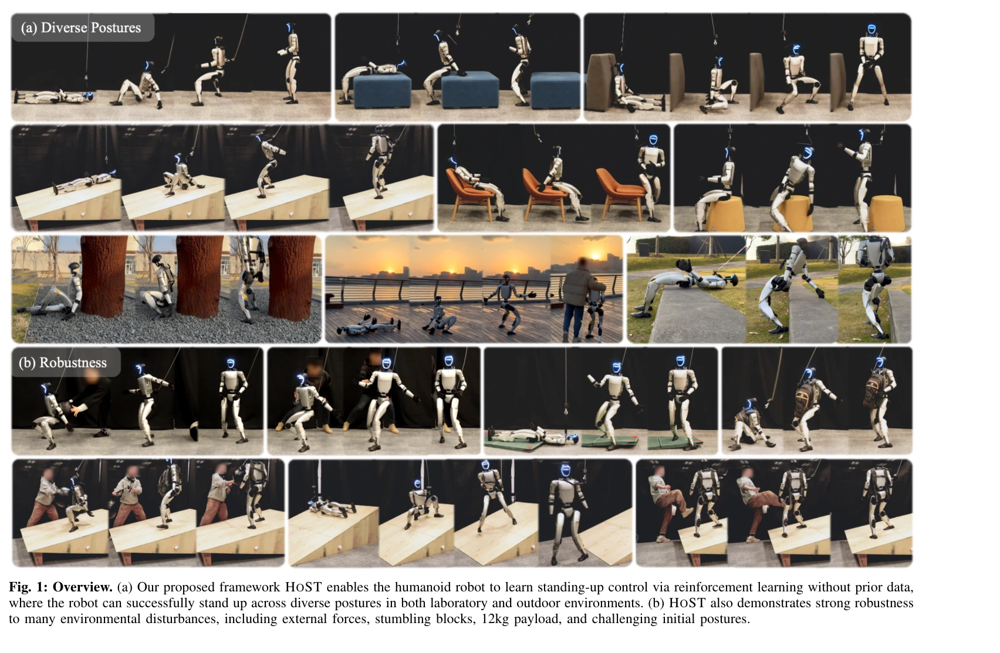

# Learning Humanoid Standing-up Control across Diverse Postures

> **저자**: Tao Huang, Junli Ren, Huayi Wang, Zirui Wang, Qingwei Ben, Muning Wen, Xiao Chen, Jianan Li, Jiangmiao Pang | **날짜**: 2025-02-12 | **URL**: [https://arxiv.org/abs/2502.08378](https://arxiv.org/abs/2502.08378)

---

## Essence

*Fig. 1: Overview. (a) Our proposed framework HOST enables the humanoid robot to learn standing-up control via reinforcem*

HoST는 reinforcement learning 기반 프레임워크로, 다양한 자세에서 인간형 로봇의 일어서기 제어를 시뮬레이션에서 학습하여 실제 하드웨어(Unitree G1)에 직접 배포 가능하도록 함.

## Motivation

- **Known**: 인간형 로봇의 일어서기 제어는 기존에 시뮬레이션 기반 접근이나 사전 정의된 궤적 추적 방식으로 다루어졌으며, 로봇 보행 및 조작 제어는 RL로 성공을 거두었음.
- **Gap**: 기존 방식들은 다양한 자세에서의 일반화를 못하거나 실세계 배포에 적합하지 않으며, 사전 궤적 없이 다양한 자세에서 robust하게 작동하는 RL 기반 일어서기 제어 방법이 없음.
- **Why**: 일어서기 능력은 로봇이 소파에서 일어나거나 넘어진 후 회복할 수 있게 하여 real-world 응용 범위를 크게 확장할 수 있기 때문.
- **Approach**: 다중 terrain 기반 curriculum 학습과 multi-critic 아키텍처를 활용한 PPO 기반 RL 훈련에서, smoothness regularization과 implicit motion speed bound를 적용하여 실제 로봇 배포 시 안정성을 확보함.

## Achievement

*Fig. 1: Overview. (a) Our proposed framework HOST enables the humanoid robot to learn standing-up control via reinforcem*

- **자세 적응형 실세계 동작**: 사전 정의된 궤적이나 sim-to-real adaptation 기법 없이 다양한 자세에서 일어서기 제어 실현
- **강건한 성능**: 외력, 장애물, 12kg 하중, 도전적 초기 자세 등 환경 교란에 대한 견고성 입증
- **매끄럽고 안정적인 동작**: 학습된 정책이 실내·실외 환경에서 진동 없고 안정적인 일어서기 동작 생성
- **평가 프로토콜 개발**: 일어서기 제어를 종합적으로 분석하기 위한 evaluation protocols 수립

## How

*Fig. 2: Framework overview. (a) We train policies in simulation from scratch*

- PPO를 기본 RL 알고리즘으로 사용하여 정책 학습
- 다양한 simulated terrain에서 curriculum-based training 수행
- multi-critic 아키텍처로 여러 reward group을 독립적으로 최적화
- smoothness regularization을 reward에 operationalize하여 진동 완화
- action rescaler를 통한 implicit motion speed bound로 과격한 동작 제약
- domain randomization으로 sim-to-real transfer 강화
- proprioceptive state (IMU, joint encoders)만 사용하여 시뮬레이션 정보 최소화
- 초기 탐색 단계에서 vertical pull force 적용으로 posture 적응성 촉진

## Originality

- 기존 trajectory tracking 방식을 벗어나 다양한 자세에서 학습 가능한 posture-adaptive RL 프레임워크 제시
- multi-critic 아키텍처와 curriculum learning을 결합하여 복잡한 multi-stage motor skill 최적화
- smoothness regularization과 motion speed bound라는 hardware 친화적 제약 메커니즘 도입
- 실제 로봇(Unitree G1, 23 DoF)에 직접 배포 가능한 수준의 sim-to-real transfer 성공

## Limitation & Further Study

- 학습은 시뮬레이션 기반이므로 sim-to-real gap 존재 가능성 (domain randomization으로 완화하지만 한계 있음)
- proprioceptive state만 사용하므로 환경의 복잡한 기하학적 특성 인식 불가능
- 다양한 로봇 형태(특히 고DoF humanoid robot)에의 일반화 검증 부족
- 실외 환경 테스트가 제한적이며 더 극한 환경(높은 각도, 미끄러운 표면 등)에서의 성능 미상
- 후속 연구에서는 시각 정보 통합, 다양한 humanoid 로봇 플랫폼 검증, 극한 환경 성능 평가 필요

## Evaluation

- Novelty: 4/5
- Technical Soundness: 3/5
- Significance: 4/5
- Clarity: 4/5
- Overall: 4/5

**총평**: 본 논문은 다양한 자세에서의 인간형 로봇 일어서기 제어를 RL로 학습하여 실제 배포하는 실질적 해결책을 제시하며, multi-critic 아키텍처와 motion constraints라는 기술적 기여와 포괄적 평가 프로토콜을 통해 humanoid robot control 분야에 의미 있는 진전을 이뤘음.

## Related Papers

- 🔄 다른 접근: [[papers/1523_Learning_Getting-Up_Policies_for_Real-World_Humanoid_Robots/review]] — 두 논문 모두 휴머노이드의 일어서기 제어를 다루지만, 다양한 자세 vs 낙상 후 복구라는 서로 다른 시나리오에 집중함
- 🏛 기반 연구: [[papers/1433_H-Zero_Cross-Humanoid_Locomotion_Pretraining_Enables_Few-sho/review]] — Cross-humanoid locomotion 사전학습을 통한 few-shot 학습 능력이 다양한 자세에서의 일어서기 제어 일반화에 직접적으로 도움됨
- 🔗 후속 연구: [[papers/1597_One-shot_Adaptation_of_Humanoid_Whole-body_Motion_with_Walki/review]] — one-shot adaptation의 개념을 일어서기 제어라는 특수한 whole-body motion에 적용하여 구체화한 형태임
- 🧪 응용 사례: [[papers/1374_Embedding_Classical_Balance_Control_Principles_in_Reinforcem/review]] — 고전적 균형 제어 원리를 RL에 임베딩하는 방법을 다양한 자세에서의 일어서기 제어에 직접 적용할 수 있다.
- 🔗 후속 연구: [[papers/1478_HumanoidBench_Simulated_Humanoid_Benchmark_for_Whole-Body_Lo/review]] — RLBench의 벤치마킹 개념을 휴머노이드 전신 제어에 특화하여 적용했다
- 🔗 후속 연구: [[papers/1541_Learning_to_Get_Up_Across_Morphologies_Zero-Shot_Recovery_wi/review]] — 다양한 형태에서의 낙상 복구 학습이 다양한 자세에서의 휴머노이드 일어서기 제어로 구체화되어 확장되었다.
- 🔄 다른 접근: [[papers/1523_Learning_Getting-Up_Policies_for_Real-World_Humanoid_Robots/review]] — 두 논문 모두 휴머노이드의 일어서기 제어를 다루지만, 낙상 후 복구 vs 다양한 자세에서의 일어서기라는 서로 다른 시나리오에 집중함
