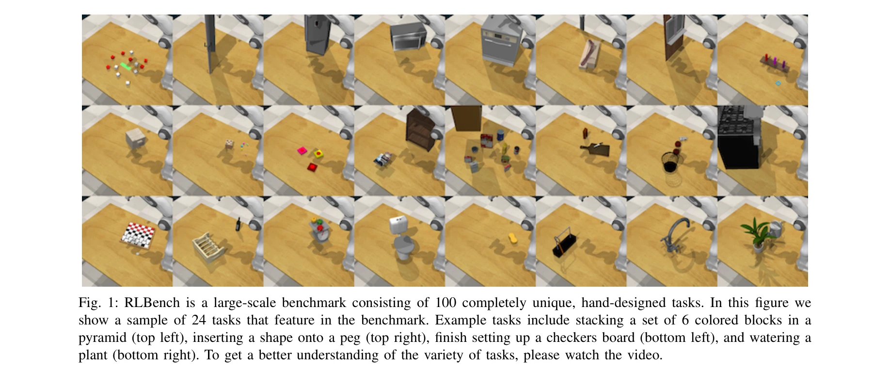
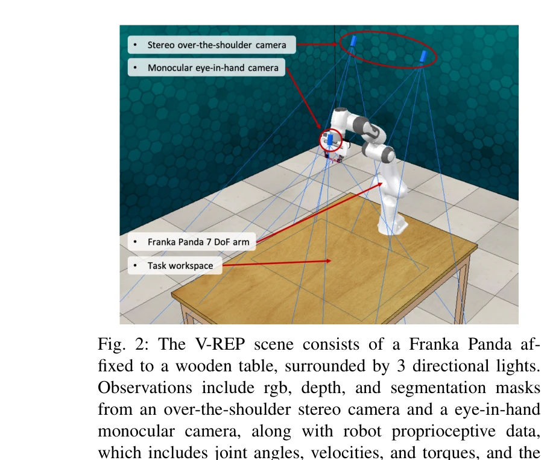

# RLBench: The Robot Learning Benchmark & Learning Environment

> **저자**: Stephen James, Zicong Ma, David Rovick Arrojo, Andrew J. Davison | **날짜**: 2019-09-26 | **URL**: [https://arxiv.org/abs/1909.12271](https://arxiv.org/abs/1909.12271)

---

## Essence

*Fig. 1: RLBench is a large-scale benchmark consisting of 100 completely unique, hand-designed tasks. In this figure we*

로봇 학습을 위한 대규모 벤치마크인 RLBench를 제시하며, 100개의 고유한 손-설계 태스크, 다양한 센서 모달리티, 그리고 motion planner를 통한 무한한 데모를 제공한다.

## Motivation

- **Known**: OpenAI Gym과 DeepMind Control Suite 같은 기존 reinforcement learning 벤치마크들이 존재하지만 현실 로봇 조작 문제에 초점을 맞추지 않으며, 다양한 로봇 학습 분야를 통합적으로 평가할 표준이 부재하다.
- **Gap**: 기존 벤치마크들은 toy task 중심이거나 특정 하위 문제(perception, grasping, planning)에만 집중하며, few-shot learning과 multi-task learning을 위한 대규모 통합 벤치마크가 없다.
- **Why**: 로봇 학습 커뮤니티가 공통된 평가 기준을 갖추면 다양한 방법론(reinforcement learning, imitation learning, few-shot learning, multi-task learning)을 공정하게 비교할 수 있으며, 연구 진전을 가속화할 수 있다.
- **Approach**: Franka Panda 로봇 팔을 사용하는 시뮬레이션 환경에서 100개의 다양한 난이도의 조작 태스크를 설계하고, PyRep 기반 도구로 waypoint motion planning을 통해 무한한 데모를 생성할 수 있도록 하였다.

## Achievement

*Fig. 1: RLBench is a large-scale benchmark consisting of 100 completely unique, hand-designed tasks. In this figure we*

- **100개 고유 태스크**: 단순 target reaching부터 oven opening, tray placement 같은 다단계 태스크까지 다양한 난이도의 조작 문제를 포함
- **다양한 관찰 모달리티**: RGB, depth, segmentation mask (over-the-shoulder stereo camera, eye-in-hand monocular camera), 그리고 joint angles, velocities, forces 같은 proprioceptive 정보 제공
- **무한 데모 생성**: motion planner 기반 waypoint 시스템으로 각 태스크에 대한 무한한 demonstrations 생성 가능
- **확장성**: PyRep 기반 오픈소스 도구로 새로운 태스크 생성과 검증이 용이하며 커뮤니티 기여 가능
- **대규모 few-shot 챌린지**: 로보틱스 분야 최초의 대규모 few-shot learning 벤치마크 제시

## How

*Fig. 2: The V-REP scene consists of a Franka Panda af-*

- V-REP 시뮬레이션 환경에서 Franka Panda 로봇 팔을 3개의 directional lights와 함께 나무 테이블에 고정
- Over-the-shoulder stereo camera와 eye-in-hand monocular camera로부터 RGB, depth, segmentation 데이터 캡처
- Robot proprioceptive data (joint angles, velocities, torques, gripper pose) 수집
- 각 태스크마다 waypoint-based motion planning 알고리즘으로 demonstration 자동 생성
- PyRep 기반 도구로 새로운 태스크를 쉽게 생성하고 검증할 수 있는 인터페이스 제공
- Diversity, reproducibility, fairness 등 벤치마크 설계 원칙 적용

## Originality

- 단순 toy task 기반 벤치마크와 달리 현실적이고 복잡한 100개 고유 조작 태스크 설계
- Motion planner 기반 무한 데모 생성으로 demonstration-based learning의 대규모 데이터 확보 실현
- reinforcement learning, imitation learning, few-shot learning, multi-task learning 등 여러 로봇 학습 분야를 통합적으로 평가 가능한 단일 벤치마크 제시
- 커뮤니티 기여가 가능한 scalable task creation 도구 제공으로 벤치마크의 지속적 확장 가능성 제시
- 기존 single-task 기반 few-shot 로봇 학습(예: 'peach in red bowl' vs 'apple in green bowl')에서 벗어나 대규모 few-shot 로보틱스 챌린지 제안

## Limitation & Further Study

- 시뮬레이션 환경만 제공하여 sim-to-real transfer의 실효성 미검증 (현실 로봇 성능 보장 불가)
- Motion planner 기반 데모 생성으로 인한 biased trajectory 가능성 (다양한 해결 방식 미반영)
- Franka Panda 단일 로봇 팔만 지원으로 다른 로봇 형태(humanoid, mobile manipulation 등) 적용 제한
- 초기 버전에서 100개 태스크로 시작하지만 도메인 커버리지 확대 필요 (예: 동적 조작, 협력 태스크)
- 후속 연구로 실제 로봇 환경과의 gap 축소, 더 다양한 데모 생성 방식 개발, 추가 로봇 플랫폼 지원 필요

## Evaluation

- Novelty: 4/5
- Technical Soundness: 3/5
- Significance: 4/5
- Clarity: 4/5
- Overall: 4/5

**총평**: RLBench는 로봇 학습 커뮤니티를 위한 포괄적이고 확장 가능한 벤치마크로서 다양한 학습 패러다임을 통합적으로 평가할 수 있는 중요한 인프라를 제공한다. 시뮬레이션 기반이라는 제약이 있지만 무한 데모, scalable task creation, 100개 다양한 태스크의 조합으로 로봇 학습 연구의 표준화를 이루고 진전을 가속화할 수 있는 매우 가치 있는 기여이다.

## Related Papers

- 🔗 후속 연구: [[papers/1562_ManiSkill-HAB_A_Benchmark_for_Low-Level_Manipulation_in_Home/review]] — ManiSkill-HAB의 가정 환경 조작 벤치마크가 RLBench의 로봇 학습 벤치마크를 실제 가정 환경으로 확장한다.
- 🔄 다른 접근: [[papers/1469_Humanoid_Occupancy_Enabling_A_Generalized_Multimodal_Occupan/review]] — ManiSkill3의 GPU 병렬화 시뮬레이션과 RLBench의 로봇 학습 환경은 모두 로봇 학습을 위한 서로 다른 시뮬레이션 플랫폼이다.
- 🏛 기반 연구: [[papers/1317_BEHAVIOR-1K_A_Human-Centered_Embodied_AI_Benchmark_with_1000/review]] — BEHAVIOR-1K의 human-centered embodied AI benchmark가 RLBench의 100개 태스크 설계의 이론적 기반을 제공한다.
