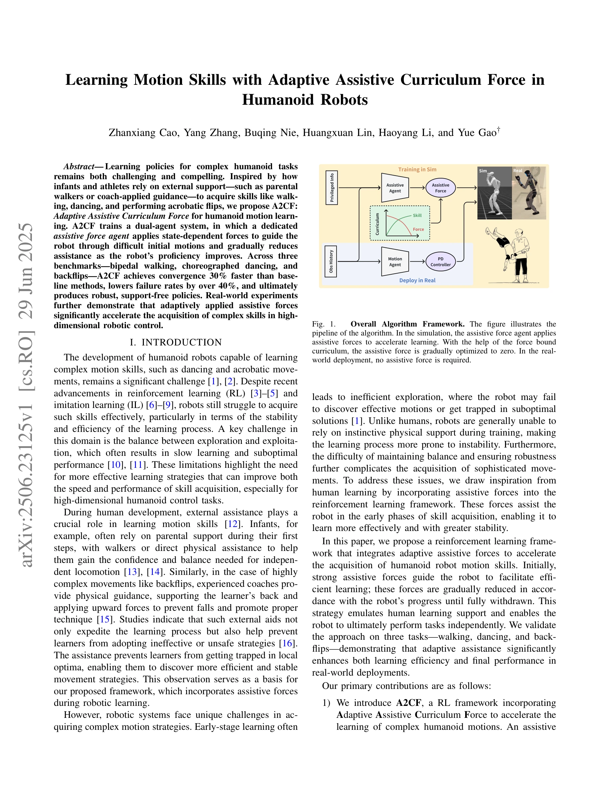

# Learning Motion Skills with Adaptive Assistive Curriculum Force in Humanoid Robots

> **저자**: Zhanxiang Cao, Yang Zhang, Buqing Nie, Huangxuan Lin, Haoyang Li, Yue Gao | **날짜**: 2025-06-29 | **URL**: [https://arxiv.org/abs/2506.23125](https://arxiv.org/abs/2506.23125)

---

## Essence

*Fig. 1.*

A2CF는 보조 힘을 제공하는 별도의 에이전트를 통해 인간형 로봇의 복잡한 동작 학습을 가속화하는 적응형 보조 커리큘럼 학습 프레임워크이다. 로봇의 숙련도 향상에 따라 보조 힘을 점진적으로 감소시켜 최종적으로 독립적 수행이 가능한 정책을 생성한다.

## Motivation

- **Known**: 강화학습(RL)과 모방학습(IL)을 통한 인간형 로봇의 동작 학습이 최근 발전했으나, 안정성과 효율성 측면에서 여전히 어려움이 있다. 인간 발달 과정에서 외부 지원(부모의 도움, 코치의 안내 등)이 학습 속도를 높이고 비효율적 전략을 방지한다는 것이 알려져 있다.
- **Gap**: 로봇 시스템은 인간과 달리 학습 중 직관적인 물리적 지원을 활용하기 어려우며, 초기 학습 단계에서 비효율적 탐색과 부분 최적해 문제에 빠지기 쉽다. 상태-의존적이고 적응형인 보조 힘을 통한 학습 가속화 방법이 부족하다.
- **Why**: 복잡한 인간형 동작 학습(걷기, 춤, 백플립 등)의 빠른 수렴과 높은 성공률은 실제 로봇 응용에서 개발 시간 단축과 안전성 향상을 가능하게 한다. 적응형 보조의 원리를 이해하면 고차원 제어 문제 해결의 일반적 방법론을 제공할 수 있다.
- **Approach**: Dual-agent 시스템을 구성하여 motion policy agent와 assistive force agent를 동시 학습한다. Hypercube 기반의 적응형 힘 경계를 정의하고 로봇의 숙련도 지표에 따라 점진적으로 감소시키는 커리큘럼을 적용한다.

## Achievement

- **수렴 속도 개선**: 기준 방법 대비 30% 빠른 수렴 달성
- **실패율 감소**: 40% 이상의 실패율 감소
- **강건한 독립 정책**: 보조 없이 작동 가능한 안정적인 정책 생성
- **실제 로봇 전이**: 시뮬레이션에서 실제 인간형 로봇으로의 성공적 이전 입증
- **다중 작업 검증**: 걷기, 춤추기, 백플립 등 3가지 벤치마크에서 일관된 성능 향상

## How

*Fig. 1.*

- **확장 행동 공간**: Motion policy의 joint position 명령과 assistive force agent의 6D spatial force(선형 힘 + 모멘트) 결합
- **Hypercube 기반 커리큘럼**: 6D 초평면 기반의 행동 경계 η_k를 정의하고 적용되는 힘의 크기에 따라 적응적 업데이트
- **적응형 경계 업데이트**: 정규화된 힘 크기 ‖F_k‖/‖η_k‖가 임계값 이하이면 경계 감소, 초과이면 증가
- **특권 정보 활용**: 시뮬레이션에서만 접근 가능한 추가 상태 정보를 사용하여 정책 개선
- **초기 분포 설계**: 적절한 초기 보조 힘 범위 설정으로 assistive force agent에 강한 사전 정보 제공
- **Random masking**: 과도한 외부 지원 의존을 방지하기 위한 마스킹 기법 적용

## Originality

- **상태-의존적 보조 힘**: 기존 HoST의 고정 수직 힘과 달리, 상태에 따라 동적으로 변하는 6D spatial force 적용
- **적응형 커리큘럼**: 로봇의 실시간 숙련도를 기반으로 보조 힘 경계를 자동으로 조정하는 메커니즘
- **Dual-agent 프레임워크**: Motion policy와 assistive force를 분리된 에이전트로 학습하면서 Joint action learner로 협력
- **인간 학습의 생물학적 영감**: 영아, 운동선수의 학습 과정을 정량적 알고리즘으로 체계화
- **특권 정보 기반 설계**: Sim-to-real transfer를 위해 시뮬레이션 전용 정보와 실제 배포용 정책을 명확히 분리

## Limitation & Further Study

- **작업 범위 제한**: 3가지 벤치마크(걷기, 춤, 백플립)만 검증되었으며, 더 다양한 동작에 대한 일반화 가능성 미검증
- **계산 복잡도**: Dual-agent 학습으로 인한 학습 시간 및 메모리 오버헤드에 대한 분석 부재
- **하이퍼파라미터 민감도**: ϵ, δ 등 커리큘럼 파라미터에 대한 민감도 분석 부족
- **Sim-to-real 간격**: 실제 로봇 실험이 제한적이며, 다양한 실제 환경에서의 강건성 검증 필요
- **보조 힘 설계**: Pelvis에만 적용되었으며, 다른 링크나 다중 접촉점에의 일반화 가능성 미검토
- **후속 연구 방향**: (1) 더 복잡한 전신 협응 작업으로 확장, (2) 시뮬레이션 환경의 노이즈 강화, (3) 다양한 형태의 로봇에 대한 전이 학습 연구

## Evaluation

- Novelty: 4/5
- Technical Soundness: 3/5
- Significance: 4/5
- Clarity: 4/5
- Overall: 4/5

**총평**: A2CF는 인간의 직관적 학습 과정을 구체적 알고리즘으로 구현하여 인간형 로봇의 복잡한 동작 학습을 크게 가속화하는 창의적이고 실용적인 접근이다. 실제 로봇까지 성공적으로 전이되었으며, 고차원 로봇 제어 문제의 중요한 해결책을 제시한다.

## Related Papers

- 🔗 후속 연구: [[papers/1532_Learning_Motion_Skills_with_Adaptive_Assistive_Curriculum_Fo/review]] — 적응형 보조 커리큘럼 학습 A2CF가 복잡한 휴머노이드 동작 학습을 가속화하는 방식이 다형태 낙상 복구 학습으로 확장될 수 있다.
- 🏛 기반 연구: [[papers/1349_Distillation-PPO_A_Novel_Two-Stage_Reinforcement_Learning_Fr/review]] — A2CF의 강화학습 기반 보조 힘 제공 방식이 Distillation-PPO의 이단계 강화학습 프레임워크를 기반으로 한다.
- 🔄 다른 접근: [[papers/1418_Guiding_Pretraining_in_Reinforcement_Learning_with_Large_Lan/review]] — 휴머노이드 동작 학습을 위한 적응형 보조 시스템과 대규모 언어 모델로 강화학습을 가이드하는 방식이 서로 다른 접근법이다.
- 🔗 후속 연구: [[papers/1315_Composite_Motion_Learning_with_Task_Control/review]] — 적응형 보조 커리큘럼 학습에서 A2CF의 점진적 감소 방법이 확장된다
- 🔗 후속 연구: [[papers/1620_VLA-RL_Towards_Masterful_and_General_Robotic_Manipulation_wi/review]] — RLinf-VLA의 통합 강화학습 프레임워크를 VLA 모델 특화하여 out-of-distribution 대응력을 향상시켰다
