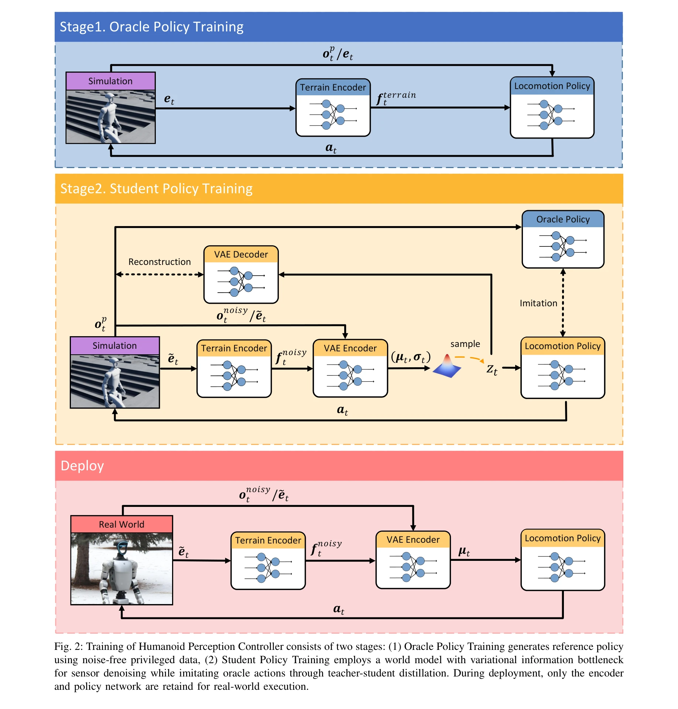

# Learning Perceptive Humanoid Locomotion over Challenging Terrain

> **저자**: Wandong Sun, Baoshi Cao, Long Chen, Yongbo Su, Yang Liu, Zongwu Xie, Hong Liu | **날짜**: 2025-03-02 | **URL**: [https://arxiv.org/abs/2503.00692](https://arxiv.org/abs/2503.00692)

---

## Essence

*Fig. 2: Training of Humanoid Perception Controller consists of two stages: (1) Oracle Policy Training generates referenc*

인형로봇이 노이즈가 있는 센서로부터 지형을 인식하면서 복잡한 지형을 주행할 수 있도록 teacher-student distillation과 variational information bottleneck을 활용한 world model을 결합한 접근법을 제안한다.

## Motivation

- **Known**: 최신 인형로봇 제어기는 proprioception에만 의존하거나 height map을 통합해도 노이즈가 있는 exteroceptive perception을 견고하게 활용하기 어렵다.
- **Gap**: 실제 환경에서 센서 노이즈로 인한 지형 인식 오류를 극복하면서 동시에 높은 수준의 주행 능력을 유지하는 방법이 부족하다.
- **Why**: 인형로봇이 실제 환경에서 인간처럼 다양한 지형을 안전하게 주행하려면 지각 능력과 센서 노이즈 대응이 필수적이기 때문이다.
- **Approach**: Oracle policy는 노이즈 없는 privileged data로 최적 정책을 학습하고, student policy는 variational information bottleneck을 가진 world model로 노이즈를 제거하면서 동시에 oracle policy를 모방하는 teacher-student distillation 프레임워크를 사용한다.

## Achievement

*Fig. 1: Deployment to outdoor environments. We deployed the model in outdoor challenging terrains. Our controller can*

- **2km 주행 성공**: 도시 환경과 야외 환경에서 외부 개입 없이 2km의 다양한 지형을 성공적으로 주행했다.
- **노이즈 견고성**: 신뢰할 수 없는 지형 추정 시나리오에서 성능이 현저히 향상되었다.
- **다양한 지형 적응**: 계단, 거친 포장도로, 자갈, 경사지, 깊은 눈 등 여러 지형 타입을 주행할 수 있다.
- **실시간 배포**: 배포 시 decoder를 제거하고 encoder와 policy만 사용하여 가볍고 빠른 실행이 가능하다.

## How

*Fig. 2: Training of Humanoid Perception Controller consists of two stages: (1) Oracle Policy Training generates referenc*

- Stage 1: Oracle policy를 privileged observation (높이, 위치, 회전, 속도 등 노이즈 없는 데이터)으로 학습하여 최적 reference policy 생성
- Stage 2: Student policy에 VAE encoder-decoder 기반 world model을 통합하여 노이즈가 있는 관측값을 압축 특성으로 변환
- Reconstruction loss와 imitation loss를 함께 최적화하여 입력 품질과 제어 성능을 동시에 향상
- Terrain encoder를 통해 높이 맵을 로봇 중심의 지형 표현으로 변환
- PPO (Proximal Policy Optimization)를 사용하여 policy 최적화

## Originality

- Variational information bottleneck을 활용한 world model을 teacher-student distillation과 결합한 새로운 방식
- Oracle policy의 privileged information을 활용하여 student policy 학습의 참조점 제공하는 구조
- 센서 노이즈 제거(denoising)와 지형 지각 통합을 명시적으로 결합한 방법론
- 배포 시 decoder 제거로 실시간 성능과 경량화를 동시에 달성하는 설계

## Limitation & Further Study

- 시뮬레이션 기반 학습으로 인한 sim-to-real gap이 완전히 제거되지 않을 가능성
- 복잡한 동적 장애물이 있는 환경에서의 성능은 평가되지 않음
- Oracle policy 학습에 필요한 privileged information이 실제 환경에서 어떻게 수집되는지에 대한 설명 부족
- 후속 연구는 더 복잡한 동적 환경, 장시간 자율 주행, 그리고 온라인 adaptation 기법 개발이 필요함

## Evaluation

- Novelty: 4/5
- Technical Soundness: 3/5
- Significance: 4/5
- Clarity: 4/5
- Overall: 4/5

**총평**: 이 논문은 인형로봇의 지형 인식과 센서 노이즈 문제를 teacher-student distillation과 world model로 효과적으로 해결하며, 실제 환경에서 2km 주행이라는 강력한 성과를 달성했다. 방법론의 설명이 명확하고 실증적 검증이 충분하지만, 시뮬레이션 대 실제 환경의 갭을 완전히 극복하는 방법에 대한 더 깊은 논의가 필요하다.

## Related Papers

- 🧪 응용 사례: [[papers/1481_Motus_A_Unified_Latent_Action_World_Model/review]] — 복잡한 지형에서의 인지 기반 이동 제어가 HumanoidPano의 360도 지형 인식과 결합하여 실제 환경 적응 능력을 향상시킬 수 있다
- 🏛 기반 연구: [[papers/1366_Discrete_Diffusion_VLA_Bringing_Discrete_Diffusion_to_Action/review]] — ego-vision world model이 지형 인식 휴머노이드 이동의 세계 모델 기반 인지에 핵심 이론적 기반을 제공한다
- 🔗 후속 연구: [[papers/1449_Hiking_in_the_Wild_A_Scalable_Perceptive_Parkour_Framework_f/review]] — 확장 가능한 인지 파쿠르 프레임워크를 복잡한 지형 이동 학습에 적용하여 다양한 환경 적응 능력을 강화할 수 있다
- 🔄 다른 접근: [[papers/1409_Gait-Adaptive_Perceptive_Humanoid_Locomotion_with_Real-Time/review]] — 둘 다 지형 인식 보행을 다루지만 전자는 실시간 하부 카메라 기반, 후자는 일반적 perceptive locomotion에 집중한다.
- 🔗 후속 연구: [[papers/1411_Gallant_Voxel_Grid-based_Humanoid_Locomotion_and_Local-navig/review]] — Challenging terrain에서의 perceptive humanoid learning이 GR-RL의 장기 복잡 조작을 지형 인식으로 확장한다.
- 🏛 기반 연구: [[papers/1481_Motus_A_Unified_Latent_Action_World_Model/review]] — 복잡한 지형에서의 인지 기반 이동 제어 방법론이 HumanoidPano의 360도 지형 인식 시스템에 직접 적용 가능하다
- 🔗 후속 연구: [[papers/1529_Learning_Humanoid_Locomotion_over_Challenging_Terrain/review]] — 지각 기반 도전적 지형 보행의 기본 개념을 Transformer 기반 sequence modeling으로 더욱 발전시킨 형태임
