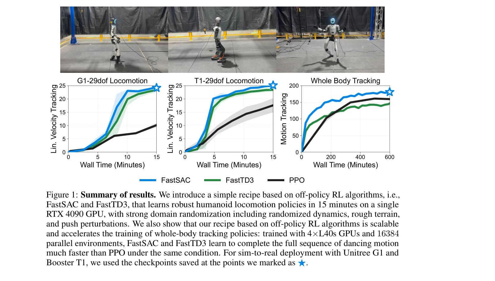
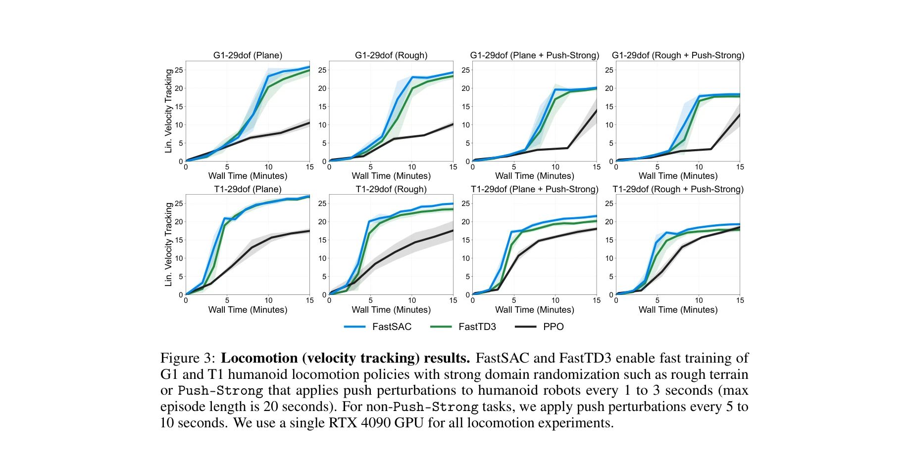
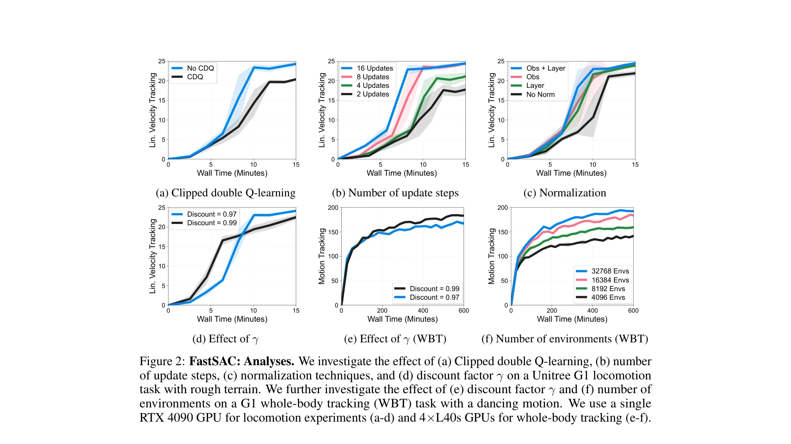

# Learning Sim-to-Real Humanoid Locomotion in 15 Minutes

> **저자**: Younggyo Seo, Carmelo Sferrazza, Juyue Chen, Guanya Shi, Rocky Duan, Pieter Abbeel | **날짜**: 2025-12-01 | **URL**: [https://arxiv.org/abs/2512.01996](https://arxiv.org/abs/2512.01996)

---

## Essence

*Figure 1: Summary of results. We introduce a simple recipe based on off-policy RL algorithms, i.e.,*

이 논문은 FastSAC와 FastTD3 기반의 off-policy RL 알고리즘과 신중하게 조정된 설계 선택사항들을 결합하여 단일 RTX 4090 GPU에서 단 15분 내에 인간형 로봇의 보행 정책을 학습할 수 있는 실용적인 레시피를 제시한다.

## Motivation

- **Known**: 대규모 병렬 시뮬레이션은 RL 학습 시간을 크게 단축했으며, PPO는 병렬 시뮬레이션으로 확장하기 용이한 표준 알고리즘으로 널리 사용되어 왔다. 최근 연구들은 off-policy 알고리즘도 대규모 학습에서 효과적이고 PPO보다 빠를 수 있음을 보였다.
- **Gap**: 높은 차원성, 강력한 domain randomization, 그리고 안정성 문제로 인해 인간형 로봇의 빠르고 신뢰할 수 있는 sim-to-real RL은 여전히 어렵다. 이전 FastTD3 연구는 제한된 관절만을 가진 인간형 로봇에만 적용되었으므로 전신 제어 확장이 필요하다.
- **Why**: 빠른 sim-to-real 반복은 로봇 개발의 반복적 성격으로 인해 실무에서 필수적이며, 15분 내 학습이 가능하면 개발 사이클을 크게 단축할 수 있다.
- **Approach**: FastSAC와 FastTD3의 off-policy RL 알고리즘에 기반하여, 대규모 병렬 환경에서 안정성을 높이기 위한 joint-limit-aware action bounds, 관찰 및 계층 정규화, clipped double Q-learning 등의 설계 선택사항들을 도입하고, 최소한의 보상 함수를 사용한다.

## Achievement

*Figure 3: Locomotion (velocity tracking) results. FastSAC and FastTD3 enable fast training of*

- **15분 내 학습**: 단일 RTX 4090 GPU에서 15분 내에 강력한 domain randomization(무작위 역학, 거친 지형, 밀기 방해)을 포함한 인간형 로봇 보행 정책 학습
- **실제 로봇 배포**: Unitree G1 및 Booster T1 로봇에서 end-to-end 학습된 정책의 성공적인 sim-to-real 전이
- **전신 추적**: 4×L40s GPU를 사용한 대규모 병렬 학습으로 춤 동작 추적 등의 전신 정책도 PPO보다 빠르게 학습
- **우수한 성능**: 다양한 환경(평면, 거친 지형, 밀기 방해)에서 FastSAC/FastTD3가 PPO를 능가하는 성능 달성
- **오픈소스 제공**: Holosoma 저장소에 완전한 코드 및 구현 공개

## How

*Figure 2: FastSAC: Analyses. We investigate the effect of (a) Clipped double Q-learning, (b) number*

- FastSAC와 FastTD3를 기본 알고리즘으로 사용하며 대규모 병렬 시뮬레이션(수천 개 환경)과 함께 확장
- Joint-limit-aware action bounds: 로봇의 관절 제한에 기반하여 Tanh 정책의 action bounds 자동 설정
- 관찰 정규화(observation normalization)와 계층 정규화(layer normalization) 적용하여 고차원 작업에서 안정성 향상
- Clipped double Q-learning을 통해 과적 추정 문제 해결
- 대규모 배치 크기(8K)와 충분한 gradient steps 사용
- 최소한의 보상 함수(minimalist reward function) 설계로 하이퍼파라미터 튜닝 단순화
- Action-rate curriculum을 자동으로 적용하여 안정적이고 저에너지 행동 유도

## Originality

- 기존 FastTD3 연구를 확장하여 전신 인간형 로봇 제어에 처음 성공적으로 적용
- Joint-limit-aware action bounds라는 간단하면서도 효과적인 기법으로 off-policy RL의 안정성 문제 해결
- 계층 정규화를 고차원 로봇 제어에 통합하여 성능 향상
- 최소한의 보상 함수 설계 철학으로 엔지니어링 복잡성을 크게 감소
- 강력한 domain randomization 하에서 15분 내 전체 주기 학습이라는 실질적 성과

## Limitation & Further Study

- 단일 RTX 4090 GPU로의 제한이 있어 더 복잡한 작업이나 더 높은 차원의 제어에는 제약이 있을 수 있음
- 연구가 특정 로봇(Unitree G1, Booster T1)에 중점을 두고 있어 다른 인간형 로봇 플랫폼으로의 일반화 평가 부족
- Reward function이 최소화되어 있지만, 특정 작업에 대한 추가 튜닝이 필요할 수 있는지에 대한 분석 부족
- 후속 연구로 다양한 로봇 형태와 더 복잡한 조작 작업에 대한 확장 필요
- Domain randomization의 범위를 더욱 확대했을 때의 성능 저하 분석 필요

## Evaluation

- Novelty: 4/5
- Technical Soundness: 3/5
- Significance: 4/5
- Clarity: 4/5
- Overall: 4/5

**총평**: 이 논문은 off-policy RL 알고리즘의 신중한 조정과 단순한 설계 선택사항의 조합으로 실용적이고 빠른 sim-to-real 로봇 학습을 달성한 매우 우수한 연구이다. 15분 내 전신 인간형 로봇 제어 정책 학습의 실현은 로봇 개발 분야에서 상당한 실질적 가치를 제공한다.

## Related Papers

- 🏛 기반 연구: [[papers/1396_FastTD3_Simple_Fast_and_Capable_Reinforcement_Learning_for_H/review]] — FastTD3 알고리즘을 기반으로 인간형 로봇의 보행 학습을 15분 내에 완료하는 실용적 레시피를 제공한다.
- 🏛 기반 연구: [[papers/1328_Deep_Reinforcement_Learning_for_Bipedal_Locomotion_A_Brief_S/review]] — Deep RL 기반 이족보행의 기본 원리를 바탕으로 극도로 빠른 학습을 가능하게 하는 최적화 방법을 개발한다.
- 🔗 후속 연구: [[papers/1283_Benchmarking_Humanoid_Imitation_Learning_with_Motion_Difficu/review]] — 인간형 로봇 모션 학습의 벤치마킹 연구를 바탕으로 실제 15분 내 학습이 가능한 구체적 솔루션을 제시한다.
- 🔄 다른 접근: [[papers/1295_Booster_Gym_An_End-to-End_Reinforcement_Learning_Framework_f/review]] — 휴머노이드 보행 학습을 각각 end-to-end 프레임워크와 15분 빠른 학습이라는 다른 접근법으로 해결한다
- 🔄 다른 접근: [[papers/1328_Deep_Reinforcement_Learning_for_Bipedal_Locomotion_A_Brief_S/review]] — 휴머노이드 locomotion 학습을 각각 체계적 분류와 15분 빠른 학습이라는 다른 접근법으로 해결한다
- 🧪 응용 사례: [[papers/1484_MuJoCo_Playground/review]] — 빠른 정책 훈련과 sim-to-real 전이를 가능하게 하는 프레임워크가 실제 humanoid locomotion 학습에 적용된다.
- 🏛 기반 연구: [[papers/1526_Real-World_Humanoid_Locomotion_with_Reinforcement_Learning/review]] — 15분 만에 sim-to-real 보행 학습을 달성한 효율적인 학습 방법론이 대규모 강화학습의 실용적 적용 가능성을 입증함
- 🧪 응용 사례: [[papers/1620_VLA-RL_Towards_Masterful_and_General_Robotic_Manipulation_wi/review]] — RoboAgent의 일반화 능력과 VLA-RL의 강화학습 개선을 결합하여 robust한 조작 정책 학습이 가능하다
- 🔄 다른 접근: [[papers/1610_PHUMA_Physically-Grounded_Humanoid_Locomotion_Dataset/review]] — 15분 만에 sim-to-real 학습을 달성하는 효율적 접근법이 PHUMA의 대규모 데이터 기반 접근법과 대조적이다
- 🔄 다른 접근: [[papers/1477_Humanoid-Gym_Reinforcement_Learning_for_Humanoid_Robot_with/review]] — 둘 다 sim-to-real 휴머노이드 학습을 다루지만 Humanoid-Gym은 범용 프레임워크에, 15분 학습은 빠른 적응에 집중한다
- 🔗 후속 연구: [[papers/1517_Learning_agile_and_dynamic_motor_skills_for_legged_robots/review]] — ANYmal의 민첩한 동작 제어를 위한 sim-to-real 전이 방법이 15분 만에 휴머노이드 locomotion을 학습하는 효율적 전이 기법으로 발전했다.
- 🔄 다른 접근: [[papers/1599_Opening_the_Sim-to-Real_Door_for_Humanoid_Pixel-to-Action_Po/review]] — 같은 sim-to-real 전이 문제를 다루지만 1534는 locomotion, 1599는 manipulation에 특화된 접근
- 🏛 기반 연구: [[papers/1293_A_Distributional_Treatment_of_Real2Sim2Real_for_Object-Centr/review]] — Learning Sim-to-Real Humanoid Locomotion의 15분 학습 방법론이 DLO 조작의 zero-shot 실환경 배포 효율성에 대한 기반 지식을 제공한다.
- 🔗 후속 연구: [[papers/1455_HoRD_Robust_Humanoid_Control_via_History-Conditioned_Reinfor/review]] — 15분 학습의 빠른 sim-to-real을 history conditioning과 결합하여 더 robust하고 효율적인 humanoid control을 달성합니다.
