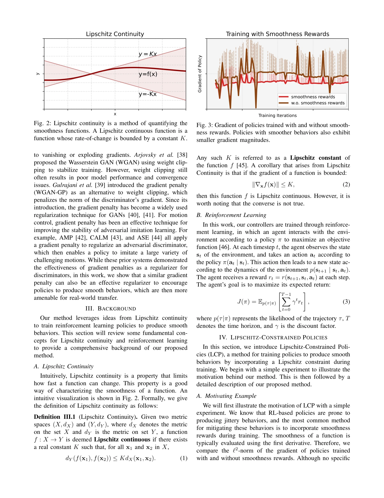
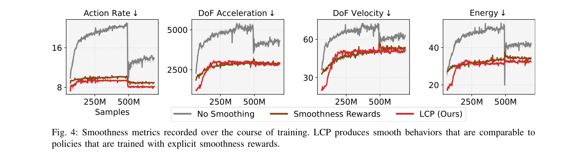

# Learning Smooth Humanoid Locomotion through Lipschitz-Constrained Policies

> **저자**: Zixuan Chen, Xialin He, Yen-Jen Wang, Qiayuan Liao, Yanjie Ze, Zhongyu Li, S. Shankar Sastry, Jiajun Wu, Koushil Sreenath, Saurabh Gupta, Xue Bin Peng | **날짜**: 2024-10-15 | **URL**: [https://arxiv.org/abs/2410.11825](https://arxiv.org/abs/2410.11825)

---

## Essence

*Fig. 2: Lipschitz continuity is a method of quantifying the*

본 논문은 강화학습으로 훈련된 정책에 Lipschitz 제약을 적용하여 부드러운 휴머노이드 로봇 보행 동작을 학습하는 방법을 제안한다. Gradient penalty를 통해 구현된 이 방법은 기존의 평활성 보상이나 저역필터를 대체할 수 있는 미분 가능한 목표함수를 제공한다.

## Motivation

- **Known**: 시뮬레이션에서 훈련된 RL 정책은 실제 로봇 배포 시 jittery한 bang-bang 제어 동작을 보여 sim-to-real 전이 실패의 주요 원인이 된다. 기존에는 평활성 보상과 저역필터를 이용해 이를 완화했으나 두 방법 모두 비미분 가능하고 하이퍼파라미터 튜닝이 필수적이다.
- **Gap**: 기존 평활성 강화 기법들은 로봇 플랫폼마다 광범위한 수동 튜닝을 필요로 하며, 자동 미분 프레임워크와 직접 통합되지 않는다. 따라서 다양한 휴머노이드 로봇에 일반적으로 적용 가능한 미분 가능한 평활성 강제 방법이 부재한다.
- **Why**: 부드러운 정책 동작은 실제 액튜에이터가 생성할 수 있는 토크 범위 내에서 작동하게 하므로 sim-to-real 전이의 성공률을 크게 향상시킨다. 또한 일반화된 평활성 강제 기법은 서로 다른 형태의 여러 휴머노이드 로봇에 쉽게 적용될 수 있다.
- **Approach**: Lipschitz 연속성의 수학적 정의를 활용하여, 정책의 입력(관측)에 대한 출력(동작)의 변화율을 제한하는 gradient penalty를 정책 손실함수에 추가한다. 이는 ||∇_x f(x)|| ≤ K 제약을 gradient penalty로 미분 가능하게 구현하여 기존 RL 프레임워크에 손쉽게 통합할 수 있다.

## Achievement

*Fig. 4: Smoothness metrics recorded over the course of training. LCP produces smooth behaviors that are comparable to*

- **Lipschitz-Constrained Policies (LCP) 제안**: 평활성 보상이나 저역필터 대비 간단하고 일반적이며 미분 가능한 새로운 기법으로, 단 몇 줄의 코드로 구현 가능
- **시뮬레이션 및 실제 로봇 검증**: 여러 휴머노이드 로봇(서로 다른 형태)에서 LCP의 효과를 광범위하게 입증하고 zero-shot 실세계 배포 성공
- **평활성 달성**: Fig. 4에서 보인 것처럼 LCP는 훈련 과정에서 지속적으로 정책의 평활성을 개선하며, Fig. 3과 같이 gradient magnitude 감소를 통해 부드러운 동작 확보
- **강건성 및 범용성**: 외부 힘에 대한 복원력과 불규칙한 지형 주행 능력을 보유하며, 플랫폼별 재튜닝 없이 다양한 휴머노이드에 적용 가능

## How

*Fig. 2: Lipschitz continuity is a method of quantifying the*

- Lipschitz 연속성 정의 활용: ||∇_x f(x)|| ≤ K 제약을 통해 정책 함수의 변화율을 제한
- Gradient penalty 구현: 정책 신경망의 gradient norm에 대한 페널티를 손실함수에 추가하여 미분 가능성 확보
- Teacher-student 프레임워크 적용: 특권 정보에 접근 가능한 teacher 정책으로 full state 정보 활용 후, student 정책을 distillation으로 훈련
- Domain randomization 통합: 시뮬레이션과 실제 환경의 domain gap 감소를 위해 시뮬레이션 매개변수 무작위화
- 기존 RL 프레임워크 통합: 자동 미분(automatic differentiation) 프레임워크와 호환 가능한 구조로 설계되어 기존 훈련 파이프라인에 용이하게 추가

## Originality

- Gradient penalty를 정책 자체의 평활성 강제에 적용한 것은 새로운 시도이며, 기존에는 주로 GAN의 discriminator 정규화에만 사용됨
- Lipschitz 연속성이라는 수학적 개념을 RL 정책의 평활성 강제와 명확하게 연결한 첫 번째 체계적 접근
- 기존의 비미분 가능한 평활성 보상과 저역필터를 대체하는 미분 가능하고 일반화 가능한 단일 기법 제시

## Limitation & Further Study

- Lipschitz 상수 K의 설정 기준이 충분히 상세히 논의되지 않으며, 다양한 로봇 형태에 대한 K 값 선택의 일반적 지침 부재
- 실제 로봇 배포 실험이 제한적일 수 있으며, 더 극단적인 환경(예: 매우 높은 경사도, 동적 장애물)에서의 성능 평가 필요
- Gradient penalty 계산으로 인한 추가 계산 비용의 정량적 분석 및 훈련 시간 비교 부족
- 후속 연구로 LCP와 다른 sim-to-real 기법(예: adversarial learning)의 결합 효과 탐구 가능
- 더 복잡한 태스크(예: 물체 조작, 계단 등반)에서의 LCP 적용성 평가 필요

## Evaluation

- Novelty: 4/5
- Technical Soundness: 3/5
- Significance: 4/5
- Clarity: 4/5
- Overall: 4/5

**총평**: 본 논문은 Lipschitz 연속성이라는 견고한 수학적 기반 위에 gradient penalty를 통해 RL 정책의 평활성을 강제하는 간결하고 실용적인 방법을 제시한다. 시뮬레이션과 실제 로봇에서의 광범위한 검증을 통해 다양한 휴머노이드에 대한 효과를 입증했으며, 기존 기법의 문제점(비미분성, 과도한 튜닝)을 우아하게 해결한 점에서 상당한 기여가 있다.

## Related Papers

- 🏛 기반 연구: [[papers/1578_MoRE_Mixture_of_Residual_Experts_for_Humanoid_Lifelike_Gaits/review]] — 확장 가능한 정책 사전학습에서 제시된 평활성 제약 개념이 Lipschitz 제약을 통한 부드러운 locomotion 학습의 이론적 토대를 제공함
- 🔗 후속 연구: [[papers/1383_End-to-End_Humanoid_Robot_Safe_and_Comfortable_Locomotion_Po/review]] — 강화학습 기반 안전하고 편안한 locomotion 정책의 평활성 보장을 Lipschitz 제약을 통해 수학적으로 더욱 엄밀하게 구현한 발전된 형태임
- 🏛 기반 연구: [[papers/1520_Learning_Bipedal_Locomotion_on_Gear-Driven_Humanoid_Robot_Us/review]] — 고기어비 로봇에서의 부드러운 보행 학습 문제에 Lipschitz 제약 기반 평활성 보장 방법을 적용할 수 있는 이론적 배경을 제공함
- 🔗 후속 연구: [[papers/1520_Learning_Bipedal_Locomotion_on_Gear-Driven_Humanoid_Robot_Us/review]] — Lipschitz 제약을 통한 부드러운 보행 학습 방법을 고기어비 로봇의 토크 센서 부재 문제 해결에 적용할 수 있는 확장 가능성을 제시함
