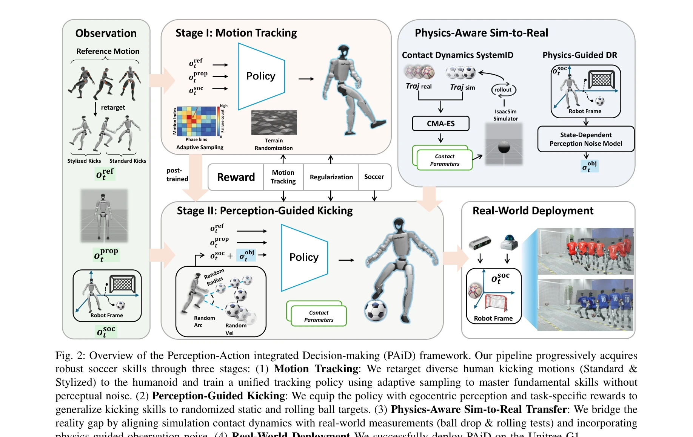

# Learning Soccer Skills for Humanoid Robots: A Progressive Perception-Action Framework

> **저자**: Jipeng Kong, Xinzhe Liu, Yuhang Lin, Jinrui Han, Sören Schwertfeger, Chenjia Bai, Xuelong Li | **날짜**: 2026-02-05 | **DOI**: [10.48550/arXiv.2602.05310](https://doi.org/10.48550/arXiv.2602.05310)

---

## Essence

*Fig. 2: Overview of the Perception-Action integrated Decision-making (PAiD) framework. Our pipeline progressively acquir*

본 논문은 휴머노이드 로봇이 인간과 같은 축구 기술을 습득하도록 하는 PAiD(Perception-Action integrated Decision-making) 프레임워크를 제안한다. 동작 추적, 지각-행동 통합, 물리 기반 시뮬-실제 이전의 세 단계로 구성된 점진적 학습 아키텍처를 통해 보상 충돌을 피하고 안정적인 기술 습득을 실현한다.

## Motivation

- **Known**: 휴머노이드 로봇의 전신 제어는 모듈식 계층적 아키텍처 또는 end-to-end reinforcement learning으로 접근되어 왔으나, 전자는 모듈 간 표현 차이를 초래하고 후자는 상충하는 보상 간 훈련 불안정성을 야기한다. 축구는 동적 지각, 전신 제어, 정확한 킹 실행이 통합되어야 하는 복잡한 과제이다.
- **Gap**: 기존 방법들은 모듈식 파이프라인에서의 모듈 간 불안정성이나 end-to-end 프레임워크에서의 상충하는 훈련 목표를 해결하지 못한다. 또한 인간과 같은 킹 자세를 재현하는 능력과 물리적 격차를 효율적으로 해소하는 방법이 부족하다.
- **Why**: 축구는 휴머노이드 로봇의 통합 지각-행동 능력을 평가하는 벤치마크로서, 단순 이동과 달리 동적 환경 적응이 필수적이다. 대규모 휴머노이드 플랫폼에서의 전신 균형 유지와 인간 같은 동작 실현은 중력·관성 효과로 인해 더욱 도전적이다.
- **Approach**: PAiD는 복잡한 행동을 단일 최적화 문제로 처리하지 않고 세 단계 커리큘럼으로 분해한다: (1) 인간 모션 추적을 통한 기초 킹 기술 습득, (2) 경량 지각 모듈로 위치 일반화, (3) 물리 기반 시뮬-실제 이전을 통해 단계별 안정성을 확보하고 보상 충돌을 회피한다.

## Achievement

*Fig. 4: Quantitative analysis of soccer shooting proficiency across the workspace. The heatmaps visualize the spatial di*

- **인간과 같은 동작 재현**: Unitree G1에서 인간 축구선수의 동작 생역학을 고충실도로 복제하며, 운동학적 궤적이 인간 선수 동작과 밀접하게 일치
- **높은 킹 성공률**: 다양한 볼 위치, 조명 변화, 물리적 교란 조건에서 91.3% 킹 성공률 달성
- **다중 환경 강건성**: 정적/구르는 볼, 다양한 위치, 외부 교란에서 견고한 성능을 유지하며 실내·실외 환경에서 일관된 실행
- **효율적 시뮬-실제 이전**: 물리 정렬 전략이 기준선 대비 우수한 샘플 효율성을 달성하며 다양한 표면에서 성능 일관성 유지

## How

*Fig. 2: Overview of the Perception-Action integrated Decision-making (PAiD) framework. Our pipeline progressively acquir*

- **Motion Tracking Stage**: 인간 축구선수로부터 mocap 데이터를 수집하여 humanoid에 retarget하고, motion tracking reward와 terrain randomization을 통해 지각 노이즈 없이 안정적인 킹 기술 습득
- **Adaptive Sampling**: 모션 학습 단계에서 위상 기반 적응형 샘플링을 도입하여 특정 위상 구간의 실패 빈도에 따라 샘플링 확률을 동적 조정
- **Perception-Guided Kicking**: 기학습된 킹 정책에 egocentric perception (시각 및 레이더 기반)을 추가하고 경량의 목표 달성 보상으로 볼 추적 및 위치 일반화 학습
- **Physics-Aware Sim-to-Real Transfer**: 볼 낙하 및 굴림 테스트를 통해 시뮬레이션의 접촉 동역학(restitution, friction) 파라미터 식별 및 반복적 정렬, CMA-ES 최적화로 실제 궤적과 시뮬레이션 궤적 간 오차 최소화
- **State-Dependent Perception Noise Model**: 실제 지각의 변동성을 모델링하여 domain randomization에 통합, 시뮬-실제 갭 완화

## Originality

- **점진적 분해 전략**: 기존의 단일 단계 end-to-end 또는 모듈식 접근과 달리, 세 단계의 명확한 분리로 보상 충돌을 회피하고 각 단계별 안정성 확보
- **경량 지각 통합**: 전체 policy를 재학습하지 않고 기학습된 킹 정책에 최소한의 지각 모듈만 추가하여 효율적 적응
- **물리 기반 정렬 방법**: 단순 domain randomization이 아닌 실제 측정값(볼 낙하, 굴림)을 기반으로 시뮬레이션 접촉 파라미터를 반복적으로 정렬하는 systematic approach
- **다양한 킹 스타일 학습**: 표준 킹뿐 아니라 전문 선수의 스타일화된 킹을 학습하여 표현력 확대

## Limitation & Further Study

- **단일 로봇 플랫폼**: Unitree G1에만 검증되었으며 다른 휴머노이드 플랫폼(Atlas, Unitree H1 등)에의 일반화 가능성 미검증
- **제한된 환경**: 실내·실외 환경에서의 테스트는 진행되었으나, 극한 기후(눈, 매우 습한 환경) 또는 매우 불규칙한 지형에서의 성능 미평가
- **지각 센서 의존성**: 시각 및 레이더 기반 로컬라이제이션에 의존하며, 이들 센서의 실패 상황(GPS 미약 환경, 강한 LED 조명)에서의 견고성 미검토
- **시간 제약**: 논문에서 실시간 추론 지연시간(latency)이 명시되지 않아, 동적 환경에서의 반응성 평가 불완전
- **후속 연구**: (1) 다양한 휴머노이드 로봇으로의 이전 및 일반화 능력 검증, (2) 센서 오류 및 고장에 대한 견고성 강화, (3) 실시간 성능 최적화 및 embedded deployment 개선, (4) 팀 기반 축구 시나리오로의 확장

## Evaluation

- Novelty: 4/5
- Technical Soundness: 3/5
- Significance: 4/5
- Clarity: 4/5
- Overall: 4/5

**총평**: 본 논문은 휴머노이드 로봇의 복합 스킬 습득을 위한 point progressive한 프레임워크를 제시하며, 보상 충돌 회피와 안정적 기초 스킬 확보라는 명확한 문제 인식 하에 세 단계 분해 전략을 제안한다. Unitree G1에서의 높은 성공률과 강건성은 실제 로봇 적용의 가능성을 보여주지만, 단일 플랫폼 검증과 센서 견고성 미검토는 일반화 가능성 평가의 제약요소이다.

## Related Papers

- 🔗 후속 연구: [[papers/1547_Learning_Vision-Driven_Reactive_Soccer_Skills_for_Humanoid_R/review]] — 시각 기반 반응형 축구 기술의 기본 아이디어를 점진적 지각-행동 통합이라는 체계적인 학습 프레임워크로 발전시킨 형태임
- 🏛 기반 연구: [[papers/1518_Learning_Agile_Striker_Skills_for_Humanoid_Soccer_Robots_fro/review]] — PAiD 프레임워크의 점진적 학습 아키텍처가 축구 로봇의 견고한 볼 킥킹 능력 습득에 이론적 토대를 제공함
- 🔄 다른 접근: [[papers/1358_Dribble_Master_Learning_Agile_Humanoid_Dribbling_through_Leg/review]] — 두 논문 모두 휴머노이드 축구 기술을 다루지만, 통합적 점진적 학습 vs 드리블 특화 학습이라는 서로 다른 접근법을 제시함
- 🏛 기반 연구: [[papers/1518_Learning_Agile_Striker_Skills_for_Humanoid_Soccer_Robots_fro/review]] — 휴머노이드 축구 기술 학습을 위한 점진적 지각-행동 통합 프레임워크의 이론적 토대를 제공함
- 🏛 기반 연구: [[papers/1547_Learning_Vision-Driven_Reactive_Soccer_Skills_for_Humanoid_R/review]] — 시각 기반 반응형 축구 기술이 PAiD 프레임워크의 지각-행동 통합 아키텍처의 구체적인 적용 사례로서 이론적 토대를 제공함
