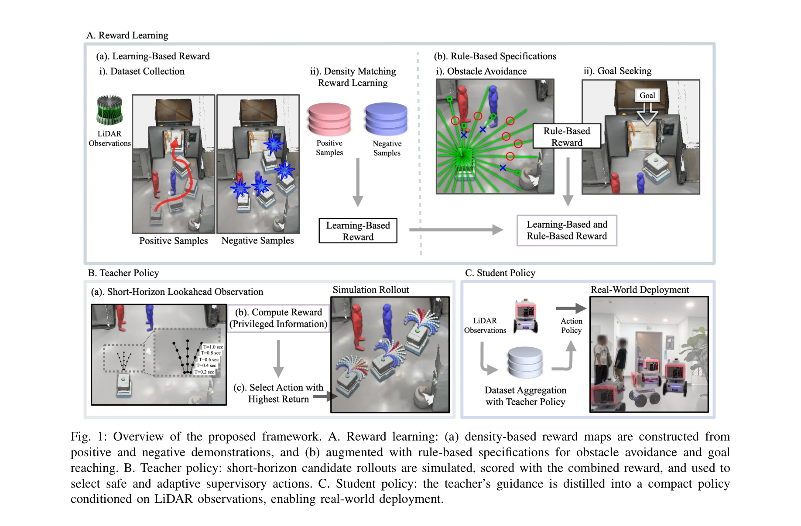
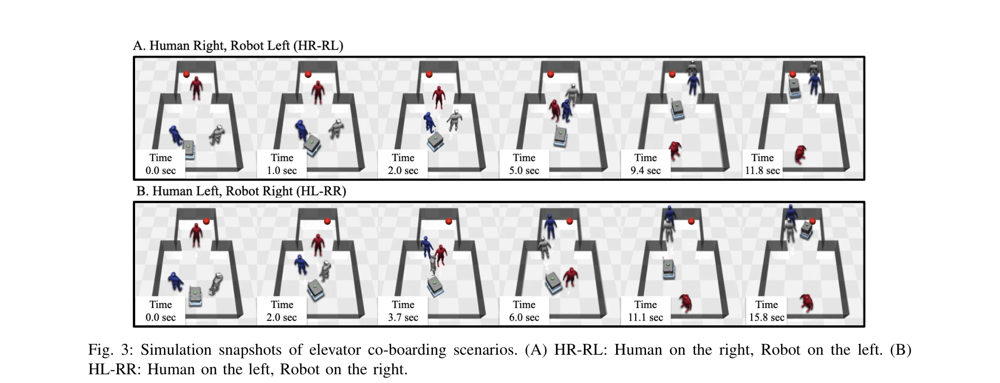

# Learning Social Navigation from Positive and Negative Demonstrations and Rule-Based Specifications

> **저자**: Chanwoo Kim, Jihwan Yoon, Hyeonseong Kim, Taemoon Jeong, Changwoo Yoo, Seungbeen Lee, Soohwan Byeon, Hoon Chung, Matthew Pan, Jean Oh, Kyungjae Lee, Sungjoon Choi | **날짜**: 2025-10-14 | **URL**: [https://arxiv.org/abs/2510.12215](https://arxiv.org/abs/2510.12215)

---

## Essence

*Fig. 1: Overview of the proposed framework. A. Reward learning: (a) density-based reward maps are constructed from*

본 논문은 긍정 및 부정 시연(demonstration)에서 학습한 밀도 기반 보상(density-based reward)을 규칙 기반 목표(rule-based objectives)와 결합하여 동적 인간 환경에서 안전성과 적응성의 균형을 이루는 모바일 로봇 네비게이션 정책을 제시한다. Teacher-student 구조를 통해 감독 신호를 생성하고 실시간 배포를 위해 콤팩트한 학생 정책으로 증류(distillation)한다.

## Motivation

- **Known**: 고전적 네비게이션 방법은 명확한 안전 보장을 제공하지만 손수 설계된 규칙에 의존하여 일반화가 어렵고, 강화학습 기반 방법은 적응성이 뛰어나지만 광범위한 보상 설계와 큰 훈련 비용이 필요하며, 모방학습은 데이터 효율적이지만 분포 변화에 취약하다.
- **Gap**: 기존 하이브리드 접근법은 학습과 규칙 기반 모듈을 통합하지만 여전히 손수 설계된 로직에 의존하고 단순화된 환경에서만 평가된다. 실제 동적 인간 환경에서 밀도 기반 학습과 명시적 안전 사양을 효과적으로 결합한 프레임워크의 부재가 있다.
- **Why**: 모바일 로봇의 실제 배포는 안전 제약을 준수하면서도 다양한 인간 행동에 적응해야 하는 상충하는 요구사항을 동시에 만족해야 하며, 이는 실시간 성능과 신뢰성이 중요한 혼잡한 환경에서 특히 중대하다.
- **Approach**: 본 논문은 긍정 및 부정 시연으로부터 밀도 기반 보상을 학습하고 장애물 회피 및 목표 도달을 위한 규칙 기반 항(term)으로 증강한다. 샘플링 기반 lookahead controller를 사용하여 보상을 평가하고 가장 높은 수익(return)을 가진 행동을 선택한 후, 이를 관찰만으로 조정되는 콤팩트한 학생 정책으로 증류하며 불확실성 추정을 포함한다.

## Achievement

*Fig. 3: Simulation snapshots of elevator co-boarding scenarios. (A) HR-RL: Human on the right, Robot on the left. (B)*

- **밀도 기반 보상 공식화**: 긍정과 부정 시연으로부터 state-action 밀도 일치를 통해 학습된 보상을 장애물 회피 및 목표 진행을 위한 규칙 기반 목표와 통합
- **Teacher-student 증류 프레임워크**: privileged information(forward simulation)을 활용하는 teacher 정책에서 관찰 조건부 student 정책으로의 효율적인 증류, 불확실성 추정 포함
- **종합적 평가**: 합성 및 엘리베이터 동승 시뮬레이션에서 기준 대비 성공률과 시간 효율성에서 일관된 향상, 인간 참여자와의 실제 시연으로 배포 실용성 검증

## How

*Fig. 1: Overview of the proposed framework. A. Reward learning: (a) density-based reward maps are constructed from*

- Density-matching optimization을 통해 경험적 state-action 밀도 ˆµ를 최대화하는 보상 R 학습 (식 4-5)
- 부정 시연에 대해 occupancy 기반 마스킹 또는 역 보상(negative reward) 적용하여 회피 대상 행동 패턴 인코딩
- Rule-based 목표 함수로 obstacle distance penalty, goal distance reward, progress incentive 추가
- Sampling-based lookahead controller에서 이산화된 속도 명령 샘플에 대해 짧은 지평선(short-horizon) rollout 시뮬레이션 수행
- Behavior cloning 또는 DAgger 유사 절차를 통해 teacher 정책의 상태-행동 쌍으로부터 neural network 기반 student 정책 학습
- Monte Carlo dropout 또는 ensemble 방법으로 학생 정책의 불확실성 추정 구현

## Originality

- 긍정 및 부정 시연을 모두 활용한 밀도 기반 보상 학습의 명확한 통합 - 기존 대부분의 모방학습은 양질의 시연만 사용
- Density-matching과 rule-based objectives의 직접적인 결합으로 data-driven 적응성과 명시적 안전 보장의 균형 달성
- Teacher-student 증류 구조에서 forward simulation 기반 감독을 관찰 조건부 정책으로 변환하면서 불확실성 추정 유지
- 실제 인간 참여자가 포함된 엘리베이터 동승 시나리오에서의 검증 - 대부분의 기존 연구는 에이전트 시뮬레이션에만 의존

## Limitation & Further Study

- Lookahead controller의 계산 비용이 임베디드 플랫폼에서 높을 수 있으며, teacher 정책이 physics simulator에 의존하므로 현실-시뮬레이션 갭에 취약
- 학습된 밀도 보상의 해석 가능성 부족 - 어떤 시연 특성이 최종 정책에 반영되는지 명확하지 않음
- 부정 시연의 품질과 양에 따른 감도 분석이 부재하며, 극도로 혼잡한 환경에서의 성능이 평가되지 않음
- 불확실성 추정의 유효성(calibration) 검증 필요 - 실제 네비게이션 오류와 예측 불확실성의 상관관계 미명시
- 후속연구로 온라인 학습 능력, 다양한 로봇 플랫폼으로의 일반화, 그리고 대규모 실제 사람 데이터셋을 통한 검증 필요

## Evaluation

- Novelty: 4/5
- Technical Soundness: 3/5
- Significance: 4/5
- Clarity: 4/5
- Overall: 4/5

**총평**: 본 논문은 데이터 기반 보상과 규칙 기반 안전 사양의 균형 있는 통합을 통해 실제 동적 환경에서의 로봇 네비게이션 문제에 대한 실용적이고 창의적인 해결책을 제시하며, 시뮬레이션과 실제 인간 실험을 통한 검증으로 높은 신뢰성을 보여준다. 다만 계산 효율성, 현실-시뮬레이션 갭, 그리고 부정 시연의 활용 메커니즘에 대한 심화 분석이 보강되면 더욱 완성도 높은 연구가 될 것으로 예상된다.

## Related Papers

- 🏛 기반 연구: [[papers/1326_CANVAS_Commonsense-Aware_Navigation_System_for_Intuitive_Hum/review]] — CANVAS의 상식 기반 내비게이션 시스템이 사회적 내비게이션에서 인간과의 상호작용을 이해하는 이론적 배경을 제공함
- 🔗 후속 연구: [[papers/1402_FocusNav_Spatial_Selective_Attention_with_Waypoint_Guidance/review]] — FocusNav의 waypoint guidance 개념을 긍정/부정 시연 기반 밀도 보상과 결합하여 사회적 환경에 특화시킨 발전된 형태임
- 🔄 다른 접근: [[papers/1575_Mobile-TeleVision_Predictive_Motion_Priors_for_Humanoid_Whol/review]] — 두 논문 모두 향상된 waypoint 기반 내비게이션을 다루지만, 사회적 시연 학습 vs 백트래킹 메커니즘이라는 서로 다른 접근법을 제시함
- 🔗 후속 연구: [[papers/1496_Octo_An_Open-Source_Generalist_Robot_Policy/review]] — RoboCat의 self-improving generalist agent와 Octo의 generalist robot policy가 범용 로봇 정책의 발전된 형태를 제시한다.
