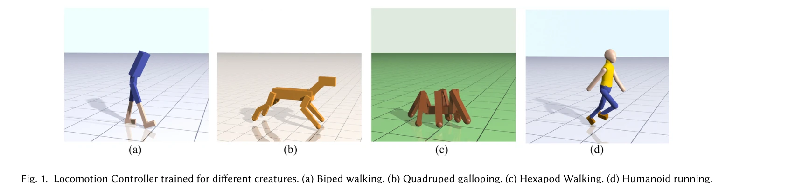

# Learning Symmetric and Low-energy Locomotion

> **저자**: Wenhao Yu, Greg Turk, C. Karen Liu | **날짜**: 2018-01-24 | **URL**: [https://arxiv.org/abs/1801.08093](https://arxiv.org/abs/1801.08093)

---

## Essence

*Fig. 1. Locomotion Controller trained for different creatures. (a) Biped walking. (b) Quadruped galloping. (c) Hexapod W*

Deep reinforcement learning에 기반하여 동작 캡처 데이터나 형태학적 지식 없이 대칭적이고 저에너지의 자연스러운 보행 운동을 자동으로 학습하는 방법을 제안한다. Mirror symmetry loss와 curriculum learning을 결합하여 다양한 형태의 캐릭터(이족보행, 사족동물, 육족동물)에서 생물학적으로 타당한 보행을 생성한다.

## Motivation

- **Known**: Deep reinforcement learning은 복잡한 제어 정책을 자동으로 학습할 수 있으나, 기존 DRL 방법으로 생성된 보행은 부자연스럽고 에너지 소비가 많다. 동작 캡처 데이터나 finite state machine을 이용하면 자연스러운 보행을 생성할 수 있지만 일반화 가능성이 제한된다.
- **Gap**: 기존 DRL 기반 보행 학습은 과도한 에너지 사용과 비대칭적 동작을 생성하는 문제가 있으며, 동시에 동작 데이터나 형태학적 지식에 의존하지 않으면서도 자연스러운 보행을 학습하는 방법이 부족하다.
- **Why**: 자연스럽고 저에너지 보행 운동은 애니메이션, 로보틱스, 시뮬레이션 분야에서 필수적이며, 다양한 형태의 캐릭터에 적용 가능한 일반적인 학습 방법은 실용적 가치가 크다.
- **Approach**: Loss function에 mirror symmetry term을 도입하여 쌍을 이루는 사지의 제어 대칭성을 직접 강제하고, curriculum learning을 통해 점진적으로 감소하는 물리적 보조를 제공하여 에너지 페널티를 강화하면서도 안정적인 학습을 가능하게 한다.

## Achievement

- **대칭적 보행 생성**: 완벽하게 대칭인 형태의 캐릭터에서 자동으로 대칭적인 보행이 생성되며, 생물역학 문헌의 관찰과 일치한다.
- **저에너지 운동**: 기존 DRL 방법 대비 현저히 낮은 에너지 소비를 달성하면서 안정적인 보행을 유지한다.
- **형태학 무관성**: 동작 캡처나 형태학적 지식 없이 이족보행, 전신 휴머노이드, 사족동물, 육족동물 등 다양한 형태에 동일한 방법론을 적용할 수 있다.
- **속도별 보행 패턴 출현**: 동작 예시나 접촉 계획 없이도 속도에 적절한 보행 패턴(걷기, 트로팅, 갤러핑 등)이 자동으로 나타난다.

## How

*Fig. 2. (a) The learner-centered curriculum determines the lessons adap-*

- Policy learning 목적함수에 mirror symmetry loss 항 추가: 대칭인 관절 쌍에 대해 학습된 제어 정책의 차이를 직접 페널티
- Learner-centered curriculum learning 방식 도입: 현재 학습 수준에 맞는 물리적 보조력(측면 균형 및 전진 운동)을 자동으로 계산하고 제공
- 점진적 보조 감소: Curriculum을 통해 보조력을 단계적으로 감소시켜 최종적으로 외부 도움 없이 독립적 보행 학습
- 에너지 페널티 강화: Curriculum으로 안정성을 확보하면서 reward function의 에너지 항 가중치를 높게 설정
- 정책 기반 대칭성 측정: 상태의 대칭성이 아닌 정책(행동)의 대칭성을 측정하여 학습 초기 비주기적 동작 단계에서도 효과적

## Originality

- Loss function 기반 mirror symmetry 도입: 기존 reward shaping 대신 목적함수에 직접 대칭성 제약을 추가하는 새로운 접근
- Learner-centered curriculum: 고정된 커리큘럼이 아니라 학습자의 현재 능력에 적응하는 동적 보조 시스템 설계
- 행동 대칭성 측정: 상태 기반이 아닌 정책 행동 기반의 대칭성 정의로 학습 초기 단계에서의 문제 해결
- 최소주의적 설계: 동작 데이터, FSM, 형태학적 지식 모두 제거하면서도 자연스러운 결과 달성

## Limitation & Further Study

- 평가 지표의 제한성: 생성된 보행의 자연스러움을 주로 정성적으로 평가하며, 정량적 생물역학 지표와의 비교가 부족
- 학습 복잡도 분석 부족: Curriculum 유무에 따른 수렴 속도, 샘플 효율성 등 정량적 학습 특성 분석이 제한적
- 형태학적 다양성의 범위: 테스트된 형태가 제한적이며, 더 복잡한 근골격 구조나 비표준 형태에 대한 적용 가능성 불명확
- 실시간 성능: 학습된 정책의 실제 로봇이나 고사양 그래픽 환경에서의 실시간 수행 능력에 대한 언급 부재
- **후속 연구 방향**: 더 복잡한 지형, 방향 전환, 계단 등 다양한 환경에서의 보행 학습; 실제 생물역학 데이터와의 정량적 비교; 근육 모델 기반 더 현실적인 시뮬레이션; 다중 태스크 학습으로의 확장

## Evaluation

- Novelty: 4/5
- Technical Soundness: 3/5
- Significance: 4/5
- Clarity: 4/5
- Overall: 4/5

**총평**: 본 논문은 DRL 기반 보행 학습의 오래된 문제들(부자연스러움, 고에너지 소비, 비대칭성)을 우아하게 해결하면서도 동작 캡처나 형태학적 지식 의존성을 완전히 제거한 혁신적 방법을 제시한다. Mirror symmetry loss와 curriculum learning의 조합은 독창적이며, 다양한 형태의 캐릭터에 대한 일반화 가능성은 높은 실용적 가치를 제공한다.

## Related Papers

- 🏛 기반 연구: [[papers/1267_AMP_Adversarial_Motion_Priors_for_Stylized_Physics-Based_Cha/review]] — AMP의 adversarial motion prior 개념을 확장하여 대칭성과 에너지 효율성을 명시적으로 고려한 자연스러운 보행을 생성한다.
- 🏛 기반 연구: [[papers/1330_DeepMimic_Example-Guided_Deep_Reinforcement_Learning_of_Phys/review]] — DeepMimic의 physics-based 캐릭터 제어 방법론을 기반으로 동작 캡처 없이도 생물학적으로 타당한 보행을 학습한다.
- 🔗 후속 연구: [[papers/1275_ASE_Large-Scale_Reusable_Adversarial_Skill_Embeddings_for_Ph/review]] — ASE의 adversarial skill embedding을 바탕으로 대칭성과 저에너지라는 특정 제약을 추가한 보행 학습을 수행한다.
