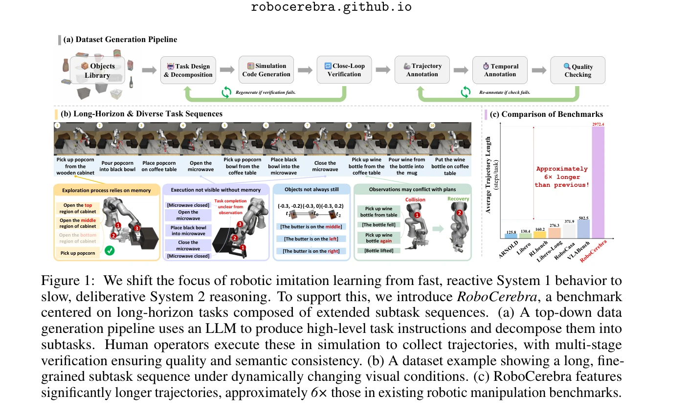
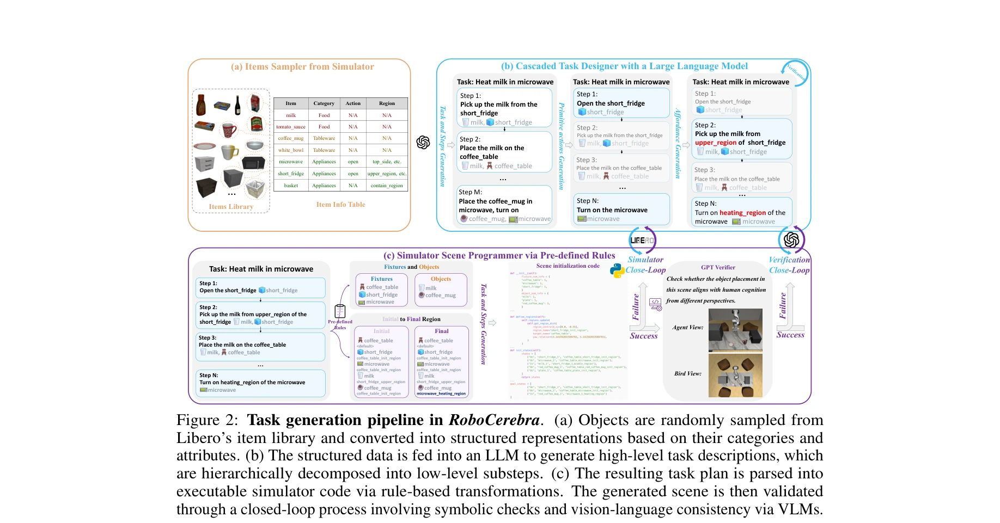

# RoboCerebra: A Large-scale Benchmark for Long-horizon Robotic Manipulation Evaluation

> **저자**: Songhao Han, Boxiang Qiu, Yue Liao, Siyuan Huang, Chen Gao, Shuicheng Yan, Si Liu | **날짜**: 2025-06-07 | **URL**: [https://arxiv.org/abs/2506.06677](https://arxiv.org/abs/2506.06677)

---

## Essence

*Figure 1: We shift the focus of robotic imitation learning from fast, reactive System 1 behavior to*

RoboCerebra는 장기간 로봇 조작 작업 평가를 위한 대규모 벤치마크로, VLM의 System 2 (deliberative reasoning) 능력을 활용한 계층적 계획-실행 프레임워크를 제안한다.

## Motivation

- **Known**: 최근 VLM 기반 로봇 시스템은 일반화 성능을 개선했으나, 대부분의 기존 연구는 반응형 System 1 정책에 집중하고 있다. 기존 벤치마크는 시간 규모와 구조적 복잡성이 제한적이다.
- **Gap**: VLM의 의미론적 추론과 장기 계획 능력(System 2)은 충분히 탐색되지 않았으며, 현재 벤치마크는 장기 지평선 작업의 복잡성을 반영하기에 부족하다. 특히 메모리 의존성과 동적 장면 변화가 결여되어 있다.
- **Why**: 실세계 로봇 작업은 복잡한 목표 분해, 시간적 추상화, 적응형 계획을 요구하므로, System 2 능력의 종합적 평가가 필요하다. 이는 더 유능하고 일반화 가능한 로봇 계획자 개발을 촉진한다.
- **Approach**: GPT를 이용한 상향식 데이터 생성 파이프라인으로 고수준 작업 명령과 세부 작업 분해를 생성하고, 시뮬레이션에서 인간 조작자가 동적 변화를 포함한 궤적을 수집한다. System 2–System 1 상호작용을 통한 계층적 평가 프로토콜을 설계한다.

## Achievement

*Figure 1: We shift the focus of robotic imitation learning from fast, reactive System 1 behavior to*

- **확장된 데이터 규모**: 기존 벤치마크 대비 약 6배 긴 행동 시퀀스(평균 502.5 steps)와 밀도 높은 subtask 주석을 포함한 1,000개 훈련 작업 및 60개 테스트 작업
- **구조화된 평가 프로토콜**: 계획(planning), 반성(reflection), 메모리(memory) 세 가지 인지 차원을 통해 System 2 능력을 체계적으로 측정
- **계층적 계획-실행 프레임워크(HPE)**: 고수준 VLM 플래너와 저수준 VLA 컨트롤러를 결합하여 의미론적 추론과 정밀 제어를 통합
- **동적 장면 변화 및 메모리 요구 작업**: 기존 벤치마크에서 결여된 현실적 복잡성을 도입하여 실제 로봇 작업 조건 반영

## How

*Figure 2: Task generation pipeline in RoboCerebra. (a) Objects are randomly sampled from*

- GPT 프롬프팅을 통해 환경 맥락 기반 고수준 작업 지시 생성 및 일관성 있는 subtask 시퀀스로 분해
- 시뮬레이션 환경에서 인간 조작자 기반 궤적 수집 및 다단계 검증(object library, task design, simulation code generation, close-loop verification, trajectory annotation, temporal annotation, quality checking)
- 동적 객체 변화 도입으로 semantic diversity 증대 및 장기 시간 의존성 촉진
- VLA 모델을 고정된 System 1 컨트롤러로 훈련 후, 구조화된 System 1–System 2 상호작용을 통해 planning/reflection/memory 차원별 평가
- GPT-4o, Qwen2.5-VL, LLaVA-Next-Video 등 최신 VLM을 System 2 모듈로 벤치마킹하여 인지 차원 분석

## Originality

- System 1–System 2 이분법 프레임워크를 로봇 조작에 명시적으로 적용하여 VLM의 deliberative reasoning 능력 강조
- LLM 생성 작업과 인간 실행 궤적을 결합한 하이브리드 데이터 생성 파이프선으로 대규모 고품질 dataset 구성
- 계획, 반성, 메모리라는 구체적인 인지 차원을 통한 System 2 평가 프로토콜의 설계
- 기존 벤치마크 대비 6배 장기 행동 시퀀스와 동적 장면 변화, 시간 주석, 세밀한 분해 등 다면적 특징 통합

## Limitation & Further Study

- 시뮬레이션 환경에서만 평가되어 sim-to-real gap이 존재; 실제 로봇에 대한 검증 부재
- GPT 기반 작업 생성이 가능한 bias를 도입할 수 있으며, 생성된 작업의 다양성이 제한적일 수 있음
- 평가 대상 VLM이 제한적(GPT-4o, Qwen2.5-VL, LLaVA-Next-Video)이며, 최신 모델 추가 벤치마킹 필요
- 메모리 메커니즘의 구현이 간단한 memory bank 형태로, 더 복잡한 기억 구조 탐색 필요
- **후속 연구**: (1) 실제 로봇 환경에서의 검증, (2) 더 정교한 메모리 및 reflection 메커니즘 개발, (3) 다양한 도메인(manipulating soft objects, outdoor tasks)으로 확장, (4) 더 강력한 System 2 모듈 개발

## Evaluation

- Novelty: 4/5
- Technical Soundness: 3/5
- Significance: 4/5
- Clarity: 4/5
- Overall: 4/5

**총평**: RoboCerebra는 VLM의 System 2 능력을 평가하기 위한 첫 대규모 벤치마크로서, 기존 장기 로봇 조작 벤치마크의 한계를 명확히 지적하고 체계적인 데이터 및 평가 프로토콜을 제시한다. 다만 시뮬레이션 환경 제한과 실제 로봇 적용 검증 부재가 실용성 측면의 과제이다.

## Related Papers

- 🔗 후속 연구: [[papers/1410_GR-3_Technical_Report/review]] — GR-3의 technical report가 RoboCerebra의 장기간 조작 작업 벤치마크를 더 발전된 모델로 확장한다.
- 🏛 기반 연구: [[papers/1578_MoRE_Mixture_of_Residual_Experts_for_Humanoid_Lifelike_Gaits/review]] — SPRINT의 scalable policy pre-training이 RoboCerebra의 hierarchical planning-execution framework의 기초 방법론을 제공한다.
- 🔄 다른 접근: [[papers/1556_RT-H_Action_Hierarchies_Using_Language/review]] — RT-H의 언어 기반 행동 계층과 RoboCerebra의 VLM System 2 reasoning은 모두 복잡한 조작 작업을 위한 서로 다른 계층적 접근법이다.
- 🔄 다른 접근: [[papers/1556_RT-H_Action_Hierarchies_Using_Language/review]] — RoboCerebra의 VLM deliberative reasoning과 RT-H의 언어 기반 행동 계층은 모두 복잡한 조작 작업을 위한 서로 다른 계층적 접근법이다.
