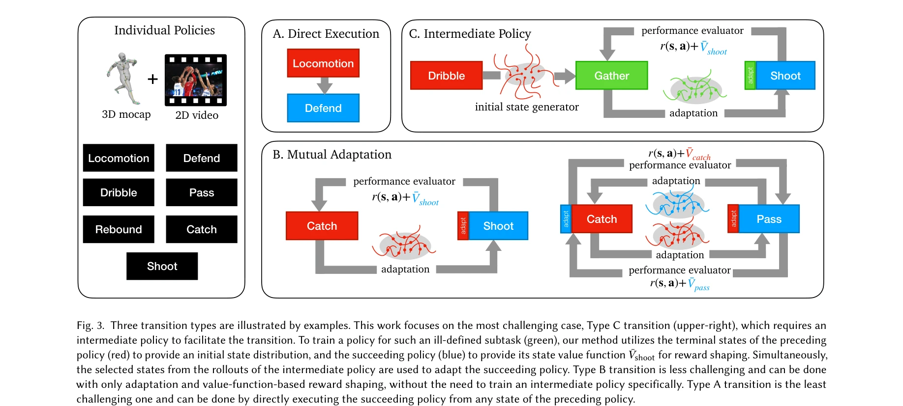
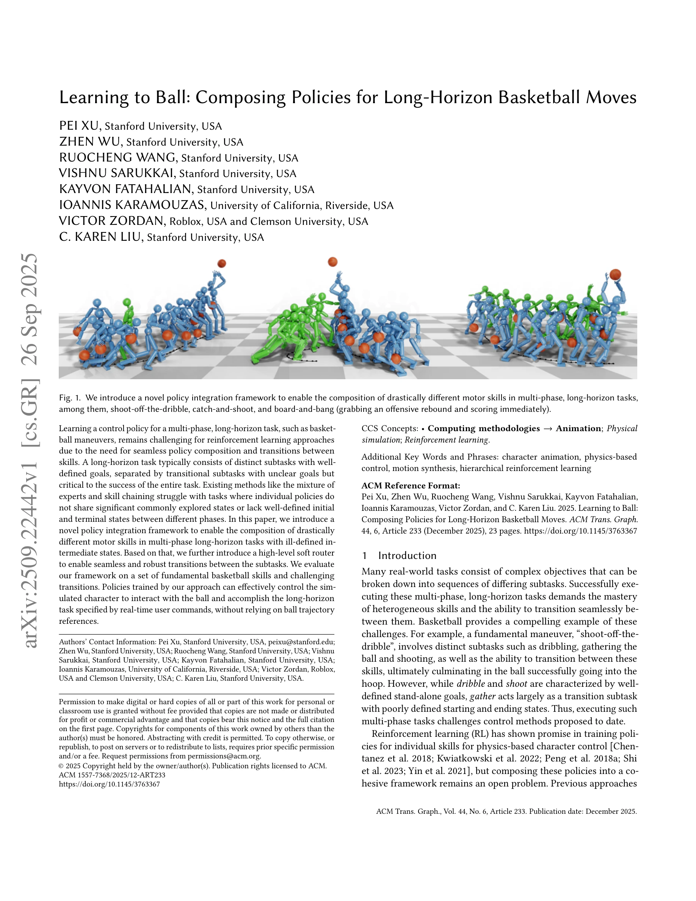

# Learning to Ball: Composing Policies for Long-Horizon Basketball Moves

> **저자**: Pei Xu, Zhen Wu, Ruocheng Wang, Vishnu Sarukkai, Kayvon Fatahalian, Ioannis Karamouzas, Victor Zordan, C. Karen Liu | **날짜**: 2025-09-26 | **URL**: [https://arxiv.org/abs/2509.22442](https://arxiv.org/abs/2509.22442)

---

## Essence

*Figure 4 shows our system architecture for primitive policy learn-*

본 논문은 농구 동작과 같은 다단계 장기 과제에서 서로 다른 모터 스킬들을 seamlessly 구성하기 위해 policy integration framework를 제안한다. 이는 중간 상태가 명확하지 않은 전이 서브태스크를 well-defined 된 서브태스크의 정책으로 guided training하여 해결한다.

## Motivation

- **Known**: Reinforcement learning은 개별 스킬에 대한 정책 학습에 성공했으나, mixture of experts와 skill chaining 같은 기존 방법들은 공유 상태가 부족하거나 명확한 초기/종료 상태가 없는 다단계 장기 과제에서 어려움을 겪는다.
- **Gap**: 특히 dribbling과 shooting 사이의 gathering 같은 중간 전이 서브태스크는 well-defined 된 목표가 없어 기존의 reward function 기반 방법으로는 효과적인 정책을 학습하기 어렵다.
- **Why**: 농구 같은 실제 다단계 작업은 이질적인 스킬의 seamless한 구성과 robust한 전이를 요구하며, 이를 해결하면 character animation과 physics-based control의 응용 범위를 크게 확장할 수 있다.
- **Approach**: Well-defined 된 서브태스크 A, C의 정책을 먼저 학습하고, ill-defined 된 중간 서브태스크 B를 A의 초기 상태 분포와 C의 state value function으로 guided training하며, 동시에 C를 fine-tuning한다. 마지막으로 high-level soft router를 학습하여 실시간 사용자 명령에 따라 서브태스크들을 조율한다.

## Achievement

*Fig. 1. We introduce a novel policy integration framework to enable the composition of drastically different motor skill*

- **Policy integration framework**: Well-defined과 ill-defined 서브태스크를 효과적으로 구성할 수 있는 novel framework 제안
- **Soft routing 메커니즘**: 서브태스크 간 seamless하고 robust한 전이를 가능하게 하는 high-level routing policy
- **다양한 데이터 활용**: 구조화되지 않은 이질적인 motion 데이터(full-body, hand-only, unstructured video)를 통합 활용
- **높은 성공률**: 전문가급 코트에서 91.8%의 슈팅 정확도 달성
- **Multi-agent interaction**: 여러 에이전트 간의 catching, passing, rebounding, defending을 통한 팀 플레이 시연

## How

*Figure 4 shows our system architecture for primitive policy learn-*

- Well-defined 서브태스크의 정책을 adversarial imitation learning 기반으로 독립적으로 학습
- Ill-defined 중간 서브태스크 B의 훈련 시 선행 정책 A의 상태 분포를 초기 상태로 제공
- 후속 정책 C의 state value function을 terminal reward shaping으로 활용하여 B의 목표 정의
- 정책 C를 B에서 생성된 상태에 적응시키기 위해 fine-tuning 동시 수행
- Adapted policy C와 함께 최적화된 state value estimator를 B의 정책 최적화에 제공
- Soft router를 통해 실시간 사용자 명령(dribbling destination, velocity, action)에 따라 primitive policies 조율

## Originality

- Ill-defined 서브태스크의 정책 학습을 위해 선행 정책의 상태 분포와 후속 정책의 value function을 활용하는 novel approach
- Policy fine-tuning과 state value estimator의 동시 최적화를 통한 seamless한 policy transition
- Unstructured, heterogeneous motion 데이터를 통합하여 활용하는 방법론
- High-level soft router로 다양한 external command에 대응하는 flexible한 구성

## Limitation & Further Study

- 세 개 이상의 서브태스크 체인에 대한 scalability와 일반화 가능성에 대한 검증 부족
- Soft router의 학습이 well-trained된 primitive policies에 의존하므로, 초기 정책 학습 실패 시 전체 시스템 성능 저하 가능
- 물리 시뮬레이션 환경에서의 결과이며, 실제 로봇 시스템으로의 sim-to-real transfer에 대한 논의 부재
- 특정 sports domain(농구)에 특화된 방법으로, 다른 장기 다단계 작업으로의 일반화 가능성 검증 필요
- 후속 연구로 더 복잡한 multi-phase task chain, 학습 효율성 개선, 실제 하드웨어 적용이 필요함

## Evaluation

- Novelty: 4/5
- Technical Soundness: 3/5
- Significance: 4/5
- Clarity: 4/5
- Overall: 4/5

**총평**: 본 논문은 ill-defined 서브태스크라는 실제 문제를 정확히 식별하고, 선행/후속 정책을 활용한 창의적인 해결책을 제시하며, 농구라는 복잡한 도메인에서 높은 성능을 달성했다. 다단계 장기 과제에서 policy composition의 중요한 도전을 다루고 있어 학계에 의미 있는 기여를 하고 있다.