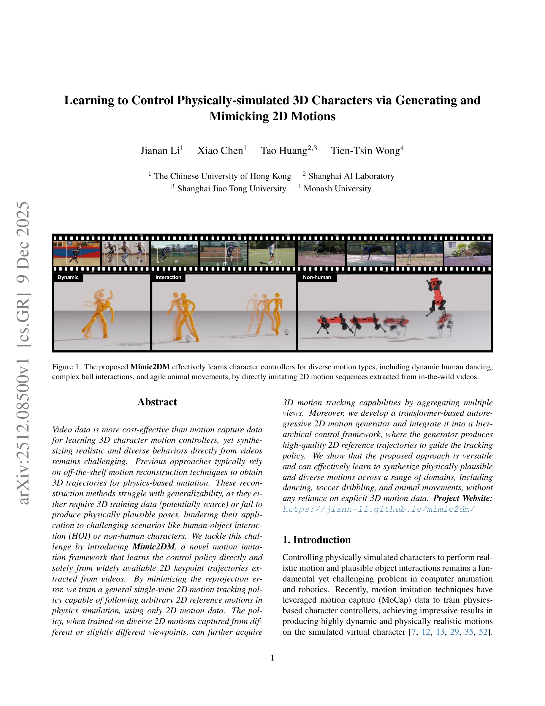
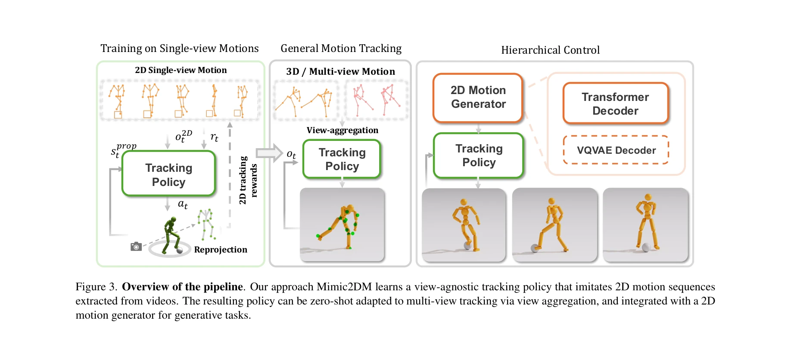

# Learning to Control Physically-simulated 3D Characters via Generating and Mimicking 2D Motions

> **저자**: Jianan Li, Xiao Chen, Tao Huang, Tien-Tsin Wong | **날짜**: 2025-12-09 | **URL**: [https://arxiv.org/abs/2512.08500](https://arxiv.org/abs/2512.08500)

---

## Essence

*Figure 1. The proposed Mimic2DM effectively learns character controllers for diverse motion types, including dynamic hum*

Mimic2DM은 비디오에서 추출한 2D 키포인트 궤적만을 사용하여 물리 기반 3D 캐릭터 제어 정책을 직접 학습하는 프레임워크이며, reprojection error 최소화와 계층적 제어 구조를 통해 춤, 축구 드리블, 동물 운동 등 다양한 도메인에서 물리적으로 타당한 모션을 생성할 수 있다.

## Motivation

- **Known**: 기존 연구는 비디오로부터 3D 모션 캡처 데이터를 추정하여 물리 기반 모션 imitation을 수행하거나, MoCap 데이터를 직접 사용하여 캐릭터 제어 정책을 학습한다. 그러나 3D 재구성 방법은 부족한 3D 학습 데이터나 물리적으로 타당하지 않은 포즈로 인해 일반화에 어려움을 겪는다.
- **Gap**: 기존 방법들은 3D 모션 데이터에 크게 의존하거나 3D 재구성 시 물리 제약을 무시하여, 인간-객체 상호작용(HOI) 또는 동물 운동처럼 3D 데이터가 부족한 도메인에서 효과적으로 작동하지 못한다. 또한 비디오로부터 직접 획득 가능한 2D 키포인트 데이터를 물리 기반 제어에 활용하는 방법이 부재하다.
- **Why**: 비디오 데이터는 MoCap 데이터보다 훨씬 비용 효율적이고 접근성이 높으며, 2D 키포인트는 다양한 스켈레톤과 인간-객체 상호작용, 비인간 캐릭터에 대해 쉽게 추출할 수 있어, 실용적 애플리케이션의 확장성과 다양성을 크게 향상시킬 수 있다.
- **Approach**: 물리 기반 2D 모션 tracking을 3D 재구성과 physics-based imitation을 단일 reprojection 최소화 작업으로 통합하고, reinforcement learning으로 최적화한다. View-agnostic tracking policy를 도입하여 다양한 viewpoint에서 학습된 2D 모션을 통해 3D 추적 능력을 획득하며, transformer 기반 autoregressive 2D motion generator를 계층적 제어 구조에 통합하여 고품질 2D 참조 궤적을 생성한다.

## Achievement

*Figure 1. The proposed Mimic2DM effectively learns character controllers for diverse motion types, including dynamic hum*

- **2D 전용 학습**: 명시적 3D 모션 데이터 없이 비디오로부터 추출한 2D 키포인트만으로 물리적으로 타당한 3D 캐릭터 제어 정책을 학습
- **다중 도메인 적용**: 춤, 축구 공 드리블, 로봇 개 운동 등 다양한 도메인에서 복잡하고 역동적인 모션 합성 성공
- **View-agnostic 확장성**: 단일 viewpoint에서 학습한 정책이 다중 viewpoint aggregation을 통해 3D 추적 능력을 획득하며, 3D 데이터 학습 방법과 비교 가능한 수준의 3D 추적 정확도 달성
- **생성 능력**: Autoregressive 2D motion generator가 diffusion 기반 모델을 능가하는 고품질 2D 모션 시퀀스 생성으로 효과적인 모션 합성 및 조건부 제어 실현

## How

*Figure 3. Overview of the pipeline. Our approach Mimic2DM learns a view-agnostic tracking policy that imitates 2D motion*

- Reprojection error 최소화: 시뮬레이션된 캐릭터의 3D 포즈를 카메라로 투영하여 2D 참조 모션과의 오차를 최소화하도록 제어 정책을 RL로 학습
- View-agnostic tracking policy: 단일 view 2D 모션 tracking 정책을 학습하되, 다양한 viewpoint의 2D 모션으로 학습하여 3D 재구성의 모호성 해소
- Adaptive state initialization: 단일 view tracking 학습 효율성 향상을 위해 초기 상태를 적응적으로 초기화
- Reprojection-error-based early termination: 2D 추적 오차 기반 조기 종료 기준으로 학습 안정성 개선
- 계층적 제어 구조: Transformer 기반 autoregressive 2D motion generator와 tracking policy 분리로 2D 모션을 인터페이스로 사용하여 생성 및 제어 작업 연결
- Multi-view aggregation: 다중 view에서의 2D 모션을 집계하여 단일 정책의 3D 추적 능력 확장

## Originality

- **기존 패러다임 변환**: 3D 모션 재구성 → 물리 기반 imitation의 2단계 파이프라인 대신, reprojection 최소화로 두 작업을 단일 RL 프레임워크로 통합하는 혁신적 접근
- **2D-to-3D 갭 해결**: 물리 제약을 명시적으로 포함하여 깊이 정보 부족의 3D-to-2D 모호성을 극복하고, view-agnostic 정책 설계로 다양한 viewpoint의 2D 데이터 활용
- **다양한 도메인 적용**: 기존 방법이 인간 모션에만 집중한 반면, HOI와 동물 운동 등 3D 데이터 부족 도메인으로 확장
- **생성형 확장**: 2D 모션을 추적 정책과 생성 모델 간의 공용 인터페이스로 활용하여 계층적 제어 구조로 확장

## Limitation & Further Study

- **Single-view ambiguity**: 단일 viewpoint의 2D 추적에서 깊이 모호성이 완전히 해소되지 않을 수 있으며, Figure 2에서 보여주듯 다양한 3D 포즈가 동일한 2D 투영을 만족할 수 있음
- **2D 추출의 신뢰성**: 복잡한 occlusion이나 빠른 모션에서 2D 키포인트 검출 오류가 학습에 직접 영향을 미칠 수 있음
- **계산 비용**: Reinforcement learning 기반 학습으로 인한 샘플 비효율성 및 multi-view 학습 시 계산 복잡도 증가
- **후속 연구 방향**: (1) 더 강력한 2D 키포인트 검출 모델 활용으로 노이즈 견고성 개선, (2) Self-supervised learning 또는 contrastive learning 도입으로 2D 데이터 활용 극대화, (3) Temporal consistency 제약 추가로 시간적 안정성 향상, (4) 부분 관찰(partial observability) 시나리오에서의 강건성 연구

## Evaluation

- Novelty: 4/5
- Technical Soundness: 3/5
- Significance: 4/5
- Clarity: 4/5
- Overall: 4/5

**총평**: 본 논문은 2D 키포인트 데이터만으로 물리 기반 3D 캐릭터 제어 정책을 학습하는 혁신적 방법을 제시하여, 비용 효율적이고 접근 가능한 모션 학습의 새로운 패러다임을 제시한다. 다양한 도메인에서의 성공적 응용과 엄밀한 실험을 통해 실용성과 일반화 능력을 입증하였으며, 영상 기반 모션 제어 분야에 상당한 기여를 한다.

## Related Papers

- 🧪 응용 사례: [[papers/1498_InterMimic_Towards_Universal_Whole-Body_Control_for_Physics-/review]] — 2D 키포인트 기반 3D 제어 프레임워크가 InterMimic의 불완전한 모션 캡처 데이터 활용에 직접적인 기술적 해결책을 제공한다
- 🏛 기반 연구: [[papers/1422_GENMO_A_GENeralist_Model_for_Human_MOtion/review]] — 일반적인 인간 모션 생성 방법론이 Mimic2DM의 다양한 도메인 모션 생성에 핵심 이론적 기반을 제공한다
- 🔗 후속 연구: [[papers/1568_Search-TTA_A_Multimodal_Test-Time_Adaptation_Framework_for_V/review]] — 3D mesh 기반 휴머노이드 모션 학습을 Mimic2DM의 물리 기반 3D 캐릭터 제어에 통합하여 기하학적 정확성을 향상시킬 수 있다
- 🔗 후속 연구: [[papers/1331_DemoHLM_From_One_Demonstration_to_Generalizable_Humanoid_Loc/review]] — 로봇 조작을 위한 장기간 바스켓볼에서 DemoHLM의 일반화 가능한 로코-조작이 확장된다
- 🧪 응용 사례: [[papers/1467_Manipulate-Anything_Automating_Real-World_Robots_using_Visio/review]] — 로봇 생성 방법론이 VLM 기반 조작 데이터 자동화에서 다양한 작업과 환경을 생성하는 데 활용됩니다.
- 🧪 응용 사례: [[papers/1480_HumanoidGen_Data_Generation_for_Bimanual_Dexterous_Manipulat/review]] — RoboGen의 자동화된 로봇 태스크 생성 개념을 휴머노이드 양팔 조작에 구체적으로 적용했다
- 🏛 기반 연구: [[papers/1498_InterMimic_Towards_Universal_Whole-Body_Control_for_Physics-/review]] — 2D 키포인트 기반 3D 캐릭터 제어 프레임워크가 InterMimic의 불완전한 모션 캡처 데이터 활용에 핵심 이론을 제공한다
