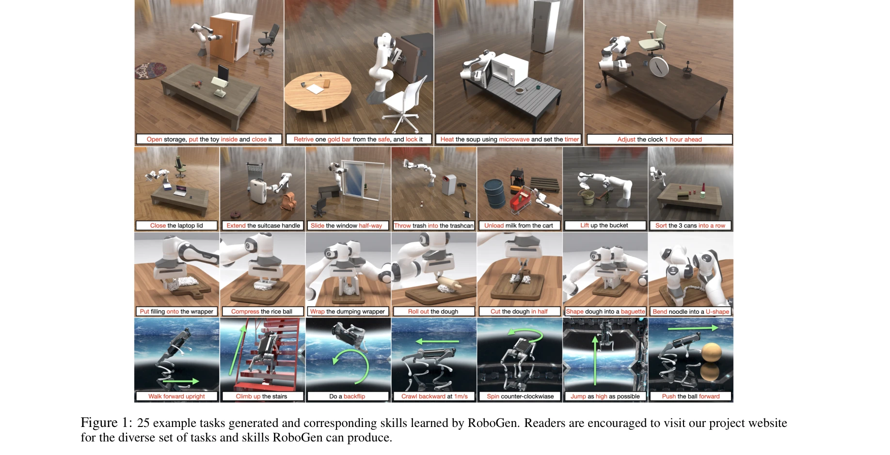
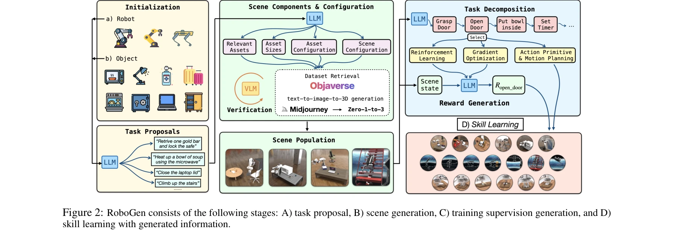

# RoboGen: Towards Unleashing Infinite Data for Automated Robot Learning via Generative Simulation

> **저자**: Yufei Wang, Zhou Xian, Feng Chen, Tsun-Hsuan Wang, Yian Wang, Katerina Fragkiadaki, Zackory Erickson, David Held, Chuang Gan | **날짜**: 2023-11-02 | **URL**: [https://arxiv.org/abs/2311.01455](https://arxiv.org/abs/2311.01455)

---

## Essence

*Figure 1: 25 example tasks generated and corresponding skills learned by RoboGen. Readers are encouraged to visit our pr*

RoboGen은 생성형 모델을 활용하여 로봇이 자동으로 다양한 작업, 장면, 학습 감독을 생성하고 이를 통해 규모 있는 로봇 기술 학습을 가능하게 하는 자동화 파이프라인이다.

## Motivation

- **Known**: 시뮬레이션 환경에서 로봇이 복잡한 스킬을 학습할 수 있으며, 최근 foundation 모델들이 다양한 모달리티에서 뛰어난 성능을 보이고 있다.
- **Gap**: 기존 로봇 학습은 작업 설계, 자산 생성, 장면 구성, 보상 함수 설계 등에 많은 인적 노력이 필요하며, foundation 모델을 로봇에 적용할 때 물리 상호작용과 제어에 필요한 지식이 부족하다.
- **Why**: 자동화된 로봇 스킬 학습 파이프라인은 시뮬레이션 환경에서의 확장성을 크게 향상시킬 수 있으며, 이는 실제 로봇 시스템의 일반화 능력 개발로 이어질 수 있다.
- **Approach**: RoboGen은 propose-generate-learn 순환 구조를 통해 foundation 모델에서 객체 의미론, affordance, 상식 지식을 추출하고 이를 이용해 시뮬레이션 환경을 구성한 후 적절한 학습 방법(RL, motion planning, trajectory optimization)을 자동으로 선택하여 로봇 정책을 학습한다.

## Achievement

*Figure 1: 25 example tasks generated and corresponding skills learned by RoboGen. Readers are encouraged to visit our pr*

- **다양한 작업 생성**: 강체 및 articulated 객체 조작, deformable 객체 조작, legged locomotion 등 25개 이상의 다양한 작업을 자동으로 생성하고 학습
- **최소한의 인적 개입**: 몇 가지 프롬프트 설계와 in-context 예제만으로 인간이 수동으로 구성한 로봇 데이셋보다 더 높은 다양성 달성
- **완전 생성형 파이프라인**: 반복적으로 쿼리 가능한 엔드-투-엔드 파이프라인으로 무한한 스킬 데모 스트림 생성
- **합리적인 foundation 모델 활용**: 동역학과 물리 상호작용에 대한 이해가 부족한 foundation 모델의 한계를 인식하고 모델 능력 범위 내의 정보만 추출하여 활용

## How

*Figure 2: RoboGen consists of the following stages: A) task proposal, B) scene generation, C) training supervision gener*

- Task Proposal: LLM을 사용하여 학습할 가치 있는 작업과 스킬을 자동으로 제안
- Scene Generation: 제안된 작업에 맞춰 관련 객체와 자산을 선택하고 생성하며 공간 구성 결정
- Task Decomposition: 고수준 작업을 서브태스크로 분해
- Algorithm Selection: RL, motion planning, trajectory optimization 중 최적의 학습 방법 자동 선택
- Training Supervision Generation: 보상 함수 등 필요한 학습 감독 자동 생성
- Policy Learning: 선택된 방법으로 정책 학습 수행

## Originality

- Foundation 모델의 지식을 로봇 스킬 학습에 체계적으로 적용하되, 직접 정책/액션 생성이 아닌 작업/장면/감독 생성에만 사용하는 창의적 접근
- 완전 자동화된 propose-generate-learn 순환 구조로 기존의 수동적 작업 설계 및 보상 함수 설계 필요성 제거
- 단순 pick-and-place 수준의 절차적 생성이 아닌 복잡한 long-horizon 작업, deformable 객체 조작, 보행 로봇까지 확장
- LLM 기반 보상 생성과 알고리즘 자동 선택의 결합으로 다양한 작업 유형에 대한 일반적 대응

## Limitation & Further Study

- Foundation 모델이 물리 동역학과 정확한 제어에 대한 이해 부족하므로, 생성된 작업의 학습 가능성과 현실성이 foundation 모델의 성능에 의존
- 현재 시뮬레이션 환경 내에서만 검증되었으며, 실제 로봇으로의 sim-to-real transfer 성능은 미평가
- 생성된 작업의 성공률이 복잡도에 따라 감소하는 경향 (Figure 5)이 있어 장기적 작업 학습의 안정성 문제
- 후속 연구: (1) 실제 로봇 환경에서의 성능 검증, (2) 생성된 작업의 실학습 가능성을 사전에 검증하는 메커니즘, (3) sim-to-real transfer 기법 개발, (4) 더 정교한 물리 시뮬레이션과 foundation 모델의 통합

## Evaluation

- Novelty: 4/5
- Technical Soundness: 3/5
- Significance: 4/5
- Clarity: 4/5
- Overall: 4/5

**총평**: RoboGen은 foundation 모델의 한계를 인식하면서도 그 강점을 창의적으로 활용하여 로봇 스킬 학습의 자동화와 규모 확대라는 의미 있는 문제를 해결한 논문이다. 완전 자동화된 파이프라인과 다양한 작업 생성이라는 성과는 주목할 만하나, 현실 환경으로의 적용 검증이 필요하다.

## Related Papers

- 🔄 다른 접근: [[papers/1408_GenSim_Generating_Robotic_Simulation_Tasks_via_Large_Languag/review]] — 로봇 시뮬레이션 작업 생성에서 RoboGen의 생성형 모델 활용과 GenSim의 LLM 기반 접근 방식을 자동화 수준에서 비교할 수 있다.
- 🏛 기반 연구: [[papers/1583_Text2Reward_Reward_Shaping_with_Language_Models_for_Reinforc/review]] — Text2Reward의 자연어 기반 reward function 자동 생성 방법론이 RoboGen의 자동 학습 감독 생성에 이론적 기반을 제공한다.
- 🔗 후속 연구: [[papers/1477_MineDojo_Building_Open-Ended_Embodied_Agents_with_Internet-S/review]] — MineDojo의 인터넷 규모 데이터를 활용한 오픈엔드 에이전트 구축 방법론을 RoboGen의 대규모 로봇 데이터 생성에 적용할 수 있다.
- 🧪 응용 사례: [[papers/1551_Legged_Robot_State-Estimation_Through_Combined_Forward_Kinem/review]] — RoboTwin 2.0의 확장 가능한 데이터 생성 및 벤치마크 플랫폼이 RoboGen의 자동화된 로봇 학습 파이프라인을 실제 환경에서 검증하는 도구를 제공한다.
- 🔗 후속 연구: [[papers/1408_GenSim_Generating_Robotic_Simulation_Tasks_via_Large_Languag/review]] — RoboGen의 자동화된 로봇 데이터 생성이 GenSim의 시뮬레이션 작업 생성을 실제 로봇 궤적 데이터 생성으로 확장한 구현체이다
- 🔗 후속 연구: [[papers/1583_Text2Reward_Reward_Shaping_with_Language_Models_for_Reinforc/review]] — Text2Reward의 자연어 기반 dense reward 생성 방법론을 RoboGen의 자동화된 학습 감독 생성에 통합하여 더 정교한 보상 설계를 가능하게 한다.
