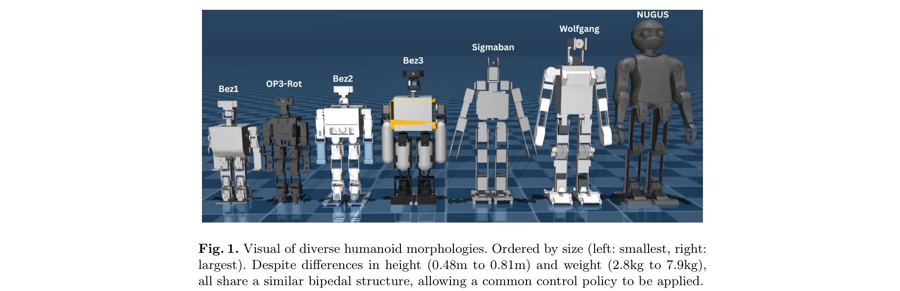
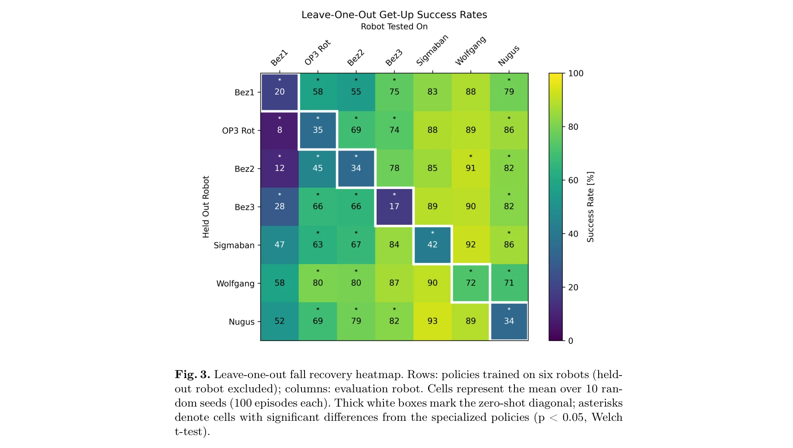
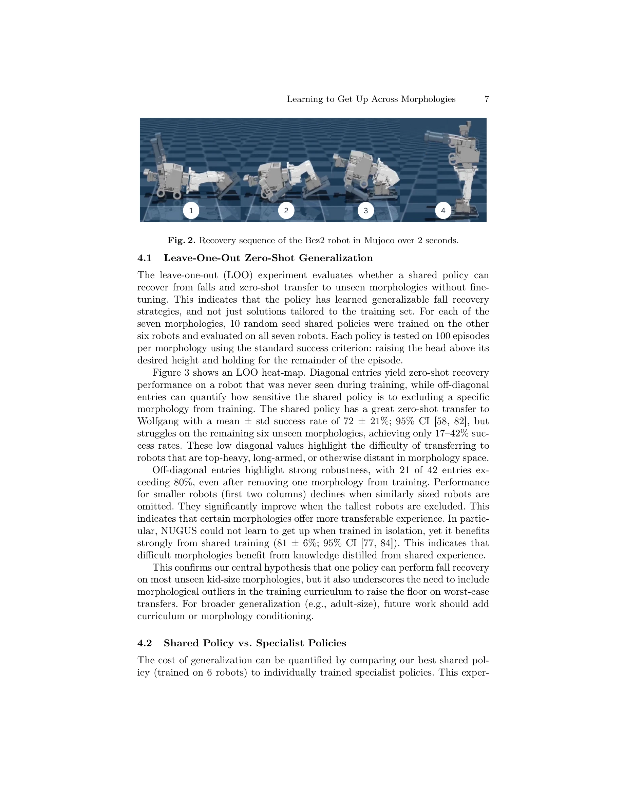

# Learning to Get Up Across Morphologies: Zero-Shot Recovery with a Unified Humanoid Policy

> **저자**: Jonathan Spraggett | **날짜**: 2025-12-13 | **URL**: [https://arxiv.org/abs/2512.12230](https://arxiv.org/abs/2512.12230)

---

## Essence

*Fig. 1. Visual of diverse humanoid morphologies. Ordered by size (left: smallest, right:*

단일 DRL 정책으로 7개의 서로 다른 휴머노이드 로봇 형태에서 낙상 복구를 수행하며 미학습 형태로 86% 성공률의 영점 사격(zero-shot) 전이를 달성한다.

## Motivation

- **Known**: 기존 DRL 기반 낙상 복구 방법들은 각 로봇 형태별로 별도의 정책 훈련이 필요하며, 다중 형태 일반화는 주로 보행 제어에만 적용되어 왔다.
- **Gap**: 휴머노이드 낙상 복구에서 형태 불가지론적(morphology-agnostic) 통합 정책이 다양한 로봇 형태에서 효과적으로 작동하는지는 명확하지 않으며, 형태 다양성이 영점 사격 일반화에 미치는 영향도 미해명이다.
- **Why**: RoboCup 같은 동적 환경에서 낙상 복구는 로봇의 경쟁력을 결정하는 핵심 기술이며, 단일 정책으로 다양한 로봇에 적용 가능하면 배포 비용을 대폭 절감할 수 있다.
- **Approach**: 7개 휴머노이드 형태에서 공통 관측 및 행동 공간을 정의하고 CrossQ를 이용해 형태 불가지론적 보상 함수로 통합 정책을 훈련하며, leave-one-out 실험과 형태 스케일 분석을 통해 일반화 성능을 검증한다.

## Achievement

*Fig. 3. Leave-one-out fall recovery heatmap. Rows: policies trained on six robots (held-*

- **영점 사격 전이 성공**: 미학습 형태에서 86 ± 7% (95% CI [81, 89])의 높은 성공률 달성
- **형태 다양성의 효과 증명**: 훈련 중 형태 다양성 증가가 미학습 로봇으로의 일반화 성능 향상을 보여줌
- **specialist 정책 초과 성능**: 일부 경우에서 공유 정책이 로봇별 전문 기준선을 능가함
- **포괄적 분석**: leave-one-out 실험, 형태 스케일 분석, 다양성 절제(ablation) 연구로 영점 사격 일반화 추세 상세 분석

## How

*Fig. 2. Recovery sequence of the Bez2 robot in Mujoco over 2 seconds.*

- 7개 휴머노이드 형태 선정 (높이 0.48-0.81m, 무게 2.8-7.9kg) 및 MuJoCo MJCF 형식으로 변환
- 어깨, 팔꿈치, 엉덩이, 무릎, 발목 pitch 관절로 축소된 공통 행동 공간 정의 (Eq. 1)
- 형태 식별자 없이 관절 위치, 속도, trunk Euler 각도, head 높이를 포함한 확장 관측 공간 설계 (Table 2)
- 직립 자세(R_Up), pitch 정렬(R_Pitch), 속도 및 행동 변화 페널티, 자체 충돌 회피를 포함한 형태 불가지론적 보상 함수 (Eq. 2, Table 3)
- CrossQ 알고리즘으로 전체 7개 형태에서 통합 정책 훈련 및 도메인 랜더마이제이션 적용
- Leave-one-out 검증: 각 형태를 제외하고 나머지 6개로 훈련 후 제외된 형태에서 검증

## Originality

- 휴머노이드 낙상 복구 분야에서 처음으로 형태 불가지론적 통합 DRL 정책 제시
- 형태 식별자를 명시적으로 제공하지 않고 상태 역학만으로 형태 차이를 추론하게 하는 설계
- 훈련 중 형태 다양성이 미학습 형태로의 영점 사격 전이에 미치는 정량적 영향을 분석한 최초 연구
- FRASA 방법론을 기반으로 하되, 형태 비의존적 보상 함수와 확장 관측 공간으로 다중 형태 학습 가능하게 확장

## Limitation & Further Study

- 형태 불가지론적 설계로 인해 explicit morphology descriptor를 활용하는 방법(NerveNet, URMA, ModuMorph)보다 정보 제약이 클 수 있음
- 훈련 형태 범위 내(0.48-0.81m)에서는 일반화가 잘 되지만 범위 외 극단적 형태에 대한 검증 부재
- sim-to-real transfer는 extensive domain randomization에만 의존하며 Adversarial Motion Priors(AMP) 미적용으로 현실성 제한
- 관절 선택(5개)이 제한적이며, 다양한 관절 구성을 가진 형태로의 확장 용이성 미검증
- 후속 연구: AMP를 통한 생물학적 동작 정제, 더 넓은 형태 범위 검증, 다른 로봇 구조(사족보행) 확장

## Evaluation

- Novelty: 4/5
- Technical Soundness: 3/5
- Significance: 4/5
- Clarity: 4/5
- Overall: 4/5

**총평**: 본 논문은 휴머노이드 낙상 복구에서 처음으로 형태 불가지론적 통합 정책의 영점 사격 일반화 가능성을 엄밀하게 증명하며, 방법론이 명확하고 실험이 포괄적이다. 다만 형태 범위 확장과 실제 로봇 배포 검증이 후속되어야 실용성이 완성될 것이다.

## Related Papers

- 🧪 응용 사례: [[papers/1523_Learning_Getting-Up_Policies_for_Real-World_Humanoid_Robots/review]] — 다형태에서 낙상 복구를 학습하는 통합 정책이 실제 휴머노이드 로봇의 일어서기 정책 학습에 직접 적용될 수 있다.
- 🏛 기반 연구: [[papers/1475_Humanoid_Whole-Body_Locomotion_on_Narrow_Terrain_via_Dynamic/review]] — 7개 형태에서 낙상 복구하는 통합 정책의 기반이 되는 메타 학습 접근법이 MetaMorph의 범용 컨트롤러 학습과 일치한다.
- 🔗 후속 연구: [[papers/1531_Learning_Humanoid_Standing-up_Control_across_Diverse_Posture/review]] — 다양한 형태에서의 낙상 복구 학습이 다양한 자세에서의 휴머노이드 일어서기 제어로 구체화되어 확장되었다.
- 🔄 다른 접근: [[papers/1348_Discovering_Self-Protective_Falling_Policy_for_Humanoid_Robo/review]] — 낙상 보호에서 삼각형 구조 대신 형태학적 다양성 기반 접근 방식을 제시한다
