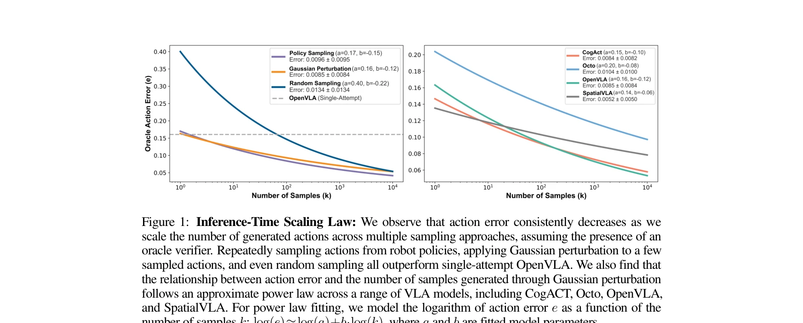
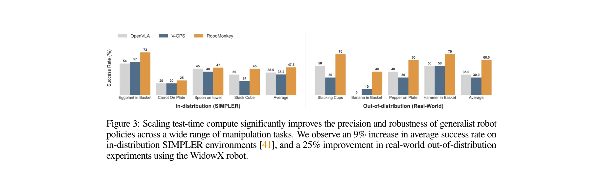
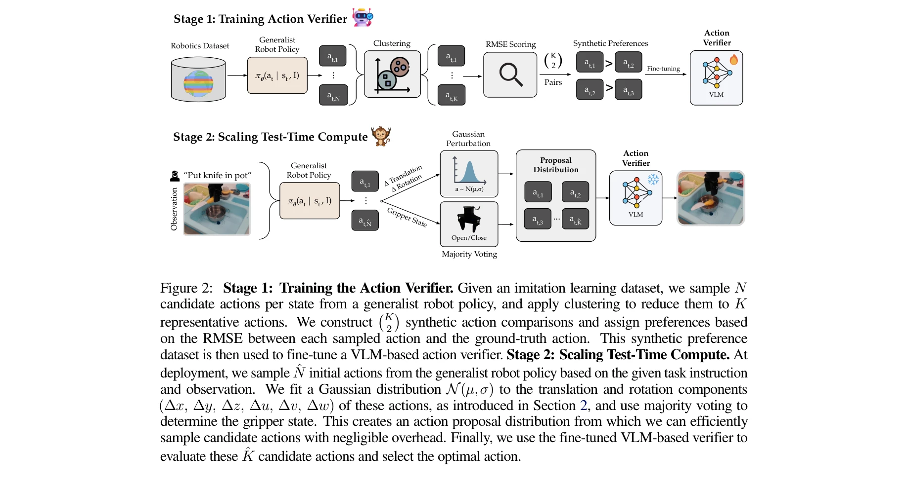

# RoboMonkey: Scaling Test-Time Sampling and Verification for Vision-Language-Action Models

> **저자**: Jacky Kwok, Christopher Agia, Rohan Sinha, Matt Foutter, Shulu Li, Ion Stoica, Azalia Mirhoseini, Marco Pavone | **날짜**: 2025-06-21 | **URL**: [https://arxiv.org/abs/2506.17811](https://arxiv.org/abs/2506.17811)

---

## Essence

*Figure 1: Inference-Time Scaling Law: We observe that action error consistently decreases as we*

Vision-Language-Action (VLA) 모델의 테스트 시간 성능을 향상시키기 위해 샘플링과 검증을 통한 스케일링 방법을 제시하며, action error가 생성 샘플 수에 따라 지수 거듭제곱 법칙을 따른다는 inference-time scaling law를 발견했다.

## Motivation

- **Known**: VLA 모델은 visuomotor control에서 뛰어난 능력을 보이지만 실제 환경에서의 robustness 문제가 있으며, LLM에서 test-time compute scaling이 성능 향상에 효과적임이 증명되었다.
- **Gap**: VLA 모델에서 deployment 단계의 test-time compute scaling 효과가 체계적으로 연구되지 않았으며, action 샘플링과 검증을 통한 정확한 scaling law가 규명되지 않았다.
- **Why**: 로봇 배포 시 견고성과 정밀성이 매우 중요하며, test-time scaling을 통해 기존 VLA 모델을 개선함으로써 실제 로봇 제어 성능을 크게 향상시킬 수 있다.
- **Approach**: VLA에서 여러 action을 샘플링한 후 Gaussian perturbation과 majority voting으로 action proposal distribution을 구성하고, VLM 기반 verifier로 최적 action을 선택하는 RoboMonkey 프레임워크를 제안했다. 합성 데이터 생성 파이프라인으로 verifier를 학습시켰다.

## Achievement

*Figure 3: Scaling test-time compute significantly improves the precision and robustness of generalist robot*

- **Inference-time scaling law 발견**: action error와 샘플 수 간의 지수 거듭제곱 법칙을 CogACT, Octo, OpenVLA, SpatialVLA 등 다양한 VLA에서 실증했다.
- **RoboMonkey 프레임워크**: 기존 VLA에 test-time scaling을 적용하여 out-of-distribution 작업에서 25% 절대 성능 향상, in-distribution 작업에서 9% 성능 향상을 달성했다.
- **합성 데이터 생성 파이프라인**: 자동으로 synthetic action preferences를 생성하여 VLM 기반 verifier를 학습하고, 데이터셋 확대에 따른 일관된 성능 개선을 입증했다.
- **적응 학습 효과**: 새로운 로봇 셋업 적응 시 VLA와 action verifier를 함께 fine-tuning하면 VLA만 fine-tuning할 때보다 7% 추가 성능 향상을 얻을 수 있음을 보였다.

## How

*Figure 2: Stage 1: Training the Action Verifier. Given an imitation learning dataset, we sample N*

- Bridge V2 Dataset에서 1,000개의 (s, a*, I) 튜플을 샘플링하여 10,000개 action 생성
- Random sampling, policy sampling, Gaussian perturbation 세 가지 샘플링 방식 비교 평가
- Normalized RMSE로 action error 측정하고 log-log scale에서 power law fitting 수행
- VLM을 기반으로 한 action verifier 구축을 위해 선호도 기반 학습 방법 적용
- Deployment 단계에서 VLA로부터 action 샘플링 → Gaussian perturbation 적용 → majority voting → VLM verifier를 통한 최종 action 선택
- SIMPLER, real-world task, LIBERO-Long benchmark에서 광범위한 simulation 및 hardware 실험 수행

## Originality

- VLA 모델에 대한 최초의 systematic inference-time scaling law 특성화
- Gaussian perturbation과 majority voting을 조합한 효율적인 action sampling 방법
- 합성 데이터를 이용한 자동화된 VLM 기반 action verifier 학습 파이프라인
- LLM의 test-time scaling 개념을 robotics domain으로 성공적으로 확장

## Limitation & Further Study

- 정적 manipulation 작업에 주로 초점을 맞추었으며, 동적 작업에 대한 일반화 가능성은 검증되지 않음
- Gaussian perturbation 방법이 4개의 초기 샘플에 의존하므로, 초기 샘플의 품질이 결과에 큰 영향을 미칠 수 있음
- VLM-based verifier의 학습에 합성 데이터를 사용하므로 sim-to-real gap 문제가 존재할 수 있음
- 계산 비용 증가로 인한 실제 배포 환경에서의 latency trade-off 분석이 제한적
- 후속 연구에서 다른 로봇 형태(비인간형 로봇, 이족 로봇 등)에 대한 확대 평가 필요

## Evaluation

- Novelty: 4/5
- Technical Soundness: 4/5
- Significance: 4/5
- Clarity: 4/5
- Overall: 4/5

**총평**: VLA 모델의 test-time scaling 가능성을 체계적으로 규명하고 실용적인 RoboMonkey 프레임워크를 제안한 우수한 연구로, inference-time scaling law의 발견과 실제 로봇에서의 유의미한 성능 향상이 로봇 제어 분야에 큰 기여를 한다.

## Related Papers

- 🔄 다른 접근: [[papers/1535_RoboArena_Distributed_Real-World_Evaluation_of_Generalist_Ro/review]] — VLA 모델 성능 평가에서 테스트 시간 스케일링과 실제 환경 분산 평가라는 상호 보완적인 접근법을 제시한다.
- 🏛 기반 연구: [[papers/1493_Neural_Scaling_Laws_in_Robotics/review]] — 로봇 학습의 신경 스케일링 법칙 연구를 바탕으로 VLA 모델에서 추론 시간 스케일링 법칙을 발견한다.
- 🔗 후속 연구: [[papers/1555_RT-2_Vision-Language-Action_Models_Transfer_Web_Knowledge_to/review]] — RT-2 모델의 성능을 테스트 시간에 샘플링과 검증을 통해 추가로 향상시키는 방법을 제시한다.
- 🔗 후속 연구: [[papers/1428_Hume_Introducing_System-2_Thinking_in_Visual-Language-Action/review]] — RoboMonkey의 test-time sampling과 verification을 System-2 thinking에 통합하여 더 robust한 policy를 구현합니다.
- 🔗 후속 연구: [[papers/1535_RoboArena_Distributed_Real-World_Evaluation_of_Generalist_Ro/review]] — VLA 모델의 테스트 시간 성능 향상 연구를 실제 로봇 환경에서의 분산 평가 시스템으로 확장한다.
- 🏛 기반 연구: [[papers/1592_TraceVLA_Visual_Trace_Prompting_Enhances_Spatial-Temporal_Aw/review]] — VLA 모델의 성능 향상 연구를 바탕으로 visual trace prompting이라는 구체적인 개선 방법을 제시한다.
