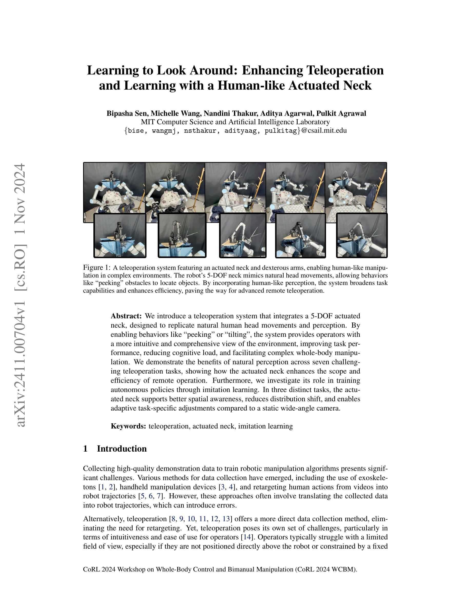
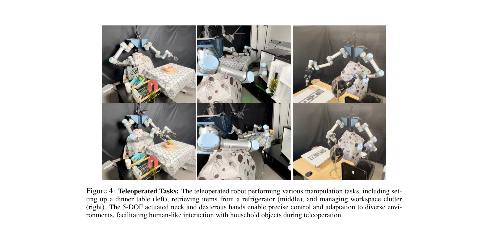
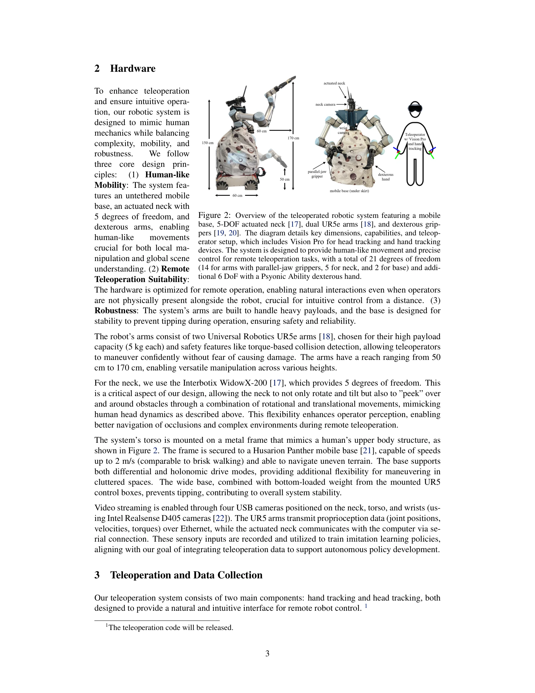

# Learning to Look Around: Enhancing Teleoperation and Learning with a Human-like Actuated Neck

> **저자**: Bipasha Sen, Michelle Wang, Nandini Thakur, Aditya Agarwal, Pulkit Agrawal | **날짜**: 2024-11-01 | **URL**: [https://arxiv.org/abs/2411.00704](https://arxiv.org/abs/2411.00704)

---

## Essence

*Figure 1: A teleoperation system featuring an actuated neck and dexterous arms, enabling human-like manipu-*

인간의 자연스러운 머리 움직임을 모방하는 5자유도 액추에이터 넥을 장착한 텔레오퍼레이션 시스템을 제안하여, 원격 조작의 직관성을 향상시키고 자율 정책 학습을 개선한다.

## Motivation

- **Known**: 텔레오퍼레이션은 직접적인 데이터 수집이 가능하지만 제한된 시야각과 인지 부하 증가의 문제가 있으며, 고정 카메라는 왜곡된 이미지와 out-of-distribution 인식을 야기한다.
- **Gap**: 기존 텔레오퍼레이션 시스템은 인간이 자연스럽게 수행하는 머리 움직임(peeking, tilting 등)을 지원하지 못하여 시야 제약이 크고, 동적 관점 조정이 imitation learning 데이터 품질에 미치는 영향이 미충분하게 연구되었다.
- **Why**: 직관적인 텔레오퍼레이션은 조작자의 인지 부하를 감소시키고 복잡한 전신 조작 작업의 성능을 향상시키며, 동적 카메라 조정은 더 나은 데이터 품질로 자율 정책의 일반화 능력을 개선할 수 있다.
- **Approach**: 5자유도 Interbotix WidowX-200 넥에 RGB 카메라를 장착하고 Apple Vision Pro를 통한 6DOF 헤드 트래킹으로 조작자의 머리 움직임을 로봇 넥에 직접 매핑하며, 7개의 텔레오퍼레이션 작업과 3개의 imitation learning 작업을 통해 효과를 검증한다.

## Achievement

*Figure 4: Teleoperated Tasks: The teleoperated robot performing various manipulation tasks, including set-*

- **직관적 텔레오퍼레이션**: 5DOF 액추에이터 넥이 자연스러운 머리 움직임(sideways, peeking, slanting)을 가능하게 하여 조작자의 인지 부하를 감소시킴
- **향상된 데이터 품질**: 표준 RGB 카메라를 사용한 동적 시점 조정이 wide-angle 카메라의 이미지 왜곡을 제거하고 out-of-distribution 인식을 감소시킴
- **강화된 interactive perception**: 목표물 추적 및 다양한 환경 높이에서의 작업 일반화를 통해 인간의 자연스러운 지각 행동 모방
- **7가지 텔레오퍼레이션 작업에서 성능 향상**: 시야 범위 및 작업 효율성이 명확히 개선됨
- **3가지 imitation learning 작업에서 공간 인식 개선**: 액추에이터 넥이 더 나은 spatial awareness와 distribution shift 감소를 실현

## How

*Figure 2: Overview of the teleoperated robotic system featuring a mobile*

- Interbotix WidowX-200 5DOF 액추에이터 넥을 UR5e 듀얼 암 위에 장착하고, Intel Realsense D405 카메라 4개를 넥과 토르소, 손목에 배치
- Apple Vision Pro를 사용한 6DOF 헤드 트래킹으로 조작자의 머리 자세를 로봇 넥 카메라 자세에 직접 매핑
- Ascension trakSTAR 6DOF 전자기 손 추적 장치로 손 위치와 손가락 움직임을 캡처하여 그리퍼 제어
- Manus VR 글러브를 통해 25개 핸드 키포인트 추적으로 dexterous Psyonic 손 제어
- 모든 센서 데이터(카메라 영상, 관절 위치/속도/토크, 넥 상태)를 수집하여 imitation learning 정책 훈련에 활용
- 7개 텔레오퍼레이션 작업(물건 찾기, 정렬, 조립 등)과 3개 자율 정책 훈련 작업에서 액추에이터 넥의 효과 정량 평가

## Originality

- 텔레오퍼레이션 시스템에 5DOF 액추에이터 넥을 통합하여 인간의 자연스러운 지각 행동을 직접 모방하는 설계는 기존 고정 카메라 기반 접근과 차별화
- 동적 카메라 조정이 imitation learning 데이터 품질과 정책 일반화에 미치는 영향을 체계적으로 검증한 실증적 연구
- Apple Vision Pro 6DOF 헤드 트래킹과 Ascension trakSTAR 손 추적을 결합한 통합 텔레오퍼레이션 인터페이스 설계
- Interactive perception 프레임워크에서 넥 움직임이 물체 추적 및 공간 인식에 기여하는 메커니즘을 명확히 제시

## Limitation & Further Study

- Apple Vision Pro 기반 손 추적이 로봇 몸체 근처에서 손이 시야를 벗어나면 추적 불안정성 발생—trakSTAR 등 대체 방식 필요
- 실험이 특정 작업 도메인(조작, 객체 찾기)에 제한되어 다양한 환경에서의 일반화 수준 미흡
- 액추에이터 넥의 추가로 인한 시스템 복잡도 증가와 비용 부담에 대한 실용성 분석 부족
- Imitation learning 3개 작업만 평가되어 더 광범위한 자율 정책 학습 시나리오에서의 이점 확인 필요
- 정량적 비교 지표(정확도, 시간, 인지 부하 측정값)의 상세한 통계 분석 제시 필요

## Evaluation

- Novelty: 4/5
- Technical Soundness: 3/5
- Significance: 4/5
- Clarity: 4/5
- Overall: 4/5

**총평**: 인간 중심 설계 철학으로 5DOF 액추에이터 넥을 텔레오퍼레이션에 통합한 창의적이고 실용적인 연구로, 직관적 원격 조작과 imitation learning 데이터 품질 개선 측면에서 명확한 기여를 제시한다. 다만 더 광범위한 정량적 평가와 다양한 환경에서의 검증이 후속으로 필요하다.

## Related Papers

- 🔄 다른 접근: [[papers/1347_DIJIT_A_Robotic_Head_for_an_Active_Observer/review]] — 인간 머리 움직임을 모방한 5자유도 넥 시스템과 능동적 관찰을 위한 로봇 헤드 DIJIT이 동일한 시각 향상 문제를 다룬다.
- 🔗 후속 연구: [[papers/1598_Open-TeleVision_Teleoperation_with_Immersive_Active_Visual_F/review]] — 자연스러운 머리 움직임을 통한 텔레오퍼레이션 향상이 VR 기반 몰입형 시각 피드백 시스템으로 확장되었다.
- 🏛 기반 연구: [[papers/1544_Learning_to_Look_Seeking_Information_for_Decision_Making_via/review]] — 텔레오퍼레이션에서 능동적 시각 탐색의 중요성이 의사결정을 위한 정보 탐색 학습의 기본 원리가 된다.
- 🏛 기반 연구: [[papers/1598_Open-TeleVision_Teleoperation_with_Immersive_Active_Visual_F/review]] — VR 몰입형 시각 피드백을 통한 원격 조종 향상이 자연스러운 머리 움직임을 통한 텔레오퍼레이션 개선의 기반이 된다.
