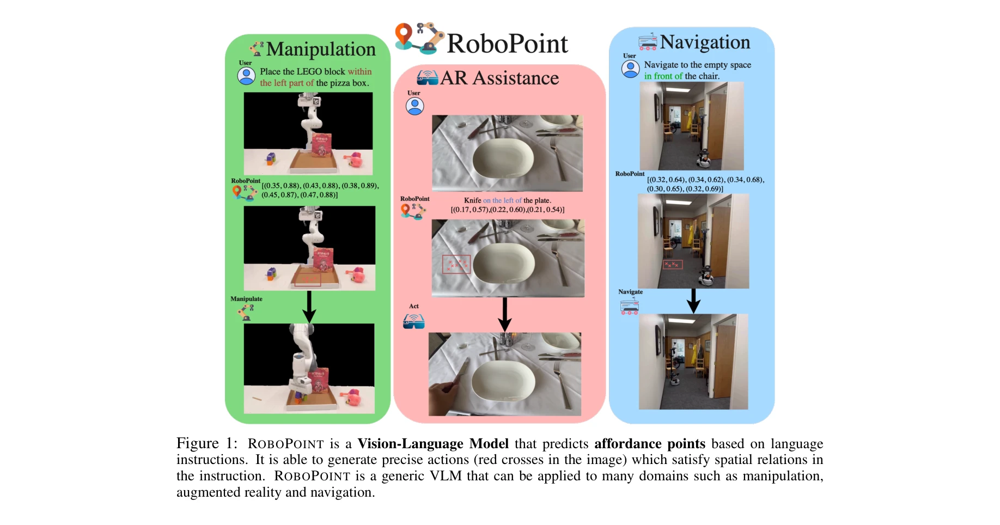
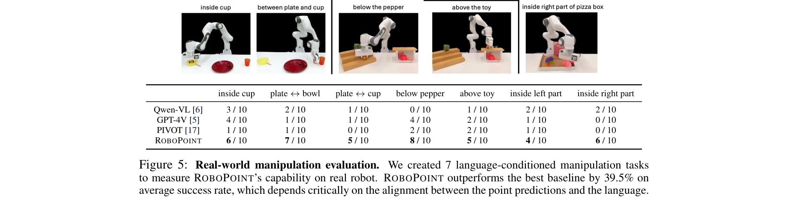
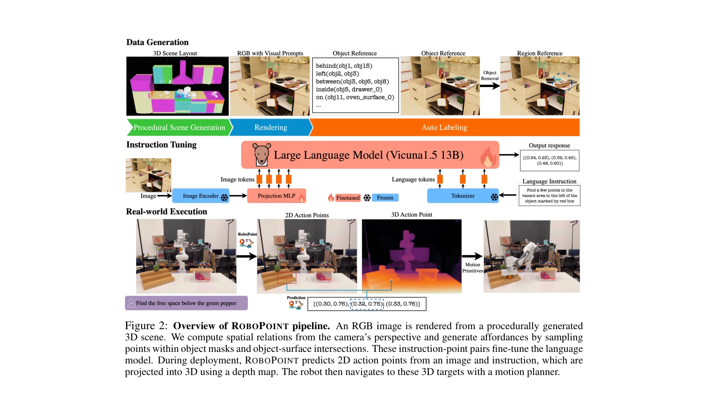

# RoboPoint: A Vision-Language Model for Spatial Affordance Prediction for Robotics

> **저자**: Wentao Yuan, Jiafei Duan, Valts Blukis, Wilbert Pumacay, Ranjay Krishna, Adithyavairavan Murali, Arsalan Mousavian, Dieter Fox | **날짜**: 2024-06-15 | **URL**: [https://arxiv.org/abs/2406.10721](https://arxiv.org/abs/2406.10721)

---

## Essence

*Figure 1: ROBOPOINT is a Vision-Language Model that predicts affordance points based on language*

RoboPoint는 언어 지시를 받아 로봇의 정확한 행동 지점(affordance keypoint)을 예측하는 Vision-Language Model로, 자동 합성 데이터 생성 파이프라인을 통해 실제 데이터 수집 없이 학습된다.

## Motivation

- **Known**: VLM은 강력한 시각-언어 이해 능력을 가지고 있지만, 로봇 제어에 필요한 공간 관계(spatial relations)를 정확히 표현하지 못한다. 기존 로봇 제어 방식은 외부 객체 검출기나 반복적 시각 프롬핑에 의존하며, affordance 예측은 다양한 표현 방식(부분 분할, 특성 기술자, keypoint)으로 연구되어 왔다.
- **Gap**: VLM은 언어가 정확하지 않아 로봇 행동 유도에 실패하며, 기존 affordance 예측 방법들은 외부 모델에 의존하거나 확장성이 낮다. 대규모 실제 로봇 데이터나 인간 시연 없이 다양한 환경에서 공간 추론을 수행할 수 있는 방법이 부족하다.
- **Why**: 로봇이 테이블 위 물체 정렬이나 선반에 물건 놓기 같은 조작 작업을 정확하게 수행하려면 정밀한 행동 지점이 필요하고, 이는 사용자의 직관적 지시와 로봇 실행 간의 간극을 줄여 로봇의 실용성을 크게 높인다.
- **Approach**: 자동 합성 데이터 생성 파이프라인으로 대규모 instruction-affordance 쌍을 생성하여 Vicuna-v1.5-13B를 instruction 튜닝하며, 2D keypoint 예측 후 depth 정보로 3D 변환하는 점 기반 행동 공간을 사용한다.

## Achievement

*Figure 5: Real-world manipulation evaluation. We created 7 language-conditioned manipulation tasks*

- **성능 우수성**: GPT-4o, LLaVA-NeXT, SpatialVLM 대비 공간 affordance 예측 정확도 21.8% 향상 및 하위 작업 성공률 30.5% 향상
- **확장성**: 실제 로봇 데이터나 인간 시연 없이 합성 데이터만으로 학습되어 다양한 환경과 시점에 확장 가능
- **일반성**: 로봇 네비게이션, 조작, AR 지원 등 다양한 하위 애플리케이션 지원
- **새로운 벤치마크**: 관계형 자유 공간 참조 평가를 위한 WHERE2PLACE 수동 주석 벤치마크 구성

## How

*Figure 2: Overview of ROBOPOINT pipeline. An RGB image is rendered from a procedurally generated*

- 합성 3D 씬에서 절차적 생성으로 다양한 객체 배치 및 카메라 관점 생성
- 카메라 관점에서 공간 관계 계산 및 객체 마스크와 객체-표면 교차 내에서 점 샘플링
- VQA(665K 대화), LVIS(객체 경계박스), 합성 데이터(객체 참조, 자유 공간 참조) 혼합 데이터로 co-training
- 이미지 인코더는 동결하고 MLP 프로젝터와 transformer 가중치만 업데이트하는 instruction tuning
- 추론 시 2D keypoint 예측 후 depth map으로 3D 좌표 변환하여 로봇 제어

## Originality

- **점 기반 행동 공간**: 기존 VLM의 경계박스 예측과 달리 2D keypoint로 더 정밀한 공간 지정, 사전 정의 행동 원시(primitive)나 외부 객체 검출기 제거
- **완전 자동화 데이터 생성**: 객체 마스크와 공간 관계 계산으로 인간 시연 없이 대규모 labeled affordance 데이터 생성
- **다중 작업 학습**: VQA, 객체 검출, affordance 예측을 통합 instruction tuning으로 학습하여 지식 망각 방지
- **실제-합성 도메인 전이**: 합성 데이터와 templated 언어로만 학습되었으나 실제 이미지와 자연어 명령에 우수한 성능

## Limitation & Further Study

- **데이터 제한**: 합성 데이터와 templated 언어만 사용하므로 실제 언어의 다양성 부족 가능성
- **depth 의존성**: 2D keypoint를 3D로 변환할 때 depth map 정확성에 의존하며, depth 센서 없는 환경에 미적용
- **단일 keypoint 예측**: 복수 행동이나 sequential task의 경우 여러 점 예측의 순서 지정 불명확
- **평가 제한**: WHERE2PLACE 벤치마크가 제한적이며, 다양한 실제 로봇 조작 시나리오에 대한 실제 로봇 실험 부족
- **후속 연구**: 실제 로봇 데이터와의 혼합 학습, 복잡한 다단계 task 지원, 다중 모달리티(tactile, proprioceptive) 통합 검토 필요

## Evaluation

- Novelty: 4/5
- Technical Soundness: 3/5
- Significance: 4/5
- Clarity: 4/5
- Overall: 4/5

**총평**: RoboPoint는 자동화된 합성 데이터 파이프라인과 점 기반 행동 공간을 결합하여 대규모 실제 데이터 수집 없이도 로봇 공간 추론을 크게 향상시킨 혁신적인 접근법이며, 조작, 네비게이션, AR 등 다양한 응용 분야의 확장성이 높지만 실제 로봇 시스템에서의 검증 강화가 필요하다.

## Related Papers

- 🔗 후속 연구: [[papers/1529_ReKep_Spatio-Temporal_Reasoning_of_Relational_Keypoint_Const/review]] — ReKep의 relational keypoint constraints가 RoboPoint의 spatial affordance prediction을 더 복잡한 관계형 제약으로 확장한다.
- 🔄 다른 접근: [[papers/1413_GraspVLA_a_Grasping_Foundation_Model_Pre-trained_on_Billion-/review]] — GraspVLA의 대규모 파지 모델과 RoboPoint의 affordance keypoint 예측은 모두 로봇 파지를 위한 서로 다른 접근법이다.
- 🏛 기반 연구: [[papers/1429_GraspSense_언어_기반_인지와_힘_맵을_활용한_손재주_로봇_파지_계획/review]] — GraspSense의 언어 기반 인지와 힘 맵이 RoboPoint의 언어 지시 기반 행동 지점 예측의 기초 방법론을 제공한다.
- 🏛 기반 연구: [[papers/1468_ManipVQA_Injecting_Robotic_Affordance_and_Physically_Grounde/review]] — 공간적 affordance 예측이 물리적으로 그라운딩된 조작 이해의 핵심 구성 요소를 제공합니다.
- 🏛 기반 연구: [[papers/1529_ReKep_Spatio-Temporal_Reasoning_of_Relational_Keypoint_Const/review]] — RoboPoint의 spatial affordance prediction이 ReKep의 keypoint 기반 제약 조건 표현의 기초 방법론을 제공한다.
- 🔄 다른 접근: [[papers/1597_UniAff_A_Unified_Representation_of_Affordances_for_Tool_Usag/review]] — UniAff는 3D constraints 기반으로, RoboPoint는 spatial affordance prediction으로 도구 사용과 객체 조작의 affordance를 다루는 다른 접근법
- 🔄 다른 접근: [[papers/1301_A3VLM_Actionable_Articulation-Aware_Vision_Language_Model/review]] — RoboPoint는 A3VLM과 유사하게 공간적 affordance를 다루지만 Vision-Language 모델 기반의 다른 접근법을 사용한다
