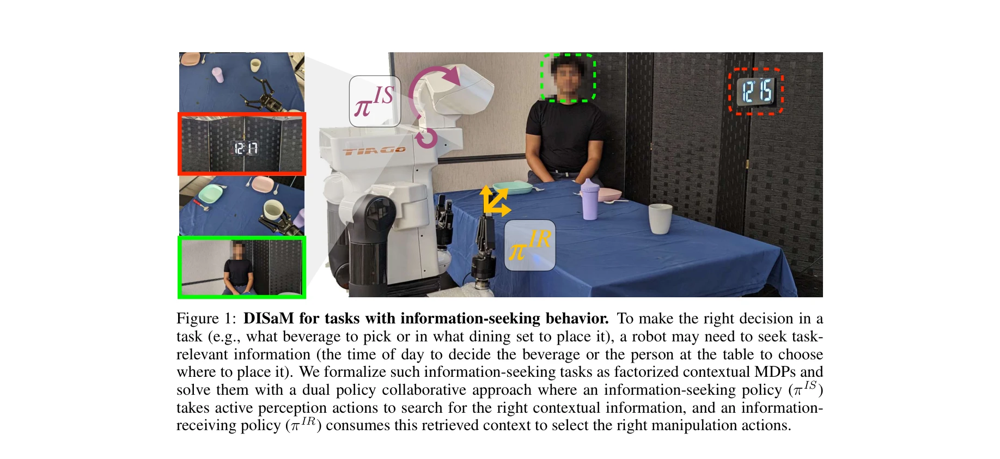

# Learning to Look: Seeking Information for Decision Making via Policy Factorization

> **저자**: Shivin Dass, Jiaheng Hu, Ben Abbatematteo, Peter Stone, Roberto Martín-Martín | **날짜**: 2024-10-24 | **URL**: [https://arxiv.org/abs/2410.18964](https://arxiv.org/abs/2410.18964)

---

## Essence

*Figure 1: DISaM for tasks with information-seeking behavior. To make the right decision in a*

로봇이 조작 작업을 수행하기 위해 능동적으로 환경을 탐색하여 필요한 정보를 찾는 문제를 factorized Contextual MDP로 형식화하고, 정보 탐색 정책과 정보 활용 정책으로 분리된 DISaM이라는 이중 정책 솔루션을 제안한다.

## Motivation

- **Known**: 기존 로봇 조작 작업은 센서 신호에서 정보가 이미 가용하다고 가정하거나 사전정의된 저차원 상태 표현에 의존한다. Active perception과 Interactive perception은 정보 수집 문제를 다루지만, 수집할 정보를 사전에 명시적으로 지정해야 한다.
- **Gap**: 정보 탐색과 조작을 동시에 수행해야 하는 장기 수평 문제에서 기존 POMDP 솔루션은 매우 복잡하거나 희소 보상 환경에서 학습 어려움을 겪는다. 무엇을 찾아야 하는지를 강화학습을 통해 자동으로 발견하면서 정보 탐색과 활용을 자연스럽게 분리하는 방법이 부재하다.
- **Why**: 로봇이 조리, 객체 선택, 다중 로봇 협업 등 실제 많은 조작 작업에서 먼저 관련 정보를 능동적으로 찾아야 하므로, 이를 효율적으로 학습할 수 있는 방법이 필수적이다.
- **Approach**: factorized Contextual MDP (fCMDP) 프레임워크에서 정보 탐색(IS) 정책과 정보 수신(IR) 정책으로 문제를 분리하고, IR 정책의 성능을 IS 정책의 내재적 보상으로 활용하여 두 정책을 별도로 학습한다. 테스트 시에는 IR 정책의 불확실성에 기반하여 탐색과 활용 사이의 균형을 자동으로 조절한다.

## Achievement

- **fCMDP 형식화**: 정보 탐색 행동과 조작 행동이 필요한 로봇 작업을 새로운 문제 클래스인 factorized Contextual MDP로 형식화
- **DISaM 솔루션**: 정보 탐색과 활용을 분리하는 이중 정책 구조로, 각 정책을 더 간단한 문제(IL, 단순 POMDP)로 변환하여 학습 효율성 향상
- **다양한 작업 적용**: 5가지 조작 작업(시뮬레이션 3개, 실제 로봇 2개)에서 기존 방법을 상당히 능가하는 성능 달성
- **자동 탐색-활용 균형**: IR 정책의 예측 불확실성을 기반으로 정보 탐색과 조작 사이의 전환을 자동으로 제어

## How

- Phase 1: 정상적인 컨텍스트가 주어진 상태에서 IR 정책을 Imitation Learning으로 학습
- Phase 2: 학습된 IR 정책을 보상 함수로 사용하여 IS 정책을 강화학습으로 학습 (Intrinsic reward 활용)
- 테스트 시: Ensemble 아키텍처를 사용하여 IR 정책의 uncertainty를 추정하고, 이를 기반으로 IS와 IR 정책 사이의 가중치 동적 조절
- 장기 수평 작업 처리: 다단계 정보 탐색/활용 루프를 수행할 수 있도록 반복적 구조 적용

## Originality

- **새로운 문제 형식화**: 능동적 정보 탐색을 포함한 조작 작업을 fCMDP로 처음 형식화하여 이전 POMDP나 일반적 CMDP 접근과 구별
- **정책 분리의 시너지**: 정보 탐색과 활용 정책을 분리함으로써, IR 정책의 학습된 보상을 IS 정책 학습에 재활용하는 우아한 설계
- **자동 탐색-활용 균형**: 사전정의된 규칙이 아니라 IR 정책의 불확실성에 기반한 자동 제어 메커니즘 제시
- **다중 감시(Embodiment) 지원**: 단일 로봇과 멀티로봇 설정 모두에서 작동하는 일반적 프레임워크

## Limitation & Further Study

- **컨텍스트 정의의 유연성**: 컨텍스트를 사전에 정의해야 하며, 컨텍스트의 차원성이나 복잡성이 증가할 때의 확장성 미불명
- **IR 정책 학습 의존성**: Phase 1에서 정확한 IR 정책을 학습해야 하는데, 이것이 실패하면 IS 정책의 보상 신호 품질 저하
- **실제 로봇 실험 제한**: 실제 로봇 평가가 2가지 작업으로 제한되어 있으며, 더 복잡한 실제 환경에서의 일반화 능력 미검증
- **계산 효율성**: Ensemble 구조와 반복적 IS-IR 루프로 인한 계산 비용에 대한 분석 부재
- **후속 연구 방향**: (1) 컨텍스트 자동 발견 메커니즘, (2) 동적 컨텍스트 변화 대응, (3) 시각 언어 모델 등 최신 파운데이션 모델과의 통합, (4) 현실 로봇에서의 대규모 평가

## Evaluation

- Novelty: 4/5
- Technical Soundness: 3/5
- Significance: 4/5
- Clarity: 4/5
- Overall: 4/5

**총평**: 본 논문은 로봇 조작에서 능동적 정보 탐색 문제를 새로운 fCMDP 프레임워크로 우아하게 형식화하고, 정책 분리를 통해 학습을 효율화하는 창의적 솔루션을 제시한다. 시뮬레이션과 실제 로봇에서 강력한 성능을 보이며, 다양한 조작 작업에 적용 가능한 일반성을 갖추었으나, 실제 로봇 평가의 범위 확대와 더 복잡한 시나리오에서의 검증이 필요하다.

## Related Papers

- 🏛 기반 연구: [[papers/1621_VLABench_A_Large-Scale_Benchmark_for_Language-Conditioned_Ro/review]] — VLABench의 자연어 지시와 장기 추론 평가 방법론이 DISaM의 정보 탐색 정책 성능을 체계적으로 평가하는 기준을 제공한다.
- 🔄 다른 접근: [[papers/1340_Context-Aware_Entity_Grounding_with_Open-Vocabulary_3D_Scene/review]] — 환경 정보 탐색에서 DISaM의 factorized MDP 방식과 Context-Aware Entity Grounding의 3D 장면 이해 방식을 비교할 수 있다.
- 🔗 후속 연구: [[papers/1529_Learning_Humanoid_Locomotion_over_Challenging_Terrain/review]] — ReKep의 시공간적 관계 키포인트 추론을 DISaM의 정보 탐색 정책에 통합하여 더 정교한 환경 이해를 가능하게 한다.
- 🧪 응용 사례: [[papers/1612_Visual_Language_Maps_for_Robot_Navigation/review]] — Visual Language Maps의 로봇 내비게이션 방법론을 DISaM의 능동적 환경 탐색에 적용하여 공간 정보 활용을 개선할 수 있다.
- 🔗 후속 연구: [[papers/1621_VLABench_A_Large-Scale_Benchmark_for_Language-Conditioned_Ro/review]] — VLABench의 자연어 지시와 장기 추론 평가를 DISaM의 정보 탐색 정책 성능 측정에 적용하여 더 포괄적인 능력 평가를 가능하게 한다.
- 🏛 기반 연구: [[papers/1543_Learning_to_Look_Around_Enhancing_Teleoperation_and_Learning/review]] — 텔레오퍼레이션에서 능동적 시각 탐색의 중요성이 의사결정을 위한 정보 탐색 학습의 기본 원리가 된다.
