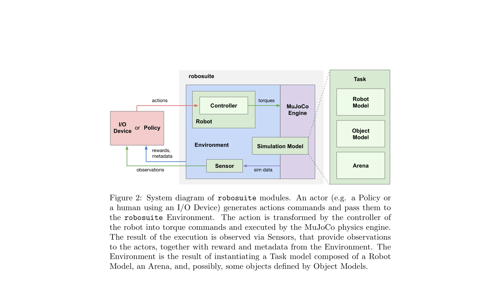
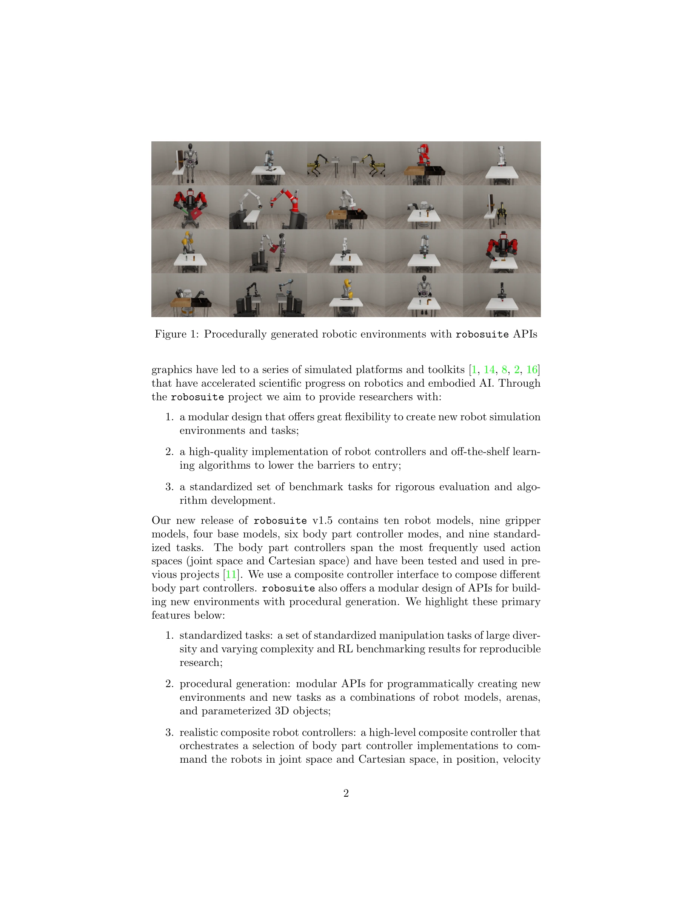

# robosuite: A Modular Simulation Framework and Benchmark for Robot Learning

> **저자**: Yuke Zhu, Josiah Wong, Ajay Mandlekar, Roberto Martín-Martín, Abhishek Joshi, Kevin Lin, Abhiram Maddukuri, Soroush Nasiriany, Yifeng Zhu | **날짜**: 2020-09-25 | **URL**: [https://arxiv.org/abs/2009.12293](https://arxiv.org/abs/2009.12293)

---

## Essence

*Figure 2: System diagram of robosuite modules. An actor (e.g. a Policy or*

robosuite는 MuJoCo 물리 엔진을 기반으로 하는 모듈식 로봇 시뮬레이션 프레임워크로, 로봇 학습 연구를 위한 벤치마크 환경과 재현 가능한 실험 환경을 제공한다.

## Motivation

- **Known**: 시뮬레이션 기반 로봇 학습은 데이터 기반 알고리즘(reinforcement learning, imitation learning)의 발전으로 다양한 로봇 제어 문제에서 성공을 거두었으나, 재현성 부족과 로봇 하드웨어 접근성 제한이 연구 진전을 방해하고 있다.
- **Gap**: 기존 시뮬레이션 플랫폼들은 유연한 환경 구성과 표준화된 벤치마크 작업이 부족하며, 높은 수준의 컨트롤러 구현과 데이터 수집 유틸리티가 체계적으로 지원되지 않는다.
- **Why**: 표준화된 벤치마크와 모듈식 설계는 로봇 학습 알고리즘의 재현 가능한 평가를 가능하게 하며, 낮은 진입 장벽으로 AI와 로보틱스 교차 분야의 연구를 촉진한다.
- **Approach**: MuJoCo 물리 엔진을 핵심으로 하여 Modeling API와 Simulation API로 구분된 모듈식 아키텍처를 설계하고, Task, Robot, Arena, Object 클래스의 조합으로 절차적 환경 생성을 지원한다.

## Achievement

*Figure 1: Procedurally generated robotic environments with robosuite APIs*

- **모듈식 설계**: 10개의 로봇 모델, 9개의 그리퍼 모델, 4개의 베이스 모델, 6개의 바디 파트 컨트롤러 모드로 구성되어 유연한 환경 구성을 지원
- **표준화된 작업**: 9개의 표준 조작 작업과 다양한 복잡도를 제공하며 최신 알고리즘의 벤치마킹 결과 포함
- **고급 컨트롤러**: joint space, Cartesian space, 역기구학(inverse kinematics), 조작 공간 제어(operational space control) 등 다양한 컨트롤 모드 제공
- **멀티모달 센싱**: RGB 카메라, depth map, segmentation mask, proprioception 등 다양한 센서 신호 지원
- **휴먼 데모 수집**: 키보드, 3D 마우스, GUI 등으로 휴먼 데모 수집 및 재현 기능 제공

## How

*Figure 2: System diagram of robosuite modules. An actor (e.g. a Policy or*

- Modeling API: Task, RobotModel, GripperModel, RobotBaseModel, Object Model, Arena을 조합하여 MJCF 형식의 시뮬레이션 모델 생성
- Simulation API: OpenAI Gym 스타일의 인터페이스로 정책(Policy) 또는 I/O 디바이스에서 액션 입력을 받아 MuJoCo 물리 엔진으로 실행
- Controller 계층: 액션 공간(joint velocity, Cartesian position 등)을 MuJoCo의 토크 커맨드로 변환하는 복합 컨트롤러(composite controller) 구현
- Sensor 계층: MjSim 객체에서 정보를 추출하여 관찰값, 보상, 메타데이터 생성
- Procedural generation: Placement initializer를 통해 매 에피소드마다 유효한 비충돌 객체 배치 샘플링

## Originality

- MuJoCo 기반 빠른 접촉 역학(contact dynamics) 시뮬레이션을 로봇 학습에 특화된 모듈식 구조로 추상화
- 절차적 환경 생성(procedural generation) API를 통해 프로그래매틱하게 새로운 작업과 환경 구성 가능
- 다양한 컨트롤 모드(joint space, Cartesian space, operational space 등)를 composite controller로 통합한 설계
- 휴먼 시연 수집, 재현, 활용을 위한 통합 유틸리티 제공

## Limitation & Further Study

- 시뮬레이션과 실제 로봇 사이의 sim-to-real transfer 성능에 대한 평가 부재
- 물리 시뮬레이션의 정확도 한계(특히 접촉 모델링, 마찰 등)로 인한 현실성 제약
- 대규모 병렬 처리 성능과 확장성에 대한 구체적 분석 부족
- 후속 연구: sim-to-real 갭 감소를 위한 도메인 랜더마이제이션 통합, 더 정교한 물리 모델 추가, 다중 에이전트 환경 확장

## Evaluation

- Novelty: 4/5
- Technical Soundness: 3/5
- Significance: 4/5
- Clarity: 4/5
- Overall: 4/5

**총평**: robosuite는 로봇 학습 커뮤니티를 위한 포괄적이고 잘 설계된 오픈소스 프레임워크로, 모듈식 아키텍처와 표준화된 벤치마크를 통해 재현 가능한 연구를 촉진하며 AI-로보틱스 교차 분야의 진입 장벽을 현저히 낮춘다.

## Related Papers

- 🔄 다른 접근: [[papers/1484_MuJoCo_Playground/review]] — 로봇 시뮬레이션 프레임워크에서 MuJoCo 기반과 다양한 환경 지원이라는 서로 다른 설계 철학을 제시한다.
- 🏛 기반 연구: [[papers/1562_Scaling_Cross-Embodied_Learning_One_Policy_for_Manipulation/review]] — robosuite의 모듈식 시뮬레이션 환경을 가정 내 조작이라는 특정 도메인으로 확장하여 현실적인 저수준 조작을 지원한다.
- 🔗 후속 연구: [[papers/1421_Genie_Sim_30__A_High-Fidelity_Comprehensive_Simulation_Platf/review]] — 기본적인 로봇 시뮬레이션 환경을 대규모 도시 환경에서의 일반적 로봇 시뮬레이션 플랫폼으로 확장한다.
- 🔄 다른 접근: [[papers/1484_MuJoCo_Playground/review]] — 로봇 학습을 위한 시뮬레이션 프레임워크에서 MuJoCo 기반과 robosuite의 서로 다른 접근 방식을 보여준다.
- 🔗 후속 연구: [[papers/1562_Scaling_Cross-Embodied_Learning_One_Policy_for_Manipulation/review]] — robosuite의 기본 시뮬레이션 프레임워크를 가정 환경의 현실적인 저수준 조작 작업으로 특화하여 확장한다.
- 🔗 후속 연구: [[papers/1299_A_Survey_of_Robotic_Navigation_and_Manipulation_with_Physics/review]] — robosuite의 modular simulation을 physics simulator의 포괄적 분석으로 확장하여 더 깊은 이해를 제공한다
