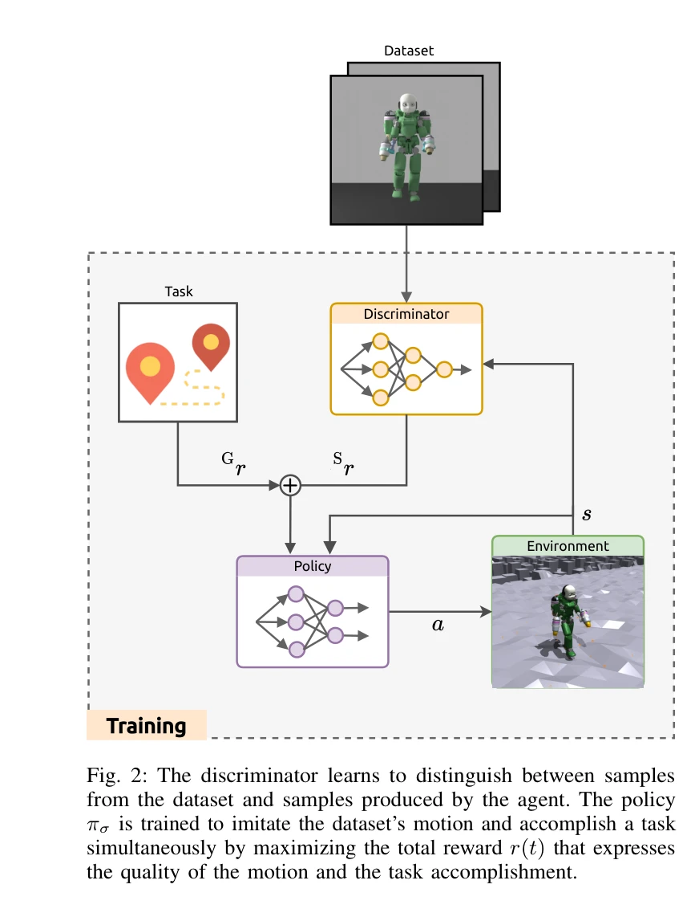

# Learning to Walk and Fly with Adversarial Motion Priors

> **저자**: Giuseppe L'Erario, Drew Hanover, Angel Romero, Yunlong Song, Gabriele Nava, Paolo Maria Viceconte, Daniele Pucci, Davide Scaramuzza | **날짜**: 2023-09-22 | **URL**: [https://arxiv.org/abs/2309.12784](https://arxiv.org/abs/2309.12784)

---

## Essence

*Fig. 2: The discriminator learns to distinguish between samples*

Adversarial Motion Priors (AMP)와 강화학습을 활용하여 항공 인형로봇이 걷기와 비행 사이를 자동으로 전환하는 다중 모드 이동 방식을 학습한다.

## Motivation

- **Known**: 기존 연구에서는 로봇의 이동 방식을 분해된 계층 구조(궤적 최적화 + 전체 신체 제어)로 다루었으나, 서로 다른 이동 방식 간의 전환 문제는 미해결 상태였다.
- **Gap**: 항공 인형로봇에서 걷기와 비행 모드 간의 자동 전환을 명시적 궤적 추적이나 상태 기계 없이 자연스럽게 구현한 연구가 부재했다.
- **Why**: 다중 모드 이동 능력은 탐색, 구조 활동, 감시 등 다양한 응용 분야에서 로봇의 환경 적응성과 효율성을 크게 향상시킬 수 있다.
- **Approach**: 인간형 보행 데이터셋과 궤적 최적화로 생성한 비행 모션 데이터셋을 학습 자료로 하여 AMP를 통해 스타일 보상을 정의하고, 에너지 프록시 항을 포함한 과제 보상과 결합하여 정책을 훈련한다.

## Achievement

- **자동 모드 전환 구현**: 명시적 상태 기계나 고수준 플래너 없이 환경 피드백을 기반으로 걷기와 비행 모드가 자동으로 전환되는 행동이 자연스럽게 출현함
- **이중 데이터셋 활용**: 인간형 보행 패턴과 최적화된 비행 궤적을 모두 활용하여 자연스러운 이동 스타일 학습
- **복잡한 지형 네비게이션**: 이상적 추진력과 실제 제트 기반 액추에이션 모두에서 복잡한 지형을 횡단하는 능력 검증
- **보상 함수 단순화**: 전통적인 복잡한 보상 함수 대신 스타일 + 과제 보상의 간단한 조합으로 효과적인 학습 달성

## How

*Fig. 2: The discriminator learns to distinguish between samples*

- Floating-base formalism을 사용하여 항공 인형로봇의 동역학 모델링
- Adversarial Motion Priors (AMP) 기반 판별기(discriminator)를 통해 데이터셋의 모션 스타일 학습
- 복합 보상 함수 rt = wG·Gr + wS·Sr 구성: 과제 보상(Gr)과 스타일 보상(Sr) 균형
- 에너지 프록시 항을 보상에 포함하여 지면 접근성에 따라 걷기/비행 선택 유도
- Nvidia Isaac Gym 시뮬레이션 환경에서 강화학습을 통한 정책 훈련
- 10회 반복 실행으로 학습 곡선의 안정성과 수렴성 검증

## Originality

- 항공 인형로봇의 명시적 상태 기계나 궤적 추적 없이 자동 모드 전환을 구현한 최초의 데모
- AMP를 항공-지상 이동 문제에 적용하여 인간형 자연스러운 보행과 최적화된 비행을 동시에 학습
- 에너지 기반 암묵적 모드 선택 메커니즘으로 명시적 전환 규칙 회피
- 실제 제트 추진 액추에이션 모델을 포함하여 현실성 향상

## Limitation & Further Study

- 시뮬레이션 환경(Isaac Gym)에서의 검증이 주이며, 실제 iRonCub 하드웨어에서의 실험 결과 부재
- 보행 데이터셋이 인간형 보행만 포함하며, 다양한 지형 특성에 최적화된 보행 스타일 학습 미흡
- 에너지 프록시 항의 가중치 설정이 과제와 환경에 따라 필요하며, 일반화 가능성 제한
- 복잡한 지형에서의 장시간 연속 운영과 에너지 효율성 분석 부족
- 다양한 인간형 보행 스타일(달리기, 계단 등)과의 확장성 검토 필요

## Evaluation

- Novelty: 4/5
- Technical Soundness: 3/5
- Significance: 4/5
- Clarity: 4/5
- Overall: 4/5

**총평**: 본 논문은 AMP를 활용한 다중 모드 이동 로봇 제어의 새로운 접근법을 제시하며, 명시적 상태 기계 없이 자동 모드 전환을 구현한 점에서 독창적이고 항공 인형로봇의 실용적 응용 가능성을 높이는 중요한 기여를 한다.

## Related Papers

- 🔗 후속 연구: [[papers/1267_AMP_Adversarial_Motion_Priors_for_Stylized_Physics-Based_Cha/review]] — 기본 AMP 프레임워크를 항공 휴머노이드라는 특수한 멀티모달 이동 시스템에 적용하여 걷기와 비행을 통합한 발전된 형태임
- 🔄 다른 접근: [[papers/1546_Learning_to_Walk_in_Costume_Adversarial_Motion_Priors_for_Ae/review]] — 두 논문 모두 AMP를 특수한 휴머노이드에 적용하지만, 항공 기능 vs 미학적 제약이라는 서로 다른 특수 요구사항에 집중함
- 🏛 기반 연구: [[papers/1500_OmniVLA_Physically-Grounded_Multimodal_VLA_with_Unified_Mult/review]] — iRonCub의 제트 추진 비행 휴머노이드 하드웨어가 걷기와 비행을 결합한 AMP 기반 제어 시스템의 실제 구현 플랫폼을 제공함
- 🔄 다른 접근: [[papers/1509_KungfuBot_Physics-Based_Humanoid_Whole-Body_Control_for_Lear/review]] — 두 논문 모두 고속 동작 학습을 다루지만, KungfuBot은 physics-based tracking에, 다른 논문은 adversarial motion priors에 초점을 둔다.
- 🔄 다른 접근: [[papers/1546_Learning_to_Walk_in_Costume_Adversarial_Motion_Priors_for_Ae/review]] — 두 논문 모두 AMP를 특수한 휴머노이드에 적용하지만, 미학적 제약 vs 항공 기능이라는 서로 다른 특수 요구사항에 집중함
