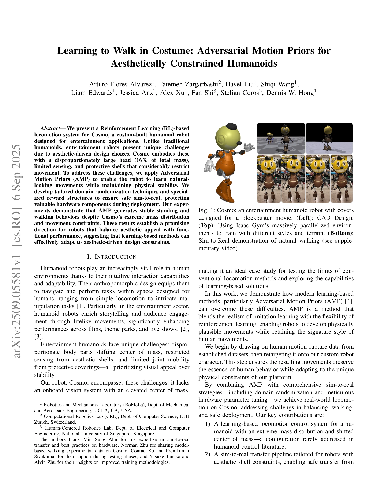
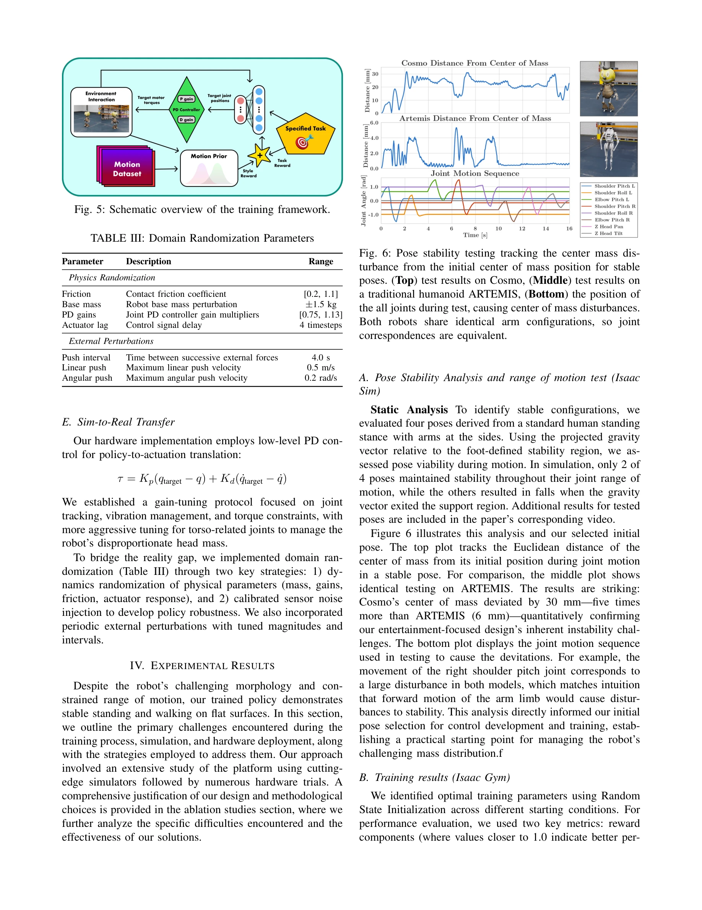

# Learning to Walk in Costume: Adversarial Motion Priors for Aesthetically Constrained Humanoids

> **저자**: Arturo Flores Alvarez, Fatemeh Zargarbashi, Havel Liu, Shiqi Wang, Liam Edwards, Jessica Anz, Alex Xu, Fan Shi, Stelian Coros, Dennis W. Hong | **날짜**: 2025-09-06 | **URL**: [https://arxiv.org/abs/2509.05581](https://arxiv.org/abs/2509.05581)

---

## Essence

*Fig. 1: Cosmo: an entertainment humanoid robot with covers*

미학적 제약이 있는 엔터테인먼트 휴머노이드 로봇 Cosmo를 위해 Adversarial Motion Priors (AMP)를 적용하여 비정상적인 질량 분포와 제한된 움직임 속에서도 자연스러운 보행 행동을 학습하는 강화학습 시스템을 제시한다.

## Motivation

- **Known**: AMP는 모션 캡처 데이터를 활용하여 자연스럽고 인간다운 움직임을 생성할 수 있으며, 강화학습과 모방학습을 결합하여 효과적인 제어를 가능하게 한다.
- **Gap**: 기존 휴머노이드 제어 연구는 미학적 설계로 인한 비정상적인 질량 분포(머리가 총 질량의 16%)와 제한된 센싱, 운동 제약을 가진 엔터테인먼트 로봇에 대한 연구가 부족하다.
- **Why**: 엔터테인먼트 로봇은 시각적 매력과 기능성 성능의 균형을 맞춰야 하며, 학습 기반 방법이 미학적 설계 제약에 적응할 수 있음을 보이는 것은 향후 엔터테인먼트 로봇 개발의 중요한 방향을 제시한다.
- **Approach**: CMU Mocap Dataset에서 인간 모션 캡처 데이터를 Cosmo의 운동학적 제약에 맞춰 retargeting하고, AMP를 통해 판별기 네트워크가 자연스러운 움직임을 유도하는 보상 신호를 학습하도록 하며, domain randomization과 맞춤형 보상 구조를 결합하여 sim-to-real 전이를 수행한다.

## Achievement

*Fig. 3: Sim-to-Real pipeline: (a) Retargeting from diverse data sources, (b) Training, (c) Validation, (d) Deployment*

- **비정상적 질량 분포 제어**: 머리가 총 질량의 16%를 차지하고 극도로 제한된 운동 범위를 가진 휴머노이드에서 안정적인 정적 자세와 보행 행동을 생성하는 학습 기반 제어 시스템 개발
- **미학 제약 맞춤형 Sim-to-Real 파이프라인**: 보호 쉘로 인한 제약을 고려하여 안전한 실제 배포를 보장하면서 성능을 유지하는 sim-to-real 전이 방법론 제시
- **AMP의 확장된 적용**: 시각 센서가 없고 고유감각 정보만을 활용하는 더 어려운 조건에서 AMP의 효과성을 입증하여 기존 접근법의 강건성 확장

## How

*Fig. 5: Schematic overview of the training framework.*

- Rokoko 플러그인과 Blender를 사용하여 CMU Mocap Dataset의 인간 모션 데이터를 Cosmo의 운동학 구조(예: 힙 관절 구조 차이)에 적응시키는 motion retargeting 수행
- AMP 프레임워크 구현: 판별기 네트워크 D_φ(s)가 참조 모션 M과 정책 π_θ가 생성한 상태를 구분하도록 학습하고, 판별기 출력을 보상 신호 r_AMP(s_t) = log D_φ(s_t)로 활용
- 관찰 공간을 기저 선속도, 각속도, 정규화된 관절 위치/속도, 중력 방향, 이전 행동, 기저 높이, 속도 명령 등의 고유감각 정보로 구성
- 보상 함수를 AMP 보상, 관절 속도, 발 접촉 감지, 발 방향성, 발 높이 등 다중 목적의 구성 요소로 설계하여 curriculum learning 적용
- Policy 네트워크(3 layers: 512, 256, 128 units), Critic 및 Discriminator(2 layers: 256, 128 units) 구조 활용, ELU 활성화 함수 사용
- Domain randomization과 하드웨어 파라미터 튜닝을 포함한 포괄적인 sim-to-real 전략으로 실제 로봇 배포 안정성 확보

## Originality

- 기존 휴머노이드 제어 문헌에서 거의 다루지 않은 극도의 질량 분포 편향(머리 중심의 비정상적 구조)과 시각 센서 부재 조건에서 AMP를 적용한 첫 사례
- 미학적 설계 제약(보호 쉘, 제한된 운동 범위)을 고려한 맞춤형 sim-to-real 전이 파이프라인 개발로 엔터테인먼트 로봇의 고유한 요구사항 반영
- 명확한 실제 배포 결과를 통해 학습 기반 방법이 전통적 모델 기반 접근법의 경직성을 극복할 수 있음을 입증

## Limitation & Further Study

- Motion retargeting 시 Cosmo의 넓은 발 쉘을 고려하지 않아 메시 클리핑 문제 발생 가능성
- 연구에서 제시된 명령 범위(전진 속도 [-0.3, 0.9] m/s)는 제한적이며, 더 다양한 속도 범위와 복잡한 지형에서의 일반화 성능 검증 필요
- 고유감각 정보만으로 제어하는 구조로 인해 시각 피드백을 활용한 더 정교한 제어 전략의 발전 여지 존재
- 단일 로봇 플랫폼(Cosmo)에 대한 연구로, 다른 미학적 제약을 가진 휴머노이드로의 전이 가능성과 일반화 능력 검증 필요
- 보상 함수의 여러 가중치를 수동으로 튜닝하는 curriculum learning 접근으로 자동화된 하이퍼파라미터 최적화 방법 개발 후속 연구로 필요

## Evaluation

- Novelty: 4/5
- Technical Soundness: 3/5
- Significance: 4/5
- Clarity: 4/5
- Overall: 4/5

**총평**: 본 논문은 미학적 제약이 있는 엔터테인먼트 휴머노이드의 제어라는 현실적이고 도전적인 문제에 AMP를 효과적으로 적용하여, 학습 기반 방법이 기존 모델 기반 접근법의 한계를 극복할 수 있음을 명확히 입증한다. 실제 하드웨어 배포 결과를 통한 실증적 검증과 엔터테인먼트 로봇의 고유한 요구사항을 반영한 맞춤형 방법론은 높은 가치를 지니지만, 단일 로봇 플랫폼에 대한 제한된 범위와 일반화 성능 검증의 부족이 한계점이다.

## Related Papers

- 🔗 후속 연구: [[papers/1267_AMP_Adversarial_Motion_Priors_for_Stylized_Physics-Based_Cha/review]] — 기본 AMP 프레임워크를 엔터테인먼트 휴머노이드의 미학적 제약과 비정상적 질량 분포라는 특수 상황에 적용한 발전된 형태임
- 🔄 다른 접근: [[papers/1545_Learning_to_Walk_and_Fly_with_Adversarial_Motion_Priors/review]] — 두 논문 모두 AMP를 특수한 휴머노이드에 적용하지만, 미학적 제약 vs 항공 기능이라는 서로 다른 특수 요구사항에 집중함
- 🔄 다른 접근: [[papers/1589_Olaf_Bringing_an_Animated_Character_to_Life_in_the_Physical/review]] — 두 논문 모두 엔터테인먼트용 캐릭터의 물리적 구현을 다루지만, 미학적 제약 vs 애니메이션 캐릭터 구현이라는 서로 다른 접근법을 제시함
- 🔄 다른 접근: [[papers/1545_Learning_to_Walk_and_Fly_with_Adversarial_Motion_Priors/review]] — 두 논문 모두 AMP를 특수한 휴머노이드에 적용하지만, 항공 기능 vs 미학적 제약이라는 서로 다른 특수 요구사항에 집중함
- 🔗 후속 연구: [[papers/1460_Human-Humanoid_Robots_Cross-Embodiment_Behavior-Skill_Transf/review]] — Robot Utility Models의 zero-shot deployment 개념을 human-humanoid cross-embodiment로 확장한 specialized application입니다.
